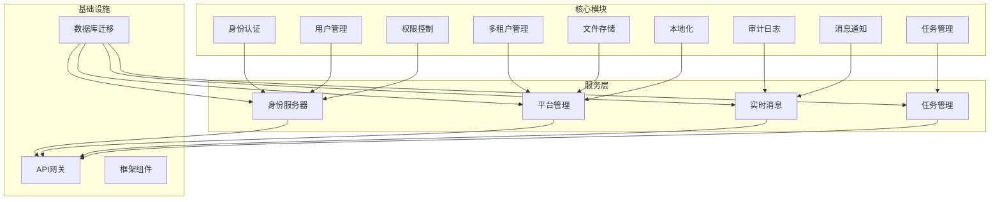
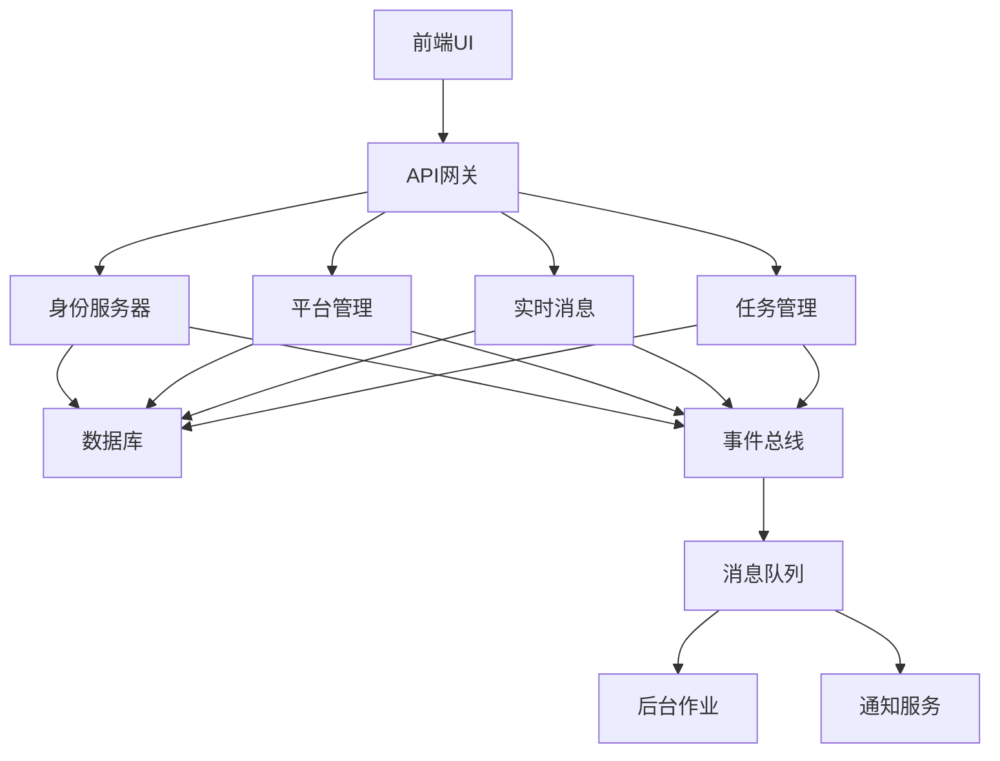
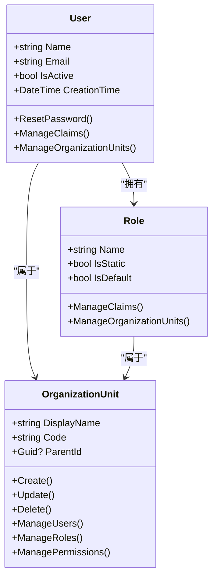

# 核心功能模块

<cite>
**本文档引用的文件**  
- [IdentityPermissions.cs](file://aspnet-core/modules/identity/LINGYUN.Abp.Identity.Application.Contracts/LINGYUN/Abp/Identity/IdentityPermissions.cs)
- [IdentityPermissionDefinitionProvider.cs](file://aspnet-core/modules/identity/LINGYUN.Abp.Identity.Application.Contracts/LINGYUN/Abp/Identity/IdentityPermissionDefinitionProvider.cs)
- [AbpUINavigationVueVbenAdminNavigationDefinitionProvider.cs](file://aspnet-core/modules/platform/LINGYUN.Abp.UI.Navigation.VueVbenAdmin/LINGYUN/Abp/UI/Navigation/VueVbenAdmin/AbpUINavigationVueVbenAdminNavigationDefinitionProvider.cs)
- [Tenant.cs](file://aspnet-core/modules/saas/LINGYUN.Abp.Saas.Domain/LINGYUN/Abp/Saas/Tenants/Tenant.cs)
- [AuditingFeatureDefinitionProvider.cs](file://aspnet-core/modules/auditing/LINGYUN.Abp.Auditing.Application.Contracts/LINGYUN/Abp/Auditing/Features/AuditingFeatureDefinitionProvider.cs)
- [TaskManagementPermissionDefinitionProvider.cs](file://aspnet-core/modules/task-management/LINGYUN.Abp.TaskManagement.Application.Contracts/LINGYUN/Abp/TaskManagement/Permissions/TaskManagementPermissionDefinitionProvider.cs)
- [NotificationEventHandler.cs](file://aspnet-core/services/LY.MicroService.RealtimeMessage.HttpApi.Host/EventBus/Distributed/NotificationEventHandler.cs)
- [OssManagementBlobProviderConfiguration.cs](file://aspnet-core/modules/oss-management/LINGYUN.Abp.BlobStoring.OssManagement/LINGYUN/Abp/BlobStoring/OssManagement/OssManagementBlobProviderConfiguration.cs)
- [LocalizationManagementResource.cs](file://aspnet-core/modules/localization-management/LINGYUN.Abp.LocalizationManagement.Domain.Shared/LINGYUN/Abp/LocalizationManagement/Localization/LocalizationManagementResource.cs)
- [LocalizationLanguageProvider.cs](file://aspnet-core/modules/localization-management/LINGYUN.Abp.LocalizationManagement.Domain/LINGYUN/Abp/LocalizationManagement/LocalizationLanguageProvider.cs)
</cite>

## 目录
1. [简介](#简介)
2. [项目结构](#项目结构)
3. [核心组件](#核心组件)
4. [架构概述](#架构概述)
5. [详细组件分析](#详细组件分析)
6. [依赖分析](#依赖分析)
7. [性能考虑](#性能考虑)
8. [故障排除指南](#故障排除指南)
9. [结论](#结论)
10. [附录](#附录)（如有必要）

## 简介
本文档全面介绍ABP Next Admin项目提供的关键企业级功能，包括身份认证、用户管理、权限控制等核心模块。文档详细说明了每个核心模块的业务逻辑、数据模型和API接口，并解释了这些模块如何协同工作以提供完整的后台管理功能。为系统管理员和开发者提供功能使用和定制的指导。

## 项目结构
该项目采用模块化架构，主要分为框架、迁移、模块、服务、模板和测试等部分。核心功能模块主要位于`modules`目录下，包括身份认证、审计、缓存管理、数据保护、演示、elsa、功能管理、gdpr、身份、身份服务器、本地化管理、openIddict、oss管理、权限管理、平台、项目、实时消息、实时通知、规则管理、saas、设置、任务管理、文本模板和webhooks等模块。



**图示来源**
- [IdentityPermissions.cs](file://aspnet-core/modules/identity/LINGYUN.Abp.Identity.Application.Contracts/LINGYUN/Abp/Identity/IdentityPermissions.cs)
- [Tenant.cs](file://aspnet-core/modules/saas/LINGYUN.Abp.Saas.Domain/LINGYUN/Abp/Saas/Tenants/Tenant.cs)
- [AuditingFeatureDefinitionProvider.cs](file://aspnet-core/modules/auditing/LINGYUN.Abp.Auditing.Application.Contracts/LINGYUN/Abp/Auditing/Features/AuditingFeatureDefinitionProvider.cs)

**章节来源**
- [IdentityPermissions.cs](file://aspnet-core/modules/identity/LINGYUN.Abp.Identity.Application.Contracts/LINGYUN/Abp/Identity/IdentityPermissions.cs)
- [AbpUINavigationVueVbenAdminNavigationDefinitionProvider.cs](file://aspnet-core/modules/platform/LINGYUN.Abp.UI.Navigation.VueVbenAdmin/LINGYUN/Abp/UI/Navigation/VueVbenAdmin/AbpUINavigationVueVbenAdminNavigationDefinitionProvider.cs)

## 核心组件
本项目的核心组件包括身份认证、用户管理、权限控制、审计日志、多租户管理、任务调度、消息通知、文件存储和本地化等功能模块。这些组件共同构成了一个完整的企业级后台管理系统。

**章节来源**
- [IdentityPermissions.cs](file://aspnet-core/modules/identity/LINGYUN.Abp.Identity.Application.Contracts/LINGYUN/Abp/Identity/IdentityPermissions.cs)
- [IdentityPermissionDefinitionProvider.cs](file://aspnet-core/modules/identity/LINGYUN.Abp.Identity.Application.Contracts/LINGYUN/Abp/Identity/IdentityPermissionDefinitionProvider.cs)

## 架构概述
系统采用微服务架构，基于ABP框架构建。核心功能模块通过服务层暴露API接口，前端通过API网关访问后端服务。各模块之间通过事件总线进行通信，实现了松耦合的设计。



**图示来源**
- [NotificationEventHandler.cs](file://aspnet-core/services/LY.MicroService.RealtimeMessage.HttpApi.Host/EventBus/Distributed/NotificationEventHandler.cs)
- [TaskManagementPermissionDefinitionProvider.cs](file://aspnet-core/modules/task-management/LINGYUN.Abp.TaskManagement.Application.Contracts/LINGYUN/Abp/TaskManagement/Permissions/TaskManagementPermissionDefinitionProvider.cs)

## 详细组件分析

### 身份认证与用户管理分析
身份认证与用户管理模块提供了完整的用户生命周期管理功能，包括用户创建、角色分配、权限设置、组织机构管理等。



**图示来源**
- [IdentityPermissions.cs](file://aspnet-core/modules/identity/LINGYUN.Abp.Identity.Application.Contracts/LINGYUN/Abp/Identity/IdentityPermissions.cs)
- [IdentityPermissionDefinitionProvider.cs](file://aspnet-core/modules/identity/LINGYUN.Abp.Identity.Application.Contracts/LINGYUN/Abp/Identity/IdentityPermissionDefinitionProvider.cs)

### 权限控制分析
权限控制模块实现了细粒度的权限管理，支持基于角色、用户和组织机构的权限分配。

```mermaid
flowchart TD
    Start([权限检查]) --> CheckUser["检查用户权限"]
    CheckUser --> UserHasPermission{"用户有权限?"}
    UserHasPermission -->|是| AllowAccess["允许访问"]
    UserHasPermission -->|否| CheckRole["检查角色权限"]
    CheckRole --> RoleHasPermission{"角色有权限?"}
    RoleHasPermission -->|是| AllowAccess
    RoleHasPermission -->|否| CheckOrganization["检查组织机构权限"]
    CheckOrganization --> OrgHasPermission{"组织机构有权限?"}
    OrgHasPermission -->|是| AllowAccess
    OrgHasPermission -->|否| DenyAccess["拒绝访问"]
    AllowAccess --> End([完成])
    DenyAccess --> End