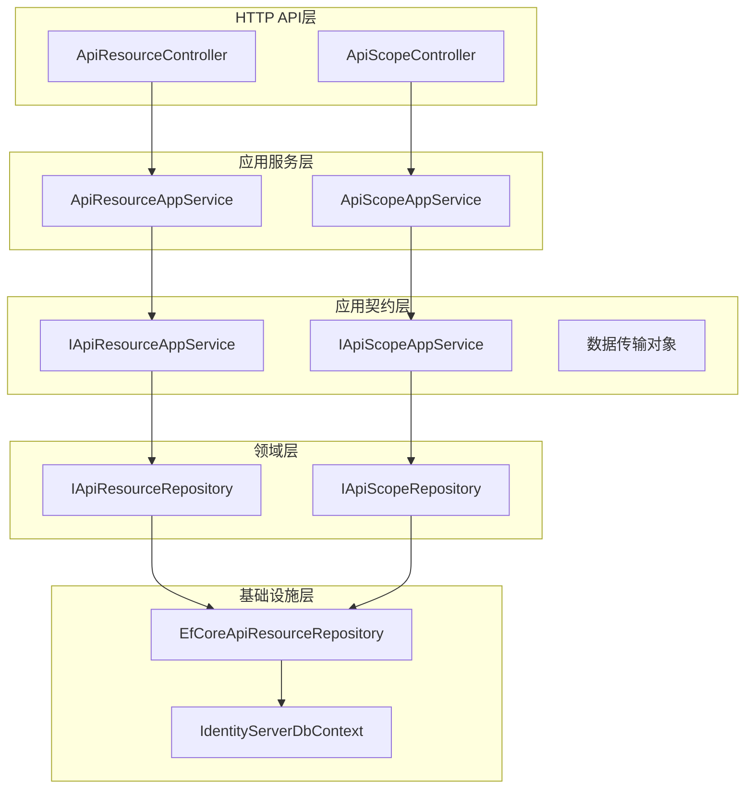
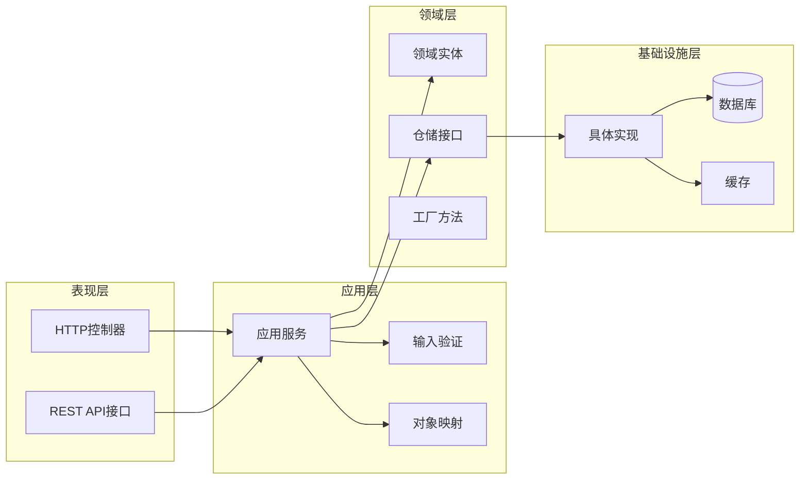
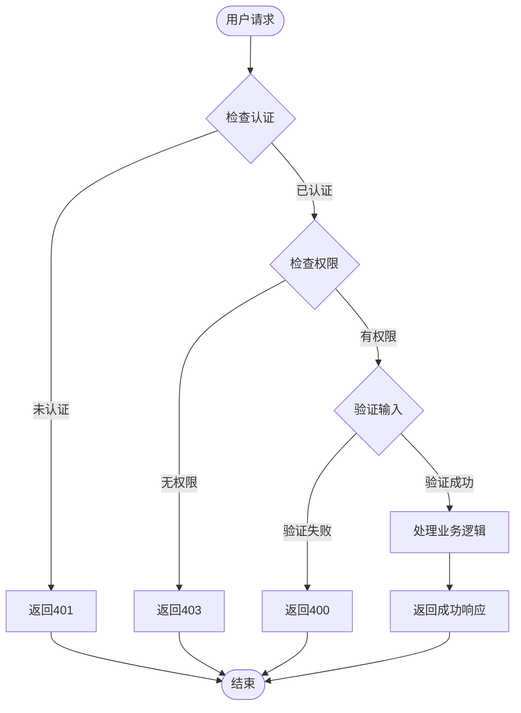
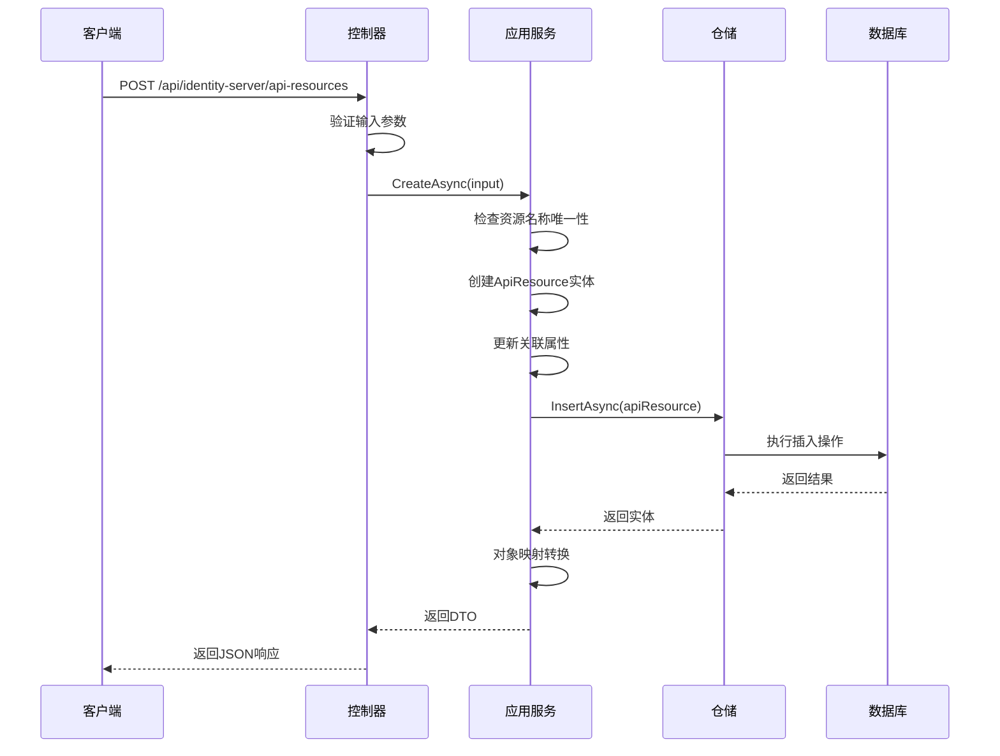
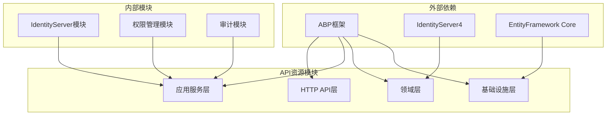

# API资源管理

<cite>
**本文档引用的文件**
- [ApiResourceController.cs](file://aspnet-core/modules/identityServer/LINGYUN.Abp.IdentityServer.HttpApi/LINGYUN/Abp/IdentityServer/ApiResources/ApiResourceController.cs)
- [ApiResourceAppService.cs](file://aspnet-core/modules/identityServer/LINGYUN.Abp.IdentityServer.Application/LINGYUN/Abp/IdentityServer/ApiResources/ApiResourceAppService.cs)
- [ApiResourceDto.cs](file://aspnet-core/modules/identityServer/LINGYUN.Abp.IdentityServer.Application.Contracts/LINGYUN/Abp/IdentityServer/ApiResources/Dto/ApiResourceDto.cs)
- [ApiResourceCreateDto.cs](file://aspnet-core/modules/identityServer/LINGYUN.Abp.IdentityServer.Application.Contracts/LINGYUN/Abp/IdentityServer/ApiResources/Dto/ApiResourceCreateDto.cs)
- [ApiResourceCreateOrUpdateDto.cs](file://aspnet-core/modules/identityServer/LINGYUN.Abp.IdentityServer.Application.Contracts/LINGYUN/Abp/IdentityServer/ApiResources/Dto/ApiResourceCreateOrUpdateDto.cs)
- [IApiResourceAppService.cs](file://aspnet-core/modules/identityServer/LINGYUN.Abp.IdentityServer.Application.Contracts/LINGYUN/Abp/IdentityServer/ApiResources/IApiResourceAppService.cs)
- [EfCoreApiResourceRepository.cs](file://aspnet-core/modules/identityServer/LINGYUN.Abp.IdentityServer.EntityFrameworkCore/LINGYUN/Abp/IdentityServer/ApiResources/EfCoreApiResourceRepository.cs)
- [AbpIdentityServerPermissionDefinitionProvider.cs](file://aspnet-core/modules/identityServer/LINGYUN.Abp.IdentityServer.Application.Contracts/LINGYUN/Abp/IdentityServer/AbpIdentityServerPermissionDefinitionProvider.cs)
- [ApiScopeController.cs](file://aspnet-core/modules/identityServer/LINGYUN.Abp.IdentityServer.HttpApi/LINGYUN/Abp/IdentityServer/ApiScopes/ApiScopeController.cs)
- [ApiScopeAppService.cs](file://aspnet-core/modules/identityServer/LINGYUN.Abp.IdentityServer.Application/LINGYUN/Abp/IdentityServer/ApiScopes/ApiScopeAppService.cs)
- [ApiScopeDto.cs](file://aspnet-core/modules/identityServer/LINGYUN.Abp.IdentityServer.Application.Contracts/LINGYUN/Abp/IdentityServer/ApiScopes/Dto/ApiScopeDto.cs)
- [ApiResourceScopeCreateDto.cs](file://aspnet-core/modules/identityServer/LINGYUN.Abp.IdentityServer.Application.Contracts/LINGYUN/Abp/IdentityServer/ApiResources/Dto/ApiResourceScopeCreateDto.cs)
- [IdentityServerDataSeedContributor.cs](file://aspnet-core/migrations/LY.MicroService.IdentityServer.EntityFrameworkCore/DataSeeder/IdentityServerDataSeedContributor.cs)
</cite>

## 目录
1. [简介](#简介)
2. [项目结构](#项目结构)
3. [核心组件](#核心组件)
4. [架构概览](#架构概览)
5. [详细组件分析](#详细组件分析)
6. [依赖关系分析](#依赖关系分析)
7. [性能考虑](#性能考虑)
8. [故障排除指南](#故障排除指南)
9. [结论](#结论)

## 简介

API资源管理子模块是基于ABP框架构建的IdentityServer4扩展模块，专门用于管理API资源实体及其相关配置。该模块提供了完整的API资源生命周期管理功能，包括创建、更新、删除、查询以及权限控制等核心功能。

API资源实体是IdentityServer4中的重要概念，它代表了一个可以被客户端访问的API集合。每个API资源包含名称、显示名称、描述、启用状态、签名算法等关键属性，并支持与API作用域、用户声明、属性和密钥的关联配置。

## 项目结构

API资源管理模块采用分层架构设计，遵循DDD（领域驱动设计）原则，将功能划分为不同的层次：



**图表来源**
- [ApiResourceController.cs](file://aspnet-core/modules/identityServer/LINGYUN.Abp.IdentityServer.HttpApi/LINGYUN/Abp/IdentityServer/ApiResources/ApiResourceController.cs#L1-L53)
- [ApiResourceAppService.cs](file://aspnet-core/modules/identityServer/LINGYUN.Abp.IdentityServer.Application/LINGYUN/Abp/IdentityServer/ApiResources/ApiResourceAppService.cs#L1-L36)
- [EfCoreApiResourceRepository.cs](file://aspnet-core/modules/identityServer/LINGYUN.Abp.IdentityServer.EntityFrameworkCore/LINGYUN/Abp/IdentityServer/ApiResources/EfCoreApiResourceRepository.cs#L1-L33)

## 核心组件

### API资源实体设计原理

API资源实体是整个模块的核心，它封装了IdentityServer4中ApiResource的所有关键属性：

```csharp
public class ApiResourceDto : ExtensibleAuditedEntityDto<Guid>
{
    public string Name { get; set; }              // 唯一标识符
    public string DisplayName { get; set; }       // 显示名称
    public string Description { get; set; }       // 描述信息
    public bool Enabled { get; set; }             // 启用状态
    public string AllowedAccessTokenSigningAlgorithms { get; set; }
    public bool ShowInDiscoveryDocument { get; set; }
    
    // 关联集合
    public List<ApiResourceSecretDto> Secrets { get; set; }
    public List<ApiResourceScopeDto> Scopes { get; set; }
    public List<ApiResourceClaimDto> UserClaims { get; set; }
    public List<ApiResourcePropertyDto> Properties { get; set; }
}
```

### API资源与作用域的关系模型

API资源与作用域之间存在一对多的关系，这种设计允许一个API资源包含多个作用域，从而实现细粒度的权限控制：

```mermaid
classDiagram
class ApiResource {
+Guid Id
+string Name
+string DisplayName
+string Description
+bool Enabled
+bool ShowInDiscoveryDocument
+ApiResourceScope[] Scopes
+AddScope(scopeName)
+FindScope(scopeName)
+RemoveScope(scopeName)
}
class ApiResourceScope {
+string Scope
+string DisplayName
+string Description
+bool Required
+bool Emphasize
+bool ShowInDiscoveryDocument
}
class ApiScope {
+Guid Id
+string Name
+string DisplayName
+string Description
+bool Enabled
+bool Required
+bool Emphasize
+bool ShowInDiscoveryDocument
}
ApiResource "1" --> "*" ApiResourceScope : contains
ApiResourceScope "maps to" ApiScope : references
```

**图表来源**
- [ApiResourceDto.cs](file://aspnet-core/modules/identityServer/LINGYUN.Abp.IdentityServer.Application.Contracts/LINGYUN/Abp/IdentityServer/ApiResources/Dto/ApiResourceDto.cs#L1-L35)
- [ApiResourceScopeCreateDto.cs](file://aspnet-core/modules/identityServer/LINGYUN.Abp.IdentityServer.Application.Contracts/LINGYUN/Abp/IdentityServer/ApiResources/Dto/ApiResourceScopeCreateDto.cs#L1-L35)

**章节来源**
- [ApiResourceDto.cs](file://aspnet-core/modules/identityServer/LINGYUN.Abp.IdentityServer.Application.Contracts/LINGYUN/Abp/IdentityServer/ApiResources/Dto/ApiResourceDto.cs#L1-L35)
- [ApiResourceScopeCreateDto.cs](file://aspnet-core/modules/identityServer/LINGYUN.Abp.IdentityServer.Application.Contracts/LINGYUN/Abp/IdentityServer/ApiResources/Dto/ApiResourceScopeCreateDto.cs#L1-L35)

## 架构概览

API资源管理模块采用经典的分层架构模式，确保了代码的可维护性和可扩展性：



**图表来源**
- [ApiResourceController.cs](file://aspnet-core/modules/identityServer/LINGYUN.Abp.IdentityServer.HttpApi/LINGYUN/Abp/IdentityServer/ApiResources/ApiResourceController.cs#L1-L53)
- [ApiResourceAppService.cs](file://aspnet-core/modules/identityServer/LINGYUN.Abp.IdentityServer.Application/LINGYUN/Abp/IdentityServer/ApiResources/ApiResourceAppService.cs#L1-L36)

## 详细组件分析

### API资源控制器组件

API资源控制器负责处理HTTP请求并调用相应的应用服务：

```csharp
[RemoteService(Name = AbpIdentityServerConsts.RemoteServiceName)]
[Area("identity-server")]
[Route("api/identity-server/api-resources")]
public class ApiResourceController : AbpControllerBase, IApiResourceAppService
{
    protected IApiResourceAppService ApiResourceAppService { get; }
    
    [HttpGet]
    [Route("{id}")]
    public async virtual Task<ApiResourceDto> GetAsync(Guid id)
    {
        return await ApiResourceAppService.GetAsync(id);
    }
    
    [HttpPost]
    public async virtual Task<ApiResourceDto> CreateAsync(ApiResourceCreateDto input)
    {
        return await ApiResourceAppService.CreateAsync(input);
    }
}
```

### 应用服务组件

应用服务实现了业务逻辑的核心处理：

```csharp
[Authorize(AbpIdentityServerPermissions.ApiResources.Default)]
public class ApiResourceAppService : AbpIdentityServerAppServiceBase, IApiResourceAppService
{
    protected IApiResourceRepository ApiResourceRepository { get; }
    
    [Authorize(AbpIdentityServerPermissions.ApiResources.Create)]
    public async virtual Task<ApiResourceDto> CreateAsync(ApiResourceCreateDto input)
    {
        var apiResourceExists = await ApiResourceRepository.CheckNameExistAsync(input.Name);
        if (apiResourceExists)
        {
            throw new UserFriendlyException(L[AbpIdentityServerErrorConsts.ApiResourceNameExisted, input.Name]);
        }
        
        var apiResource = new ApiResource(
            GuidGenerator.Create(), 
            input.Name,
            input.DisplayName, 
            input.Description);
            
        await UpdateApiResourceByInputAsync(apiResource, input);
        apiResource = await ApiResourceRepository.InsertAsync(apiResource);
        
        return ObjectMapper.Map<ApiResource, ApiResourceDto>(apiResource);
    }
}
```

### 权限控制策略

模块实现了细粒度的权限控制策略，确保只有授权用户才能执行相应操作：



**图表来源**
- [ApiResourceAppService.cs](file://aspnet-core/modules/identityServer/LINGYUN.Abp.IdentityServer.Application/LINGYUN/Abp/IdentityServer/ApiResources/ApiResourceAppService.cs#L44-L66)
- [AbpIdentityServerPermissionDefinitionProvider.cs](file://aspnet-core/modules/identityServer/LINGYUN.Abp.IdentityServer.Application.Contracts/LINGYUN/Abp/IdentityServer/AbpIdentityServerPermissionDefinitionProvider.cs#L37-L47)

**章节来源**
- [ApiResourceController.cs](file://aspnet-core/modules/identityServer/LINGYUN.Abp.IdentityServer.HttpApi/LINGYUN/Abp/IdentityServer/ApiResources/ApiResourceController.cs#L1-L53)
- [ApiResourceAppService.cs](file://aspnet-core/modules/identityServer/LINGYUN.Abp.IdentityServer.Application/LINGYUN/Abp/IdentityServer/ApiResources/ApiResourceAppService.cs#L1-L185)
- [AbpIdentityServerPermissionDefinitionProvider.cs](file://aspnet-core/modules/identityServer/LINGYUN.Abp.IdentityServer.Application.Contracts/LINGYUN/Abp/IdentityServer/AbpIdentityServerPermissionDefinitionProvider.cs#L26-L70)

### API资源配置方法

API资源的配置通过多种方式实现，包括直接创建、批量导入和模板化配置：



**图表来源**
- [ApiResourceController.cs](file://aspnet-core/modules/identityServer/LINGYUN.Abp.IdentityServer.HttpApi/LINGYUN/Abp/IdentityServer/ApiResources/ApiResourceController.cs#L30-L38)
- [ApiResourceAppService.cs](file://aspnet-core/modules/identityServer/LINGYUN.Abp.IdentityServer.Application/LINGYUN/Abp/IdentityServer/ApiResources/ApiResourceAppService.cs#L44-L66)

### 受保护的API端点

模块为所有敏感操作设置了严格的权限控制：

| 操作类型 | 权限名称 | 描述 |
|---------|---------|------|
| 创建 | ApiResources.Create | 创建新的API资源 |
| 更新 | ApiResources.Update | 更新现有API资源 |
| 删除 | ApiResources.Delete | 删除API资源 |
| 管理声明 | ApiResources.ManageClaims | 管理用户声明 |
| 管理密钥 | ApiResources.ManageSecrets | 管理API密钥 |
| 管理作用域 | ApiResources.ManageScopes | 管理API作用域 |
| 管理属性 | ApiResources.ManageProperties | 管理API属性 |

**章节来源**
- [AbpIdentityServerPermissionDefinitionProvider.cs](file://aspnet-core/modules/identityServer/LINGYUN.Abp.IdentityServer.Application.Contracts/LINGYUN/Abp/IdentityServer/AbpIdentityServerPermissionDefinitionProvider.cs#L37-L47)

## 依赖关系分析

API资源管理模块具有清晰的依赖关系结构，遵循依赖倒置原则：



**图表来源**
- [ApiResourceAppService.cs](file://aspnet-core/modules/identityServer/LINGYUN.Abp.IdentityServer.Application/LINGYUN/Abp/IdentityServer/ApiResources/ApiResourceAppService.cs#L1-L15)
- [EfCoreApiResourceRepository.cs](file://aspnet-core/modules/identityServer/LINGYUN.Abp.IdentityServer.EntityFrameworkCore/LINGYUN/Abp/IdentityServer/ApiResources/EfCoreApiResourceRepository.cs#L1-L15)

**章节来源**
- [ApiResourceAppService.cs](file://aspnet-core/modules/identityServer/LINGYUN.Abp.IdentityServer.Application/LINGYUN/Abp/IdentityServer/ApiResources/ApiResourceAppService.cs#L1-L185)
- [EfCoreApiResourceRepository.cs](file://aspnet-core/modules/identityServer/LINGYUN.Abp.IdentityServer.EntityFrameworkCore/LINGYUN/Abp/IdentityServer/ApiResources/EfCoreApiResourceRepository.cs#L1-L33)

## 性能考虑

### 查询优化

模块采用了多种查询优化策略：

1. **分页查询**：支持大数据量场景下的分页查询
2. **索引优化**：在关键字段上建立数据库索引
3. **缓存机制**：对频繁访问的API资源进行缓存
4. **延迟加载**：关联实体采用延迟加载策略

### 并发控制

为了确保数据一致性，模块实现了以下并发控制机制：

- **乐观锁**：使用时间戳或行版本号检测并发冲突
- **事务管理**：确保相关操作的原子性
- **死锁预防**：合理安排数据库操作顺序

## 故障排除指南

### 常见问题及解决方案

#### 1. API资源名称重复错误

**问题描述**：尝试创建同名的API资源时出现异常

**解决方案**：
```csharp
// 检查资源是否存在
var apiResourceExists = await ApiResourceRepository.CheckNameExistAsync(input.Name);
if (apiResourceExists)
{
    throw new UserFriendlyException(L[AbpIdentityServerErrorConsts.ApiResourceNameExisted, input.Name]);
}
```

#### 2. 权限不足错误

**问题描述**：用户没有执行特定操作的权限

**解决方案**：检查用户权限配置，确保分配了相应的权限角色

#### 3. 密钥管理问题

**问题描述**：API密钥无法正确存储或验证

**解决方案**：确保密钥经过适当的哈希处理，并使用SHA256或SHA512算法

**章节来源**
- [ApiResourceAppService.cs](file://aspnet-core/modules/identityServer/LINGYUN.Abp.IdentityServer.Application/LINGYUN/Abp/IdentityServer/ApiResources/ApiResourceAppService.cs#L44-L66)
- [ApiResourceAppService.cs](file://aspnet-core/modules/identityServer/LINGYUN.Abp.IdentityServer.Application/LINGYUN/Abp/IdentityServer/ApiResources/ApiResourceAppService.cs#L135-L154)

## 最佳实践

### API资源版本管理

虽然当前模块主要关注基础功能，但建议在实际应用中实现版本管理：

1. **语义化版本控制**：使用MAJOR.MINOR.PATCH格式
2. **向后兼容性**：确保新版本不会破坏现有功能
3. **迁移策略**：提供平滑的升级路径
4. **废弃通知**：提前通知即将废弃的功能

### 作用域继承

对于复杂的应用场景，可以考虑实现作用域继承机制：

```csharp
// 示例：作用域继承配置
public class HierarchicalApiResource : ApiResource
{
    public List<string> ParentScopes { get; set; }
    public List<string> ChildScopes { get; set; }
    
    public void InheritFromParent()
    {
        // 实现作用域继承逻辑
    }
}
```

### 安全审查流程

为系统管理员提供API资源安全审查的流程指导：

1. **定期审计**：定期检查API资源的安全配置
2. **权限验证**：验证用户权限分配的合理性
3. **密钥轮换**：定期更新API密钥
4. **监控告警**：设置异常访问的监控和告警

## 结论

API资源管理子模块是一个功能完整、设计良好的IdentityServer4扩展模块。它不仅提供了基本的CRUD操作，还实现了完善的权限控制、数据验证和错误处理机制。

模块的主要优势包括：

- **清晰的架构设计**：遵循分层架构和DDD原则
- **完善的权限控制**：支持细粒度的权限管理
- **灵活的配置选项**：支持多种配置方式
- **良好的扩展性**：便于添加新的功能特性

对于开发者而言，该模块提供了丰富的API和清晰的使用指南；对于系统管理员而言，提供了全面的安全审查和配置管理工具。通过合理的使用和配置，该模块能够有效支持企业级的API资源管理需求。