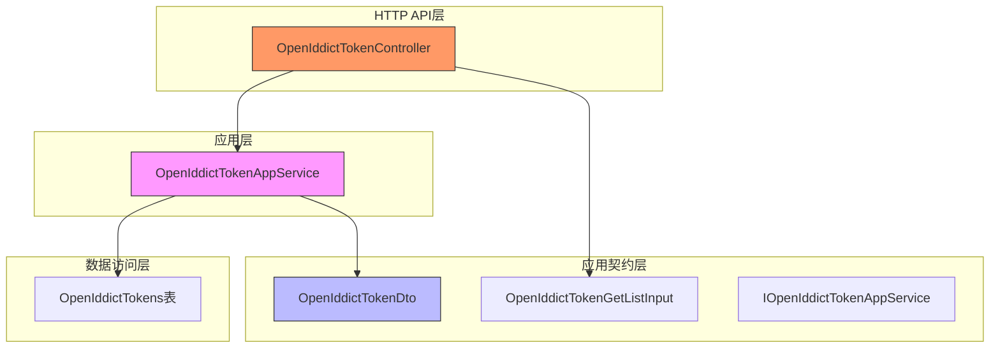
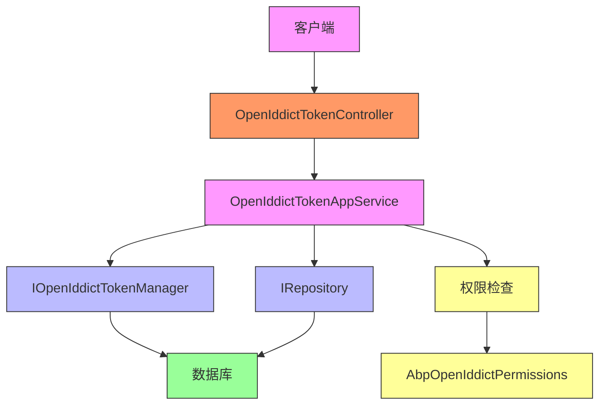
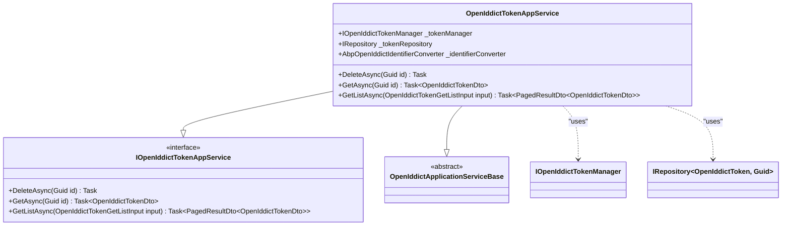
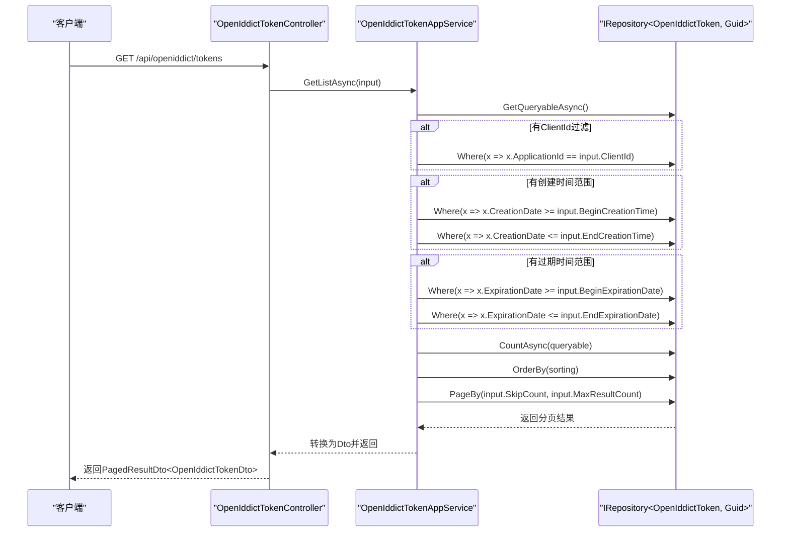
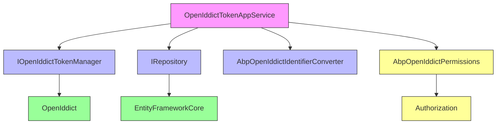

# 令牌管理

<cite>
**本文档中引用的文件**  
- [OpenIddictTokenAppService.cs](file://aspnet-core/modules/openIddict/LINGYUN.Abp.OpenIddict.Application/LINGYUN/Abp/OpenIddict/Tokens/OpenIddictTokenAppService.cs)
- [OpenIddictTokenDto.cs](file://aspnet-core/modules/openIddict/LINGYUN.Abp.OpenIddict.Application.Contracts/LINGYUN/Abp/OpenIddict/Tokens/OpenIddictTokenDto.cs)
- [OpenIddictTokenController.cs](file://aspnet-core/modules/openIddict/LINGYUN.Abp.OpenIddict.HttpApi/LINGYUN/Abp/OpenIddict/Tokens/OpenIddictTokenController.cs)
- [AbpOpenIddictPermissions.cs](file://aspnet-core/modules/openIddict/LINGYUN.Abp.OpenIddict.Application.Contracts/LINGYUN/Abp/OpenIddict/Permissions/AbpOpenIddictPermissions.cs)
- [ClientDataSeederContributor.cs](file://aspnet-core/migrations/LY.MicroService.Applications.Single.EntityFrameworkCore/DataSeeder/ClientDataSeederContributor.cs)
- [OpenIddictTokenGetListInput.cs](file://aspnet-core/modules/openIddict/LINGYUN.Abp.OpenIddict.Application.Contracts/LINGYUN/Abp/OpenIddict/Tokens/OpenIddictTokenGetListInput.cs)
- [20250409030245_Initial-Single-Project-MSSQL.cs](file://aspnet-core/migrations/LY.MicroService.Applications.Single.EntityFrameworkCore.SqlServer/Migrations/20250409030245_Initial-Single-Project-MSSQL.cs)
</cite>

## 目录
1. [简介](#简介)
2. [项目结构](#项目结构)
3. [核心组件](#核心组件)
4. [架构概述](#架构概述)
5. [详细组件分析](#详细组件分析)
6. [依赖分析](#依赖分析)
7. [性能考虑](#性能考虑)
8. [故障排除指南](#故障排除指南)
9. [结论](#结论)

## 简介
本项目基于ABP框架构建，采用OpenIddict实现OAuth 2.0和OpenID Connect协议，提供完整的令牌管理功能。系统支持访问令牌、ID令牌和刷新令牌的全生命周期管理，包括颁发、验证、刷新和撤销等操作。通过模块化设计，实现了令牌的存储、查询和安全管理，为开发者提供了灵活的扩展接口。

## 项目结构
项目采用分层架构设计，令牌管理功能主要集中在`openIddict`模块中。该模块包含应用层、应用契约层和HTTP API层，分别负责业务逻辑处理、数据传输和接口暴露。数据持久化通过EntityFrameworkCore实现，支持多种数据库。

**图示来源**
- [OpenIddictTokenAppService.cs](file://aspnet-core/modules/openIddict/LINGYUN.Abp.OpenIddict.Application/LINGYUN/Abp/OpenIddict/Tokens/OpenIddictTokenAppService.cs)
- [OpenIddictTokenDto.cs](file://aspnet-core/modules/openIddict/LINGYUN.Abp.OpenIddict.Application.Contracts/LINGYUN/Abp/OpenIddict/Tokens/OpenIddictTokenDto.cs)
- [OpenIddictTokenController.cs](file://aspnet-core/modules/openIddict/LINGYUN.Abp.OpenIddict.HttpApi/LINGYUN/Abp/OpenIddict/Tokens/OpenIddictTokenController.cs)
- [20250409030245_Initial-Single-Project-MSSQL.cs](file://aspnet-core/migrations/LY.MicroService.Applications.Single.EntityFrameworkCore.SqlServer/Migrations/20250409030245_Initial-Single-Project-MSSQL.cs)

**本节来源**
- [OpenIddictTokenAppService.cs](file://aspnet-core/modules/openIddict/LINGYUN.Abp.OpenIddict.Application/LINGYUN/Abp/OpenIddict/Tokens/OpenIddictTokenAppService.cs)
- [OpenIddictTokenDto.cs](file://aspnet-core/modules/openIddict/LINGYUN.Abp.OpenIddict.Application.Contracts/LINGYUN/Abp/OpenIddict/Tokens/OpenIddictTokenDto.cs)

## 核心组件
令牌管理子模块的核心组件包括令牌应用服务、数据传输对象和控制器。`OpenIddictTokenAppService`负责处理令牌的业务逻辑，`OpenIddictTokenDto`定义了令牌的数据结构，`OpenIddictTokenController`暴露RESTful API接口。系统通过`IOpenIddictTokenManager`和`IRepository<OpenIddictToken, Guid>`与底层数据存储交互。

**本节来源**
- [OpenIddictTokenAppService.cs](file://aspnet-core/modules/openIddict/LINGYUN.Abp.OpenIddict.Application/LINGYUN/Abp/OpenIddict/Tokens/OpenIddictTokenAppService.cs)
- [OpenIddictTokenDto.cs](file://aspnet-core/modules/openIddict/LINGYUN.Abp.OpenIddict.Application.Contracts/LINGYUN/Abp/OpenIddict/Tokens/OpenIddictTokenDto.cs)
- [OpenIddictTokenController.cs](file://aspnet-core/modules/openIddict/LINGYUN.Abp.OpenIddict.HttpApi/LINGYUN/Abp/OpenIddict/Tokens/OpenIddictTokenController.cs)

## 架构概述
系统采用典型的分层架构，从上到下分为表现层、应用层、领域层和基础设施层。OpenIddict模块作为身份认证的核心，与其他模块通过定义良好的接口进行交互。权限管理通过`AbpOpenIddictPermissions`类集中定义，确保了安全控制的一致性。

**图示来源**
- [OpenIddictTokenController.cs](file://aspnet-core/modules/openIddict/LINGYUN.Abp.OpenIddict.HttpApi/LINGYUN/Abp/OpenIddict/Tokens/OpenIddictTokenController.cs)
- [OpenIddictTokenAppService.cs](file://aspnet-core/modules/openIddict/LINGYUN.Abp.OpenIddict.Application/LINGYUN/Abp/OpenIddict/Tokens/OpenIddictTokenAppService.cs)
- [AbpOpenIddictPermissions.cs](file://aspnet-core/modules/openIddict/LINGYUN.Abp.OpenIddict.Application.Contracts/LINGYUN/Abp/OpenIddict/Permissions/AbpOpenIddictPermissions.cs)

## 详细组件分析
### 令牌应用服务分析
`OpenIddictTokenAppService`类实现了`IOpenIddictTokenAppService`接口，提供了对令牌的增删改查操作。服务通过依赖注入获取`IOpenIddictTokenManager`和`IRepository<OpenIddictToken, Guid>`实例，实现了与OpenIddict框架的集成。

#### 类图

**图示来源**
- [OpenIddictTokenAppService.cs](file://aspnet-core/modules/openIddict/LINGYUN.Abp.OpenIddict.Application/LINGYUN/Abp/OpenIddict/Tokens/OpenIddictTokenAppService.cs)
- [IOpenIddictTokenAppService.cs](file://aspnet-core/modules/openIddict/LINGYUN.Abp.OpenIddict.Application.Contracts/LINGYUN/Abp/OpenIddict/Tokens/IOpenIddictTokenAppService.cs)

#### 令牌查询流程

**图示来源**
- [OpenIddictTokenController.cs](file://aspnet-core/modules/openIddict/LINGYUN.Abp.OpenIddict.HttpApi/LINGYUN/Abp/OpenIddict/Tokens/OpenIddictTokenController.cs)
- [OpenIddictTokenAppService.cs](file://aspnet-core/modules/openIddict/LINGYUN.Abp.OpenIddict.Application/LINGYUN/Abp/OpenIddict/Tokens/OpenIddictTokenAppService.cs)
- [OpenIddictTokenGetListInput.cs](file://aspnet-core/modules/openIddict/LINGYUN.Abp.OpenIddict.Application.Contracts/LINGYUN/Abp/OpenIddict/Tokens/OpenIddictTokenGetListInput.cs)

**本节来源**
- [OpenIddictTokenAppService.cs](file://aspnet-core/modules/openIddict/LINGYUN.Abp.OpenIddict.Application/LINGYUN/Abp/OpenIddict/Tokens/OpenIddictTokenAppService.cs)
- [OpenIddictTokenController.cs](file://aspnet-core/modules/openIddict/LINGYUN.Abp.OpenIddict.HttpApi/LINGYUN/Abp/OpenIddict/Tokens/OpenIddictTokenController.cs)

## 依赖分析
令牌管理模块依赖于ABP框架的核心组件和OpenIddict库。通过`AbpOpenIddictDomainModule`依赖，确保了与身份认证领域的紧密集成。权限控制通过`AbpOpenIddictPermissions`类实现，遵循ABP的权限管理规范。

**图示来源**
- [OpenIddictTokenAppService.cs](file://aspnet-core/modules/openIddict/LINGYUN.Abp.OpenIddict.Application/LINGYUN/Abp/OpenIddict/Tokens/OpenIddictTokenAppService.cs)
- [AbpOpenIddictPermissions.cs](file://aspnet-core/modules/openIddict/LINGYUN.Abp.OpenIddict.Application.Contracts/LINGYUN/Abp/OpenIddict/Permissions/AbpOpenIddictPermissions.cs)

**本节来源**
- [OpenIddictTokenAppService.cs](file://aspnet-core/modules/openIddict/LINGYUN.Abp.OpenIddict.Application/LINGYUN/Abp/OpenIddict/Tokens/OpenIddictTokenAppService.cs)
- [AbpOpenIddictPermissions.cs](file://aspnet-core/modules/openIddict/LINGYUN.Abp.OpenIddict.Application.Contracts/LINGYUN/Abp/OpenIddict/Permissions/AbpOpenIddictPermissions.cs)

## 性能考虑
令牌查询操作通过分页和过滤机制优化性能。`GetListAsync`方法支持多种过滤条件，包括客户端ID、创建时间范围、过期时间范围等，避免了全表扫描。数据库层面通过索引优化查询性能，如在`ApplicationId`、`Status`、`Subject`和`Type`字段上创建复合索引。

## 故障排除指南
当令牌管理功能出现异常时，应首先检查权限配置是否正确。`AbpOpenIddictPermissions.Tokens.Default`权限是访问令牌API的基础权限，`AbpOpenIddictPermissions.Tokens.Delete`权限是删除令牌的必要权限。同时，应确保数据库连接正常，OpenIddict相关表已正确创建。

**本节来源**
- [AbpOpenIddictPermissions.cs](file://aspnet-core/modules/openIddict/LINGYUN.Abp.OpenIddict.Application.Contracts/LINGYUN/Abp/OpenIddict/Permissions/AbpOpenIddictPermissions.cs)
- [ClientDataSeederContributor.cs](file://aspnet-core/migrations/LY.MicroService.Applications.Single.EntityFrameworkCore/DataSeeder/ClientDataSeederContributor.cs)

## 结论
本令牌管理子模块基于ABP框架和OpenIddict库构建，提供了完整的OAuth 2.0和OpenID Connect令牌管理功能。通过清晰的分层架构和模块化设计，实现了高内聚低耦合的系统结构。系统支持灵活的查询和过滤功能，同时通过权限控制确保了安全性。未来可进一步优化性能，如引入缓存机制减少数据库访问。