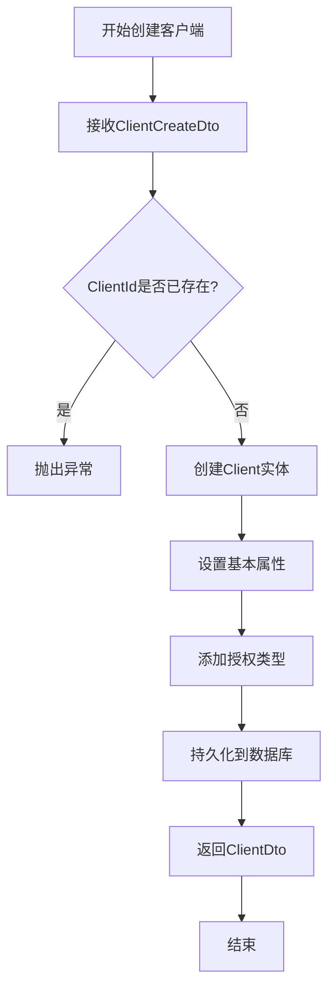

# 客户端管理

<cite>
**本文档引用的文件**  
- [ClientAppService.cs](file://aspnet-core/modules/identityServer/LINGYUN.Abp.IdentityServer.Application/LINGYUN/Abp/IdentityServer/Clients/ClientAppService.cs)
- [ClientUpdateDto.cs](file://aspnet-core/modules/identityServer/LINGYUN.Abp.IdentityServer.Application.Contracts/LINGYUN/Abp/IdentityServer/Clients/Dto/ClientUpdateDto.cs)
- [ClientCreateDto.cs](file://aspnet-core/modules/identityServer/LINGYUN.Abp.IdentityServer.Application.Contracts/LINGYUN/Abp/IdentityServer/Clients/Dto/ClientCreateDto.cs)
- [ClientController.cs](file://aspnet-core/modules/identityServer/LINGYUN.Abp.IdentityServer.HttpApi/LINGYUN/Abp/IdentityServer/Clients/ClientController.cs)
- [20230515095947_FixUser.Designer.cs](file://aspnet-core/migrations/LY.MicroService.IdentityServer.EntityFrameworkCore/Migrations/20230515095947_FixUser.Designer.cs)
</cite>

## 目录
1. [简介](#简介)
2. [客户端实体模型设计](#客户端实体模型设计)
3. [客户端配置生命周期管理](#客户端配置生命周期管理)
4. [客户端类型与安全考虑](#客户端类型与安全考虑)
5. [客户端管理API使用示例](#客户端管理api使用示例)
6. [客户端凭证存储与保护最佳实践](#客户端凭证存储与保护最佳实践)
7. [客户端安全审计指导](#客户端安全审计指导)
8. [结论](#结论)

## 简介
本文档详细阐述了abp-next-admin项目中客户端管理子模块的设计与实现。该模块基于IdentityServer4框架，为系统提供OAuth 2.0和OpenID Connect协议支持，用于管理访问受保护资源的应用程序（即客户端）。文档深入解析了客户端实体的核心属性、配置的生命周期操作（创建、更新、删除）、不同客户端类型的安全差异，并为开发者和系统管理员提供实用的配置、安全和审计指导。

## 客户端实体模型设计

客户端实体模型是整个认证授权系统的核心，它定义了客户端应用程序的身份、权限和行为。该模型设计遵循IdentityServer4规范，并通过ABP框架进行了扩展。

### 核心属性
客户端实体包含以下核心属性，这些属性共同决定了客户端的行为和安全策略：

*   **ClientId (客户端ID)**: 客户端的唯一标识符，是客户端在系统中的“用户名”。在数据库中定义为最大长度200的非空字符串，是客户端进行身份验证时必须提供的关键信息。
*   **ClientName (客户端名称)**: 用于显示的客户端名称，便于管理员识别。最大长度为200个字符。
*   **ClientUri (客户端URI)**: 指向客户端主页的URI，最大长度为2000个字符。
*   **Description (描述)**: 对客户端的详细描述，帮助理解其用途。
*   **Enabled (启用状态)**: 布尔值，用于控制客户端是否可以登录和获取令牌。禁用的客户端将无法通过认证。

### 认证与授权配置
*   **RequireClientSecret (需要客户端密钥)**: 布尔值，指示客户端是否需要提供密钥进行身份验证。公共客户端（如SPA、移动应用）通常设为`false`，而机密客户端（如Web应用）必须设为`true`。
*   **AllowedGrantTypes (允许的授权类型)**: 字符串集合，定义了客户端可以使用的授权流程，如`authorization_code`（授权码）、`implicit`（隐式）、`client_credentials`（客户端凭证）等。
*   **RequireConsent (需要用户同意)**: 布尔值，决定用户在登录时是否需要明确同意授权给该客户端。
*   **AllowAccessTokensViaBrowser (允许通过浏览器传输访问令牌)**: 仅在使用`implicit`授权类型时相关，决定访问令牌是否可以通过浏览器URL传输。

### 令牌与会话配置
*   **AccessTokenLifetime (访问令牌有效期)**: 访问令牌的有效时长（秒）。
*   **IdentityTokenLifetime (身份令牌有效期)**: 身份令牌的有效时长（秒）。
*   **AbsoluteRefreshTokenLifetime (绝对刷新令牌有效期)**: 刷新令牌的绝对过期时间（秒）。
*   **SlidingRefreshTokenLifetime (滑动刷新令牌有效期)**: 刷新令牌的滑动过期时间（秒），每次使用后都会刷新过期时间。
*   **RefreshTokenUsage (刷新令牌使用方式)**: 定义刷新令牌是单次使用（`OneTimeOnly`）还是可重复使用（`ReUse`）。
*   **UserSsoLifetime (用户单点登录有效期)**: 用户在不同客户端间单点登录的有效时长。

### 重定向与跨域配置
*   **RedirectUris (重定向URI)**: 允许的重定向URI列表。在授权码流程中，用户授权后，IdentityServer会将授权码重定向到此列表中的某个URI。这是防止重定向攻击的关键安全配置。
*   **PostLogoutRedirectUris (登出后重定向URI)**: 用户登出后，允许重定向到的URI列表。
*   **AllowedCorsOrigins (允许的跨域源)**: 允许发起跨域请求的源列表，主要用于SPA应用，防止跨站请求伪造（CSRF）攻击。

### 其他高级配置
*   **ClientSecrets (客户端密钥)**: 客户端的密钥集合，通常以哈希形式存储。用于机密客户端的身份验证。
*   **AllowedScopes (允许的作用域)**: 客户端可以请求的API资源和身份资源的范围。
*   **Claims (声明)**: 与客户端关联的声明，可以在令牌中包含。
*   **Properties (属性)**: 用于存储自定义的键值对配置。

**Section sources**
- [ClientUpdateDto.cs](file://aspnet-core/modules/identityServer/LINGYUN.Abp.IdentityServer.Application.Contracts/LINGYUN/Abp/IdentityServer/Clients/Dto/ClientUpdateDto.cs#L9-L122)
- [20230515095947_FixUser.Designer.cs](file://aspnet-core/migrations/LY.MicroService.IdentityServer.EntityFrameworkCore/Migrations/20230515095947_FixUser.Designer.cs#L981-L1015)

## 客户端配置生命周期管理

客户端的配置管理通过标准的CRUD（创建、读取、更新、删除）操作实现，所有操作均通过`ClientAppService`应用服务暴露的API进行。

### 创建客户端
创建新客户端是通过`ClientAppService.CreateAsync`方法实现的。开发者需要提供一个`ClientCreateDto`对象，其中必须包含`ClientId`、`ClientName`和至少一个`AllowedGrantTypes`。系统会首先检查`ClientId`的唯一性，如果已存在则抛出异常。创建成功后，系统会生成一个唯一的`Id`并持久化到数据库。



**Diagram sources**
- [ClientAppService.cs](file://aspnet-core/modules/identityServer/LINGYUN.Abp.IdentityServer.Application/LINGYUN/Abp/IdentityServer/Clients/ClientAppService.cs#L34-L73)

### 更新客户端
更新客户端是通过`ClientAppService.UpdateAsync`方法实现的。此方法接收客户端的`Id`和一个`ClientUpdateDto`对象。其核心逻辑是采用“合并”策略，而非简单覆盖：
1.  **基础属性**: 检查每个基础属性（如`ClientName`, `ClientUri`）是否发生变化，仅更新有变化的字段。
2.  **集合属性**: 对于`RedirectUris`, `AllowedScopes`, `ClientSecrets`等集合属性，系统会执行“差集”操作：
    *   首先，移除当前实体中存在但`input`中不存在的项。
    *   然后，遍历`input`中的项，如果在当前实体中找不到匹配项，则将其添加。
3.  **密钥处理**: 客户端密钥在更新时会进行SHA256哈希处理后再存储，确保明文密钥不会被记录。

这种设计确保了配置的精确更新，避免了因全量覆盖而导致的配置丢失。

**Section sources**
- [ClientAppService.cs](file://aspnet-core/modules/identityServer/LINGYUN.Abp.IdentityServer.Application/LINGYUN/Abp/IdentityServer/Clients/ClientAppService.cs#L68-L103)

### 删除客户端
删除客户端是通过`ClientAppService.DeleteAsync`方法实现的。该操作会根据提供的`Id`从数据库中获取对应的客户端实体，并将其删除。此操作是不可逆的，因此通常需要管理员权限。

### 克隆客户端
系统提供了一个便捷的`CloneAsync`功能，允许管理员基于一个现有客户端快速创建一个新客户端。新客户端可以继承源客户端的大部分配置（如授权类型、作用域、重定向URI等），但必须提供新的`ClientId`和`ClientName`。这在需要创建配置相似的多个客户端时非常高效。

**Section sources**
- [ClientAppService.cs](file://aspnet-core/modules/identityServer/LINGYUN.Abp.IdentityServer.Application/LINGYUN/Abp/IdentityServer/Clients/ClientAppService.cs#L220-L300)

## 客户端类型与安全考虑

根据客户端的机密性，主要分为两种类型，其安全配置有显著差异。

### 机密客户端 (Confidential Client)
*   **定义**: 运行在服务器端的应用程序，如传统的Web应用。其客户端密钥可以安全地存储在服务器上，不会暴露给最终用户。
*   **安全配置**:
    *   `RequireClientSecret` 必须设置为 `true`。
    *   推荐使用 `authorization_code` 授权类型，因为它更安全。
    *   `ClientSecrets` 必须配置强密码，并定期轮换。
    *   `RedirectUris` 必须精确配置，避免使用通配符。

### 公共客户端 (Public Client)
*   **定义**: 运行在用户设备上的应用程序，如单页应用(SPA)、移动应用或桌面应用。由于代码在客户端执行，无法安全地存储密钥。
*   **安全配置**:
    *   `RequireClientSecret` 设置为 `false`。
    *   使用 `authorization_code` 授权类型配合PKCE（Proof Key for Code Exchange）扩展，这是现代公共客户端推荐的安全方案。
    *   `AllowAccessTokensViaBrowser` 可以设置为 `true`，因为令牌需要在浏览器中使用。
    *   `AllowedCorsOrigins` 必须精确配置，以允许前端应用发起请求。

**Section sources**
- [ClientUpdateDto.cs](file://aspnet-core/modules/identityServer/LINGYUN.Abp.IdentityServer.Application.Contracts/LINGYUN/Abp/IdentityServer/Clients/Dto/ClientUpdateDto.cs#L24-L33)

## 客户端管理API使用示例

客户端管理功能通过RESTful API暴露，开发者可以通过代码或管理界面进行操作。

### API端点
*   **获取客户端列表**: `GET /api/identity-server/clients`
*   **获取单个客户端**: `GET /api/identity-server/clients/{id}`
*   **创建客户端**: `POST /api/identity-server/clients`
*   **更新客户端**: `PUT /api/identity-server/clients/{id}`
*   **删除客户端**: `DELETE /api/identity-server/clients/{id}`
*   **克隆客户端**: `POST /api/identity-server/clients/{id}/clone`

### 代码使用示例 (C#)
```csharp
// 假设已注入 IClientAppService clientAppService
var clientCreateDto = new ClientCreateDto
{
    ClientId = "my-web-app",
    ClientName = "My Web Application",
    AllowedGrantTypes = new List<ClientGrantTypeDto> 
    { 
        new ClientGrantTypeDto { GrantType = "authorization_code" } 
    },
    RedirectUris = new List<ClientRedirectUriDto>
    {
        new ClientRedirectUriDto { RedirectUri = "https://myapp.com/callback" }
    }
};

var createdClient = await clientAppService.CreateAsync(clientCreateDto);
```

### 管理界面配置
系统提供了基于Vue的管理界面（位于`apps/vue/src/views/identity-server/clients`），管理员可以通过图形化界面直观地完成所有客户端管理操作，包括在`ClientModal`、`ClientGrantType`、`ClientCallback`等组件中配置各项参数。

**Section sources**
- [ClientController.cs](file://aspnet-core/modules/identityServer/LINGYUN.Abp.IdentityServer.HttpApi/LINGYUN/Abp/IdentityServer/Clients/ClientController.cs#L42-L80)

## 客户端凭证存储与保护最佳实践

客户端凭证（尤其是密钥）的安全是整个系统安全的基石。

1.  **密钥哈希存储**: 系统在存储客户端密钥前会自动进行SHA256哈希处理，确保数据库中不会以明文形式存储密钥。
2.  **强密钥生成**: 创建客户端时，应使用密码学安全的随机数生成器生成足够长（建议32位以上）的密钥。
3.  **密钥轮换**: 定期轮换客户端密钥。在IdentityServer中，可以添加新的密钥并保留旧密钥一段时间，以确保平滑过渡，然后删除旧密钥。
4.  **环境隔离**: 不同环境（开发、测试、生产）应使用不同的客户端和密钥，避免生产密钥泄露到开发环境。
5.  **最小权限原则**: 为客户端分配其业务功能所需的最小权限集，即最小化`AllowedScopes`。

## 客户端安全审计指导

系统管理员应定期进行安全审计，以确保客户端配置的安全性。

1.  **定期审查**: 定期审查所有客户端的列表，检查是否有不再使用的客户端，并及时禁用或删除。
2.  **检查重定向URI**: 重点检查`RedirectUris`配置，确保没有包含可疑或不安全的域名，防止开放重定向攻击。
3.  **审计密钥**: 检查客户端密钥的强度和轮换历史。对于长期未轮换的密钥，应强制要求更新。
4.  **监控日志**: 启用并监控认证日志，关注异常的登录尝试和令牌请求，这可能是客户端凭证泄露的迹象。
5.  **权限审查**: 审查每个客户端的`AllowedScopes`，确保其没有被授予超出其业务需求的权限。

## 结论
abp-next-admin的客户端管理子模块提供了一套功能完整、安全可靠的解决方案。通过深入理解客户端实体模型的设计、生命周期管理流程以及不同类型客户端的安全配置，开发者可以正确地集成和配置客户端。同时，遵循凭证保护和安全审计的最佳实践，系统管理员能够有效维护整个认证授权系统的安全边界。