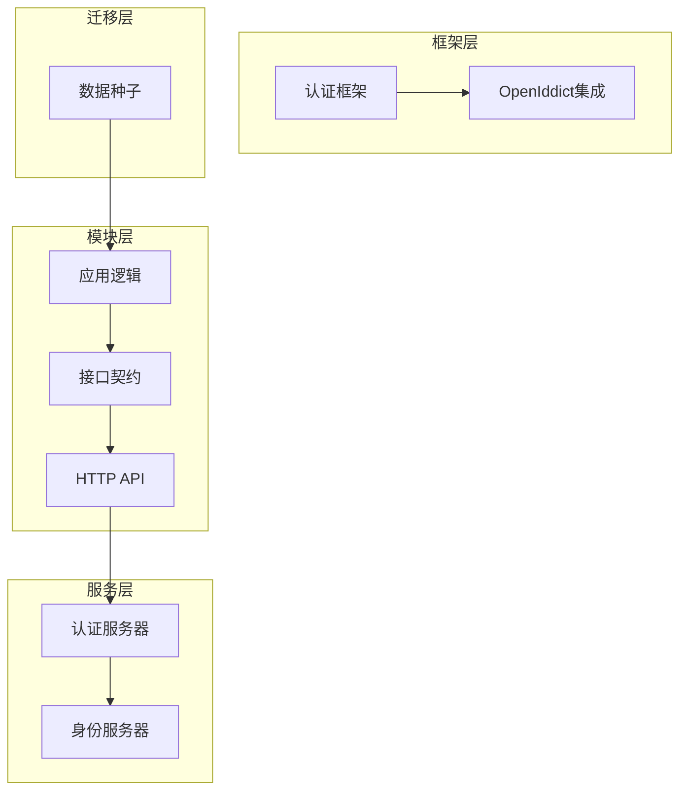
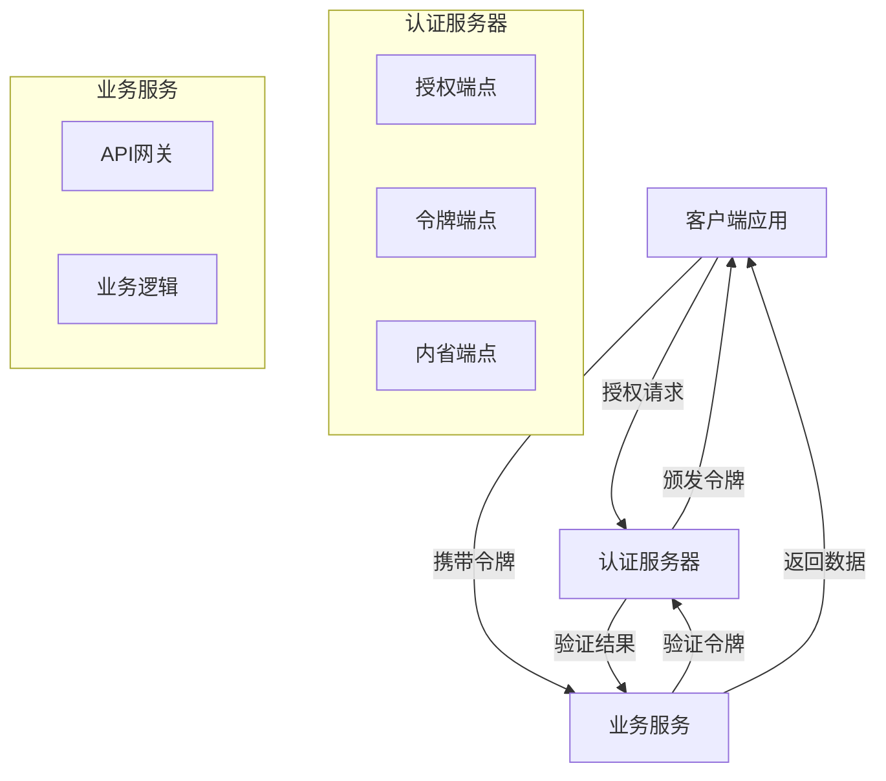
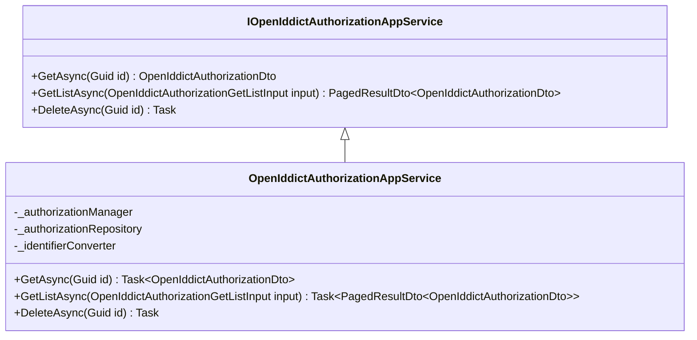
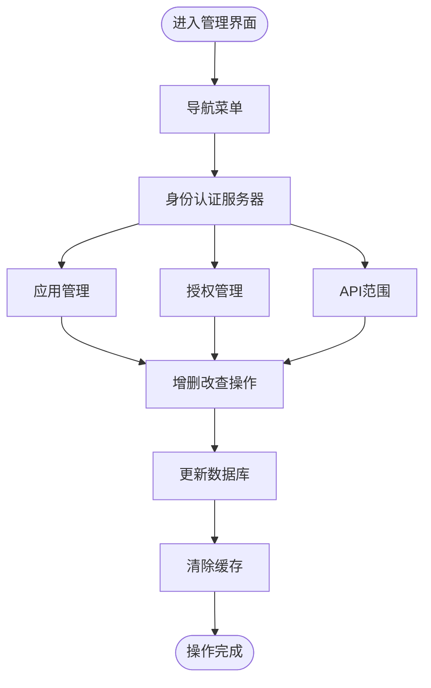
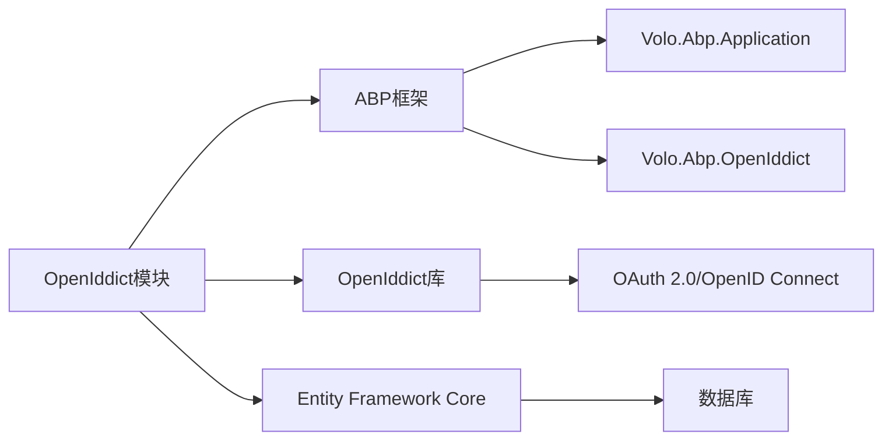

# 认证授权模块

<cite>
**本文档中引用的文件**  
- [ClientDataSeederContributor.cs](file://aspnet-core/migrations/LY.MicroService.Applications.Single.EntityFrameworkCore/DataSeeder/ClientDataSeederContributor.cs)
- [AuthServerDataSeedContributor.cs](file://aspnet-core/services/LY.MicroService.AuthServer/DataSeeder/AuthServerDataSeedContributor.cs)
- [IOpenIddictAuthorizationAppService.cs](file://aspnet-core/modules/openIddict/LINGYUN.Abp.OpenIddict.Application.Contracts/LINGYUN/Abp/OpenIddict/Authorizations/IOpenIddictAuthorizationAppService.cs)
- [OpenIddictAuthorizationAppService.cs](file://aspnet-core/modules/openIddict/LINGYUN.Abp.OpenIddict.Application/LINGYUN/Abp/OpenIddict/Authorizations/OpenIddictAuthorizationAppService.cs)
- [AbpOpenIddictApplicationModule.cs](file://aspnet-core/modules/openIddict/LINGYUN.Abp.OpenIddict.Application/LINGYUN/Abp/OpenIddict/AbpOpenIddictApplicationModule.cs)
- [AbpUINavigationVueVbenAdminNavigationDefinitionProvider.cs](file://aspnet-core/modules/platform/LINGYUN.Abp.UI.Navigation.VueVbenAdmin/LINGYUN/Abp/UI/Navigation/VueVbenAdmin/AbpUINavigationVueVbenAdminNavigationDefinitionProvider.cs)
- [README.EN.md](file://aspnet-core/modules/openIddict/LINGYUN.Abp.OpenIddict.HttpApi/README.EN.md)
- [IdentityServerHttpApiHostModule.Configure.cs](file://aspnet-core/services/LY.MicroService.IdentityServer.HttpApi.Host/IdentityServerHttpApiHostModule.Configure.cs)
- [template.json](file://aspnet-core/templates/aio/content/.template.config/template.json)
</cite>

## 目录
1. [简介](#简介)
2. [项目结构](#项目结构)
3. [核心组件](#核心组件)
4. [架构概述](#架构概述)
5. [详细组件分析](#详细组件分析)
6. [依赖分析](#依赖分析)
7. [性能考虑](#性能考虑)
8. [故障排除指南](#故障排除指南)
9. [结论](#结论)

## 简介
本项目基于OpenIddict实现OAuth 2.0和OpenID Connect协议，提供完整的认证授权功能。系统支持多种授权模式，包括授权码模式、客户端凭证模式、密码模式等，并通过模块化设计实现了灵活的客户端管理和API资源定义。项目采用微服务架构，包含独立的认证服务器和多个业务服务，支持多租户场景下的安全认证需求。

## 项目结构
项目采用分层架构设计，主要包含框架层、迁移层、模块层和服务层。认证授权功能主要集中在openIddict模块中，通过Application、Application.Contracts和HttpApi等子模块提供完整的API支持。数据初始化通过DataSeederContributor类实现，确保系统启动时具备必要的客户端配置。

**Diagram sources**
- [ClientDataSeederContributor.cs](file://aspnet-core/migrations/LY.MicroService.Applications.Single.EntityFrameworkCore/DataSeeder/ClientDataSeederContributor.cs)
- [AbpOpenIddictApplicationModule.cs](file://aspnet-core/modules/openIddict/LINGYUN.Abp.OpenIddict.Application/LINGYUN/Abp/OpenIddict/AbpOpenIddictApplicationModule.cs)

**Section sources**
- [ClientDataSeederContributor.cs](file://aspnet-core/migrations/LY.MicroService.Applications.Single.EntityFrameworkCore/DataSeeder/ClientDataSeederContributor.cs)
- [template.json](file://aspnet-core/templates/aio/content/.template.config/template.json)

## 核心组件
认证授权模块的核心组件包括客户端管理、API资源定义、身份资源配置等。系统通过OpenIddictConstants.Permissions定义了完整的权限体系，支持授权码、密码、客户端凭证等多种授权模式。客户端配置包含重定向URI、权限集合等关键属性，确保安全的认证流程。

**Section sources**
- [ClientDataSeederContributor.cs](file://aspnet-core/migrations/LY.MicroService.Applications.Single.EntityFrameworkCore/DataSeeder/ClientDataSeederContributor.cs)
- [AuthServerDataSeedContributor.cs](file://aspnet-core/services/LY.MicroService.AuthServer/DataSeeder/AuthServerDataSeedContributor.cs)

## 架构概述
系统采用基于OpenIddict的认证架构，通过标准的OAuth 2.0和OpenID Connect协议实现安全认证。架构分为表示层、应用层、领域层和基础设施层，各层职责分明。认证服务器负责令牌的颁发和验证，业务服务通过API网关进行安全访问控制。

**Diagram sources**
- [IdentityServerHttpApiHostModule.Configure.cs](file://aspnet-core/services/LY.MicroService.IdentityServer.HttpApi.Host/IdentityServerHttpApiHostModule.Configure.cs)
- [README.EN.md](file://aspnet-core/modules/openIddict/LINGYUN.Abp.OpenIddict.HttpApi/README.EN.md)

## 详细组件分析

### 授权管理分析
授权管理组件负责处理用户的授权记录，提供授权的查询、删除等操作。系统通过IOpenIddictAuthorizationAppService接口定义了标准的CRUD操作，支持分页查询和条件过滤。授权数据与客户端应用关联，便于进行细粒度的权限控制。

**Diagram sources**
- [IOpenIddictAuthorizationAppService.cs](file://aspnet-core/modules/openIddict/LINGYUN.Abp.OpenIddict.Application.Contracts/LINGYUN/Abp/OpenIddict/Authorizations/IOpenIddictAuthorizationAppService.cs)
- [OpenIddictAuthorizationAppService.cs](file://aspnet-core/modules/openIddict/LINGYUN.Abp.OpenIddict.Application/LINGYUN/Abp/OpenIddict/Authorizations/OpenIddictAuthorizationAppService.cs)

**Section sources**
- [OpenIddictAuthorizationAppService.cs](file://aspnet-core/modules/openIddict/LINGYUN.Abp.OpenIddict.Application/LINGYUN/Abp/OpenIddict/Authorizations/OpenIddictAuthorizationAppService.cs)

### 应用管理分析
应用管理功能通过导航菜单集成到管理界面中，提供应用、授权和API范围的可视化管理。系统支持主机端的多租户配置，管理员可以通过Web界面进行客户端应用的增删改查操作，简化了配置管理流程。

**Diagram sources**
- [AbpUINavigationVueVbenAdminNavigationDefinitionProvider.cs](file://aspnet-core/modules/platform/LINGYUN.Abp.UI.Navigation.VueVbenAdmin/LINGYUN/Abp/UI/Navigation/VueVbenAdmin/AbpUINavigationVueVbenAdminNavigationDefinitionProvider.cs)

**Section sources**
- [AbpUINavigationVueVbenAdminNavigationDefinitionProvider.cs](file://aspnet-core/modules/platform/LINGYUN.Abp.UI.Navigation.VueVbenAdmin/LINGYUN/Abp/UI/Navigation/VueVbenAdmin/AbpUINavigationVueVbenAdminNavigationDefinitionProvider.cs)

## 依赖分析
认证授权模块依赖于ABP框架的核心组件和OpenIddict库，通过模块化设计实现了松耦合的架构。应用层依赖于领域层的服务和仓储，接口契约层为前后端分离提供了清晰的API定义。数据访问通过Entity Framework Core实现，支持多种数据库。

**Diagram sources**
- [AbpOpenIddictApplicationModule.cs](file://aspnet-core/modules/openIddict/LINGYUN.Abp.OpenIddict.Application/LINGYUN/Abp/OpenIddict/AbpOpenIddictApplicationModule.cs)

**Section sources**
- [AbpOpenIddictApplicationModule.cs](file://aspnet-core/modules/openIddict/LINGYUN.Abp.OpenIddict.Application/LINGYUN/Abp/OpenIddict/AbpOpenIddictApplicationModule.cs)

## 性能考虑
系统在认证授权过程中考虑了性能优化，通过缓存机制减少数据库访问，采用异步编程模型提高响应速度。令牌验证采用JWT标准，支持无状态验证，减轻服务器负担。建议在生产环境中启用HTTPS，确保通信安全。

## 故障排除指南
当遇到认证授权问题时，首先检查客户端配置是否正确，包括重定向URI和权限设置。查看日志文件中的安全日志记录，确认认证流程的执行情况。确保认证服务器和业务服务之间的网络连接正常，时钟同步准确。

**Section sources**
- [README.EN.md](file://aspnet-core/modules/openIddict/LINGYUN.Abp.OpenIddict.HttpApi/README.EN.md)

## 结论
本认证授权模块基于OpenIddict实现了完整的OAuth 2.0和OpenID Connect协议支持，提供了灵活的客户端管理和细粒度的权限控制。系统架构清晰，组件职责分明，支持多租户场景下的安全认证需求。通过标准化的API设计和管理界面集成，为开发者和系统管理员提供了便捷的使用体验。