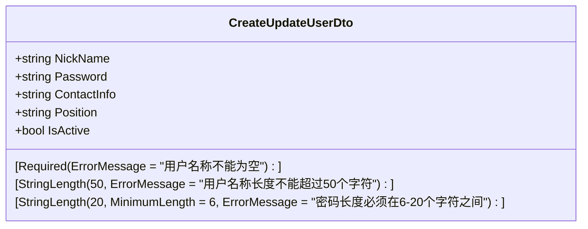
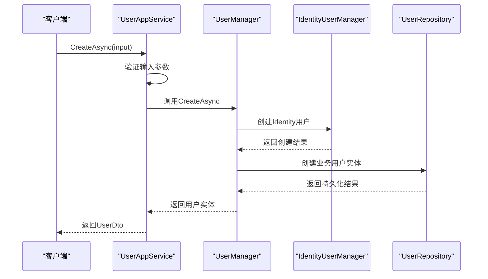
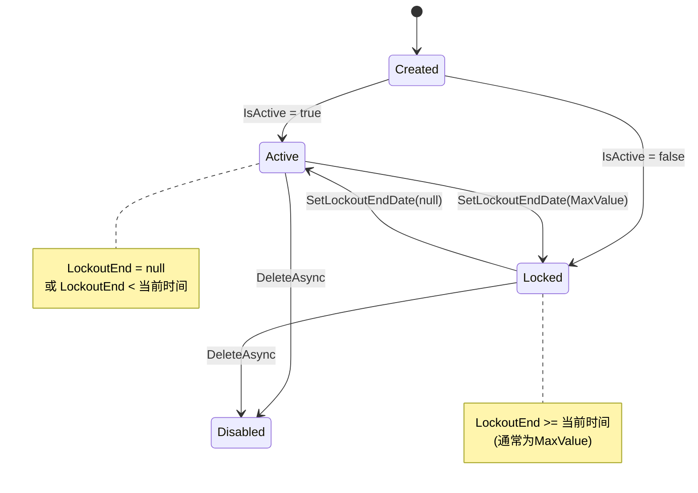
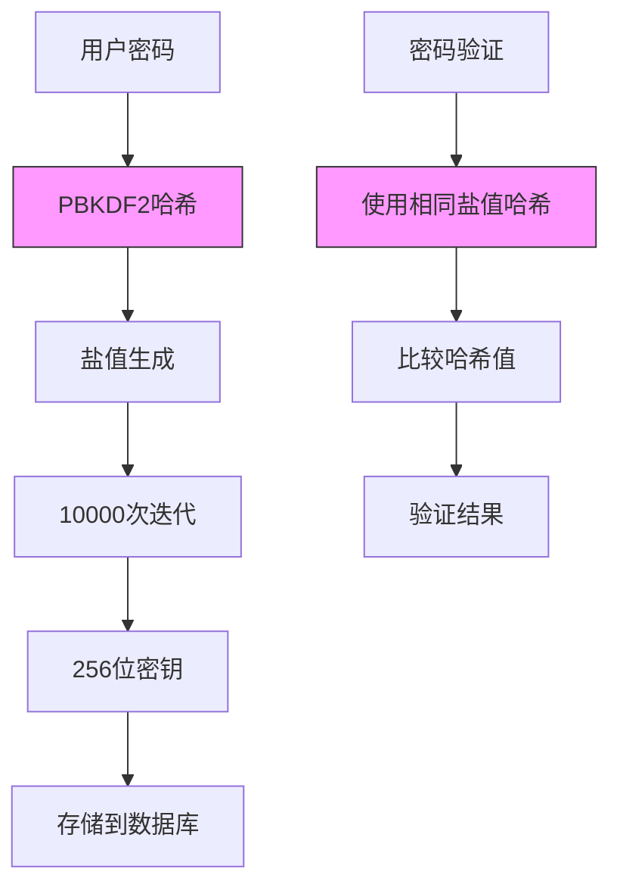
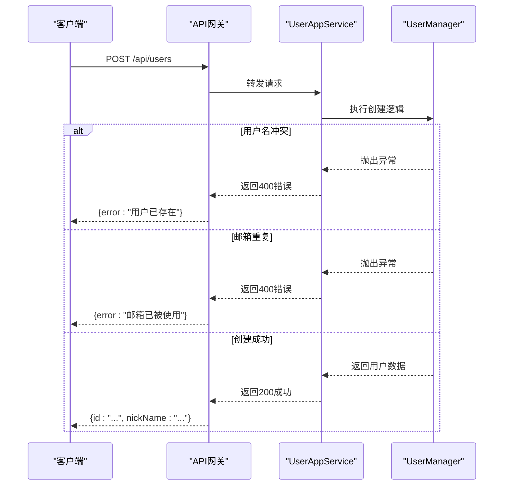
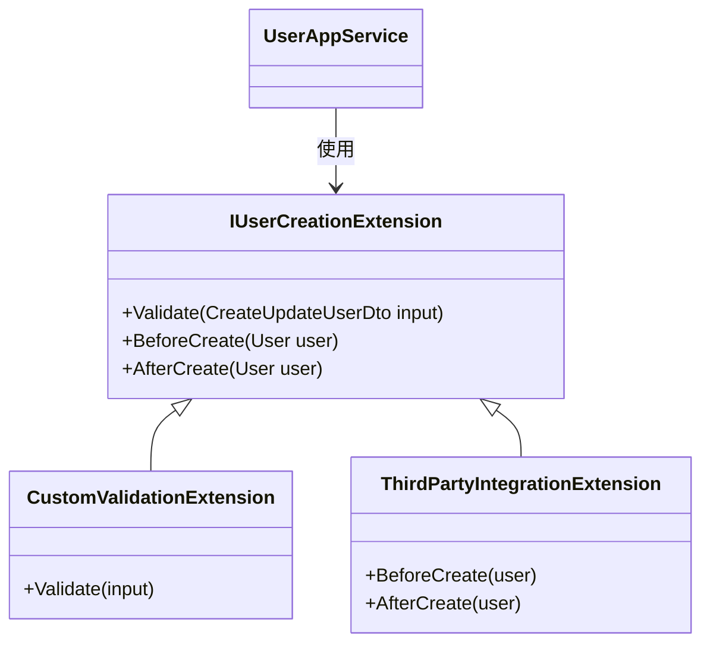

# 用户创建

<cite>
**本文档引用的文件**
- [CreateUpdateUserDto.cs](file://aspnet-core\templates\aio\content\src\PackageName.CompanyName.ProjectName.Application.Contracts\PackageName\CompanyName\ProjectName\Users\Dtos\CreateUpdateUserDto.cs)
- [UserAppService.cs](file://aspnet-core\templates\aio\content\src\PackageName.CompanyName.ProjectName.Application\PackageName\CompanyName\ProjectName\Users\UserAppService.cs)
- [UserManager.cs](file://aspnet-core\templates\aio\content\src\PackageName.CompanyName.ProjectName.Domain\PackageName\CompanyName\ProjectName\Users\UserManager.cs)
- [User.cs](file://aspnet-core\templates\aio\content\src\PackageName.CompanyName.ProjectName.Domain\PackageName\CompanyName\ProjectName\Users\User.cs)
- [IdentityUserManagerExtensions.cs](file://aspnet-core\modules\identity\LINGYUN.Abp.Identity.Domain\Microsoft\AspNetCore\Identity\IdentityUserManagerExtensions.cs)
- [UserSettingAppService.cs](file://aspnet-core\modules\settings\LINGYUN.Abp.SettingManagement.Application\LINGYUN\Abp\SettingManagement\UserSettingAppService.cs)
- [SettingAppService.cs](file://aspnet-core\modules\settings\LINGYUN.Abp.SettingManagement.Application\LINGYUN\Abp\SettingManagement\SettingAppService.cs)
</cite>

## 目录
1. [简介](#简介)
2. [数据传输对象定义](#数据传输对象定义)
3. [用户创建业务逻辑](#用户创建业务逻辑)
4. [用户状态转换与事件机制](#用户状态转换与事件机制)
5. [密码安全与哈希算法](#密码安全与哈希算法)
6. [API调用示例](#api调用示例)
7. [扩展与自定义](#扩展与自定义)
8. [异常处理](#异常处理)
9. [总结](#总结)

## 简介
本文档详细说明了基于ABP框架的用户创建功能实现。系统采用分层架构设计，将用户创建流程分解为数据传输、业务逻辑、领域服务和持久化等多个层次。核心功能通过`CreateUpdateUserDto`数据传输对象接收用户输入，经由`UserAppService`应用服务协调，最终由`UserManager`领域服务完成用户实体的创建和持久化。整个流程遵循领域驱动设计原则，确保了业务逻辑的清晰性和可维护性。

## 数据传输对象定义
`CreateUpdateUserDto`数据传输对象定义了用户创建所需的所有字段及其验证规则。该对象采用数据注解（Data Annotations）方式进行声明式验证，确保输入数据的完整性和正确性。



**图示来源**
- [CreateUpdateUserDto.cs](file://aspnet-core\templates\aio\content\src\PackageName.CompanyName.ProjectName.Application.Contracts\PackageName\CompanyName\ProjectName\Users\Dtos\CreateUpdateUserDto.cs#L1-L37)

**字段定义与验证规则：**
- **NickName（用户名称）**：必填字段，长度限制在50个字符以内，用于标识用户身份
- **Password（密码）**：可选字段，长度必须在6-20个字符之间，遵循密码强度策略
- **ContactInfo（联系方式）**：可选字段，用于存储用户的联系信息
- **Position（职位）**：可选字段，记录用户的职位信息
- **IsActive（是否启用）**：布尔类型，默认值为true，表示用户创建后默认处于激活状态

**本节来源**
- [CreateUpdateUserDto.cs](file://aspnet-core\templates\aio\content\src\PackageName.CompanyName.ProjectName.Application.Contracts\PackageName\CompanyName\ProjectName\Users\Dtos\CreateUpdateUserDto.cs#L1-L37)

## 用户创建业务逻辑
用户创建的核心逻辑由`IdentityUserAppService`中的`CreateAsync`方法实现，该方法遵循典型的三层架构模式，协调应用服务、领域服务和基础设施服务完成用户创建。



**图示来源**
- [UserAppService.cs](file://aspnet-core\templates\aio\content\src\PackageName.CompanyName.ProjectName.Application\PackageName\CompanyName\ProjectName\Users\UserAppService.cs#L39-L78)
- [UserManager.cs](file://aspnet-core\templates\aio\content\src\PackageName.CompanyName.ProjectName.Domain\PackageName\CompanyName\ProjectName\Users\UserManager.cs#L37-L97)

**业务流程详细说明：**
1. **参数验证**：首先检查用户名称和密码是否为空，确保基本输入要求
2. **唯一性检查**：通过`_userRepository.FindAsync`查询数据库，验证用户昵称是否已存在，防止重复创建
3. **密码强度验证**：检查密码长度是否符合最小6位的要求，确保密码安全性
4. **Identity用户创建**：使用`IdentityUserManager.CreateAsync`方法创建ASP.NET Core Identity用户，系统自动处理密码哈希
5. **用户状态设置**：根据`IsActive`参数设置用户锁定状态，禁用用户时设置`LockoutEndDate`为最大值
6. **业务用户创建**：创建与Identity用户关联的业务用户实体，存储额外的业务信息
7. **持久化保存**：通过`_userRepository.InsertAsync`将用户实体保存到数据库

**本节来源**
- [UserAppService.cs](file://aspnet-core\templates\aio\content\src\PackageName.CompanyName.ProjectName.Application\PackageName\CompanyName\ProjectName\Users\UserAppService.cs#L39-L78)
- [UserManager.cs](file://aspnet-core\templates\aio\content\src\PackageName.CompanyName.ProjectName.Domain\PackageName\CompanyName\ProjectName\Users\UserManager.cs#L37-L97)

## 用户状态转换与事件机制
用户实体在创建过程中经历明确的状态转换，并通过事件机制通知系统其他组件。系统采用基于ASP.NET Core Identity的状态管理模型，通过`LockoutEnd`属性控制用户激活状态。



**图示来源**
- [UserManager.cs](file://aspnet-core\templates\aio\content\src\PackageName.CompanyName.ProjectName.Domain\PackageName\CompanyName\ProjectName\Users\UserManager.cs#L75-L97)
- [User.cs](file://aspnet-core\templates\aio\content\src\PackageName.CompanyName.ProjectName.Domain\PackageName\CompanyName\ProjectName\Users\User.cs#L1-L59)

**状态转换规则：**
- **创建状态（Created）**：用户实体刚被创建，尚未确定最终状态
- **激活状态（Active）**：`LockoutEnd`为null或小于当前时间，用户可以正常登录
- **锁定状态（Locked）**：`LockoutEnd`大于等于当前时间，用户被禁止登录
- **禁用状态（Disabled）**：用户被删除，从系统中移除

**事件触发机制：**
系统通过领域事件（Domain Events）模式实现松耦合的事件通知。当用户状态发生变化时，`UserManager`会发布相应的领域事件，如`UserCreatedEvent`、`UserStatusChangedEvent`等。其他模块可以通过订阅这些事件来执行相应的业务逻辑，例如发送欢迎邮件、记录审计日志或同步到第三方系统。

**本节来源**
- [UserManager.cs](file://aspnet-core\templates\aio\content\src\PackageName.CompanyName.ProjectName.Domain\PackageName\CompanyName\ProjectName\Users\UserManager.cs#L75-L97)
- [User.cs](file://aspnet-core\templates\aio\content\src\PackageName.CompanyName.ProjectName.Domain\PackageName\CompanyName\ProjectName\Users\User.cs#L1-L59)

## 密码安全与哈希算法
系统采用ASP.NET Core Identity默认的密码哈希机制，基于PBKDF2算法提供强大的密码安全保护。密码策略通过配置系统进行管理，支持动态调整安全要求。



**图示来源**
- [IdentityUserManagerExtensions.cs](file://aspnet-core\modules\identity\LINGYUN.Abp.Identity.Domain\Microsoft\AspNetCore\Identity\IdentityUserManagerExtensions.cs#L1-L43)
- [UserSettingAppService.cs](file://aspnet-core\modules\settings\LINGYUN.Abp.SettingManagement.Application\LINGYUN\Abp\SettingManagement\UserSettingAppService.cs#L142-L164)

**密码策略配置：**
系统支持通过设置管理模块配置密码策略，包括：
- **密码长度**：最小6位，最大20位
- **字符复杂度**：可配置是否要求包含大写字母、小写字母、数字和特殊字符
- **唯一字符**：可配置密码中必须包含的唯一字符数量
- **密码历史**：防止用户重复使用最近使用过的密码
- **密码过期**：可配置密码定期更换策略

**安全配置：**
- **PBKDF2参数**：使用HMAC-SHA256作为伪随机函数，10000次迭代，256位密钥长度
- **盐值管理**：每个用户使用唯一的随机盐值，防止彩虹表攻击
- **哈希存储**：哈希值与盐值一起存储在IdentityUser表中，格式为`V3`版本

**本节来源**
- [IdentityUserManagerExtensions.cs](file://aspnet-core\modules\identity\LINGYUN.Abp.Identity.Domain\Microsoft\AspNetCore\Identity\IdentityUserManagerExtensions.cs#L1-L43)
- [UserSettingAppService.cs](file://aspnet-core\modules\settings\LINGYUN.Abp.SettingManagement.Application\LINGYUN\Abp\SettingManagement\UserSettingAppService.cs#L142-L164)
- [SettingAppService.cs](file://aspnet-core\modules\settings\LINGYUN.Abp.SettingManagement.Application\LINGYUN\Abp\SettingManagement\SettingAppService.cs#L324-L370)

## API调用示例
以下示例展示了如何通过HTTP请求创建新用户，包括成功创建和处理异常情况的完整流程。



**图示来源**
- [UserAppService.cs](file://aspnet-core\templates\aio\content\src\PackageName.CompanyName.ProjectName.Application\PackageName\CompanyName\ProjectName\Users\UserAppService.cs#L39-L78)
- [UserManager.cs](file://aspnet-core\templates\aio\content\src\PackageName.CompanyName.ProjectName.Domain\PackageName\CompanyName\ProjectName\Users\UserManager.cs#L37-L97)

**成功创建用户示例：**
```json
POST /api/users
Content-Type: application/json
Authorization: Bearer <token>

{
  "nickName": "zhangsan",
  "password": "Test123456!",
  "contactInfo": "13800138000",
  "position": "工程师",
  "isActive": true
}

HTTP/1.1 200 OK
Content-Type: application/json

{
  "id": "a1b2c3d4-e5f6-7890-g1h2-i3j4k5l6m7n8",
  "nickName": "zhangsan",
  "contactInfo": "13800138000",
  "position": "工程师",
  "isActive": true,
  "creationTime": "2024-01-01T00:00:00Z"
}
```

**本节来源**
- [UserAppService.cs](file://aspnet-core\templates\aio\content\src\PackageName.CompanyName.ProjectName.Application\PackageName\CompanyName\ProjectName\Users\UserAppService.cs#L39-L78)
- [UserManager.cs](file://aspnet-core\templates\aio\content\src\PackageName.CompanyName.ProjectName.Domain\PackageName\CompanyName\ProjectName\Users\UserManager.cs#L37-L97)

## 扩展与自定义
系统提供了灵活的扩展机制，允许开发者在不修改核心代码的情况下添加自定义验证规则和集成第三方身份验证。



**图示来源**
- [UserAppService.cs](file://aspnet-core\templates\aio\content\src\PackageName.CompanyName.ProjectName.Application\PackageName\CompanyName\ProjectName\Users\UserAppService.cs#L39-L78)
- [UserManager.cs](file://aspnet-core\templates\aio\content\src\PackageName.CompanyName.ProjectName.Domain