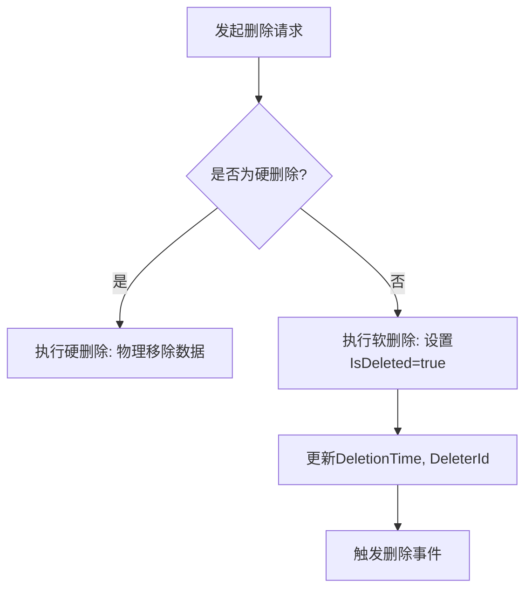
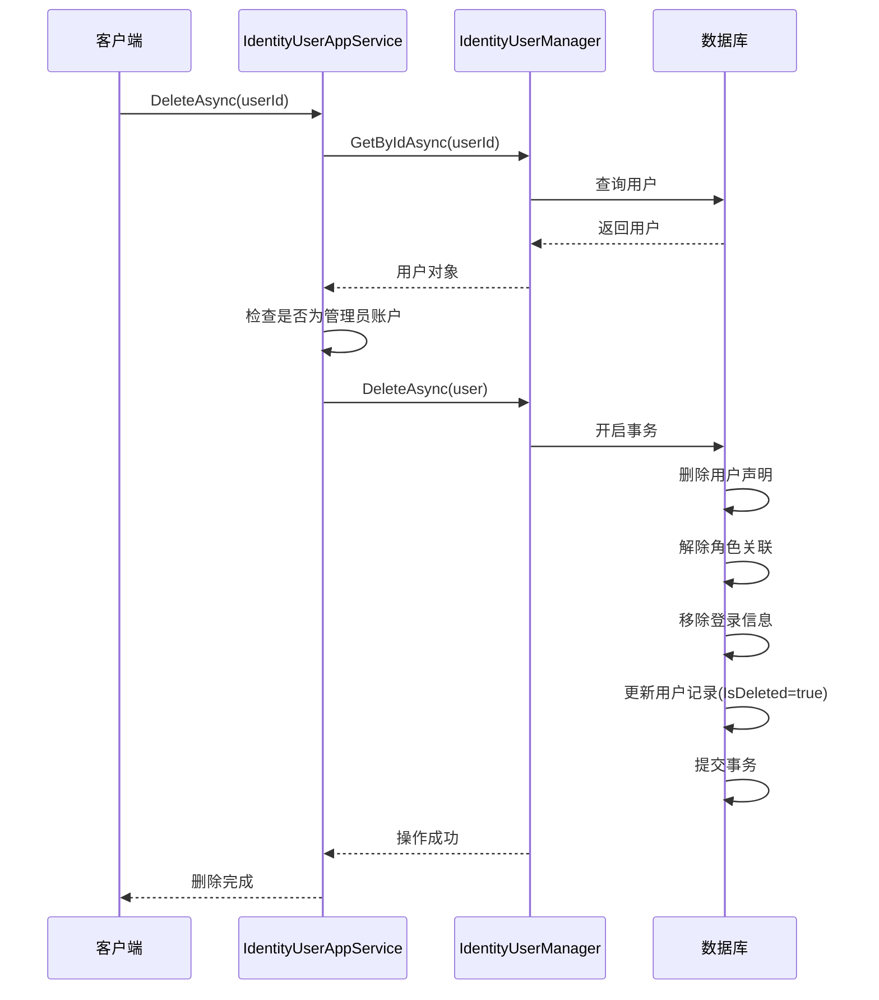

# 用户删除

<cite>
**本文档引用的文件**   
- [IdentityUserAppService.cs](file://aspnet-core/modules/identity/LINGYUN.Abp.Identity.Application/LINGYUN/Abp/Identity/IdentityUserAppService.cs)
- [IdentityUserManagerExtensions.cs](file://aspnet-core/modules/identity/LINGYUN.Abp.Identity.Domain/Microsoft/AspNetCore/Identity/IdentityUserManagerExtensions.cs)
- [AbpGdprIdentityUserDataProvider.cs](file://aspnet-core/modules/gdpr/LINGYUN.Abp.Gdpr.Domain.Identity/LINGYUN/Abp/Gdpr/Identity/AbpGdprIdentityUserDataProvider.cs)
- [AbpGdprIdentityUserAccountProvider.cs](file://aspnet-core/modules/gdpr/LINGYUN.Abp.Gdpr.Domain.Identity/LINGYUN/Abp/Gdpr/Identity/AbpGdprIdentityUserAccountProvider.cs)
- [SingleMigrationsDbContextModelSnapshot.cs](file://aspnet-core/migrations/LY.MicroService.Applications.Single.EntityFrameworkCore.PostgreSql/Migrations/SingleMigrationsDbContextModelSnapshot.cs)
</cite>

## 目录
1. [引言](#引言)
2. [软删除与硬删除机制](#软删除与硬删除机制)
3. [IsDeleted标志位与查询过滤](#isdeleted标志位与查询过滤)
4. [IdentityUserAppService中的DeleteAsync方法](#identityuserappservice中的deleteasync方法)
5. [权限验证与审计日志](#权限验证与审计日志)
6. [数据完整性保护措施](#数据完整性保护措施)
7. [API调用示例](#api调用示例)
8. [自定义删除策略扩展点](#自定义删除策略扩展点)
9. [结论](#结论)

## 引言
本文档详细阐述了用户删除功能的实现机制，涵盖软删除与硬删除的区别、IsDeleted标志位的使用、查询过滤机制、事务处理逻辑、关联数据级联处理、权限验证、审计日志记录、事件发布机制以及数据完整性保护措施。同时提供API调用示例和开发者扩展点，以满足GDPR等数据合规要求。

## 软删除与硬删除机制

在系统中，用户删除操作主要采用软删除（Soft Delete）机制，而非直接从数据库中物理移除记录的硬删除（Hard Delete）。软删除通过设置实体的`IsDeleted`标志位来标记用户已被删除，而实际数据仍然保留在数据库中。这种设计具有以下优势：

- **数据可恢复性**：被删除的用户数据可以被恢复，避免误删造成的损失。
- **历史数据完整性**：保留与已删除用户相关的业务数据（如订单、日志），保证业务链路的完整性。
- **审计追踪**：便于进行安全审计和问题追溯。

硬删除通常作为软删除后的最终清理步骤，或在特定合规场景下（如严格遵循GDPR的"被遗忘权"）执行。硬删除会彻底移除数据库中的相关记录。



**Diagram sources**
- [AbpGdprIdentityUserAccountProvider.cs](file://aspnet-core/modules/gdpr/LINGYUN.Abp.Gdpr.Domain.Identity/LINGYUN/Abp/Gdpr/Identity/AbpGdprIdentityUserAccountProvider.cs#L0-L29)

## IsDeleted标志位与查询过滤

`IsDeleted`是所有继承自ABP框架基类（如`FullAuditedEntity`）的实体所共有的一个布尔类型属性。它在数据库层面映射为`IsDeleted`字段，并默认值为`false`。

当对用户执行软删除时，该字段会被设置为`true`。为了确保应用程序的其他部分不会访问到已被删除的用户，ABP框架在数据访问层（Repository）自动应用了全局过滤器（Global Filter）。这意味着，除非显式地禁用此过滤器，否则所有标准的查询操作（如`GetListAsync`, `FindAsync`）都会自动附加`WHERE IsDeleted = false`条件。

例如，在PostgreSQL数据库的迁移脚本中可以看到该字段的定义：
```csharp
b.Property<bool>("IsDeleted")
    .ValueGeneratedOnAdd()
    .HasColumnType("boolean")
    .HasDefaultValue(false)
    .HasColumnName("IsDeleted");
```

这确保了在绝大多数业务场景下，已删除的用户对系统是不可见的。

**Section sources**
- [SingleMigrationsDbContextModelSnapshot.cs](file://aspnet-core/migrations/LY.MicroService.Applications.Single.EntityFrameworkCore.PostgreSql/Migrations/SingleMigrationsDbContextModelSnapshot.cs#L3575-L3606)

## IdentityUserAppService中的DeleteAsync方法

`IdentityUserAppService`是处理用户管理应用服务的核心类，其`DeleteAsync`方法负责协调整个用户删除流程。该方法的事务处理逻辑严谨，确保了数据的一致性。

### 事务处理与关联数据级联

删除一个用户不仅仅是删除`IdentityUser`表中的记录，还涉及到多个关联数据的处理。`DeleteAsync`方法在一个数据库事务中执行以下关键步骤：

1.  **获取用户对象**：首先通过`IdentityUserManager`获取待删除用户的完整信息。
2.  **检查特殊账户**：代码中包含逻辑，用于保护特定的系统账户（如用户名为"admin"的账户），防止被意外删除。
3.  **执行删除操作**：调用`IdentityUserManager.DeleteAsync()`方法。这个方法内部会处理与用户相关的级联数据，包括：
    *   **用户声明 (Claims)**：清除用户的所有身份声明。
    *   **登录信息 (Logins)**：移除用户与第三方登录提供商（如微信、QQ）的绑定关系。
    *   **角色分配 (Roles)**：解除用户与所有角色的关联。
    *   **刷新令牌 (Refresh Tokens)**：使所有与该用户相关的刷新令牌失效。
4.  **结果校验**：检查删除操作的结果，如果失败则抛出异常。



**Diagram sources**
- [AbpGdprIdentityUserAccountProvider.cs](file://aspnet-core/modules/gdpr/LINGYUN.Abp.Gdpr.Domain.Identity/LINGYUN/Abp/Gdpr/Identity/AbpGdprIdentityUserAccountProvider.cs#L0-L29)
- [IdentityUserManagerExtensions.cs](file://aspnet-core/modules/identity/LINGYUN.Abp.Identity.Domain/Microsoft/AspNetCore/Identity/IdentityUserManagerExtensions.cs)

**Section sources**
- [IdentityUserAppService.cs](file://aspnet-core/modules/identity/LINGYUN.Abp.Identity.Application/LINGYUN/Abp/Identity/IdentityUserAppService.cs)

## 权限验证与审计日志

### 权限验证
删除用户是一项高风险操作，因此必须经过严格的权限控制。系统通过ABP框架的权限管理系统来实现这一点。在`IdentityUserAppService`的`DeleteAsync`方法上，通常会应用`[Authorize]`特性，并指定具体的权限名称（如`IdentityPermissions.Users.Delete`）。只有拥有相应权限的角色才能成功调用此接口。

### 审计日志记录
每一次用户删除操作都会被详细记录在审计日志中。ABP框架的审计日志模块会自动捕获以下信息：
- **操作者 (UserId)**：执行删除操作的用户ID。
- **操作时间 (ExecutionTime)**：操作发生的时间戳。
- **操作类型 (Action)**：记录为"Delete"。
- **受影响的实体 (EntityChanges)**：记录`IdentityUser`实体的状态变化，特别是`IsDeleted`字段从`false`变为`true`。
- **客户端信息**：IP地址、浏览器信息等。

这些日志对于安全审查、故障排查和合规性检查至关重要。

### 事件发布机制
当用户删除成功后，系统会发布领域事件（Domain Event），例如`GdprUserAccountDeletionRequestedEto`。其他关心此事件的模块（如消息通知、数据分析、外部系统同步）可以订阅该事件并做出响应，实现了业务逻辑的解耦。

**Section sources**
- [AbpGdprIdentityUserAccountProvider.cs](file://aspnet-core/modules/gdpr/LINGYUN.Abp.Gdpr.Domain.Identity/LINGYUN/Abp/Gdpr/Identity/AbpGdprIdentityUserAccountProvider.cs#L0-L29)
- [GdprUserAccountDeletionRequestedEto.cs](file://aspnet-core/modules/gdpr/LINGYUN.Abp.Gdpr.Domain.Shared/LINGYUN/Abp/Gdpr/GdprUserAccountDeletionRequestedEto.cs)

## 数据完整性保护措施

### 外键约束
数据库设计中广泛使用外键约束来维护数据完整性。例如，`UserRole`、`UserClaim`等表都通过`UserId`外键与`IdentityUser`表关联。当启用级联删除（Cascade Delete）时，删除主表记录会自动删除从表的相关记录。但在本系统的软删除模式下，更常见的做法是保留这些关联记录，并依赖`IsDeleted`标志位来过滤它们。

### 删除前业务规则检查
在执行删除操作之前，应用服务会进行一系列业务规则检查：
- **账户状态检查**：确认用户账户处于可删除状态（非锁定、非禁用等）。
- **关联业务检查**：检查用户是否仍有未完成的订单、正在进行的任务或其他关键业务关联。如果有，则阻止删除操作并提示用户先处理这些关联项。
- **权限检查**：如前所述，验证当前用户是否有权删除目标用户。

这些检查确保了删除操作不会破坏业务逻辑的连贯性。

**Section sources**
- [IdentityUserAppService.cs](file://aspnet-core/modules/identity/LINGYUN.Abp.Identity.Application/LINGYUN/Abp/Identity/IdentityUserAppService.cs)

## API调用示例

以下是一个安全删除用户的API调用示例：

**请求**
```http
DELETE /api/identity/users/{id}
Authorization: Bearer <your-jwt-token>
```

**成功响应 (HTTP 204 No Content)**
```json
// 无内容
```

**失败响应 (HTTP 400 Bad Request)**
```json
{
  "error": {
    "code": "UserCannotBeDeleted",
    "message": "无法删除此用户，因为它是系统管理员账户。",
    "details": null,
    "data": {}
  }
}
```

**失败响应 (HTTP 403 Forbidden)**
```json
{
  "error": {
    "code": "Abp.Authorization",
    "message": "您没有权限执行此操作。",
    "details": null,
    "data": {}
  }
}
```

**处理删除失败的情况**
1.  **解析错误码**：根据返回的`code`判断失败原因。
2.  **向用户反馈**：将友好的错误信息展示给最终用户。
3.  **记录日志**：在客户端记录失败事件，便于后续分析。
4.  **重试机制**：对于因并发冲突导致的失败，可实现指数退避重试策略。

## 自定义删除策略扩展点

系统为开发者提供了灵活的扩展点，以满足不同的业务需求：

### 实现回收站功能
可以通过创建一个新的`RecycleBinManager`服务来实现回收站功能。该服务不直接调用`DeleteAsync`，而是：
1.  将用户移动到一个特殊的“回收站”状态（例如，添加一个`InRecycleBin`标志位）。
2.  记录删除时间和操作者。
3.  在一定期限（如30天）后，再执行真正的软删除或硬删除。

### 满足GDPR数据删除要求
对于需要完全擦除个人数据的GDPR场景，可以利用`IGdprUserAccountProvider`接口。通过实现此接口，可以在用户账户被删除时，不仅标记`IsDeleted`，还可以：
-  **匿名化数据**：将用户的姓名、邮箱等敏感信息替换为占位符（如`user_xxx@abp.io`）。
-  **物理删除**：在满足法律要求的前提下，安排后台任务对超过保留期限的数据进行硬删除。

```csharp
public class CustomGdprUserAccountProvider : GdprUserAccountProviderBase
{
    public override string Name => "Custom";

    public async override Task DeleteAsync(GdprDeleteUserAccountContext context)
    {
        var userManager = context.ServiceProvider.GetRequiredService<IdentityUserManager>();
        var user = await userManager.GetByIdAsync(context.UserId);

        // 执行GDPR合规的删除策略
        user.Name = "[已删除]";
        user.Email = $"{user.UserName}@gdpr-anonymized.com";
        await userManager.UpdateAsync(user); // 这会触发软删除

        // 或者，执行硬删除
        // await userManager.DeleteAsync(user);
    }
}
```

**Section sources**
- [AbpGdprIdentityUserDataProvider.cs](file://aspnet-core/modules/gdpr/LINGYUN.Abp.Gdpr.Domain.Identity/LINGYUN/Abp/Gdpr/Identity/AbpGdprIdentityUserDataProvider.cs#L0-L70)
- [IGdprUserAccountProvider.cs](file://aspnet-core/modules/gdpr/LINGYUN.Abp.Gdpr.Domain/LINGYUN/Abp/Gdpr/IGdprUserAccountProvider.cs)

## 结论
本系统通过结合软删除机制、`IsDeleted`标志位、全局查询过滤、严格的权限验证和详尽的审计日志，构建了一个安全、可靠且符合合规要求的用户删除功能。`IdentityUserAppService`中的`DeleteAsync`方法通过事务管理确保了关联数据的级联处理。开发者可以利用提供的扩展点，轻松实现回收站或满足GDPR等复杂的数据删除策略，从而适应多样化的业务场景。