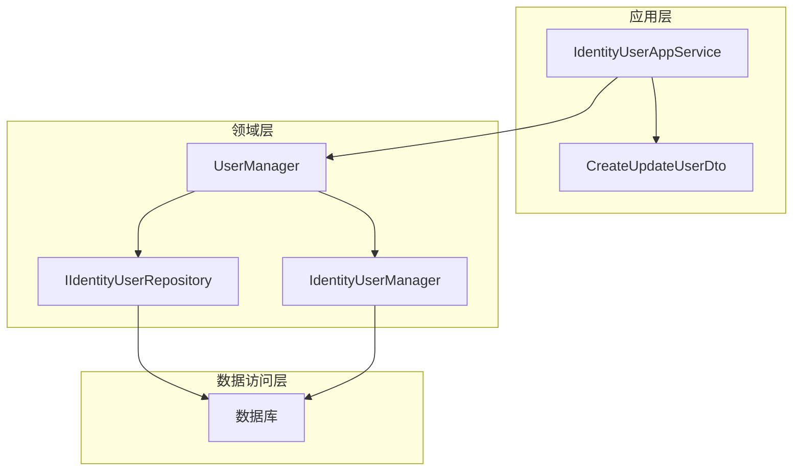

# 用户更新

<cite>
**本文档引用的文件**  
- [CreateUpdateUserDto.cs](file://aspnet-core\templates\aio\content\src\PackageName.CompanyName.ProjectName.Application.Contracts\PackageName\CompanyName\ProjectName\Users\Dtos\CreateUpdateUserDto.cs)
- [IdentityUserAppService.cs](file://aspnet-core\modules\identity\LINGYUN.Abp.Identity.Application\LINGYUN\Abp\Identity\IdentityUserAppService.cs)
- [UserManager.cs](file://aspnet-core\templates\aio\content\src\PackageName.CompanyName.ProjectName.Domain\PackageName\CompanyName\ProjectName\Users\UserManager.cs)
</cite>

## 目录
1. [简介](#简介)
2. [项目结构](#项目结构)
3. [核心组件](#核心组件)
4. [架构概述](#架构概述)
5. [详细组件分析](#详细组件分析)
6. [依赖分析](#依赖分析)
7. [性能考虑](#性能考虑)
8. [故障排除指南](#故障排除指南)
9. [结论](#结论)
10. [附录](#附录)（如有必要）

## 简介
本文档详细说明了 abp-next-admin 项目中用户更新功能的实现。重点介绍了 `CreateUpdateUserDto` 数据传输对象的可更新字段及其验证约束，解释了 `IdentityUserAppService` 中 `UpdateAsync` 方法的实现逻辑，包括并发控制（乐观锁）、变更跟踪、审计日志记录等机制。文档还描述了用户关键信息（如用户名、邮箱、手机号）更新时的验证流程和通知策略，以及用户状态管理（启用/禁用）、密码重置、多因素认证设置等特殊更新操作的实现细节。最后，文档提供了 API 调用示例和开发者扩展点。

## 项目结构
用户更新功能主要分布在 `aspnet-core/modules/identity` 模块中，遵循 ABP 框架的分层架构。核心代码位于 `LINGYUN.Abp.Identity.Application` 和 `LINGYUN.Abp.Identity.Application.Contracts` 项目中，分别负责应用服务的实现和数据传输对象（DTO）的定义。业务逻辑和数据访问由 `LINGYUN.Abp.Identity.Domain` 项目处理。

**图表来源**
- [IdentityUserAppService.cs](file://aspnet-core\modules\identity\LINGYUN.Abp.Identity.Application\LINGYUN\Abp\Identity\IdentityUserAppService.cs)
- [UserManager.cs](file://aspnet-core\templates\aio\content\src\PackageName.CompanyName.ProjectName.Domain