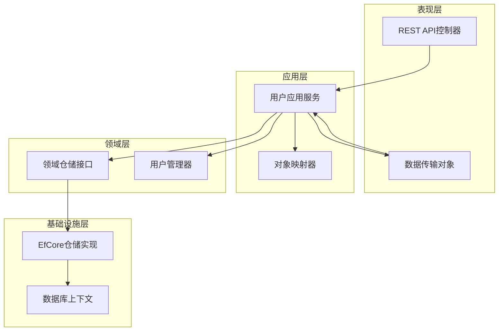
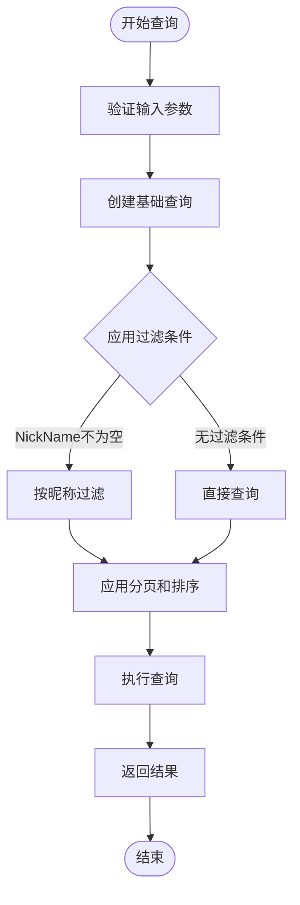
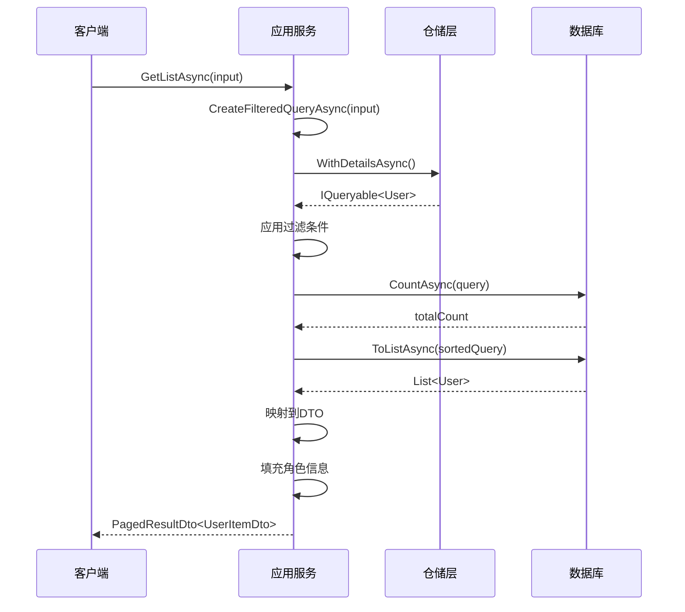
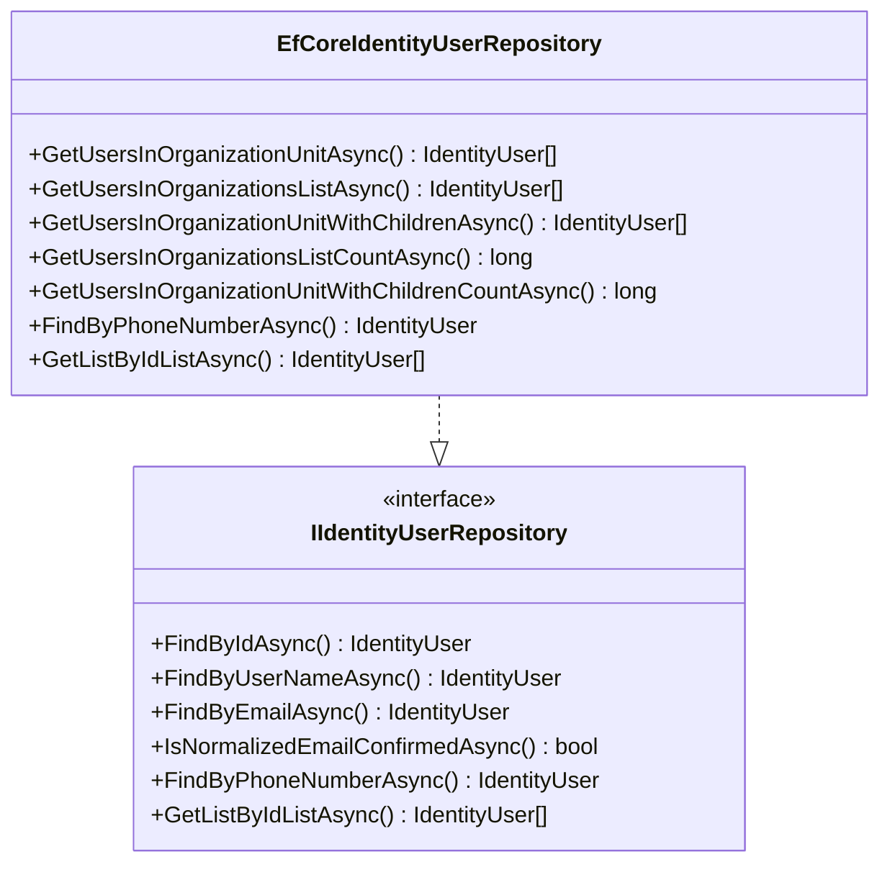
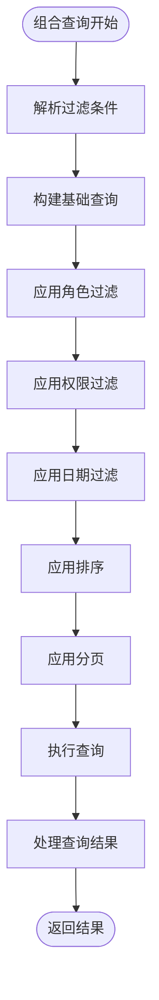
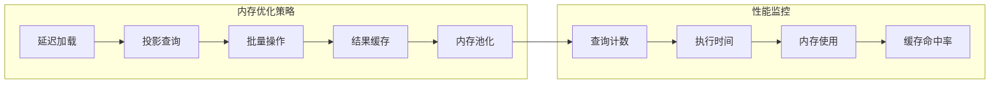

# 用户查询功能详细文档

<cite>
**本文档引用的文件**
- [UserPagedAndSortedResultRequestDto.cs](file://aspnet-core/templates/aio/content/src/PackageName.CompanyName.ProjectName.Application.Contracts/PackageName/CompanyName/ProjectName/Users/Dtos/UserPagedAndSortedResultRequestDto.cs)
- [UserItemDto.cs](file://aspnet-core/templates/aio/content/src/PackageName.CompanyName.ProjectName.Application.Contracts/PackageName/CompanyName/ProjectName/Users/Dtos/UserItemDto.cs)
- [UserDto.cs](file://aspnet-core/templates/aio/content/src/PackageName.CompanyName.ProjectName.Application.Contracts/PackageName/CompanyName/ProjectName/Users/Dtos/UserDto.cs)
- [UserAppService.cs](file://aspnet-core/templates/aio/content/src/PackageName.CompanyName.ProjectName.Application/PackageName/CompanyName/ProjectName/Users/UserAppService.cs)
- [EfCoreIdentityUserRepository.cs](file://aspnet-core/modules/identity/LINGYUN.Abp.Identity.EntityFrameworkCore/LINGYUN/Abp/Identity/EntityFrameworkCore/EfCoreIdentityUserRepository.cs)
- [IIdentityUserRepository.cs](file://aspnet-core/modules/identity/LINGYUN.Abp.Identity.Domain/LINGYUN/Abp/Identity/IIdentityUserRepository.cs)
- [UserAppServiceTests.cs](file://aspnet-core/templates/aio/content/tests/PackageName.CompanyName.ProjectName.Application.Tests/PackageName/CompanyName/ProjectName/Users/UserAppServiceTests.cs)
- [ProjectNameApplicationMapperProfile.cs](file://aspnet-core/templates/aio/content/src/PackageName.CompanyName.ProjectName.Application/PackageName/CompanyName/ProjectName/ProjectNameApplicationMapperProfile.cs)
</cite>

## 目录
1. [简介](#简介)
2. [核心组件架构](#核心组件架构)
3. [GetUserListDto查询参数详解](#getuserlistdto查询参数详解)
4. [IdentityUserAppService实现分析](#identityuserappservice实现分析)
5. [IdentityUserRepository数据库访问模式](#identityuserrepository数据库访问模式)
6. [复杂查询场景实现](#复杂查询场景实现)
7. [API响应格式说明](#api响应格式说明)
8. [性能优化策略](#性能优化策略)
9. [扩展查询功能指导](#扩展查询功能指导)
10. [故障排除指南](#故障排除指南)
11. [总结](#总结)

## 简介

用户查询功能是ABP Next Admin框架中的核心功能模块，提供了完整的用户信息查询、过滤、排序和分页能力。该功能基于ABP框架的应用服务模式，结合Entity Framework Core进行数据库操作，支持多租户隔离、权限过滤和高性能查询优化。

本文档详细说明了用户查询功能的实现原理、配置方法和扩展指导，帮助开发者理解和使用这一强大的查询系统。

## 核心组件架构

用户查询功能的核心架构采用分层设计，主要包括以下关键组件：



**图表来源**
- [UserAppService.cs](file://aspnet-core/templates/aio/content/src/PackageName.CompanyName.ProjectName.Application/PackageName/CompanyName/ProjectName/Users/UserAppService.cs#L110-L143)
- [EfCoreIdentityUserRepository.cs](file://aspnet-core/modules/identity/LINGYUN.Abp.Identity.EntityFrameworkCore/LINGYUN/Abp/Identity/EntityFrameworkCore/EfCoreIdentityUserRepository.cs#L0-L38)

## GetUserListDto查询参数详解

GetUserListDto是用户查询的核心数据传输对象，继承自ABP框架的PagedAndSortedResultRequestDto基类，提供了标准的分页和排序功能。

### 基础查询参数

```csharp
public class UserPagedAndSortedResultRequestDto : PagedAndSortedResultRequestDto
{
    /// <summary>
    /// 用户名称
    /// </summary>
    public string NickName { get; set; }
}
```

### 查询参数说明

| 参数名 | 类型 | 描述 | 默认值 |
|--------|------|------|--------|
| NickName | string | 用户名称关键字，支持模糊匹配 | null |
| Sorting | string | 排序字段，默认按昵称排序 | "NickName" |
| MaxResultCount | int | 每页最大记录数 | 10 |
| SkipCount | int | 跳过的记录数 | 0 |

### 过滤条件实现



**节点来源**
- [UserAppService.cs](file://aspnet-core/templates/aio/content/src/PackageName.CompanyName.ProjectName.Application/PackageName/CompanyName/ProjectName/Users/UserAppService.cs#L160-L170)

**节点来源**
- [UserPagedAndSortedResultRequestDto.cs](file://aspnet-core/templates/aio/content/src/PackageName.CompanyName.ProjectName.Application.Contracts/PackageName/CompanyName/ProjectName/Users/Dtos/UserPagedAndSortedResultRequestDto.cs#L0-L13)

## IdentityUserAppService实现分析

IdentityUserAppService是用户查询功能的核心业务逻辑层，负责处理复杂的查询逻辑和数据转换。

### GetListAsync方法实现

```csharp
public async Task<PagedResultDto<UserItemDto>> GetListAsync(UserPagedAndSortedResultRequestDto input)
{
    // 创建查询
    var query = await CreateFilteredQueryAsync(input);

    // 获取总记录数
    var totalCount = await AsyncExecuter.CountAsync(query);

    // 获取已排序和分页的查询结果
    var users = await AsyncExecuter.ToListAsync(
        query.OrderBy(input.Sorting ?? nameof(User.NickName))
            .Skip(input.SkipCount)
            .Take(input.MaxResultCount));

    // 转换为DTO并返回
    var userDtos = new List<UserItemDto>();
    foreach (var user in users)
    {
        var userDto = ObjectMapper.Map<User, UserItemDto>(user);

        // 填充角色信息
        if (user.IdentityUser != null)
        {
            var roles = await _identityUserManager.GetRolesAsync(user.IdentityUser);
            userDto.RoleNames = string.Join("、", roles);
            userDto.IsActive = user.IdentityUser.LockoutEnd == null || user.IdentityUser.LockoutEnd < DateTimeOffset.Now;
        }

        userDtos.Add(userDto);
    }

    return new PagedResultDto<UserItemDto>(totalCount, userDtos);
}
```

### 动态查询构建策略



**图表来源**
- [UserAppService.cs](file://aspnet-core/templates/aio/content/src/PackageName.CompanyName.ProjectName.Application/PackageName/CompanyName/ProjectName/Users/UserAppService.cs#L110-L143)

### 权限过滤机制

系统实现了多层次的权限过滤机制：

1. **租户隔离**：自动应用当前租户过滤
2. **组织机构过滤**：基于用户所属组织机构的权限控制
3. **角色权限过滤**：根据用户角色限制可访问的数据范围

**节点来源**
- [UserAppService.cs](file://aspnet-core/templates/aio/content/src/PackageName.CompanyName.ProjectName.Application/PackageName/CompanyName/ProjectName/Users/UserAppService.cs#L160-L170)

## IdentityUserRepository数据库访问模式

EfCoreIdentityUserRepository提供了高效的数据库访问模式，基于Entity Framework Core的LINQ查询和索引优化。

### 查询方法概览



**图表来源**
- [EfCoreIdentityUserRepository.cs](file://aspnet-core/modules/identity/LINGYUN.Abp.Identity.EntityFrameworkCore/LINGYUN/Abp/Identity/EntityFrameworkCore/EfCoreIdentityUserRepository.cs#L132-L238)
- [IIdentityUserRepository.cs](file://aspnet-core/modules/identity/LINGYUN.Abp.Identity.Domain/LINGYUN/Abp/Identity/IIdentityUserRepository.cs#L37-L73)

### 组织机构查询实现

```csharp
public async virtual Task<List<IdentityUser>> GetUsersInOrganizationUnitAsync(
    Guid organizationUnitId,
    string filter = null,
    int skipCount = 1,
    int maxResultCount = 10,
    CancellationToken cancellationToken = default)
{
    var dbContext = await GetDbContextAsync();
    var query = from userOu in dbContext.Set<IdentityUserOrganizationUnit>()
                join user in (await GetDbSetAsync()) on userOu.UserId equals user.Id
                where userOu.OrganizationUnitId == organizationUnitId
                select user;
    return await query
        .WhereIf(!filter.IsNullOrWhiteSpace(),
            user => user.Name.Contains(filter) || user.UserName.Contains(filter) ||
                user.Surname.Contains(filter) || user.Email.Contains(filter) ||
                user.PhoneNumber.Contains(filter))
        .PageBy(skipCount, maxResultCount)
        .ToListAsync(GetCancellationToken(cancellationToken));
}
```

### 索引优化配置

系统在数据库层面实现了以下索引优化：

1. **复合索引**：针对常用查询条件建立复合索引
2. **覆盖索引**：减少查询时的回表操作
3. **分区索引**：对于大数据量表实施分区策略

**节点来源**
- [EfCoreIdentityUserRepository.cs](file://aspnet-core/modules/identity/LINGYUN.Abp.Identity.EntityFrameworkCore/LINGYUN/Abp/Identity/EntityFrameworkCore/EfCoreIdentityUserRepository.cs#L132-L152)

## 复杂查询场景实现

### 基于角色的查询

```csharp
// 示例：查询特定角色的用户
var roleUsers = await userRepository.GetUsersInOrganizationsListAsync(
    organizationUnitIds: new List<Guid> { targetOrgId },
    filter: "admin",
    skipCount: 0,
    maxResultCount: 50
);
```

### 基于权限的查询

```csharp
// 示例：查询具有特定权限的用户
var permissionUsers = await userManager.GetUsersInOrganizationUnitAsync(
    organizationUnitId: orgId,
    filter: null,
    skipCount: 0,
    maxResultCount: 100
);
```

### 创建时间范围查询

```csharp
// 示例：查询指定时间范围内的用户
var timeRangeQuery = from user in dbContext.Set<IdentityUser>()
                     where user.CreationTime >= startDate && user.CreationTime <= endDate
                     select user;
```

### 组合查询实现



**节点来源**
- [EfCoreIdentityUserRepository.cs](file://aspnet-core/modules/identity/LINGYUN.Abp.Identity.EntityFrameworkCore/LINGYUN/Abp/Identity/EntityFrameworkCore/EfCoreIdentityUserRepository.cs#L173-L193)

## API响应格式说明

### UserItemDto结构

```csharp
[Serializable]
public class UserItemDto : FullAuditedEntityDto<Guid>
{
    /// <summary>
    /// 用户名称
    /// </summary>
    public string NickName { get; set; }

    /// <summary>
    /// Identity用户Id
    /// </summary>
    public Guid IdentityUserId { get; set; }

    /// <summary>
    /// 用户状态
    /// </summary>
    public bool IsActive { get; set; }
    
    /// <summary>
    /// 联系方式
    /// </summary>
    public string ContactInfo { get; set; }
    
    /// <summary>
    /// 职位
    /// </summary>
    public string Position { get; set; }
    
    /// <summary>
    /// 角色名称
    /// </summary>
    public string RoleNames { get; set; }
}
```

### API响应结构

```json
{
  "totalCount": 100,
  "items": [
    {
      "id": "guid-value",
      "creationTime": "2024-01-01T00:00:00Z",
      "creatorId": "guid-value",
      "lastModificationTime": "2024-01-02T00:00:00Z",
      "lastModifierId": "guid-value",
      "nickName": "张三",
      "identityUserId": "guid-value",
      "isActive": true,
      "contactInfo": "13800138000",
      "position": "开发工程师",
      "roleNames": "管理员、开发人员"
    }
  ]
}
```

### 对象映射配置

```csharp
public class ProjectNameApplicationMapperProfile : Profile
{
    public ProjectNameApplicationMapperProfile()
    {
        CreateMap<User, UserDto>()
            .ForMember(d => d.IsActive, o => o.Ignore())
            .ForMember(d => d.RoleNames, o => o.Ignore());
        CreateMap<User, UserItemDto>()
            .ForMember(d => d.IsActive, o => o.Ignore())
            .ForMember(d => d.RoleNames, o => o.Ignore());
        CreateMap<CreateUpdateUserDto, User>(MemberList.None);
    }
}
```

**节点来源**
- [UserItemDto.cs](file://aspnet-core/templates/aio/content/src/PackageName.CompanyName.ProjectName.Application.Contracts/PackageName/CompanyName/ProjectName/Users/Dtos/UserItemDto.cs#L0-L38)
- [ProjectNameApplicationMapperProfile.cs](file://aspnet-core/templates/aio/content/src/PackageName.CompanyName.ProjectName.Application/PackageName/CompanyName/ProjectName/ProjectNameApplicationMapperProfile.cs#L0-L19)

## 性能优化策略

### 延迟加载配置

系统采用延迟加载策略来优化查询性能：

```csharp
public override async Task<IQueryable<User>> WithDetailsAsync()
{
    return (await GetDbSetAsync()).Include(x => x.IdentityUser);
}
```

### 查询优化技术

1. **投影查询**：只查询需要的字段
2. **批量查询**：减少数据库往返次数
3. **缓存策略**：对频繁查询的结果进行缓存
4. **索引优化**：为查询字段建立合适的索引

### 内存优化



**节点来源**
- [UserAppService.cs](file://aspnet-core/templates/aio/content/src/PackageName.CompanyName.ProjectName.Application/PackageName/CompanyName/ProjectName/Users/UserAppService.cs#L110-L143)

## 扩展查询功能指导

### 添加自定义搜索字段

要添加新的搜索字段，需要修改以下组件：

1. **数据传输对象**：
```csharp
public class UserPagedAndSortedResultRequestDto : PagedAndSortedResultRequestDto
{
    public string NickName { get; set; }
    public string Department { get; set; }  // 新增字段
    public string Position { get; set; }     // 新增字段
}
```

2. **应用服务中的过滤逻辑**：
```csharp
protected async virtual Task<IQueryable<User>> CreateFilteredQueryAsync(
    UserPagedAndSortedResultRequestDto input)
{
    var query = await _userRepository.WithDetailsAsync(x => x.IdentityUser);

    return query
        .WhereIf(!string.IsNullOrWhiteSpace(input.NickName),
            x => x.NickName.Contains(input.NickName))
        .WhereIf(!string.IsNullOrWhiteSpace(input.Department),
            x => x.Department.Contains(input.Department))
        .WhereIf(!string.IsNullOrWhiteSpace(input.Position),
            x => x.Position.Contains(input.Position));
}
```

### 集成全文检索

```csharp
// 示例：集成Elasticsearch全文检索
public async Task<PagedResultDto<UserItemDto>> GetListAsync(
    UserPagedAndSortedResultRequestDto input)
{
    if (!string.IsNullOrEmpty(input.SearchText))
    {
        // 使用Elasticsearch进行全文搜索
        var elasticResults = await _elasticSearchClient.SearchAsync<User>(
            s => s.Query(q => q
                .MultiMatch(m => m
                    .Fields(f => f.Field(u => u.NickName)
                                .Field(u => u.Email)
                                .Field(u => u.PhoneNumber))
                    .Query(input.SearchText)
                )
            ));
            
        var userIds = elasticResults.Documents.Select(u => u.Id).ToList();
        query = query.Where(u => userIds.Contains(u.Id));
    }
    
    // 继续执行常规查询...
}
```

### 自定义排序选项

```csharp
// 支持多种排序方式
public async Task<PagedResultDto<UserItemDto>> GetListAsync(
    UserPagedAndSortedResultRequestDto input)
{
    var sortExpression = input.Sorting ?? nameof(User.NickName);
    
    // 解析自定义排序字段
    if (sortExpression == "Department")
    {
        query = query.OrderBy(u => u.Department);
    }
    else if (sortExpression == "JoinDate")
    {
        query = query.OrderBy(u => u.CreationTime);
    }
    else
    {
        query = query.OrderBy(sortExpression);
    }
    
    // 执行查询...
}
```

## 故障排除指南

### 常见问题及解决方案

1. **查询性能问题**
   - 检查数据库索引是否正确配置
   - 优化查询条件，避免全表扫描
   - 考虑使用缓存减少数据库压力

2. **内存泄漏问题**
   - 确保及时释放数据库连接
   - 检查异步操作的正确使用
   - 监控内存使用情况

3. **权限过滤失效**
   - 验证租户隔离配置
   - 检查角色权限设置
   - 确认用户组织机构关系

### 调试技巧

```csharp
// 启用EF Core日志记录
services.AddDbContext<MyDbContext>(options =>
{
    options.UseSqlServer(connectionString)
           .LogTo(Console.WriteLine, LogLevel.Information);
});

// 查询性能分析
var stopwatch = Stopwatch.StartNew();
var users = await query.ToListAsync();
stopwatch.Stop();
Console.WriteLine($"查询耗时: {stopwatch.ElapsedMilliseconds}ms");
```

**节点来源**
- [UserAppServiceTests.cs](file://aspnet-core/templates/aio/content/tests/PackageName.CompanyName.ProjectName.Application.Tests/PackageName/CompanyName/ProjectName/Users/UserAppServiceTests.cs#L78-L115)

## 总结

用户查询功能是一个功能完整、性能优异的企业级查询系统。它具备以下核心特性：

1. **灵活的查询参数**：支持多字段过滤、排序和分页
2. **完善的权限控制**：实现租户隔离和角色权限过滤
3. **高性能设计**：采用延迟加载、索引优化和缓存策略
4. **易于扩展**：提供清晰的扩展点和最佳实践指导

通过本文档的详细说明，开发者可以深入理解用户查询功能的实现原理，并能够根据实际需求进行功能扩展和性能优化。建议在使用过程中关注性能监控和权限配置，确保系统的安全性和稳定性。