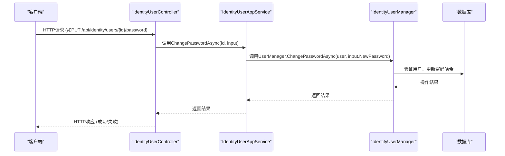

# 用户管理

<cite>
**本文档中引用的文件**  
- [IIdentityUserAppService.cs](file://aspnet-core/modules/identity/LINGYUN.Abp.Identity.Application.Contracts/LINGYUN/Abp/Identity/IIdentityUserAppService.cs)
- [IdentityUserController.cs](file://aspnet-core/modules/identity/LINGYUN.Abp.Identity.HttpApi/LINGYUN/Abp/Identity/IdentityUserController.cs)
- [IdentityUserAppService.cs](file://aspnet-core/modules/identity/LINGYUN.Abp.Identity.Application/LINGYUN/Abp/Identity/IdentityUserAppService.cs)
- [IIdentityUserRepository.cs](file://aspnet-core/modules/identity/LINGYUN.Abp.Identity.Domain/LINGYUN/Abp/Identity/IIdentityUserRepository.cs)
- [EfCoreIdentityUserRepository.cs](file://aspnet-core/modules/identity/LINGYUN.Abp.Identity.EntityFrameworkCore/LINGYUN/Abp/Identity/EntityFrameworkCore/EfCoreIdentityUserRepository.cs)
- [20241210084730_Add-DataProtection-Module.Designer.cs](file://aspnet-core/migrations/LY.MicroService.Applications.Single.EntityFrameworkCore.PostgreSql/Migrations/20241210084730_Add-DataProtection-Module.Designer.cs)
- [IdentityUserWto.cs](file://aspnet-core/modules/webhooks/LINGYUN.Abp.Webhooks.Identity/LINGYUN/Abp/Webhooks/Identity/IdentityUserWto.cs)
- [AbpUINavigationVueVbenAdminNavigationDefinitionProvider.cs](file://aspnet-core/modules/platform/LINGYUN.Abp.UI.Navigation.VueVbenAdmin/LINGYUN/Abp/UI/Navigation/VueVbenAdmin/AbpUINavigationVueVbenAdminNavigationDefinitionProvider.cs)
</cite>

## 目录
1. [简介](#简介)
2. [用户实体（IdentityUser）属性定义](#用户实体identityuser属性定义)
3. [数据验证规则与业务约束](#数据验证规则与业务约束)
4. [用户应用程序服务（IdentityUserAppService）API接口](#用户应用程序服务identityuserappservice-api接口)
5. [用户仓储实现（IdentityUserRepository）数据库访问模式](#用户仓储实现identityuserrepository数据库访问模式)
6. [用户密码加密与账户状态管理](#用户密码加密与账户状态管理)
7. [开发者操作示例与扩展指导](#开发者操作示例与扩展指导)

## 简介
本文档详细阐述了 abp-next-admin_vben5 项目中用户管理子模块的设计与实现。该模块基于 ABP 框架构建，提供了完整的用户生命周期管理功能，包括用户创建、更新、删除、查询、组织机构分配、声明管理、密码变更、双因素认证控制等。系统通过分层架构实现了业务逻辑与数据访问的分离，并集成了审计日志、安全控制等企业级特性。用户管理界面集成在 Vue Vben Admin 前端框架中，路径为 `/manage/identity/user`。

## 用户实体（IdentityUser）属性定义
用户实体 `IdentityUser` 继承自 ABP 框架的 `Volo.Abp.Identity.IdentityUser`，其核心属性在数据库迁移文件中定义，主要包括：

- **Id**: `Guid` 类型，主键，唯一标识用户。
- **UserName**: `string` 类型，最大长度 256，用户登录名，唯一且必填。
- **NormalizedUserName**: `string` 类型，最大长度 256，规范化用户名，用于高效查询。
- **Email**: `string` 类型，最大长度 256，用户邮箱，必填。
- **NormalizedEmail**: `string` 类型，最大长度 256，规范化邮箱，用于高效查询。
- **EmailConfirmed**: `bool` 类型，默认 `false`，标识邮箱是否已验证。
- **PhoneNumber**: `string` 类型，用户电话号码。
- **PhoneNumberConfirmed**: `bool` 类型，默认 `false`，标识电话号码是否已验证。
- **PasswordHash**: `string` 类型，存储加密后的密码哈希值。
- **SecurityStamp**: `string` 类型，用于安全验证，密码或安全相关数据变更时更新。
- **ConcurrencyStamp**: `string` 类型，用于乐观并发控制。
- **TwoFactorEnabled**: `bool` 类型，默认 `false`，标识是否启用双因素认证。
- **LockoutEnd**: `DateTimeOffset?` 类型，账户被锁定的结束时间，`null` 表示未锁定。
- **LockoutEnabled**: `bool` 类型，默认 `true`，标识账户是否可被锁定。
- **AccessFailedCount**: `int` 类型，默认 `0`，记录连续登录失败次数。
- **IsActive**: `bool` 类型，标识用户是否处于激活状态。
- **IsExternal**: `bool` 类型，默认 `false`，标识用户是否为外部身份提供商（如微信、QQ）创建。
- **EntityVersion**: `int` 类型，实体版本号，用于并发控制。
- **ExtraProperties**: `string` 类型，JSON 格式，存储扩展属性，支持灵活的用户信息扩展。
- **CreatorId**: `Guid?` 类型，创建者用户ID。
- **CreationTime**: `DateTime` 类型，创建时间。
- **LastModifierId**: `Guid?` 类型，最后修改者用户ID。
- **LastModificationTime**: `DateTime?` 类型，最后修改时间。
- **DeleterId**: `Guid?` 类型，删除者用户ID。
- **DeletionTime**: `DateTime?` 类型，删除时间。
- **IsDeleted**: `bool` 类型，默认 `false`，软删除标记。

**Section sources**
- [20241210084730_Add-DataProtection-Module.Designer.cs](file://aspnet-core/migrations/LY.MicroService.Applications.Single.EntityFrameworkCore.PostgreSql/Migrations/20241210084730_Add-DataProtection-Module.Designer.cs#L3554-L3586)

## 数据验证规则与业务约束
用户管理模块通过多层机制确保数据的完整性和业务规则的执行：

1.  **数据库约束**：在数据库层面通过 `NOT NULL`、`UNIQUE`、`MAX_LENGTH` 等约束保证数据有效性。例如，`UserName` 和 `Email` 字段被定义为必填且有长度限制。
2.  **应用服务验证**：`IdentityUserAppService` 在执行业务逻辑前，会调用 `IdentityUserManager` 进行验证。`IdentityUserManager` 内部集成了 `UserValidator` 和 `PasswordValidator`，它们根据 `IdentityOptions` 配置执行验证。
3.  **配置化规则**：核心验证规则由 `IdentityOptions` 配置，开发者可在模块配置中自定义，例如：
    -   密码复杂度要求（长度、是否需要数字、特殊字符等）。
    -   用户名和邮箱的唯一性校验。
    -   登录失败锁定策略（失败次数、锁定时长）。
4.  **业务逻辑约束**：在 `IdentityUserAppService` 的方法中，通过显式检查实现业务约束。例如，在 `SetOrganizationUnitsAsync` 方法中，会先获取用户，再进行组织机构的分配操作。

**Section sources**
- [IdentityUserAppService.cs](file://aspnet-core/modules/identity/LINGYUN.Abp.Identity.Application/LINGYUN/Abp/Identity/IdentityUserAppService.cs#L14-L38)
- [IIdentityUserAppService.cs](file://aspnet-core/modules/identity/LINGYUN.Abp.Identity.Application.Contracts/LINGYUN/Abp/Identity/IIdentityUserAppService.cs#L0-L47)

## 用户应用程序服务（IdentityUserAppService）API接口
`IIdentityUserAppService` 接口定义了用户管理的核心操作，其具体实现为 `IdentityUserAppService`。以下是主要API接口的详细说明：

### 创建、更新、删除用户
项目中未直接提供创建、更新、删除用户的API，这些操作通常由更高层的管理服务或通过 `IdentityUserManager` 直接处理。标准的用户管理CRUD操作由ABP框架的基础服务提供。

### 查询用户
查询功能通过 `IdentityUserAppService` 提供的特定方法实现：
- **GetOrganizationUnitsAsync(Guid id)**: 获取指定用户所属的所有组织机构。
- **GetClaimsAsync(Guid id)**: 获取指定用户的所有声明（Claims）。

### 用户管理操作
- **ChangeTwoFactorEnabledAsync(Guid id, TwoFactorEnabledDto input)**: 变更用户的双因素认证状态。`input` 参数包含 `Enabled` 布尔值。
- **ChangePasswordAsync(Guid id, IdentityUserSetPasswordInput input)**: 变更用户密码。`input` 参数包含 `CurrentPassword` 和 `NewPassword`。
- **SetOrganizationUnitsAsync(Guid id, IdentityUserOrganizationUnitUpdateDto input)**: 为用户设置组织机构。`input` 参数包含一个 `Guid[]` 类型的 `OrganizationUnitIds` 数组。
- **RemoveOrganizationUnitsAsync(Guid id, Guid ouId)**: 从用户移除指定的组织机构。
- **AddClaimAsync(Guid id, IdentityUserClaimCreateDto input)**: 为用户添加声明。`input` 参数包含 `Type` 和 `Value`。
- **UpdateClaimAsync(Guid id, IdentityUserClaimUpdateDto input)**: 更新用户的声明。`input` 参数包含 `Type` 和新的 `Value`。
- **DeleteClaimAsync(Guid id, IdentityUserClaimDeleteDto input)**: 删除用户的声明。`input` 参数包含 `Type`。

所有API接口均通过 `IdentityUserController` 暴露为HTTP RESTful端点，路径为 `/api/identity/users`，并受 `IdentityPermissions` 权限系统保护。



**Diagram sources**
- [IdentityUserController.cs](file://aspnet-core/modules/identity/LINGYUN.Abp.Identity.HttpApi/LINGYUN/Abp/Identity/IdentityUserController.cs#L0-L42)
- [IdentityUserAppService.cs](file://aspnet-core/modules/identity/LINGYUN.Abp.Identity.Application/LINGYUN/Abp/Identity/IdentityUserAppService.cs#L14-L38)

**Section sources**
- [IIdentityUserAppService.cs](file://aspnet-core/modules/identity/LINGYUN.Abp.Identity.Application.Contracts/LINGYUN/Abp/Identity/IIdentityUserAppService.cs#L0-L47)

## 用户仓储实现（IdentityUserRepository）数据库访问模式
用户仓储接口 `IIdentityUserRepository` 定义了数据访问契约，其基于 Entity Framework Core 的具体实现为 `EfCoreIdentityUserRepository`。

- **实现方式**：`EfCoreIdentityUserRepository` 继承自 `EfCoreRepository<IdentityDbContext, IdentityUser>`，利用ABP框架提供的泛型仓储基类，自动获得 `GetAsync`, `FindAsync`, `InsertAsync`, `UpdateAsync`, `DeleteAsync` 等基础CRUD方法。
- **查询优化策略**：
    1.  **延迟加载与显式加载**：对于导航属性（如 `OrganizationUnits`），默认使用延迟加载。在 `IdentityUserAppService` 中，通过 `UserManager.GetOrganizationUnitsAsync(user)` 方法显式加载相关数据，避免N+1查询问题。
    2.  **LINQ查询优化**：开发者可以重写仓储方法，编写高效的LINQ查询，EF Core会将其翻译为优化的SQL语句。
    3.  **索引利用**：数据库表在 `UserName`, `NormalizedUserName`, `Email`, `NormalizedEmail`, `IsDeleted` 等字段上建立了索引，确保查询性能。
- **事务管理**：所有数据库操作均在ABP框架的 `IUnitOfWork` 管理下进行，确保了数据的一致性。

**Section sources**
- [IIdentityUserRepository.cs](file://aspnet-core/modules/identity/LINGYUN.Abp.Identity.Domain/LINGYUN/Abp/Identity/IIdentityUserRepository.cs)
- [EfCoreIdentityUserRepository.cs](file://aspnet-core/modules/identity/LINGYUN.Abp.Identity.EntityFrameworkCore/LINGYUN/Abp/Identity/EntityFrameworkCore/EfCoreIdentityUserRepository.cs)

## 用户密码加密与账户状态管理
### 密码加密
系统采用业界标准的密码哈希算法。当用户设置或更改密码时，`IdentityUserManager` 会使用配置的 `IPasswordHasher<IdentityUser>` 服务（默认为 ASP.NET Core Identity 的 `PasswordHasher`）对明文密码进行哈希处理。哈希后的密码（`PasswordHash`）被存储在数据库中，原始密码不会被存储，即使数据库泄露，攻击者也难以反推出原始密码。

### 账户状态管理
- **激活状态 (IsActive)**：`IsActive` 字段用于控制用户是否可以登录。管理员可以将用户设置为非激活状态，使其无法登录系统。
- **锁定机制 (Lockout)**：当用户连续登录失败次数超过 `IdentityOptions.Lockout.AllowedForNewUsers` 配置的阈值时，账户将被临时锁定。`LockoutEnabled` 字段控制此功能是否开启，`LockoutEnd` 字段记录锁定的结束时间。`AccessFailedCount` 记录失败次数，成功登录后会重置为0。
- **软删除 (Soft Delete)**：系统采用软删除机制。删除用户时，`IsDeleted` 字段被设为 `true`，同时记录 `DeletionTime` 和 `DeleterId`。被删除的用户在常规查询中不可见，但数据仍保留在数据库中，便于审计和恢复。

**Section sources**
- [20241210084730_Add-DataProtection-Module.Designer.cs](file://aspnet-core/migrations/LY.MicroService.Applications.Single.EntityFrameworkCore.PostgreSql/Migrations/20241210084730_Add-DataProtection-Module.Designer.cs#L3554-L3586)
- [IdentityUserAppService.cs](file://aspnet-core/modules/identity/LINGYUN.Abp.Identity.Application/LINGYUN/Abp/Identity/IdentityUserAppService.cs#L14-L38)

## 开发者操作示例与扩展指导
### 实际代码示例
以下示例展示如何通过 `IIdentityUserAppService` API 进行用户管理操作（伪代码）：

```csharp
// 获取用户应用服务
var userAppService = serviceProvider.GetService<IIdentityUserAppService>();

// 1. 变更用户密码
await userAppService.ChangePasswordAsync(
    userId,
    new IdentityUserSetPasswordInput 
    { 
        CurrentPassword = "oldPass123", 
        NewPassword = "newPass456!" 
    });

// 2. 启用双因素认证
await userAppService.ChangeTwoFactorEnabledAsync(
    userId, 
    new TwoFactorEnabledDto { Enabled = true });

// 3. 为用户分配组织机构
await userAppService.SetOrganizationUnitsAsync(
    userId,
    new IdentityUserOrganizationUnitUpdateDto 
    { 
        OrganizationUnitIds = new Guid[] { ouId1, ouId2 } 
    });
```

### 扩展用户属性和自定义行为
1.  **扩展用户属性**：利用 `ExtraProperties` 字段。该字段以JSON格式存储，可以动态添加任意属性。例如，在应用服务中：
    ```csharp
    user.SetProperty("JobTitle", "Senior Developer");
    user.SetProperty("Department", "Engineering");
    await UserManager.UpdateAsync(user);
    ```
    读取时使用 `user.GetProperty<string>("JobTitle")`。

2.  **自定义用户行为**：
    -   **自定义验证**：继承 `UserValidator<TUser>` 或 `PasswordValidator<TUser>`，重写 `ValidateAsync` 方法，添加自定义业务规则，然后在模块的 `ConfigureServices` 中替换默认的验证器。
    -   **事件处理**：订阅 `IdentityUser` 实体的 `Created`, `Updated`, `Deleted` 等事件，执行自定义逻辑（如发送通知、更新缓存）。可通过实现 `IEntityCreatedEventHandler<IdentityUser>` 等接口来完成。
    -   **自定义仓储方法**：在 `IIdentityUserRepository` 接口中定义新的查询方法，在 `EfCoreIdentityUserRepository` 中实现，以支持复杂的业务查询。

**Section sources**
- [IdentityUserWto.cs](file://aspnet-core/modules/webhooks/LINGYUN.Abp.Webhooks.Identity/LINGYUN/Abp/Webhooks/Identity/IdentityUserWto.cs#L0-L22)
- [IdentityUserAppService.cs](file://aspnet-core/modules/identity/LINGYUN.Abp.Identity.Application/LINGYUN/Abp/Identity/IdentityUserAppService.cs#L14-L38)
- [AbpUINavigationVueVbenAdminNavigationDefinitionProvider.cs](file://aspnet-core/modules/platform/LINGYUN.Abp.UI.Navigation.VueVbenAdmin/LINGYUN/Abp/UI/Navigation/VueVbenAdmin/AbpUINavigationVueVbenAdminNavigationDefinitionProvider.cs#L75-L107)