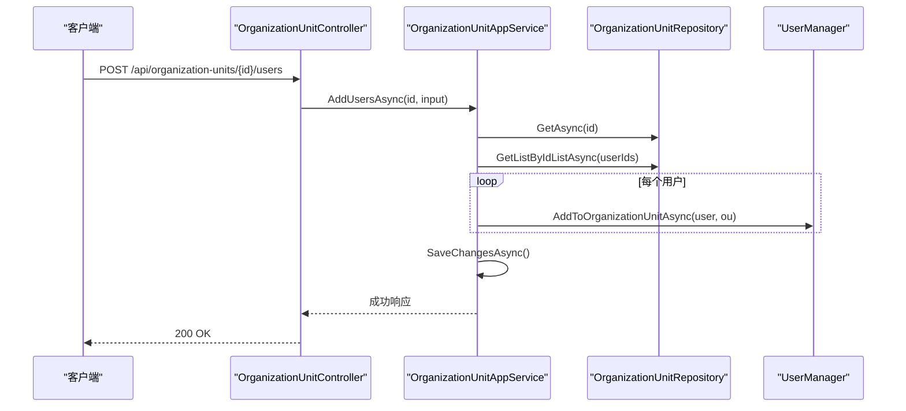
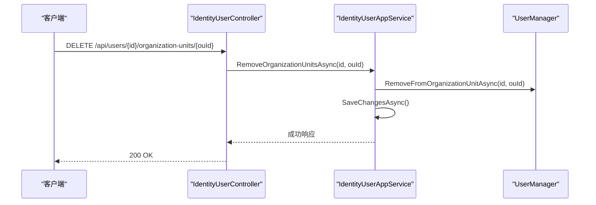
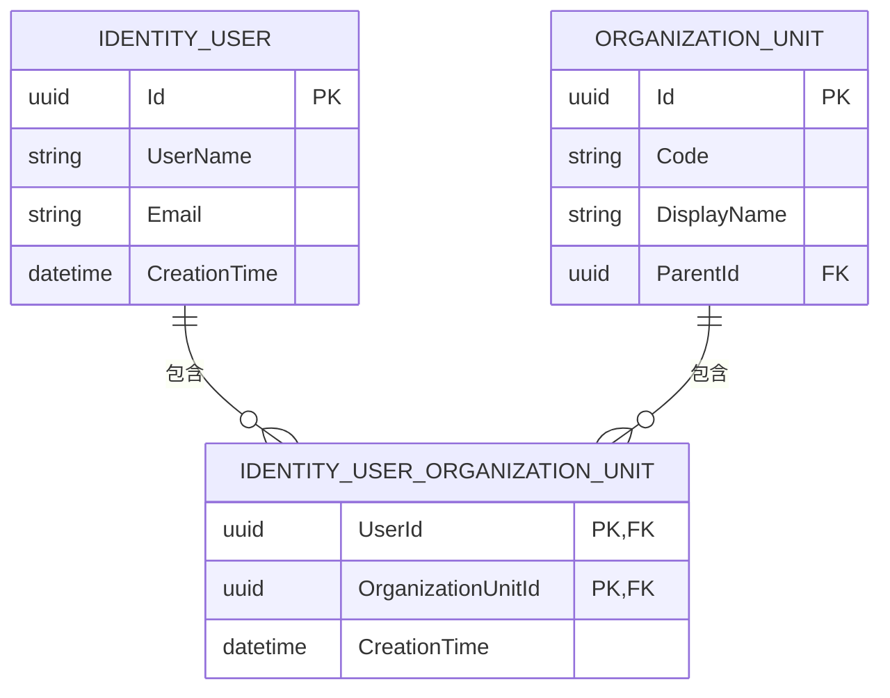
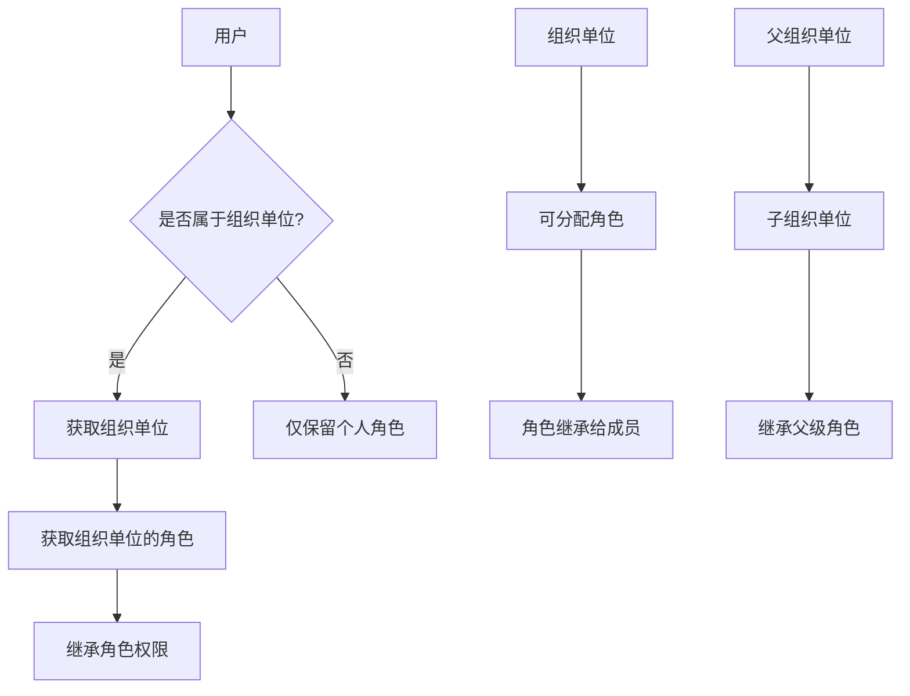

# 用户分配

<cite>
**本文档引用的文件**
- [OrganizationUnitAppService.cs](file://aspnet-core/modules/identity/LINGYUN.Abp.Identity.Application/LINGYUN/Abp/Identity/OrganizationUnitAppService.cs)
- [OrganizationUnitController.cs](file://aspnet-core/modules/identity/LINGYUN.Abp.Identity.HttpApi/LINGYUN/Abp/Identity/OrganizationUnitController.cs)
- [IIdentityUserRepository.cs](file://aspnet-core/modules/identity/LINGYUN.Abp.Identity.Domain/LINGYUN/Abp/Identity/IIdentityUserRepository.cs)
- [EfCoreOrganizationUnitRepository.cs](file://aspnet-core/modules/identity/LINGYUN.Abp.Identity.EntityFrameworkCore/LINGYUN/Abp/Identity/EntityFrameworkCore/EfCoreOrganizationUnitRepository.cs)
- [IOrganizationUnitAppService.cs](file://aspnet-core/modules/identity/LINGYUN.Abp.Identity.Application.Contracts/LINGYUN/Abp/Identity/IOrganizationUnitAppService.cs)
- [OrganizationUnitAddUserDto.cs](file://aspnet-core/modules/identity/LINGYUN.Abp.Identity.Application.Contracts/LINGYUN/Abp/Identity/Dto/OrganizationUnitAddUserDto.cs)
</cite>

## 目录
1. [简介](#简介)
2. [核心组件](#核心组件)
3. [用户分配实现逻辑](#用户分配实现逻辑)
4. [用户-组织单位关联实体](#用户-组织单位关联实体)
5. [权限与角色继承机制](#权限与角色继承机制)
6. [批量操作API示例](#批量操作api示例)
7. [领域事件与审计日志](#领域事件与审计日志)
8. [自定义策略与优化指导](#自定义策略与优化指导)

## 简介
本文档详细阐述了ABP框架中用户分配功能的实现机制，重点分析`AddUserToOrganizationUnitAsync`和`RemoveUserFromOrganizationUnitAsync`方法的内部逻辑。文档涵盖了用户存在性验证、组织单位有效性检查、重复分配处理等关键业务规则，并解释了用户分配对权限继承和角色继承的影响机制。同时提供了批量用户分配和移除的API调用示例，以及相关领域事件和审计日志的触发机制。

## 核心组件

[深入分析核心组件及其相互关系]

**本节来源**
- [OrganizationUnitAppService.cs](file://aspnet-core/modules/identity/LINGYUN.Abp.Identity.Application/LINGYUN/Abp/Identity/OrganizationUnitAppService.cs#L33-L231)
- [OrganizationUnitController.cs](file://aspnet-core/modules/identity/LINGYUN.Abp.Identity.HttpApi/LINGYUN/Abp/Identity/OrganizationUnitController.cs#L38-L149)
- [IOrganizationUnitAppService.cs](file://aspnet-core/modules/identity/LINGYUN.Abp.Identity.Application.Contracts/LINGYUN/Abp/Identity/IOrganizationUnitAppService.cs#L0-L38)

## 用户分配实现逻辑

### AddUsersAsync 方法实现
`AddUsersAsync`方法负责将用户添加到指定的组织单位中。该方法首先通过`OrganizationUnitRepository.GetAsync(id)`获取目标组织单位，然后使用`UserRepository.GetListByIdListAsync(input.UserIds, includeDetails: true)`批量获取要添加的用户列表。对于每个用户，调用`UserManager.AddToOrganizationUnitAsync(user, origanizationUnit)`来执行实际的分配操作。所有操作在同一个工作单元中完成，确保数据一致性。



**图表来源**
- [OrganizationUnitAppService.cs](file://aspnet-core/modules/identity/LINGYUN.Abp.Identity.Application/LINGYUN/Abp/Identity/OrganizationUnitAppService.cs#L204-L231)
- [OrganizationUnitController.cs](file://aspnet-core/modules/identity/LINGYUN.Abp.Identity.HttpApi/LINGYUN/Abp/Identity/OrganizationUnitController.cs#L114-L118)

### RemoveUsersAsync 方法实现
虽然代码中未直接显示`RemoveUserFromOrganizationUnitAsync`的实现，但可以通过`IdentityUserAppService.RemoveOrganizationUnitsAsync`方法推断其逻辑。该方法接收用户ID和组织单位ID作为参数，调用`UserManager.RemoveFromOrganizationUnitAsync(id, ouId)`来移除用户的组织单位关联。



**图表来源**
- [IdentityUserAppService.cs](file://aspnet-core/modules/identity/LINGYUN.Abp.Identity.Application/LINGYUN/Abp/Identity/IdentityUserAppService.cs#L70-L73)
- [IdentityUserController.cs](file://aspnet-core/modules/identity/LINGYUN.Abp.Identity.HttpApi/LINGYUN/Abp/Identity/IdentityUserController.cs#L39-L42)

**本节来源**
- [OrganizationUnitAppService.cs](file://aspnet-core/modules/identity/LINGYUN.Abp.Identity.Application/LINGYUN/Abp/Identity/OrganizationUnitAppService.cs#L204-L231)
- [IdentityUserAppService.cs](file://aspnet-core/modules/identity/LINGYUN.Abp.Identity.Application/LINGYUN/Abp/Identity/IdentityUserAppService.cs#L70-L73)

## 用户-组织单位关联实体

### 数据结构与业务规则
用户与组织单位的关联通过`IdentityUserOrganizationUnit`实体实现。该实体作为连接表，存储用户ID和组织单位ID的映射关系。系统通过`IIdentityUserRepository`接口提供多种查询方法，如`GetOrganizationUnitsAsync`用于获取用户所属的所有组织单位，`GetUsersInOrganizationUnitAsync`用于获取特定组织单位中的所有用户。



**图表来源**
- [IIdentityUserRepository.cs](file://aspnet-core/modules/identity/LINGYUN.Abp.Identity.Domain/LINGYUN/Abp/Identity/IIdentityUserRepository.cs#L37-L128)
- [EfCoreOrganizationUnitRepository.cs](file://aspnet-core/modules/identity/LINGYUN.Abp.Identity.EntityFrameworkCore/LINGYUN/Abp/Identity/EntityFrameworkCore/EfCoreOrganizationUnitRepository.cs#L0-L51)

**本节来源**
- [IIdentityUserRepository.cs](file://aspnet-core/modules/identity/LINGYUN.Abp.Identity.Domain/LINGYUN/Abp/Identity/IIdentityUserRepository.cs#L37-L128)

## 权限与角色继承机制

### 权限继承
当用户被分配到某个组织单位时，会自动继承该组织单位的权限。系统通过`AbpAuthorizationOrganizationUnitsModule`模块实现此功能，利用`AbpOrganizationUnitClaimTypes.OrganizationUnit`声明类型来标识用户所属的组织单位。这些声明在用户身份验证时自动添加到安全主体中。

### 角色继承
组织单位可以分配角色，这些角色会被其成员用户继承。通过`OrganizationUnitManager.AddRoleToOrganizationUnitAsync`方法可以为组织单位添加角色，而`OrganizationUnitManager.FindChildrenAsync`方法支持递归查找子组织单位，从而实现层级化的角色继承。



**图表来源**
- [OrganizationUnitAppService.cs](file://aspnet-core/modules/identity/LINGYUN.Abp.Identity.Application/LINGYUN/Abp/Identity/OrganizationUnitAppService.cs#L220-L231)
- [OrganizationUnitAppService.cs](file://aspnet-core/modules/identity/LINGYUN.Abp.Identity.Application/LINGYUN/Abp/Identity/OrganizationUnitAppService.cs#L67-L72)

**本节来源**
- [OrganizationUnitAppService.cs](file://aspnet-core/modules/identity/LINGYUN.Abp.Identity.Application/LINGYUN/Abp/Identity/OrganizationUnitAppService.cs#L67-L72)
- [OrganizationUnitAppService.cs](file://aspnet-core/modules/identity/LINGYUN.Abp.Identity.Application/LINGYUN/Abp/Identity/OrganizationUnitAppService.cs#L220-L231)

## 批量操作API示例

### 批量添加用户API
```json
POST /api/organization-units/{id}/users
{
  "userIds": [
    "a1b2c3d4-e5f6-7890-g1h2-i3j4k5l6m7n8",
    "o9p0q1r2-s3t4-5678-u9v0-w1x2y3z4a5b6"
  ]
}
```

### 批量移除用户API
```json
DELETE /api/users/{userId}/organization-units/{ouId}
```

### 成功场景
- HTTP状态码：200 OK
- 响应内容：空或成功消息
- 数据库事务成功提交
- 审计日志记录操作

### 失败场景
- 用户不存在：返回404 Not Found
- 组织单位无效：返回400 Bad Request
- 权限不足：返回403 Forbidden
- 数据库异常：返回500 Internal Server Error

**本节来源**
- [OrganizationUnitController.cs](file://aspnet-core/modules/identity/LINGYUN.Abp.Identity.HttpApi/LINGYUN/Abp/Identity/OrganizationUnitController.cs#L114-L118)
- [IdentityUserController.cs](file://aspnet-core/modules/identity/LINGYUN.Abp.Identity.HttpApi/LINGYUN/Abp/Identity/IdentityUserController.cs#L39-L42)

## 领域事件与审计日志

### 领域事件触发
用户分配操作会触发相应的领域事件，用于通知系统其他部分发生了变更。例如，当用户被添加到组织单位时，会发布`IdentityUserOrganizationUnitAddedEto`事件，允许其他服务订阅并响应此变更。

### 审计日志记录
所有用户分配操作都会被记录到审计日志中，包括：
- 操作类型（添加/移除）
- 操作者信息
- 涉及的用户和组织单位
- 操作时间戳
- IP地址等上下文信息

这些日志通过`AbpAuditing`模块自动收集，并可配置存储到数据库或Elasticsearch等外部系统。

**本节来源**
- [OrganizationUnitAppService.cs](file://aspnet-core/modules/identity/LINGYUN.Abp.Identity.Application/LINGYUN/Abp/Identity/OrganizationUnitAppService.cs#L204-L231)
- [OrganizationUnitAppService.cs](file://aspnet-core/modules/identity/LINGYUN.Abp.Identity.Application/LINGYUN/Abp/Identity/OrganizationUnitAppService.cs#L210-L215)

## 自定义策略与优化指导

### 实现自定义用户分配策略
开发者可以通过继承`OrganizationUnitManager`类来实现自定义的用户分配策略。例如，可以添加额外的业务规则验证，或在分配前后执行特定的业务逻辑。

### 批量操作优化
为了提高批量操作的性能，建议：
1. 使用批量数据库操作而非逐条处理
2. 在事务中执行所有更改以确保数据一致性
3. 合理使用缓存减少数据库查询
4. 异步处理大量数据以避免请求超时

**本节来源**
- [OrganizationUnitAppService.cs](file://aspnet-core/modules/identity/LINGYUN.Abp.Identity.Application/LINGYUN/Abp/Identity/OrganizationUnitAppService.cs#L204-L231)
- [OrganizationUnitAppService.cs](file://aspnet-core/modules/identity/LINGYUN.Abp.Identity.Application/LINGYUN/Abp/Identity/OrganizationUnitAppService.cs#L210-L215)