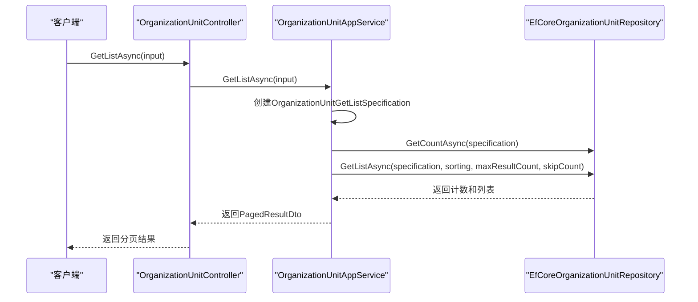
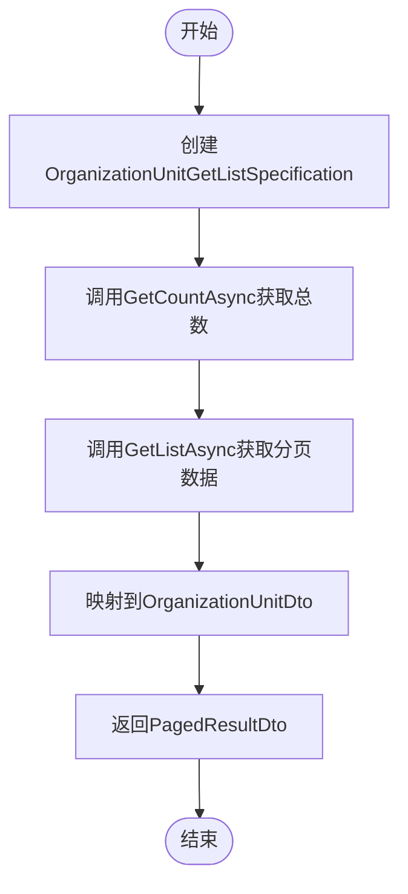
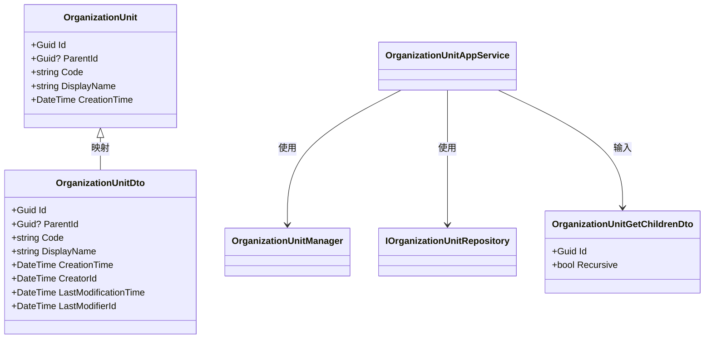
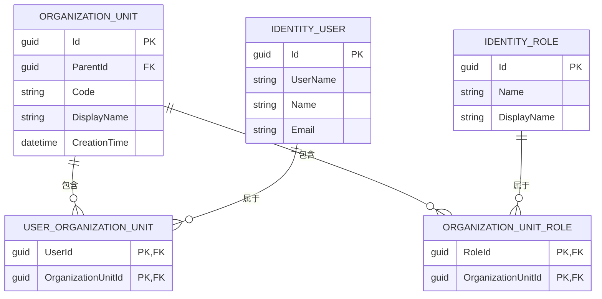

# 组织单位查询

<cite>
**本文档中引用的文件**
- [OrganizationUnitAppService.cs](file://aspnet-core/modules/identity/LINGYUN.Abp.Identity.Application/LINGYUN/Abp/Identity/OrganizationUnitAppService.cs)
- [OrganizationUnitController.cs](file://aspnet-core/modules/identity/LINGYUN.Abp.Identity.HttpApi/LINGYUN/Abp/Identity/OrganizationUnitController.cs)
- [EfCoreOrganizationUnitRepository.cs](file://aspnet-core/modules/identity/LINGYUN.Abp.Identity.EntityFrameworkCore/LINGYUN/Abp/Identity/EntityFrameworkCore/EfCoreOrganizationUnitRepository.cs)
- [IOrganizationUnitRepository.cs](file://aspnet-core/modules/identity/LINGYUN.Abp.Identity.Domain/LINGYUN/Abp/Identity/IOrganizationUnitRepository.cs)
- [OrganizationUnitDto.cs](file://aspnet-core/modules/identity/LINGYUN.Abp.Identity.Application.Contracts/LINGYUN/Abp/Identity/Dto/OrganizationUnitDto.cs)
- [OrganizationUnitGetByPagedDto.cs](file://aspnet-core/modules/identity/LINGYUN.Abp.Identity.Application.Contracts/LINGYUN/Abp/Identity/Dto/OrganizationUnitGetByPagedDto.cs)
- [OrganizationUnitGetListSpecification.cs](file://aspnet-core/modules/identity/LINGYUN.Abp.Identity.Application/LINGYUN/Abp/Identity/OrganizationUnitGetListSpecification.cs)
</cite>

## 目录
1. [简介](#简介)
2. [核心查询方法](#核心查询方法)
3. [分页与过滤机制](#分页与过滤机制)
4. [树形结构展平策略](#树形结构展平策略)
5. [组织单位仓储优化技术](#组织单位仓储优化技术)
6. [层级信息与统计获取](#层级信息与统计获取)
7. [API调用示例](#api调用示例)
8. [性能优化建议](#性能优化建议)

## 简介
本文档详细描述了abp-next-admin系统中组织单位查询功能的实现。系统提供了丰富的查询接口，支持分页、过滤、排序和树形结构展平等功能。通过这些接口，开发者可以高效地查询组织单位信息，包括完整的树形结构、特定层级的子节点以及包含用户统计和权限继承数据的详细信息。

**Section sources**
- [OrganizationUnitAppService.cs](file://aspnet-core/modules/identity/LINGYUN.Abp.Identity.Application/LINGYUN/Abp/Identity/OrganizationUnitAppService.cs)
- [OrganizationUnitController.cs](file://aspnet-core/modules/identity/LINGYUN.Abp.Identity.HttpApi/LINGYUN/Abp/Identity/OrganizationUnitController.cs)

## 核心查询方法
系统提供了多个核心查询方法来满足不同的查询需求：

- `GetListAsync`: 分页查询组织单位列表，支持过滤和排序
- `GetAllListAsync`: 获取所有组织单位列表
- `GetAsync`: 根据ID获取单个组织单位
- `GetRootAsync`: 获取根节点组织单位
- `FindChildrenAsync`: 查找指定组织单位的子节点
- `GetLastChildOrNullAsync`: 获取最后一个子节点或空值



**Diagram sources**
- [OrganizationUnitController.cs](file://aspnet-core/modules/identity/LINGYUN.Abp.Identity.HttpApi/LINGYUN/Abp/Identity/OrganizationUnitController.cs#L79-L82)
- [OrganizationUnitAppService.cs](file://aspnet-core/modules/identity/LINGYUN.Abp.Identity.Application/LINGYUN/Abp/Identity/OrganizationUnitAppService.cs#L96-L123)
- [EfCoreOrganizationUnitRepository.cs](file://aspnet-core/modules/identity/LINGYUN.Abp.Identity.EntityFrameworkCore/LINGYUN/Abp/Identity/EntityFrameworkCore/EfCoreOrganizationUnitRepository.cs#L35-L50)

**Section sources**
- [OrganizationUnitAppService.cs](file://aspnet-core/modules/identity/LINGYUN.Abp.Identity.Application/LINGYUN/Abp/Identity/OrganizationUnitAppService.cs#L67-L205)
- [OrganizationUnitController.cs](file://aspnet-core/modules/identity/LINGYUN.Abp.Identity.HttpApi/LINGYUN/Abp/Identity/OrganizationUnitController.cs#L38-L149)

## 分页与过滤机制
系统实现了标准的分页和过滤机制，通过`OrganizationUnitGetByPagedDto`输入参数和`OrganizationUnitGetListSpecification`规范类来实现。

### 分页参数
分页查询使用`PagedAndSortedResultRequestDto`基类，包含以下参数：
- `MaxResultCount`: 每页最大结果数（默认10）
- `SkipCount`: 跳过的记录数（用于分页）
- `Sorting`: 排序规则

### 过滤实现
过滤功能通过`OrganizationUnitGetListSpecification`类实现，该类继承自ABP框架的`Specification<T>`模式：

```csharp
public override Expression<Func<OrganizationUnit, bool>> ToExpression()
{
    Expression<Func<OrganizationUnit, bool>> expression = _ => true;
    return expression.AndIf(!Input.Filter.IsNullOrWhiteSpace(), x =>
        x.DisplayName.Contains(Input.Filter) || x.Code.Contains(Input.Filter));
}
```

此实现允许在显示名称(DisplayName)和编码(Code)字段上进行模糊搜索。



**Diagram sources**
- [OrganizationUnitGetByPagedDto.cs](file://aspnet-core/modules/identity/LINGYUN.Abp.Identity.Application.Contracts/LINGYUN/Abp/Identity/Dto/OrganizationUnitGetByPagedDto.cs)
- [OrganizationUnitGetListSpecification.cs](file://aspnet-core/modules/identity/LINGYUN.Abp.Identity.Application/LINGYUN/Abp/Identity/OrganizationUnitGetListSpecification.cs)
- [EfCoreOrganizationUnitRepository.cs](file://aspnet-core/modules/identity/LINGYUN.Abp.Identity.EntityFrameworkCore/LINGYUN/Abp/Identity/EntityFrameworkCore/EfCoreOrganizationUnitRepository.cs)

**Section sources**
- [OrganizationUnitGetListSpecification.cs](file://aspnet-core/modules/identity/LINGYUN.Abp.Identity.Application/LINGYUN/Abp/Identity/OrganizationUnitGetListSpecification.cs#L6-L23)
- [OrganizationUnitGetByPagedDto.cs](file://aspnet-core/modules/identity/LINGYUN.Abp.Identity.Application.Contracts/LINGYUN/Abp/Identity/Dto/OrganizationUnitGetByPagedDto.cs#L4-L7)

## 树形结构展平策略
系统采用路径枚举模式(Path Enumeration Pattern)来优化树形结构的查询性能。每个组织单位都有一个Code属性，该属性包含了从根节点到当前节点的完整路径。

### 展平策略实现
当需要查询某个组织单位及其所有子节点时，系统使用Code字段的前缀匹配：

```csharp
// 查询某个组织单位下的所有用户（包括子节点）
var query = from userOu in dbContext.Set<IdentityUserOrganizationUnit>()
            join user in (await GetDbSetAsync()) on userOu.UserId equals user.Id
            join ou in dbContext.Set<OrganizationUnit>() on userOu.OrganizationUnitId equals ou.Id
            where ou.Code.StartsWith(code)
            select user;
```

这种策略避免了递归查询，大大提高了查询效率。

### 递归查询支持
对于需要精确控制递归深度的场景，系统提供了`FindChildrenAsync`方法，通过`OrganizationUnitGetChildrenDto`参数中的`Recursive`标志来控制是否递归查询所有子节点。



**Diagram sources**
- [OrganizationUnitDto.cs](file://aspnet-core/modules/identity/LINGYUN.Abp.Identity.Application.Contracts/LINGYUN/Abp/Identity/Dto/OrganizationUnitDto.cs)
- [OrganizationUnitGetChildrenDto.cs](file://aspnet-core/modules/identity/LINGYUN.Abp.Identity.Application.Contracts/LINGYUN/Abp/Identity/Dto/OrganizationUnitGetChildrenDto.cs)
- [OrganizationUnitAppService.cs](file://aspnet-core/modules/identity/LINGYUN.Abp.Identity.Application/LINGYUN/Abp/Identity/OrganizationUnitAppService.cs)

**Section sources**
- [EfCoreIdentityUserRepository.cs](file://aspnet-core/modules/identity/LINGYUN.Abp.Identity.EntityFrameworkCore/LINGYUN/Abp/Identity/EntityFrameworkCore/EfCoreIdentityUserRepository.cs#L215-L237)
- [OrganizationUnitAppService.cs](file://aspnet-core/modules/identity/LINGYUN.Abp.Identity.Application/LINGYUN/Abp/Identity/OrganizationUnitAppService.cs#L75-L82)

## 组织单位仓储优化技术
组织单位仓储层实现了多种优化技术来提高查询性能。

### 自定义仓储接口
系统扩展了ABP框架的默认仓储，添加了专门用于分页查询的方法：

```csharp
public interface IOrganizationUnitRepository : Volo.Abp.Identity.IOrganizationUnitRepository
{
    Task<int> GetCountAsync(
        ISpecification<OrganizationUnit> specification,
        CancellationToken cancellationToken = default);

    Task<List<OrganizationUnit>> GetListAsync(
        ISpecification<OrganizationUnit> specification,
        string sorting = nameof(OrganizationUnit.Code),
        int maxResultCount = 10,
        int skipCount = 0,
        bool includeDetails = false,
        CancellationToken cancellationToken = default);
}
```

### 实现细节
`EfCoreOrganizationUnitRepository`实现了上述接口，提供了高效的查询方法：

```csharp
public async virtual Task<List<OrganizationUnit>> GetListAsync(
    ISpecification<OrganizationUnit> specification,
    string sorting = nameof(OrganizationUnit.Code),
    int maxResultCount = 10,
    int skipCount = 0,
    bool includeDetails = false,
    CancellationToken cancellationToken = default)
{
    if (sorting.IsNullOrWhiteSpace())
    {
        sorting = nameof(OrganizationUnit.Code);
    }
    return await (await GetDbSetAsync())
        .IncludeDetails(includeDetails)
        .Where(specification.ToExpression())
        .OrderBy(sorting)
        .PageBy(skipCount, maxResultCount)
        .ToListAsync(GetCancellationToken(cancellationToken));
}
```

**Section sources**
- [IOrganizationUnitRepository.cs](file://aspnet-core/modules/identity/LINGYUN.Abp.Identity.Domain/LINGYUN/Abp/Identity/IOrganizationUnitRepository.cs#L0-L21)
- [EfCoreOrganizationUnitRepository.cs](file://aspnet-core/modules/identity/LINGYUN.Abp.Identity.EntityFrameworkCore/LINGYUN/Abp/Identity/EntityFrameworkCore/EfCoreOrganizationUnitRepository.cs#L0-L38)

## 层级信息与统计获取
系统提供了多种方法来获取组织单位的层级信息和相关统计。

### 层级信息
- `ParentId`: 指向父级组织单位的GUID
- `Code`: 包含完整路径的编码，如"001.002.003"
- `DisplayName`: 显示名称

### 用户统计
可以通过以下方法获取组织单位的用户统计信息：
- `GetUsersInOrganizationUnitCountAsync`: 获取指定组织单位的用户数量
- `GetUsersInOrganizationUnitWithChildrenCountAsync`: 获取指定组织单位及其所有子节点的用户总数

### 权限继承
系统通过角色与组织单位的关联实现权限继承：
- `GetRolesInOrganizationUnitAsync`: 获取直接分配给该组织单位的角色
- `GetRolesInOrganizationUnitWithChildrenAsync`: 获取该组织单位及其子节点的所有角色



**Diagram sources**
- [EfCoreIdentityUserRepository.cs](file://aspnet-core/modules/identity/LINGYUN.Abp.Identity.EntityFrameworkCore/LINGYUN/Abp/Identity/EntityFrameworkCore/EfCoreIdentityUserRepository.cs#L132-L152)
- [EfCoreIdentityRoleRepository.cs](file://aspnet-core/modules/identity/LINGYUN.Abp.Identity.EntityFrameworkCore/LINGYUN/Abp/Identity/EntityFrameworkCore/EfCoreIdentityRoleRepository.cs#L83-L95)

**Section sources**
- [IIdentityUserRepository.cs](file://aspnet-core/modules/identity/LINGYUN.Abp.Identity.Domain/LINGYUN/Abp/Identity/IIdentityUserRepository.cs#L71-L128)
- [EfCoreIdentityUserRepository.cs](file://aspnet-core/modules/identity/LINGYUN.Abp.Identity.EntityFrameworkCore/LINGYUN/Abp/Identity/EntityFrameworkCore/EfCoreIdentityUserRepository.cs#L97-L130)

## API调用示例
以下是各种查询场景的API调用示例：

### 按名称搜索
```http
GET /api/identity/organization-units?Filter=开发 HTTP/1.1
```
此请求将返回显示名称或编码中包含"开发"的所有组织单位。

### 分页查询
```http
GET /api/identity/organization-units?MaxResultCount=20&SkipCount=0&Sorting=DisplayName HTTP/1.1
```
此请求将返回按显示名称排序的前20个组织单位。

### 获取完整树形结构
```http
GET /api/identity/organization-units/all HTTP/1.1
```
此请求将返回所有组织单位的扁平化列表，前端可据此重建树形结构。

### 按层级查询子节点
```http
POST /api/identity/organization-units/find-children HTTP/1.1
Content-Type: application/json

{
    "id": "a1b2c3d4-e5f6-7890-g1h2-i3j4k5l6m7n8",
    "recursive": true
}
```
此请求将返回指定组织单位的所有子节点（包括递归子节点）。

### 获取根节点
```http
GET /api/identity/organization-units/root-node HTTP/1.1
```
此请求将返回所有顶级组织单位（无父级的组织单位）。

**Section sources**
- [OrganizationUnitController.cs](file://aspnet-core/modules/identity/LINGYUN.Abp.Identity.HttpApi/LINGYUN/Abp/Identity/OrganizationUnitController.cs#L38-L149)

## 性能优化建议
为了确保组织单位查询的高性能，建议采取以下措施：

### 索引建议
在数据库中为以下字段创建索引：
- `OrganizationUnit.Code` (前缀索引，支持StartsWith查询)
- `OrganizationUnit.ParentId` (外键索引)
- `OrganizationUnit.DisplayName` (全文索引或普通索引)
- `OrganizationUnit.Code` 和 `OrganizationUnit.DisplayName` 的组合索引

### 缓存策略
1. **全量缓存**: 对于不经常变化的组织单位树，可以缓存完整的组织单位列表。
2. **分层缓存**: 按层级缓存组织单位，减少重复查询。
3. **热点数据缓存**: 缓存频繁访问的组织单位及其子节点。

### 查询优化
- 使用`GetAllListAsync`获取完整列表后在内存中构建树形结构，而不是多次递归查询。
- 对于大型组织结构，优先使用基于Code前缀的查询而非递归CTE查询。
- 合理设置分页大小，避免一次性加载过多数据。

**Section sources**
- [EfCoreOrganizationUnitRepository.cs](file://aspnet-core/modules/identity/LINGYUN.Abp.Identity.EntityFrameworkCore/LINGYUN/Abp/Identity/EntityFrameworkCore/EfCoreOrganizationUnitRepository.cs)
- [OrganizationUnitAppService.cs](file://aspnet-core/modules/identity/LINGYUN.Abp.Identity.Application/LINGYUN/Abp/Identity/OrganizationUnitAppService.cs)