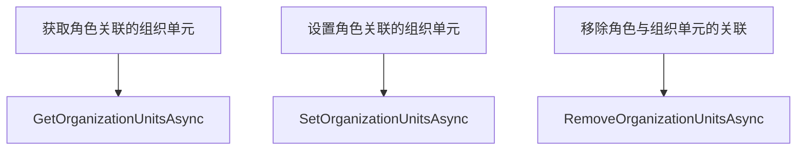
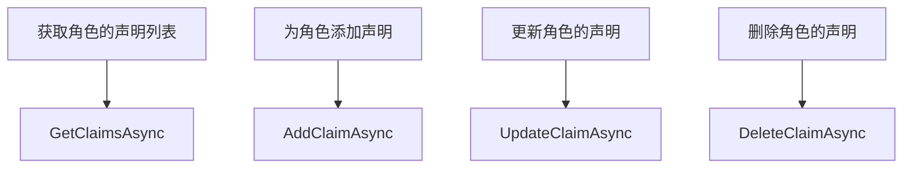
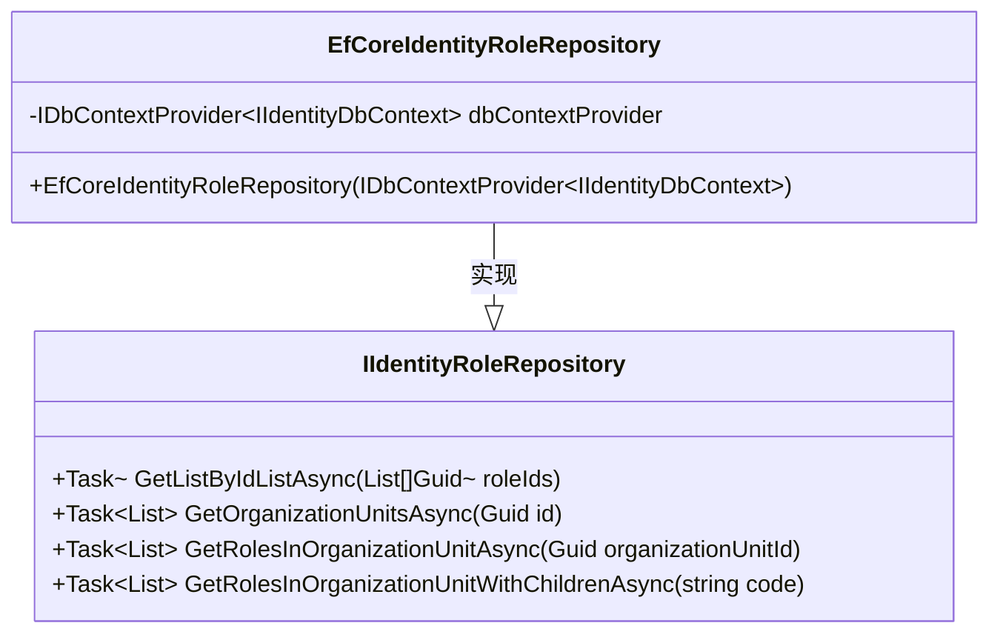
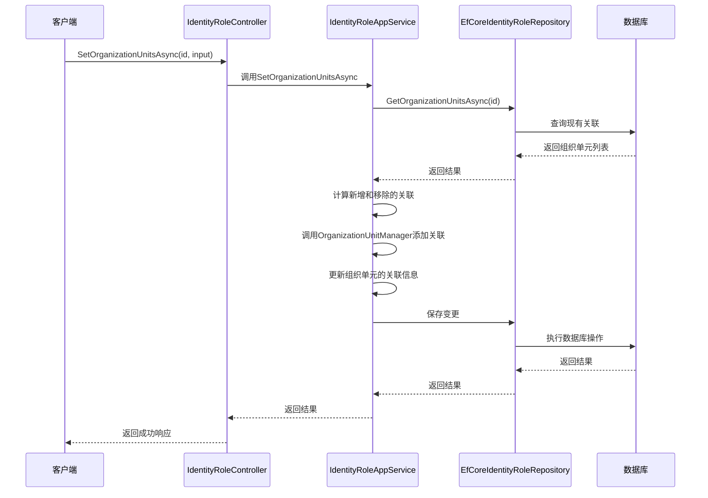

# 角色管理

<cite>
**本文档中引用的文件**   
- [IdentityRoleAppService.cs](file://aspnet-core/modules/identity/LINGYUN.Abp.Identity.Application/LINGYUN/Abp/Identity/IdentityRoleAppService.cs)
- [EfCoreIdentityRoleRepository.cs](file://aspnet-core/modules/identity/LINGYUN.Abp.Identity.EntityFrameworkCore/LINGYUN/Abp/Identity/EntityFrameworkCore/EfCoreIdentityRoleRepository.cs)
- [IIdentityRoleAppService.cs](file://aspnet-core/modules/identity/LINGYUN.Abp.Identity.Application.Contracts/LINGYUN/Abp/Identity/IIdentityRoleAppService.cs)
- [IdentityRoleController.cs](file://aspnet-core/modules/identity/LINGYUN.Abp.Identity.HttpApi/LINGYUN/Abp/Identity/IdentityRoleController.cs)
- [IIdentityRoleRepository.cs](file://aspnet-core/modules/identity/LINGYUN.Abp.Identity.Domain/LINGYUN/Abp/Identity/IIdentityRoleRepository.cs)
- [IdentityPermissions.cs](file://aspnet-core/modules/identity/LINGYUN.Abp.Identity.Application.Contracts/LINGYUN/Abp/Identity/IdentityPermissions.cs)
</cite>

## 目录
1. [简介](#简介)
2. [角色实体设计](#角色实体设计)
3. [角色应用服务API](#角色应用服务api)
4. [角色仓储实现](#角色仓储实现)
5. [角色与组织单元关系](#角色与组织单元关系)
6. [权限管理机制](#权限管理机制)
7. [开发者指导](#开发者指导)

## 简介
本文档详细阐述了abp-next-admin系统中角色管理子模块的设计与实现。该模块基于ABP框架的身份认证体系，提供了完整的角色生命周期管理功能，包括角色的创建、更新、删除、查询以及角色与组织单元、声明的关联管理。系统通过分层架构设计，将应用服务、领域仓储和数据访问层清晰分离，确保了代码的可维护性和可扩展性。

## 角色实体设计
角色实体（IdentityRole）是系统权限管理的核心组成部分，继承自Volo.Abp.Identity.IdentityRole基类。该实体主要包含以下属性：

- **Id**: 角色的唯一标识符，类型为Guid
- **Name**: 角色名称，用于标识和显示
- **IsDefault**: 布尔值，表示是否为默认角色
- **IsStatic**: 布尔值，表示是否为静态角色（不可删除）
- **IsPublic**: 布尔值，表示是否为公共角色
- **ConcurrencyStamp**: 并发控制戳，用于乐观锁机制
- **ExtraProperties**: 扩展属性，用于存储额外的JSON格式数据
- **EntityVersion**: 实体版本号，用于跟踪实体变更

角色实体通过Claims集合与声明（Claim）建立关联，支持为角色分配各种声明类型和值，从而实现细粒度的权限控制。

**Section sources**
- [IdentityRoleAppService.cs](file://aspnet-core/modules/identity/LINGYUN.Abp.Identity.Application/LINGYUN/Abp/Identity/IdentityRoleAppService.cs#L13)
- [IdentityRoleController.cs](file://aspnet-core/modules/identity/LINGYUN.Abp.Identity.HttpApi/LINGYUN/Abp/Identity/IdentityRoleController.cs#L17)

## 角色应用服务API
角色应用程序服务（IdentityRoleAppService）实现了IIdentityRoleAppService接口，提供了以下API接口：

### 组织单元管理接口


**Diagram sources**
- [IIdentityRoleAppService.cs](file://aspnet-core/modules/identity/LINGYUN.Abp.Identity.Application.Contracts/LINGYUN/Abp/Identity/IIdentityRoleAppService.cs#L5-L14)
- [IdentityRoleAppService.cs](file://aspnet-core/modules/identity/LINGYUN.Abp.Identity.Application/LINGYUN/Abp/Identity/IdentityRoleAppService.cs#L13)

### 声明管理接口


**Diagram sources**
- [IIdentityRoleAppService.cs](file://aspnet-core/modules/identity/LINGYUN.Abp.Identity.Application.Contracts/LINGYUN/Abp/Identity/IIdentityRoleAppService.cs#L16-L25)
- [IdentityRoleAppService.cs](file://aspnet-core/modules/identity/LINGYUN.Abp.Identity.Application/LINGYUN/Abp/Identity/IdentityRoleAppService.cs#L13)

所有API接口均受到权限控制，需要相应的权限才能执行操作。例如，管理组织单元需要IdentityPermissions.Roles.ManageOrganizationUnits权限，管理声明需要IdentityPermissions.Roles.ManageClaims权限。

**Section sources**
- [IIdentityRoleAppService.cs](file://aspnet-core/modules/identity/LINGYUN.Abp.Identity.Application.Contracts/LINGYUN/Abp/Identity/IIdentityRoleAppService.cs)
- [IdentityRoleController.cs](file://aspnet-core/modules/identity/LINGYUN.Abp.Identity.HttpApi/LINGYUN/Abp/Identity/IdentityRoleController.cs)

## 角色仓储实现
角色仓储（IIdentityRoleRepository）的实现类EfCoreIdentityRoleRepository基于Entity Framework Core，提供了高效的数据访问模式和性能优化策略。

### 数据库访问模式
仓储实现通过IDbContextProvider<IIdentityDbContext>获取数据库上下文，确保了多租户环境下的正确数据隔离。主要的数据访问方法包括：

- **GetListByIdListAsync**: 根据角色ID列表批量获取角色信息
- **GetOrganizationUnitsAsync**: 获取与角色关联的组织单元
- **GetRolesInOrganizationUnitAsync**: 获取指定组织单元中的所有角色
- **GetRolesInOrganizationUnitWithChildrenAsync**: 获取指定组织单元及其子组织单元中的所有角色

### 性能优化策略
- **批量操作**: 支持通过ID列表批量查询角色，减少数据库往返次数
- **包含细节**: 通过IncludeDetails方法控制是否加载关联的详细信息，避免N+1查询问题
- **异步操作**: 所有数据库操作均采用异步模式，提高系统吞吐量
- **查询优化**: 使用LINQ动态查询和EF Core的查询优化特性，生成高效的SQL语句



**Diagram sources**
- [IIdentityRoleRepository.cs](file://aspnet-core/modules/identity/LINGYUN.Abp.Identity.Domain/LINGYUN/Abp/Identity/IIdentityRoleRepository.cs)
- [EfCoreIdentityRoleRepository.cs](file://aspnet-core/modules/identity/LINGYUN.Abp.Identity.EntityFrameworkCore/LINGYUN/Abp/Identity/EntityFrameworkCore/EfCoreIdentityRoleRepository.cs)

**Section sources**
- [EfCoreIdentityRoleRepository.cs](file://aspnet-core/modules/identity/LINGYUN.Abp.Identity.EntityFrameworkCore/LINGYUN/Abp/Identity/EntityFrameworkCore/EfCoreIdentityRoleRepository.cs)
- [IIdentityRoleRepository.cs](file://aspnet-core/modules/identity/LINGYUN.Abp.Identity.Domain/LINGYUN/Abp/Identity/IIdentityRoleRepository.cs)

## 角色与组织单元关系
系统通过多对多关系实现角色与组织单元的关联管理。这种设计模式支持灵活的权限分配，允许将同一角色分配给多个组织单元，或将多个角色分配给同一组织单元。

### 关系实现方式
- **关联表**: 使用OrganizationUnitRole作为中间表存储角色与组织单元的关联
- **双向查询**: 支持从角色查询关联的组织单元，也支持从组织单元查询关联的角色
- **层级查询**: 支持查询组织单元及其所有子组织单元中的角色

### 操作流程


**Diagram sources**
- [IdentityRoleAppService.cs](file://aspnet-core/modules/identity/LINGYUN.Abp.Identity.Application/LINGYUN/Abp/Identity/IdentityRoleAppService.cs#L38-L62)
- [EfCoreIdentityRoleRepository.cs](file://aspnet-core/modules/identity/LINGYUN.Abp.Identity.EntityFrameworkCore/LINGYUN/Abp/Identity/EntityFrameworkCore/EfCoreIdentityRoleRepository.cs#L38-L55)

**Section sources**
- [IdentityRoleAppService.cs](file://aspnet-core/modules/identity/LINGYUN.Abp.Identity.Application/LINGYUN/Abp/Identity/IdentityRoleAppService.cs)
- [EfCoreIdentityRoleRepository.cs](file://aspnet-core/modules/identity/LINGYUN.Abp.Identity.EntityFrameworkCore/LINGYUN/Abp/Identity/EntityFrameworkCore/EfCoreIdentityRoleRepository.cs)

## 权限管理机制
系统的权限管理机制基于声明（Claim）模型，通过为角色分配不同的声明来实现权限控制。

### 声明管理
- **添加声明**: 通过AddClaimAsync方法为角色添加声明，系统会检查声明是否已存在以避免重复
- **更新声明**: 通过UpdateClaimAsync方法更新声明的值，先移除旧声明再添加新声明
- **删除声明**: 通过DeleteClaimAsync方法移除角色的声明

### 权限继承
系统支持权限的继承机制，主要体现在：
- **组织单元继承**: 子组织单元可以继承父组织单元的角色分配
- **角色继承**: 虽然当前实现中没有直接的角色继承，但通过组织单元的层级结构间接实现了权限的继承

### 权限验证
所有敏感操作都受到权限验证的保护，通过[Authorize]特性指定所需的权限。例如：
- 管理组织单元关联需要IdentityPermissions.Roles.ManageOrganizationUnits权限
- 管理声明需要IdentityPermissions.Roles.ManageClaims权限

```mermaid
classDiagram
    class IdentityRoleClaimCreateDto {
        +string ClaimType
        +string ClaimValue
    }
    
    class IdentityRoleClaimUpdateDto {
        +string ClaimType
        +string ClaimValue
        +string