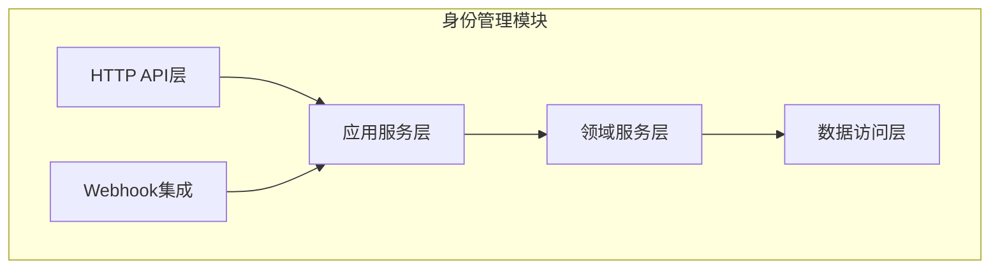
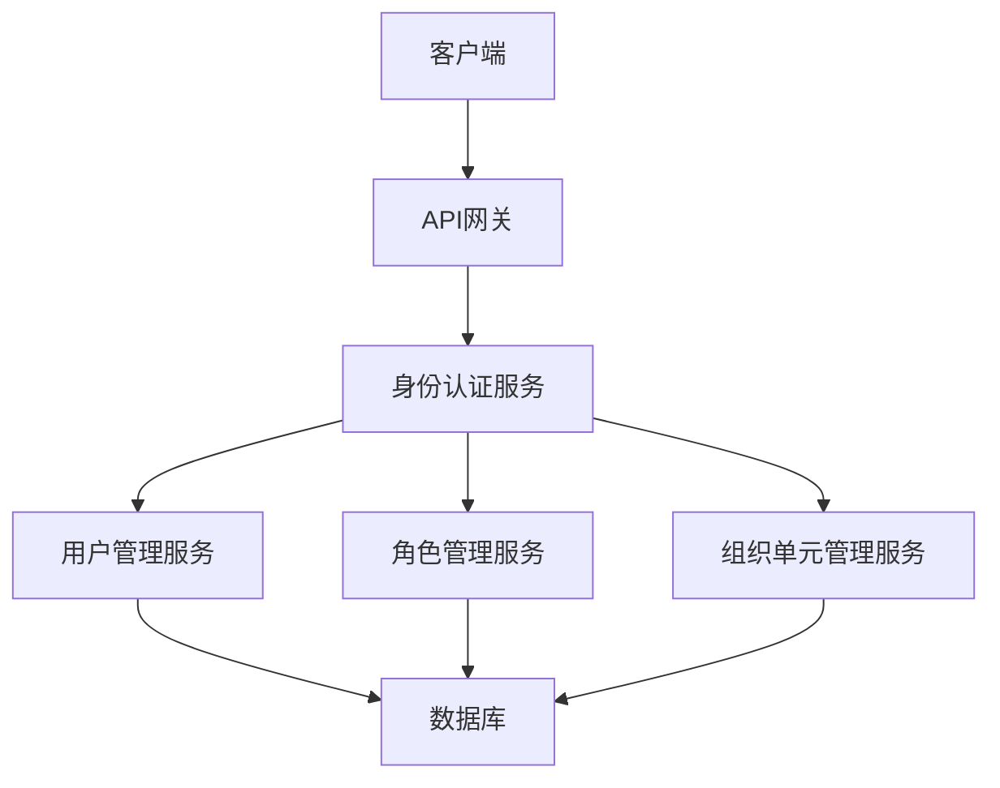

# 身份管理模块

<cite>
**本文档引用的文件**   
- [OrganizationUnitController.cs](file://aspnet-core/modules/identity/LINGYUN.Abp.Identity.HttpApi/LINGYUN/Abp/Identity/OrganizationUnitController.cs)
- [IOrganizationUnitAppService.cs](file://aspnet-core/modules/identity/LINGYUN.Abp.Identity.Application.Contracts/LINGYUN/Abp/Identity/IOrganizationUnitAppService.cs)
- [OrganizationUnitAppService.cs](file://aspnet-core/modules/identity/LINGYUN.Abp.Identity.Application/LINGYUN/Abp/Identity/OrganizationUnitAppService.cs)
- [IdentityPermissionDefinitionProvider.cs](file://aspnet-core/modules/identity/LINGYUN.Abp.Identity.Application.Contracts/LINGYUN/Abp/Identity/IdentityPermissionDefinitionProvider.cs)
- [IIdentityUserRepository.cs](file://aspnet-core/modules/identity/LINGYUN.Abp.Identity.Domain/LINGYUN/Abp/Identity/IIdentityUserRepository.cs)
- [IdentityUserWto.cs](file://aspnet-core/modules/webhooks/LINGYUN.Abp.Webhooks.Identity/LINGYUN/Abp/Webhooks/Identity/IdentityUserWto.cs)
- [AbpGdprIdentityUserDataProvider.cs](file://aspnet-core/modules/gdpr/LINGYUN.Abp.Gdpr.Domain.Identity/LINGYUN/Abp/Gdpr/Identity/AbpGdprIdentityUserDataProvider.cs)
- [PermissionManagementPermissionDefinitionProvider.cs](file://aspnet-core/modules/permissions-management/LINGYUN.Abp.PermissionManagement.Application.Contracts/LINGYUN/Abp/PermissionManagement/Permissions/PermissionManagementPermissionDefinitionProvider.cs)
- [OrganizationUnitPermissionManagementProvider.cs](file://aspnet-core/modules/permissions-management/LINGYUN.Abp.PermissionManagement.Domain.OrganizationUnits/LINGYUN/Abp/PermissionManagement/OrganizationUnits/OrganizationUnitPermissionManagementProvider.cs)
- [AbpUINavigationVueVbenAdminNavigationDefinitionProvider.cs](file://aspnet-core/modules/platform/LINGYUN.Abp.UI.Navigation.VueVbenAdmin/LINGYUN/Abp/UI/Navigation/VueVbenAdmin/AbpUINavigationVueVbenAdminNavigationDefinitionProvider.cs)
- [*.Designer.cs](file://aspnet-core/migrations/**/*.Designer.cs)
</cite>

## 目录
1. [简介](#简介)
2. [项目结构](#项目结构)
3. [核心组件](#核心组件)
4. [架构概述](#架构概述)
5. [详细组件分析](#详细组件分析)
6. [依赖分析](#依赖分析)
7. [性能考虑](#性能考虑)
8. [故障排除指南](#故障排除指南)
9. [结论](#结论)
10. [附录](#附录)（如有必要）

## 简介
身份管理模块是系统安全与权限控制的核心组件，负责用户账户管理、角色权限分配、组织架构维护等关键功能。该模块基于ABP框架构建，提供了完整的用户生命周期管理能力，支持多租户架构下的身份认证与授权。通过精细化的权限控制机制，系统能够实现基于角色、组织单元的细粒度访问控制，满足企业级应用的安全需求。

## 项目结构
身份管理模块采用分层架构设计，主要包含应用层、领域层和数据访问层。模块通过清晰的职责划分，实现了业务逻辑与数据访问的分离，提高了代码的可维护性和可扩展性。



**图表来源**
- [OrganizationUnitController.cs](file://aspnet-core/modules/identity/LINGYUN.Abp.Identity.HttpApi/LINGYUN/Abp/Identity/OrganizationUnitController.cs)
- [IOrganizationUnitAppService.cs](file://aspnet-core/modules/identity/LINGYUN.Abp.Identity.Application.Contracts/LINGYUN/Abp/Identity/IOrganizationUnitAppService.cs)
- [OrganizationUnitAppService.cs](file://aspnet-core/modules/identity/LINGYUN.Abp.Identity.Application/LINGYUN/Abp/Identity/OrganizationUnitAppService.cs)

**本节来源**
- [OrganizationUnitController.cs](file://aspnet-core/modules/identity/LINGYUN.Abp.Identity.HttpApi/LINGYUN/Abp/Identity/OrganizationUnitController.cs)
- [IOrganizationUnitAppService.cs](file://aspnet-core/modules/identity/LINGYUN.Abp.Identity.Application.Contracts/LINGYUN/Abp/Identity/IOrganizationUnitAppService.cs)

## 核心组件
身份管理模块的核心组件包括用户管理、角色管理、组织单元管理三大功能模块。这些组件通过服务接口暴露功能，支持灵活的权限控制和数据访问。

**本节来源**
- [IOrganizationUnitAppService.cs](file://aspnet-core/modules/identity/LINGYUN.Abp.Identity.Application.Contracts/LINGYUN/Abp/Identity/IOrganizationUnitAppService.cs)
- [OrganizationUnitAppService.cs](file://aspnet-core/modules/identity/LINGYUN.Abp.Identity.Application/LINGYUN/Abp/Identity/OrganizationUnitAppService.cs)

## 架构概述
身份管理模块采用领域驱动设计（DDD）原则，将业务逻辑封装在领域服务中，通过应用服务对外提供API接口。模块支持基于JWT的认证机制，集成多种第三方登录方式，确保系统的安全性和灵活性。



**图表来源**
- [OrganizationUnitController.cs](file://aspnet-core/modules/identity/LINGYUN.Abp.Identity.HttpApi/LINGYUN/Abp/Identity/OrganizationUnitController.cs)
- [IdentityPermissionDefinitionProvider.cs](file://aspnet-core/modules/identity/LINGYUN.Abp.Identity.Application.Contracts/LINGYUN/Abp/Identity/IdentityPermissionDefinitionProvider.cs)

## 详细组件分析

### 组织单元管理分析
组织单元管理组件提供了完整的组织架构管理功能，支持组织单元的增删改查、角色分配、用户管理等操作。通过树形结构存储组织单元，实现了高效的层级查询和管理。

#### 对象导向组件：
```mermaid
classDiagram
    class OrganizationUnitAppService {
        +GetListAsync(input) PagedResultDto
        +GetRoleNamesAsync(id) ListResultDto
        +GetUnaddedRolesAsync(id, input) PagedResultDto
        +GetRolesAsync(id, input) PagedResultDto
        +GetUnaddedUsersAsync(id, input) PagedResultDto
        +GetUsersAsync(id, input) PagedResultDto
        +MoveAsync(id, input) void
        +UpdateAsync(id, input) OrganizationUnitDto
        +AddUsersAsync(id, input) void
    }
    
    class IOrganizationUnitAppService {
        +GetAllListAsync() ListResultDto
        +GetLastChildOrNullAsync(parentId) OrganizationUnitDto
        +MoveAsync(id, input) Task
        +GetRootAsync() ListResultDto
        +FindChildrenAsync(input) ListResultDto
        +GetRoleNamesAsync(id) ListResultDto
        +GetUnaddedRolesAsync(id, input) PagedResultDto
