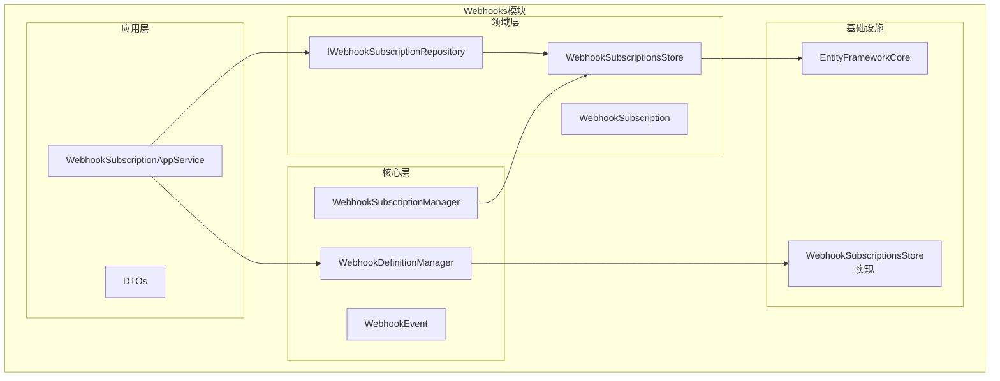
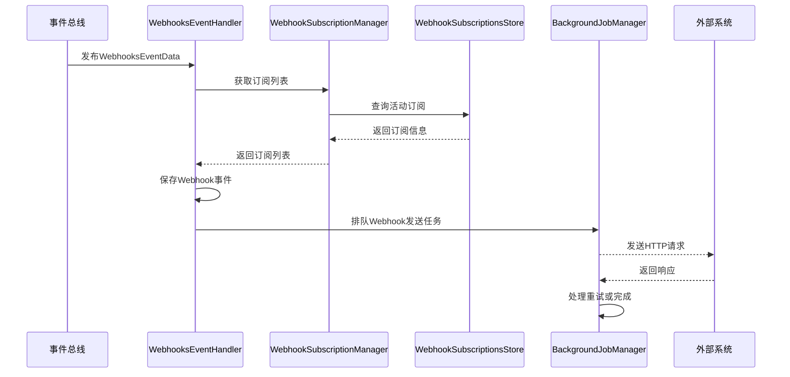
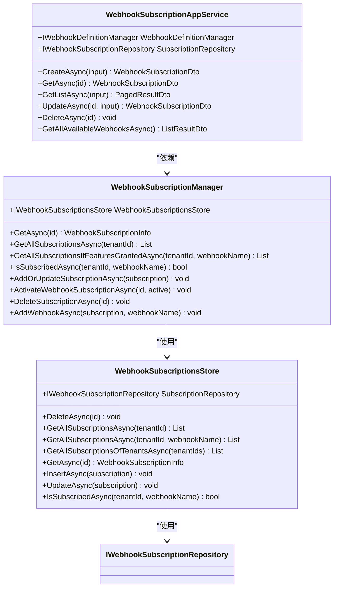
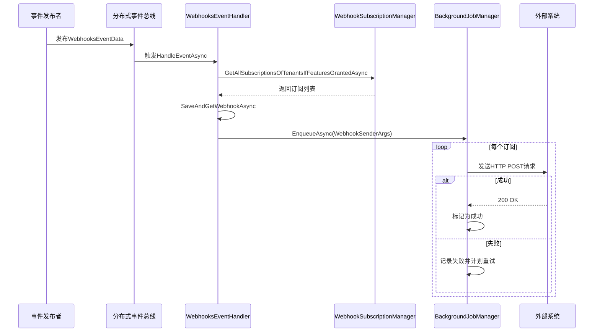

# Webhooks管理模块

<cite>
**本文档引用的文件**  
- [WebhookSubscriptionAppService.cs](file://aspnet-core/modules/webhooks/LINGYUN.Abp.WebhooksManagement.Application/LINGYUN/Abp/WebhooksManagement/WebhookSubscriptionAppService.cs)
- [WebhookSubscriptionManager.cs](file://aspnet-core/modules/webhooks/LINGYUN.Abp.Webhooks/LINGYUN/Abp/Webhooks/WebhookSubscriptionManager.cs)
- [WebhookSubscriptionsStore.cs](file://aspnet-core/modules/webhooks/LINGYUN.Abp.WebhooksManagement.Domain/LINGYUN/Abp/WebhooksManagement/WebhookSubscriptionsStore.cs)
- [WebhookDefinitionManager.cs](file://aspnet-core/modules/webhooks/LINGYUN.Abp.Webhooks.Core/LINGYUN/Abp/Webhooks/WebhookDefinitionManager.cs)
- [WebhooksEventHandler.cs](file://aspnet-core/services/LY.MicroService.WebhooksManagement.HttpApi.Host/EventBus/Handlers/WebhooksEventHandler.cs)
- [WebhookSubscriptionInfo.cs](file://aspnet-core/modules/webhooks/LINGYUN.Abp.Webhooks/LINGYUN/Abp/Webhooks/WebhookSubscriptionInfo.cs)
- [WebhookEvent.cs](file://aspnet-core/modules/webhooks/LINGYUN.Abp.Webhooks.Core/LINGYUN/Abp/Webhooks/WebhookEvent.cs)
- [WebhookSubscriptionEto.cs](file://aspnet-core/modules/webhooks/LINGYUN.Abp.WebhooksManagement.Domain.Shared/LINGYUN/Abp/WebhooksManagement/WebhookSubscriptionEto.cs)
</cite>

## 目录
1. [简介](#简介)
2. [项目结构](#项目结构)
3. [核心组件](#核心组件)
4. [架构概述](#架构概述)
5. [详细组件分析](#详细组件分析)
6. [依赖分析](#依赖分析)
7. [性能考虑](#性能考虑)
8. [故障排除指南](#故障排除指南)
9. [结论](#结论)

## 简介
Webhooks管理模块为系统提供了事件驱动的外部通知机制。该模块允许租户订阅特定的系统事件，并配置回调URL来接收这些事件的通知。模块实现了完整的CRUD操作、安全性验证、重试机制和错误处理，支持多租户环境下的事件发布/订阅模型。

## 项目结构
Webhooks管理模块采用分层架构设计，包含多个独立的组件，每个组件负责特定的功能领域。模块遵循ABP框架的模块化设计原则，确保了高内聚低耦合的特性。



**图表来源**
- [WebhookSubscriptionAppService.cs](file://aspnet-core/modules/webhooks/LINGYUN.Abp.WebhooksManagement.Application/LINGYUN/Abp/WebhooksManagement/WebhookSubscriptionAppService.cs)
- [WebhookSubscriptionsStore.cs](file://aspnet-core/modules/webhooks/LINGYUN.Abp.WebhooksManagement.Domain/LINGYUN/Abp/WebhooksManagement/WebhookSubscriptionsStore.cs)
- [WebhookDefinitionManager.cs](file://aspnet-core/modules/webhooks/LINGYUN.Abp.Webhooks.Core/LINGYUN/Abp/Webhooks/WebhookDefinitionManager.cs)

**章节来源**
- [WebhookSubscriptionAppService.cs](file://aspnet-core/modules/webhooks/LINGYUN.Abp.WebhooksManagement.Application/LINGYUN/Abp/WebhooksManagement/WebhookSubscriptionAppService.cs)
- [WebhookSubscriptionsStore.cs](file://aspnet-core/modules/webhooks/LINGYUN.Abp.WebhooksManagement.Domain/LINGYUN/Abp/WebhooksManagement/WebhookSubscriptionsStore.cs)

## 核心组件
Webhooks管理模块的核心组件包括订阅管理、事件发布、安全性验证和消息序列化。这些组件协同工作，确保事件能够可靠地从系统内部传递到外部系统。

**章节来源**
- [WebhookSubscriptionManager.cs](file://aspnet-core/modules/webhooks/LINGYUN.Abp.Webhooks/LINGYUN/Abp/Webhooks/WebhookSubscriptionManager.cs)
- [WebhookDefinitionManager.cs](file://aspnet-core/modules/webhooks/LINGYUN.Abp.Webhooks.Core/LINGYUN/Abp/Webhooks/WebhookDefinitionManager.cs)

## 架构概述
Webhooks管理模块采用事件驱动架构，通过分布式事件总线接收系统事件，然后根据订阅关系将事件转发到外部系统的回调URL。模块实现了完整的发布/订阅模式，支持多租户和权限控制。



**图表来源**
- [WebhooksEventHandler.cs](file://aspnet-core/services/LY.MicroService.WebhooksManagement.HttpApi.Host/EventBus/Handlers/WebhooksEventHandler.cs)
- [WebhookSubscriptionManager.cs](file://aspnet-core/modules/webhooks/LINGYUN.Abp.Webhooks/LINGYUN/Abp/Webhooks/WebhookSubscriptionManager.cs)
- [WebhookSubscriptionsStore.cs](file://aspnet-core/modules/webhooks/LINGYUN.Abp.WebhooksManagement.Domain/LINGYUN/Abp/WebhooksManagement/WebhookSubscriptionsStore.cs)

## 详细组件分析

### 订阅管理分析
Webhooks订阅管理组件负责处理Webhook订阅的CRUD操作，包括创建、读取、更新和删除订阅。组件实现了完整的权限验证和数据一致性保证。

#### 订阅管理类图


**图表来源**
- [WebhookSubscriptionAppService.cs](file://aspnet-core/modules/webhooks/LINGYUN.Abp.WebhooksManagement.Application/LINGYUN/Abp/WebhooksManagement/WebhookSubscriptionAppService.cs)
- [WebhookSubscriptionManager.cs](file://aspnet-core/modules/webhooks/LINGYUN.Abp.Webhooks/LINGYUN/Abp/Webhooks/WebhookSubscriptionManager.cs)
- [WebhookSubscriptionsStore.cs](file://aspnet-core/modules/webhooks/LINGYUN.Abp.WebhooksManagement.Domain/LINGYUN/Abp/WebhooksManagement/WebhookSubscriptionsStore.cs)

**章节来源**
- [WebhookSubscriptionAppService.cs](file://aspnet-core/modules/webhooks/LINGYUN.Abp.WebhooksManagement.Application/LINGYUN/Abp/WebhooksManagement/WebhookSubscriptionAppService.cs)
- [WebhookSubscriptionManager.cs](file://aspnet-core/modules/webhooks/LINGYUN.Abp.Webhooks/LINGYUN/Abp/Webhooks/WebhookSubscriptionManager.cs)

### 事件发布分析
事件发布组件负责处理系统事件的发布和分发，确保订阅了特定事件的外部系统能够及时收到通知。组件实现了可靠的消息传递机制，包括重试和错误处理。

#### 事件发布序列图


**图表来源**
- [WebhooksEventHandler.cs](file://aspnet-core/services/LY.MicroService.WebhooksManagement.HttpApi.Host/EventBus/Handlers/WebhooksEventHandler.cs)
- [WebhookSubscriptionManager.cs](file://aspnet-core/modules/webhooks/LINGYUN.Abp.Webhooks/LINGYUN/Abp/Webhooks/WebhookSubscriptionManager.cs)

**章节来源**
- [WebhooksEventHandler.cs](file://aspnet-core/services/LY.MicroService.WebhooksManagement.HttpApi.Host/EventBus/Handlers/WebhooksEventHandler.cs)

### 消息序列化分析
消息序列化组件负责处理Webhook事件数据的序列化和反序列化，确保消息格式的一致性和兼容性。组件使用JSON格式作为消息的序列化格式。

#### 消息序列化类图
```mermaid
classDiagram
    class WebhookEvent {
        +Guid Id
        +string WebhookName
        +string Data
        +DateTime CreationTime
        +Guid? TenantId
