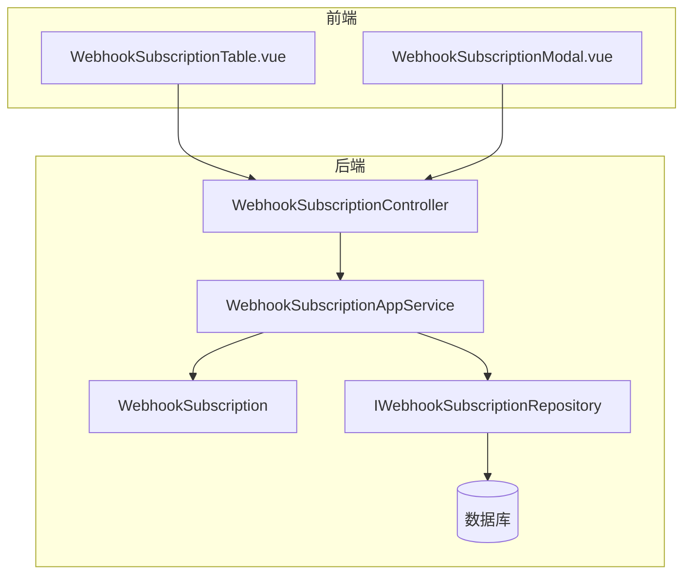
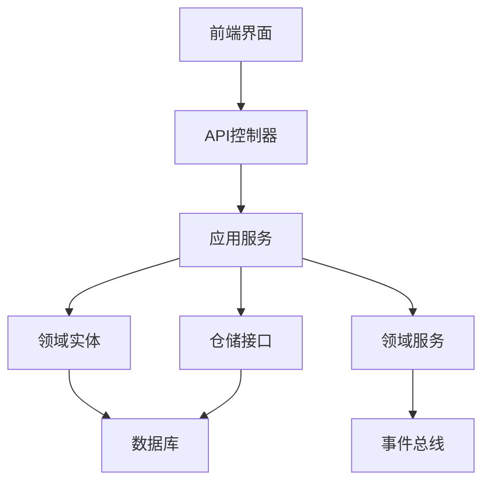
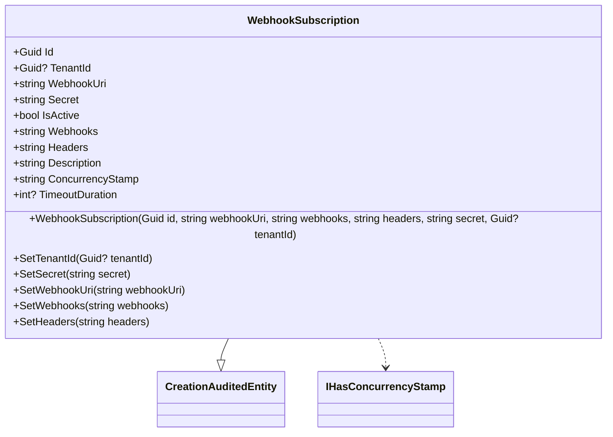
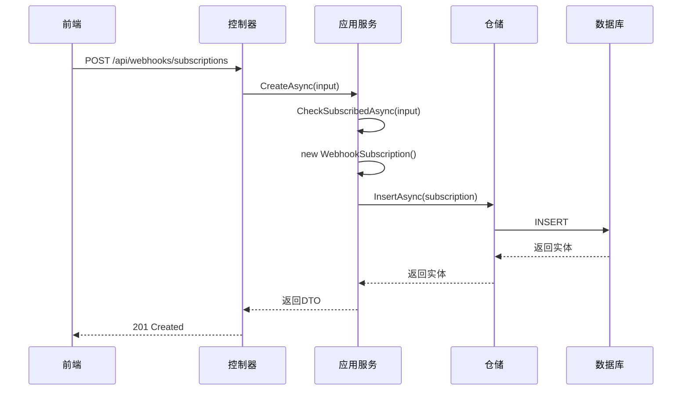
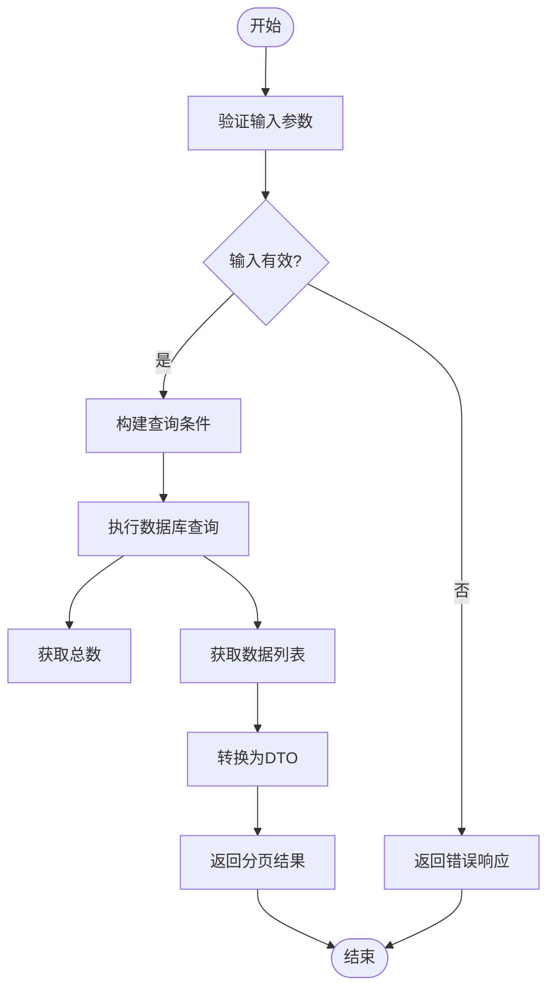
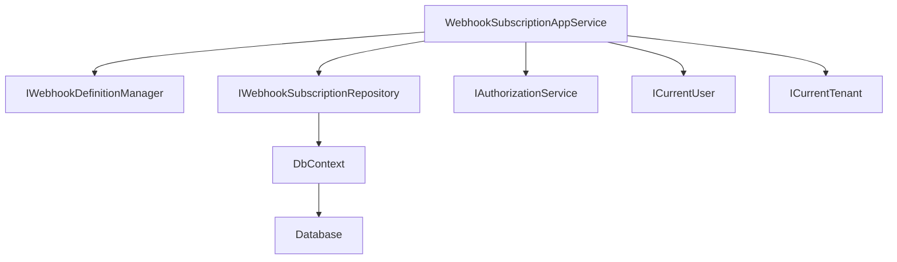

# Webhook订阅管理

<cite>
**本文档引用的文件**   
- [WebhookSubscription.cs](file://aspnet-core/modules/webhooks/LINGYUN.Abp.WebhooksManagement.Domain/LINGYUN/Abp/WebhooksManagement/WebhookSubscription.cs)
- [WebhookSubscriptionAppService.cs](file://aspnet-core/modules/webhooks/LINGYUN.Abp.WebhooksManagement.Application/LINGYUN/Abp/WebhooksManagement/WebhookSubscriptionAppService.cs)
- [WebhookSubscriptionDto.cs](file://aspnet-core/modules/webhooks/LINGYUN.Abp.WebhooksManagement.Application.Contracts/LINGYUN/Abp/WebhooksManagement/WebhookSubscriptionDto.cs)
- [WebhookSubscriptionCreateOrUpdateInput.cs](file://aspnet-core/modules/webhooks/LINGYUN.Abp.WebhooksManagement.Application.Contracts/LINGYUN/Abp/WebhooksManagement/WebhookSubscriptionCreateOrUpdateInput.cs)
- [WebhookSubscriptionController.cs](file://aspnet-core/modules/webhooks/LINGYUN.Abp.WebhooksManagement.HttpApi/LINGYUN/Abp/WebhooksManagement/WebhookSubscriptionController.cs)
- [WebhookSubscriptionConsts.cs](file://aspnet-core/modules/webhooks/LINGYUN.Abp.WebhooksManagement.Domain.Shared/LINGYUN/Abp/WebhooksManagement/WebhookSubscriptionConsts.cs)
- [WebhooksManagementErrorCodes.cs](file://aspnet-core/modules/webhooks/LINGYUN.Abp.WebhooksManagement.Domain.Shared/LINGYUN/Abp/WebhooksManagement/WebhooksManagementErrorCodes.cs)
- [WebhooksManagementPermissions.cs](file://aspnet-core/modules/webhooks/LINGYUN.Abp.WebhooksManagement.Application.Contracts/LINGYUN/Abp/WebhooksManagement/Authorization/WebhooksManagementPermissions.cs)
- [WebhookSubscriptionTable.vue](file://apps/vben5/packages/@abp/webhooks/src/components/subscriptions/WebhookSubscriptionTable.vue)
- [WebhookSubscriptionModal.vue](file://apps/vben5/packages/@abp/webhooks/src/components/subscriptions/WebhookSubscriptionModal.vue)
</cite>

## 目录
1. [简介](#简介)
2. [项目结构](#项目结构)
3. [核心组件](#核心组件)
4. [架构概述](#架构概述)
5. [详细组件分析](#详细组件分析)
6. [依赖分析](#依赖分析)
7. [性能考虑](#性能考虑)
8. [故障排除指南](#故障排除指南)
9. [结论](#结论)
10. [附录](#附录)（如有必要）

## 简介
本文档详细介绍了ABP Next Admin系统中Webhook订阅管理功能的实现机制。Webhook订阅管理允许系统在特定事件发生时向外部系统发送HTTP通知，实现系统间的实时通信和集成。文档深入解析了订阅的创建、更新、删除和查询操作的实现逻辑，包括数据模型、验证规则和业务逻辑。同时涵盖了API使用方法、参数说明、返回值以及管理界面配置方式，并提供了实际代码示例。

## 项目结构
Webhook订阅管理功能分布在多个模块中，遵循分层架构设计。核心业务逻辑位于领域层，应用服务提供API接口，HTTP API层暴露REST端点，前端组件提供用户界面。

**图示来源**
- [WebhookSubscriptionTable.vue](file://apps/vben5/packages/@abp/webhooks/src/components/subscriptions/WebhookSubscriptionTable.vue)
- [WebhookSubscriptionModal.vue](file://apps/vben5/packages/@abp/webhooks/src/components/subscriptions/WebhookSubscriptionModal.vue)
- [WebhookSubscriptionController.cs](file://aspnet-core/modules/webhooks/LINGYUN.Abp.WebhooksManagement.HttpApi/LINGYUN/Abp/WebhooksManagement/WebhookSubscriptionController.cs)
- [WebhookSubscriptionAppService.cs](file://aspnet-core/modules/webhooks/LINGYUN.Abp.WebhooksManagement.Application/LINGYUN/Abp/WebhooksManagement/WebhookSubscriptionAppService.cs)
- [WebhookSubscription.cs](file://aspnet-core/modules/webhooks/LINGYUN.Abp.WebhooksManagement.Domain/LINGYUN/Abp/WebhooksManagement/WebhookSubscription.cs)

**本节来源**
- [WebhookSubscription.cs](file://aspnet-core/modules/webhooks/LINGYUN.Abp.WebhooksManagement.Domain/LINGYUN/Abp/WebhooksManagement/WebhookSubscription.cs)
- [WebhookSubscriptionAppService.cs](file://aspnet-core/modules/webhooks/LINGYUN.Abp.WebhooksManagement.Application/LINGYUN/Abp/WebhooksManagement/WebhookSubscriptionAppService.cs)

## 核心组件
Webhook订阅管理的核心组件包括数据模型、应用服务、DTO传输对象和API控制器。数据模型`WebhookSubscription`定义了订阅的持久化结构，应用服务`WebhookSubscriptionAppService`实现了业务逻辑，DTO对象用于在不同层之间安全地传输数据，API控制器暴露RESTful接口供前端调用。

**本节来源**
- [WebhookSubscription.cs](file://aspnet-core/modules/webhooks/LINGYUN.Abp.WebhooksManagement.Domain/LINGYUN/Abp/WebhooksManagement/WebhookSubscription.cs)
- [WebhookSubscriptionAppService.cs](file://aspnet-core/modules/webhooks/LINGYUN.Abp.WebhooksManagement.Application/LINGYUN/Abp/WebhooksManagement/WebhookSubscriptionAppService.cs)
- [WebhookSubscriptionDto.cs](file://aspnet-core/modules/webhooks/LINGYUN.Abp.WebhooksManagement.Application.Contracts/LINGYUN/Abp/WebhooksManagement/WebhookSubscriptionDto.cs)

## 架构概述
Webhook订阅管理采用典型的分层架构，从上到下分为表示层、应用层、领域层和基础设施层。表示层由Vue组件构成，负责用户交互；应用层包含应用服务，协调领域对象完成业务用例；领域层包含实体和领域服务，封装核心业务规则；基础设施层提供数据访问和外部集成能力。

**图示来源**
- [WebhookSubscriptionController.cs](file://aspnet-core/modules/webhooks/LINGYUN.Abp.WebhooksManagement.HttpApi/LINGYUN/Abp/WebhooksManagement/WebhookSubscriptionController.cs)
- [WebhookSubscriptionAppService.cs](file://aspnet-core/modules/webhooks/LINGYUN.Abp.WebhooksManagement.Application/LINGYUN/Abp/WebhooksManagement/WebhookSubscriptionAppService.cs)
- [WebhookSubscription.cs](file://aspnet-core/modules/webhooks/LINGYUN.Abp.WebhooksManagement.Domain/LINGYUN/Abp/WebhooksManagement/WebhookSubscription.cs)
- [IWebhookSubscriptionRepository.cs](file://aspnet-core/modules/webhooks/LINGYUN.Abp.WebhooksManagement.Domain/LINGYUN/Abp/WebhooksManagement/IWebhookSubscriptionRepository.cs)

## 详细组件分析
### 订阅数据模型分析
`WebhookSubscription`实体类是Webhook订阅的核心数据模型，继承自`CreationAuditedEntity<Guid>`，具备创建审计功能。该实体采用保护性编程模式，所有属性通过受保护的`set`访问器和公共方法进行修改，确保数据完整性。

**图示来源**
- [WebhookSubscription.cs](file://aspnet-core/modules/webhooks/LINGYUN.Abp.WebhooksManagement.Domain/LINGYUN/Abp/WebhooksManagement/WebhookSubscription.cs)

**本节来源**
- [WebhookSubscription.cs](file://aspnet-core/modules/webhooks/LINGYUN.Abp.WebhooksManagement.Domain/LINGYUN/Abp/WebhooksManagement/WebhookSubscription.cs)
- [WebhookSubscriptionConsts.cs](file://aspnet-core/modules/webhooks/LINGYUN.Abp.WebhooksManagement.Domain.Shared/LINGYUN/Abp/WebhooksManagement/WebhookSubscriptionConsts.cs)

### 订阅创建与更新分析
订阅的创建和更新操作由`WebhookSubscriptionAppService`中的`CreateAsync`和`UpdateAsync`方法处理。创建操作首先验证输入，然后实例化新的`WebhookSubscription`实体并持久化到数据库。更新操作则先获取现有实体，应用变更，最后保存。

**图示来源**
- [WebhookSubscriptionAppService.cs](file://aspnet-core/modules/webhooks/LINGYUN.Abp.WebhooksManagement.Application/LINGYUN/Abp/WebhooksManagement/WebhookSubscriptionAppService.cs)
- [WebhookSubscriptionController.cs](file://aspnet-core/modules/webhooks/LINGYUN.Abp.WebhooksManagement.HttpApi/LINGYUN/Abp/WebhooksManagement/WebhookSubscriptionController.cs)

**本节来源**
- [WebhookSubscriptionAppService.cs](file://aspnet-core/modules/webhooks/LINGYUN.Abp.WebhooksManagement.Application/LINGYUN/Abp/WebhooksManagement/WebhookSubscriptionAppService.cs)
- [WebhookSubscriptionCreateOrUpdateInput.cs](file://aspnet-core/modules/webhooks/LINGYUN.Abp.WebhooksManagement.Application.Contracts/LINGYUN/Abp/WebhooksManagement/WebhookSubscriptionCreateOrUpdateInput.cs)

### 订阅查询与删除分析
订阅的查询操作支持分页、排序和多种过滤条件，通过`GetListAsync`方法实现。删除操作分为单个删除和批量删除，均通过`DeleteAsync`和`DeleteManyAsync`方法提供。

**图示来源**
- [WebhookSubscriptionAppService.cs](file://aspnet-core/modules/webhooks/LINGYUN.Abp.WebhooksManagement.Application/LINGYUN/Abp/WebhooksManagement/WebhookSubscriptionAppService.cs)
- [WebhookSubscriptionGetListSpecification.cs](file://aspnet-core/modules/webhooks/LINGYUN.Abp.WebhooksManagement.Application/LINGYUN/Abp/WebhooksManagement/WebhookSubscriptionAppService.cs#L182)

**本节来源**
- [WebhookSubscriptionAppService.cs](file://aspnet-core/modules/webhooks/LINGYUN.Abp.WebhooksManagement.Application/LINGYUN/Abp/WebhooksManagement/WebhookSubscriptionAppService.cs)
- [WebhookSubscriptionGetListInput.cs](file://aspnet-core/modules/webhooks/LINGYUN.Abp.WebhooksManagement.Application.Contracts/LINGYUN/Abp/WebhooksManagement/WebhookSubscriptionGetListInput.cs)

## 依赖分析
Webhook订阅管理功能依赖于多个ABP框架模块和外部服务。核心依赖包括多租户管理、权限验证、数据审计和事件总线。这些依赖通过依赖注入在应用服务中获取。

**图示来源**
- [WebhookSubscriptionAppService.cs](file://aspnet-core/modules/webhooks/LINGYUN.Abp.WebhooksManagement.Application/LINGYUN/Abp/WebhooksManagement/WebhookSubscriptionAppService.cs)
- [WebhookSubscription.cs](file://aspnet-core/modules/webhooks/LINGYUN.Abp.WebhooksManagement.Domain/LINGYUN/Abp/WebhooksManagement/WebhookSubscription.cs)

**本节来源**
- [WebhookSubscriptionAppService.cs](file://aspnet-core/modules/webhooks/LINGYUN.Abp.WebhooksManagement.Application/LINGYUN/Abp/WebhooksManagement/WebhookSubscriptionAppService.cs)
- [WebhookSubscription.cs](file://aspnet-core/modules/webhooks/LINGYUN.Abp.WebhooksManagement.Domain/LINGYUN/Abp/WebhooksManagement/WebhookSubscription.cs)

## 性能考虑
Webhook订阅管理在性能方面进行了多项优化。查询操作使用规范模式（Specification Pattern）构建复杂查询条件，避免了应用层的数据过滤。所有数据库操作都通过仓储接口进行，支持异步操作以提高响应性。此外，系统使用并发戳（Concurrency Stamp）来处理并发更新问题。

## 故障排除指南
### 重复订阅问题
当尝试创建已存在的订阅时，系统会抛出`WebhooksManagementErrorCodes.WebhookSubscription.DuplicateSubscribed`错误。此验证在`CheckSubscribedAsync`方法中执行，确保同一租户对同一Webhook URI和事件的订阅不会重复。

**本节来源**
- [WebhookSubscriptionAppService.cs](file://aspnet-core/modules/webhooks/LINGYUN.Abp.WebhooksManagement.Application/LINGYUN/Abp/WebhooksManagement/WebhookSubscriptionAppService.cs#L150-L163)
- [WebhooksManagementErrorCodes.cs](file://aspnet-core/modules/webhooks/LINGYUN.Abp.WebhooksManagement.Domain.Shared/LINGYUN/Abp/WebhooksManagement/WebhooksManagementErrorCodes.cs)

### 权限问题
所有Webhook订阅操作都受权限控制。创建、更新和删除操作需要相应的权限，如`WebhooksManagementPermissions.WebhookSubscription.Create`。如果用户没有足够权限，系统会返回403 Forbidden错误。

**本节来源**
- [WebhookSubscriptionAppService.cs](file://aspnet-core/modules/webhooks/LINGYUN.Abp.WebhooksManagement.Application/LINGYUN/Abp/WebhooksManagement/WebhookSubscriptionAppService.cs)
- [WebhooksManagementPermissions.cs](file://aspnet-core/modules/webhooks/LINGYUN.Abp.WebhooksManagement.Application.Contracts/LINGYUN/Abp/WebhooksManagement/Authorization/WebhooksManagementPermissions.cs)

## 结论
Webhook订阅管理功能提供了一套完整的解决方案，用于管理外部系统的事件通知。系统设计遵循领域驱动设计原则，具有良好的分层结构和清晰的职责划分。通过保护性编程、输入验证和权限控制，确保了系统的安全性和数据完整性。前端组件与后端API紧密配合，为用户提供直观易用的管理界面。

## 附录
### Webhook订阅API端点
| 端点 | HTTP方法 | 权限要求 | 描述 |
|------|---------|---------|------|
| /api/webhooks/subscriptions | POST | WebhooksManagementPermissions.WebhookSubscription.Create | 创建新的Webhook订阅 |
| /api/webhooks/subscriptions/{id} | GET | 无 | 获取指定ID的Webhook订阅 |
| /api/webhooks/subscriptions | GET | 无 | 获取Webhook订阅列表（支持分页和过滤） |
| /api/webhooks/subscriptions/{id} | PUT | WebhooksManagementPermissions.WebhookSubscription.Update | 更新指定ID的Webhook订阅 |
| /api/webhooks/subscriptions/{id} | DELETE | WebhooksManagementPermissions.WebhookSubscription.Delete | 删除指定ID的Webhook订阅 |
| /api/webhooks/subscriptions/delete-many | DELETE | WebhooksManagementPermissions.WebhookSubscription.Delete | 批量删除Webhook订阅 |
| /api/webhooks/subscriptions/availables | GET | 无 | 获取所有可用的Webhook事件 |

### Webhook订阅数据模型字段
| 字段 | 类型 | 最大长度 | 是否必填 | 描述 |
|------|------|---------|---------|------|
| Id | Guid | - | 是 | 订阅唯一标识符 |
| TenantId | Guid? | - | 否 | 租户ID，支持多租户 |
| WebhookUri | string | 255 | 是 | 回调URL地址 |
| Secret | string | 128 | 否 | 签名密钥，用于验证请求来源 |
| IsActive | bool | - | 是 | 是否激活状态 |
| Webhooks | string | 无限制 | 是 | 订阅的事件列表（JSON格式） |
| Headers | string | 无限制 | 否 | 自定义HTTP头信息（JSON格式） |
| Description | string | 128 | 否 | 订阅描述 |
| ConcurrencyStamp | string | - | 是 | 并发控制戳 |
| TimeoutDuration | int? | - | 否 | 请求超时时间（秒），范围10-300 |

### Webhook订阅验证规则
| 规则 | 实现方式 | 错误代码 |
|------|---------|---------|
| 回调URL长度验证 | DynamicStringLengthAttribute | WebhookSubscriptionConsts.MaxWebhookUriLength |
| 密钥长度验证 | DynamicStringLengthAttribute | WebhookSubscriptionConsts.MaxSecretLength |
| 描述长度验证 | DynamicStringLengthAttribute | WebhookSubscriptionConsts.MaxDescriptionLength |
| 超时时间范围验证 | DynamicRangeAttribute | WebhookSubscriptionConsts.TimeoutDurationMinimum 到 Maximum |
| 重复订阅检查 | CheckSubscribedAsync方法 | WebhooksManagementErrorCodes.WebhookSubscription.DuplicateSubscribed |