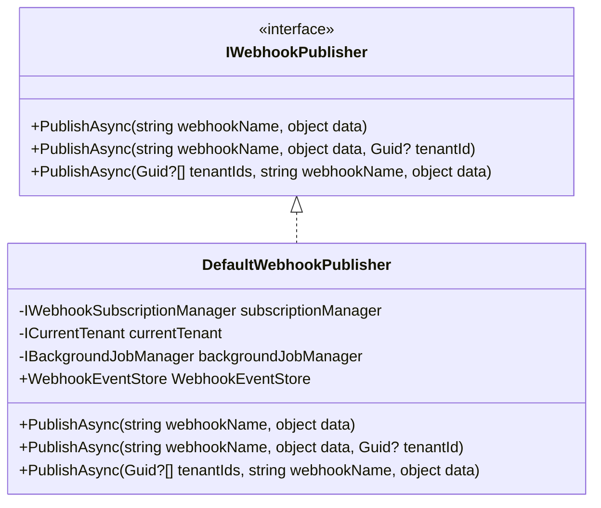
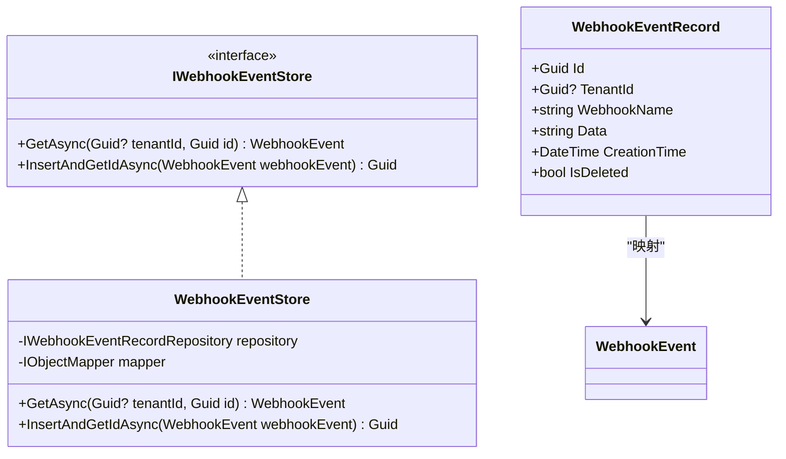
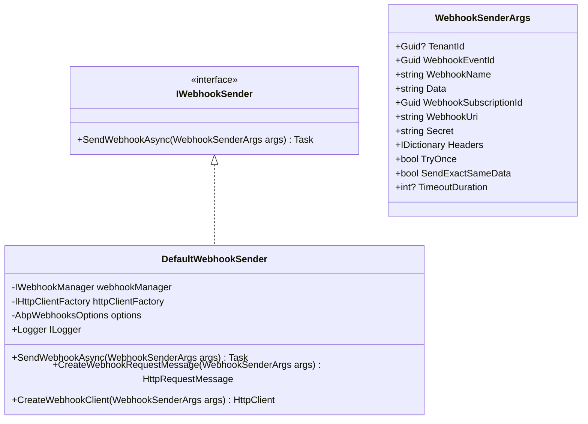
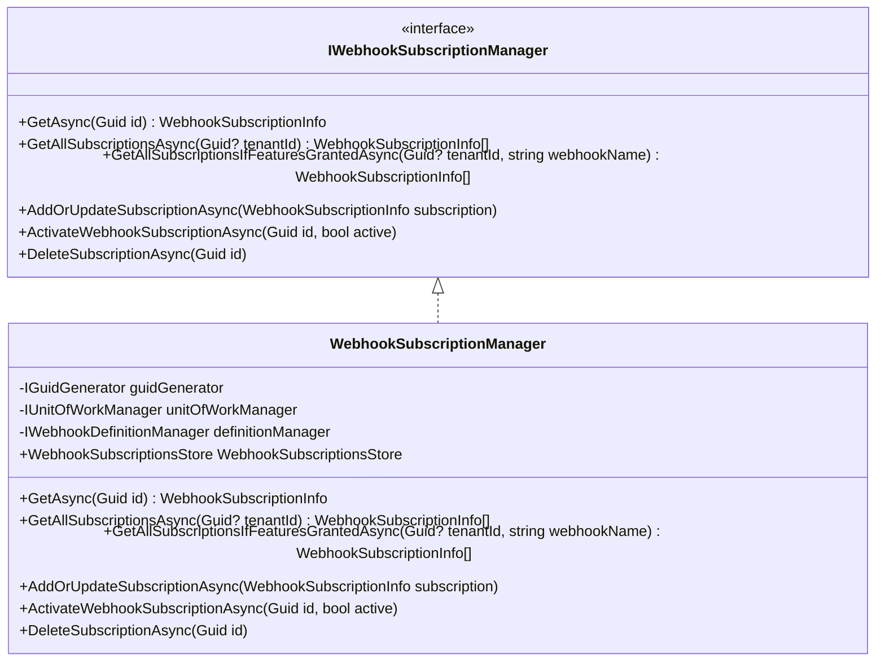
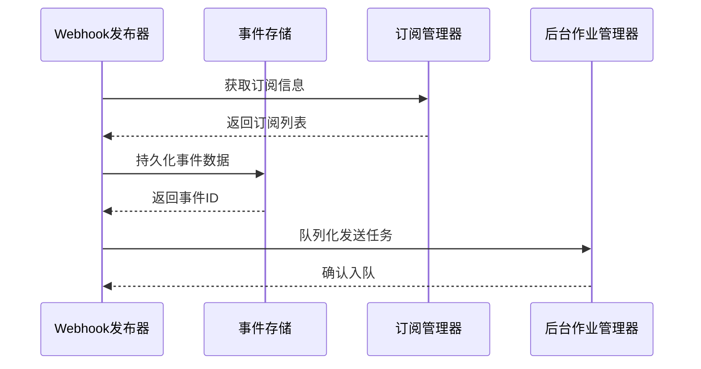
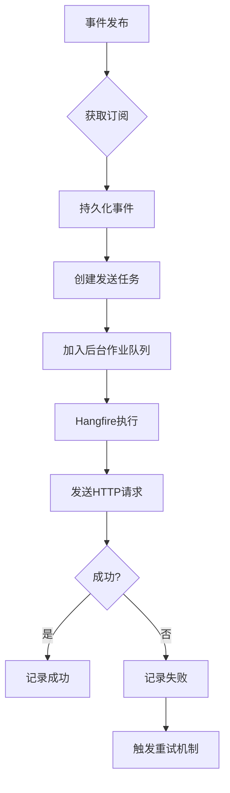
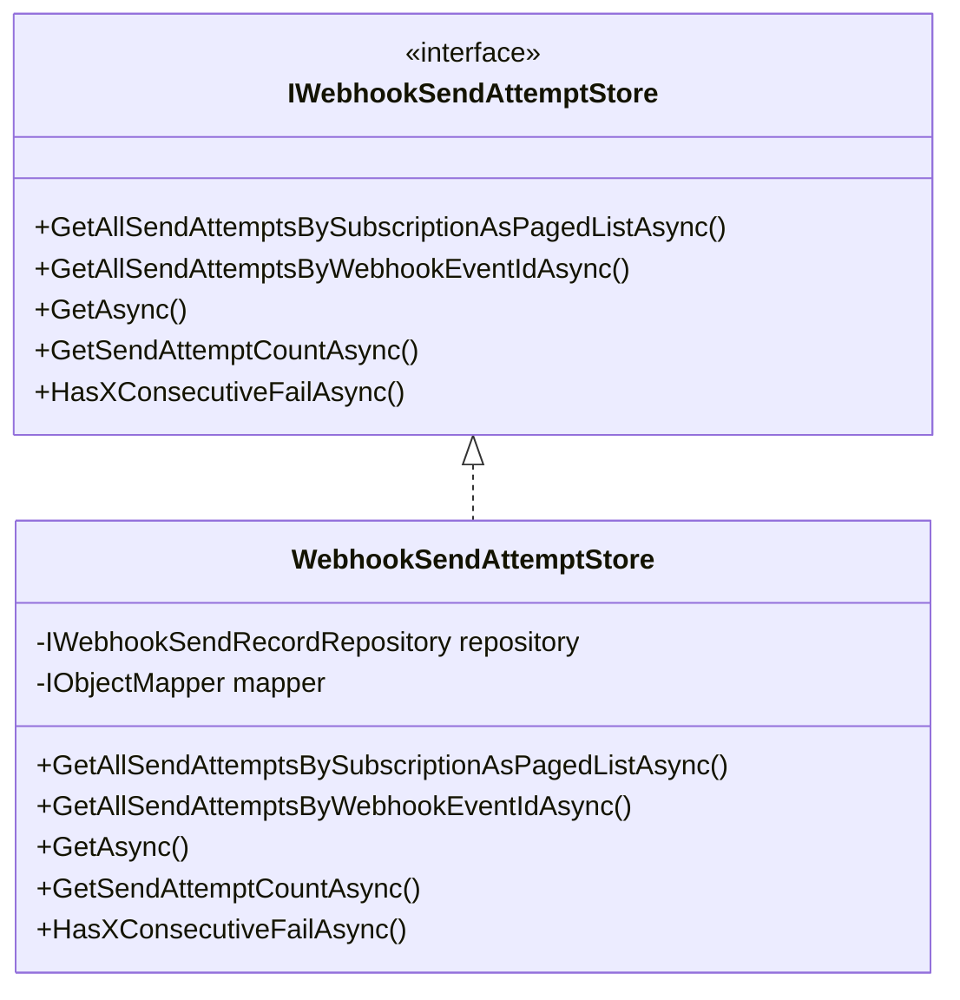
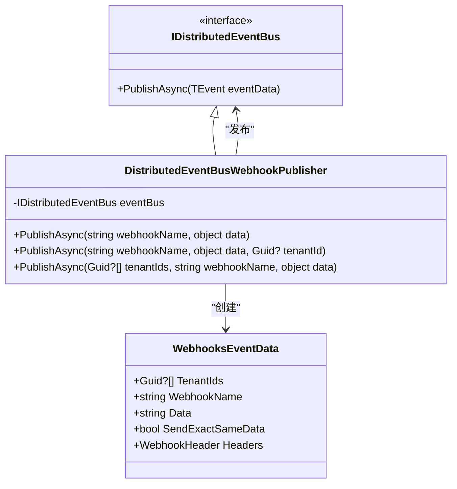
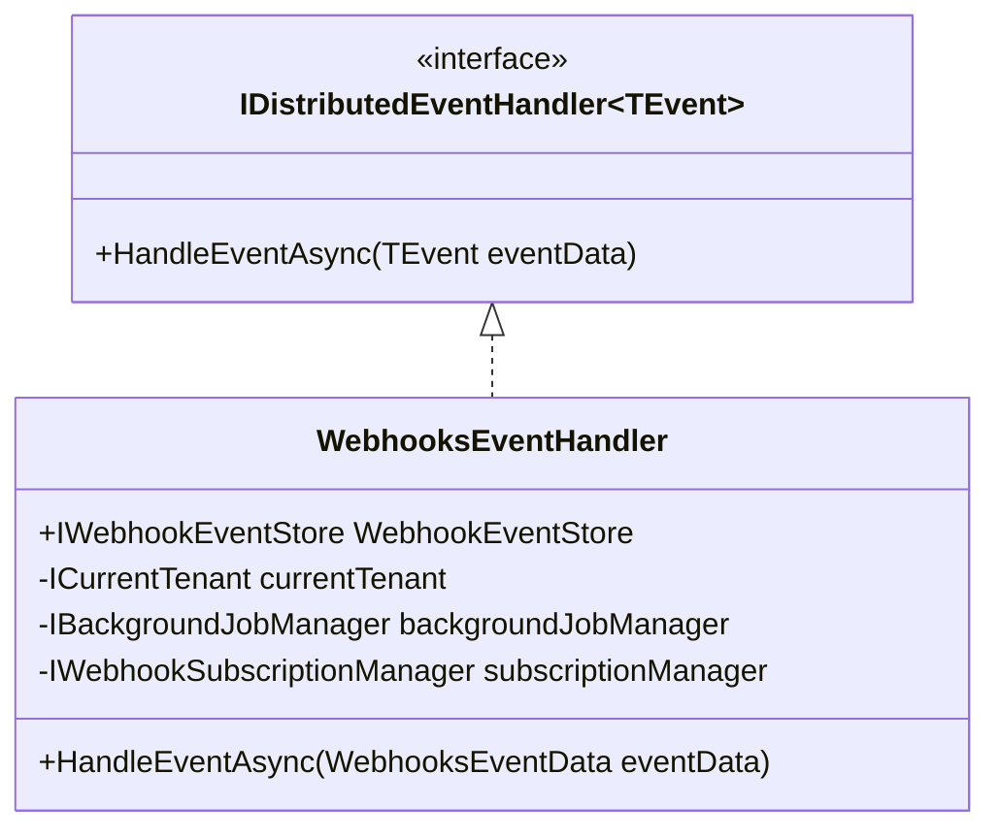

# 事件处理机制

<cite>
**本文档引用的文件**
- [DefaultWebhookPublisher.cs](file://aspnet-core/modules/webhooks/LINGYUN.Abp.Webhooks/LINGYUN/Abp/Webhooks/DefaultWebhookPublisher.cs)
- [DistributedEventBusWebhookPublisher.cs](file://aspnet-core/modules/webhooks/LINGYUN.Abp.Webhooks.EventBus/LINGYUN/Abp/Webhooks/EventBus/DistributedEventBusWebhookPublisher.cs)
- [WebhooksEventHandler.cs](file://aspnet-core/services/LY.MicroService.WebhooksManagement.HttpApi.Host/EventBus/Handlers/WebhooksEventHandler.cs)
- [WebhookEventStore.cs](file://aspnet-core/modules/webhooks/LINGYUN.Abp.WebhooksManagement.Domain/LINGYUN/Abp/WebhooksManagement/WebhookEventStore.cs)
- [WebhookSenderArgs.cs](file://aspnet-core/modules/webhooks/LINGYUN.Abp.Webhooks/LINGYUN/Abp/Webhooks/WebhookSenderArgs.cs)
- [DefaultWebhookSender.cs](file://aspnet-core/modules/webhooks/LINGYUN.Abp.Webhooks/LINGYUN/Abp/Webhooks/DefaultWebhookSender.cs)
- [WebhookSubscriptionManager.cs](file://aspnet-core/modules/webhooks/LINGYUN.Abp.Webhooks/LINGYUN/Abp/Webhooks/WebhookSubscriptionManager.cs)
- [WebhookEventRecord.cs](file://aspnet-core/modules/webhooks/LINGYUN.Abp.WebhooksManagement.Domain/LINGYUN/Abp/WebhooksManagement/WebhookEventRecord.cs)
- [WebhookSendAttemptStore.cs](file://aspnet-core/modules/webhooks/LINGYUN.Abp.WebhooksManagement.Domain/LINGYUN/Abp/WebhooksManagement/WebhookSendAttemptStore.cs)
- [WebhooksEventData.cs](file://aspnet-core/modules/webhooks/LINGYUN.Abp.Webhooks.EventBus/LINGYUN/Abp/Webhooks/EventBus/WebhooksEventData.cs)
</cite>

## 目录
1. [简介](#简介)
2. [核心组件](#核心组件)
3. [事件发布流程](#事件发布流程)
4. [事件序列化与传输](#事件序列化与传输)
5. [异步处理与队列管理](#异步处理与队列管理)
6. [失败重试策略](#失败重试策略)
7. [ABP事件总线集成](#abp事件总线集成)
8. [可靠性与顺序性保证](#可靠性与顺序性保证)

## 简介
本项目实现了基于ABP框架的Webhooks事件处理机制，提供了一套完整的事件发布、订阅、传输和确认流程。系统通过分布式事件总线实现跨服务通信，利用后台作业进行异步处理，并确保事件传递的可靠性和顺序性。

## 核心组件

### Webhook发布器
`IWebhookPublisher`接口定义了三种事件发布方法：针对当前租户、指定租户或多个租户发布事件。`DefaultWebhookPublisher`是其默认实现，负责将事件数据持久化并分发给订阅者。



**图示来源**
- [IWebhookPublisher.cs](file://aspnet-core/modules/webhooks/LINGYUN.Abp.Webhooks/LINGYUN/Abp/Webhooks/IWebhookPublisher.cs#L5-L55)
- [DefaultWebhookPublisher.cs](file://aspnet-core/modules/webhooks/LINGYUN.Abp.Webhooks/LINGYUN/Abp/Webhooks/DefaultWebhookPublisher.cs#L0-L140)

### Webhook事件存储
`IWebhookEventStore`接口定义了事件存储操作，`WebhookEventStore`是其实现类，负责将`WebhookEvent`实体持久化到数据库中。



**图示来源**
- [WebhookEventStore.cs](file://aspnet-core/modules/webhooks/LINGYUN.Abp.WebhooksManagement.Domain/LINGYUN/Abp/WebhooksManagement/WebhookEventStore.cs#L0-L51)
- [WebhookEventRecord.cs](file://aspnet-core/modules/webhooks/LINGYUN.Abp.WebhooksManagement.Domain/LINGYUN/Abp/WebhooksManagement/WebhookEventRecord.cs#L0-L32)

**本节来源**
- [WebhookEventStore.cs](file://aspnet-core/modules/webhooks/LINGYUN.Abp.WebhooksManagement.Domain/LINGYUN/Abp/WebhooksManagement/WebhookEventStore.cs#L0-L51)
- [WebhookEventRecord.cs](file://aspnet-core/modules/webhooks/LINGYUN.Abp.WebhooksManagement.Domain/LINGYUN/Abp/WebhooksManagement/WebhookEventRecord.cs#L0-L32)

### Webhook发送器
`IWebhookSender`接口定义了Webhook发送操作，`DefaultWebhookSender`是其默认实现，负责通过HTTP客户端向订阅者的端点发送事件。



**图示来源**
- [DefaultWebhookSender.cs](file://aspnet-core/modules/webhooks/LINGYUN.Abp.Webhooks/LINGYUN/Abp/Webhooks/DefaultWebhookSender.cs#L0-L207)
- [WebhookSenderArgs.cs](file://aspnet-core/modules/webhooks/LINGYUN.Abp.Webhooks/LINGYUN/Abp/Webhooks/WebhookSenderArgs.cs#L0-L71)

**本节来源**
- [DefaultWebhookSender.cs](file://aspnet-core/modules/webhooks/LINGYUN.Abp.Webhooks/LINGYUN/Abp/Webhooks/DefaultWebhookSender.cs#L0-L207)
- [WebhookSenderArgs.cs](file://aspnet-core/modules/webhooks/LINGYUN.Abp.Webhooks/LINGYUN/Abp/Webhooks/WebhookSenderArgs.cs#L0-L71)

### Webhook订阅管理器
`IWebhookSubscriptionManager`接口定义了订阅管理操作，`WebhookSubscriptionManager`是其实现类，负责管理租户的Webhook订阅。



**图示来源**
- [WebhookSubscriptionManager.cs](file://aspnet-core/modules/webhooks/LINGYUN.Abp.Webhooks/LINGYUN/Abp/Webhooks/WebhookSubscriptionManager.cs#L0-L172)

**本节来源**
- [WebhookSubscriptionManager.cs](file://aspnet-core/modules/webhooks/LINGYUN.Abp.Webhooks/LINGYUN/Abp/Webhooks/WebhookSubscriptionManager.cs#L0-L172)

## 事件发布流程

### 事件发布序列图


**图示来源**
- [DefaultWebhookPublisher.cs](file://aspnet-core/modules/webhooks/LINGYUN.Abp.Webhooks/LINGYUN/Abp/Webhooks/DefaultWebhookPublisher.cs#L0-L140)

**本节来源**
- [DefaultWebhookPublisher.cs](file://aspnet-core/modules/webhooks/LINGYUN.Abp.Webhooks/LINGYUN/Abp/Webhooks/DefaultWebhookPublisher.cs#L0-L140)

### 事件发布步骤
1. 调用`IWebhookPublisher.PublishAsync`方法发布事件
2. `WebhookSubscriptionManager`根据租户ID和Webhook名称获取所有有效订阅
3. `WebhookEventStore`将事件数据持久化到数据库
4. 为每个订阅创建`WebhookSenderArgs`参数对象
5. 通过`IBackgroundJobManager`将发送任务加入后台作业队列

## 事件序列化与传输

### 序列化格式
事件数据使用JSON格式进行序列化，通过`Newtonsoft.Json.JsonConvert.SerializeObject`方法将任意对象转换为JSON字符串。

```csharp
[SPEC SYMBOL](file://aspnet-core/modules/webhooks/LINGYUN.Abp.Webhooks/LINGYUN/Abp/Webhooks/DefaultWebhookPublisher.cs#L123-L140)
```

### 传输协议
使用HTTP POST请求传输事件，请求包含以下要素：
- **URL**: 订阅者配置的Webhook端点
- **Method**: POST
- **Content-Type**: application/json
- **Body**: JSON格式的事件数据
- **Headers**: 包含认证和其他元数据的HTTP头

## 异步处理与队列管理

### 后台作业处理流程


**图示来源**
- [DefaultWebhookPublisher.cs](file://aspnet-core/modules/webhooks/LINGYUN.Abp.Webhooks/LINGYUN/Abp/Webhooks/DefaultWebhookPublisher.cs#L0-L140)
- [DefaultWebhookSender.cs](file://aspnet-core/modules/webhooks/LINGYUN.Abp.Webhooks/LINGYUN/Abp/Webhooks/DefaultWebhookSender.cs#L0-L207)

**本节来源**
- [DefaultWebhookPublisher.cs](file://aspnet-core/modules/webhooks/LINGYUN.Abp.Webhooks/LINGYUN/Abp/Webhooks/DefaultWebhookPublisher.cs#L0-L140)
- [DefaultWebhookSender.cs](file://aspnet-core/modules/webhooks/LINGYUN.Abp.Webhooks/LINGYUN/Abp/Webhooks/DefaultWebhookSender.cs#L0-L207)

### 队列管理机制
系统使用ABP框架的后台作业系统（基于Hangfire）管理事件发送队列。每个发送任务被封装为`WebhookSenderArgs`对象并加入队列。

## 失败重试策略

### 发送尝试存储
`IWebhookSendAttemptStore`接口和`WebhookSendAttemptStore`实现类负责管理发送尝试记录。



**图示来源**
- [WebhookSendAttemptStore.cs](file://aspnet-core/modules/webhooks/LINGYUN.Abp.WebhooksManagement.Domain/LINGYUN/Abp/WebhooksManagement/WebhookSendAttemptStore.cs#L0-L138)

**本节来源**
- [WebhookSendAttemptStore.cs](file://aspnet-core/modules/webhooks/LINGYUN.Abp.WebhooksManagement.Domain/LINGYUN/Abp/WebhooksManagement/WebhookSendAttemptStore.cs#L0-L138)

### 重试逻辑
当发送失败时，系统会：
1. 记录失败的发送尝试，包括状态码和响应内容
2. 根据配置的重试策略决定是否重试
3. 如果需要重试，将任务重新加入队列
4. 支持连续失败检测，避免对持续不可用的端点无限重试

## ABP事件总线集成

### 分布式事件总线发布器
`DistributedEventBusWebhookPublisher`实现了通过ABP分布式事件总线发布Webhook的功能。



**图示来源**
- [DistributedEventBusWebhookPublisher.cs](file://aspnet-core/modules/webhooks/LINGYUN.Abp.Webhooks.EventBus/LINGYUN/Abp/Webhooks/EventBus/DistributedEventBusWebhookPublisher.cs#L0-L72)
- [WebhooksEventData.cs](file://aspnet-core/modules/webhooks/LINGYUN.Abp.Webhooks.EventBus/LINGYUN/Abp/Webhooks/EventBus/WebhooksEventData.cs#L0-L39)

**本节来源**
- [DistributedEventBusWebhookPublisher.cs](file://aspnet-core/modules/webhooks/LINGYUN.Abp.Webhooks.EventBus/LINGYUN/Abp/Webhooks/EventBus/DistributedEventBusWebhookPublisher.cs#L0-L72)
- [WebhooksEventData.cs](file://aspnet-core/modules/webhooks/LINGYUN.Abp.Webhooks.EventBus/LINGYUN/Abp/Webhooks/EventBus/WebhooksEventData.cs#L0-L39)

### 事件处理器
`WebhooksEventHandler`监听分布式事件总线上的Webhook事件并进行处理。



**图示来源**
- [WebhooksEventHandler.cs](file://aspnet-core/services/LY.MicroService.WebhooksManagement.HttpApi.Host/EventBus/Handlers/WebhooksEventHandler.cs#L0-L38)

**本节来源**
- [WebhooksEventHandler.cs](file://aspnet-core/services/LY.MicroService.WebhooksManagement.HttpApi.Host/EventBus/Handlers/WebhooksEventHandler.cs#L0-L38)

## 可靠性与顺序性保证

### 可靠性机制
1. **持久化存储**: 所有事件在发布前都会被持久化到数据库
2. **事务管理**: 使用`[UnitOfWork]`特性确保数据一致性
3. **错误处理**: 完善的异常捕获和日志记录机制
4. **状态跟踪**: 记录每个发送尝试的详细信息

### 顺序性保证
虽然系统主要设计为异步处理，但在特定场景下可以通过以下方式保证顺序性：
1. 对于同一租户的同一类型事件，可以使用有序队列
2. 在订阅端实现幂等性处理，避免重复事件的影响
3. 使用事件版本号或时间戳来识别事件顺序

### 数据模型关系
```mermaid
erDiagram
WEBHOOK_EVENT {
guid Id PK
guid? TenantId FK
string WebhookName
string Data
datetime CreationTime
boolean IsDeleted
}
WEBHOOK_SUBSCRIPTION {
guid Id PK
guid? TenantId FK
string WebhookUri
string Secret
boolean IsActive
int TimeoutDuration
}
WEBHOOK_SEND_ATTEMPT {
guid Id PK
guid WebhookEventId FK
guid WebhookSubscriptionId FK
guid? TenantId FK
datetime CreationTime
int? ResponseStatusCode
string ResponseContent
string RequestHeaders
string ResponseHeaders
}
WEBHOOK_EVENT ||--o{ WEBHOOK_SEND_ATTEMPT : "1:N"
WEBHOOK_SUBSCRIPTION ||--o{ WEBHOOK_SEND_ATTEMPT : "1:N"
```

**图示来源**
- [WebhookEventRecord.cs](file://aspnet-core/modules/webhooks/LINGYUN.Abp.WebhooksManagement.Domain/LINGYUN/Abp/WebhooksManagement/WebhookEventRecord.cs#L0-L32)
- [WebhookSendAttemptStore.cs](file://aspnet-core/modules/webhooks/LINGYUN.Abp.WebhooksManagement.Domain/LINGYUN/Abp/WebhooksManagement/WebhookSendAttemptStore.cs#L0-L138)

**本节来源**
- [WebhookEventRecord.cs](file://aspnet-core/modules/webhooks/LINGYUN.Abp.WebhooksManagement.Domain/LINGYUN/Abp/WebhooksManagement/WebhookEventRecord.cs#L0-L32)
- [WebhookSendAttemptStore.cs](file://aspnet-core/modules/webhooks/LINGYUN.Abp.WebhooksManagement.Domain/LINGYUN/Abp/WebhooksManagement/WebhookSendAttemptStore.cs#L0-L138)