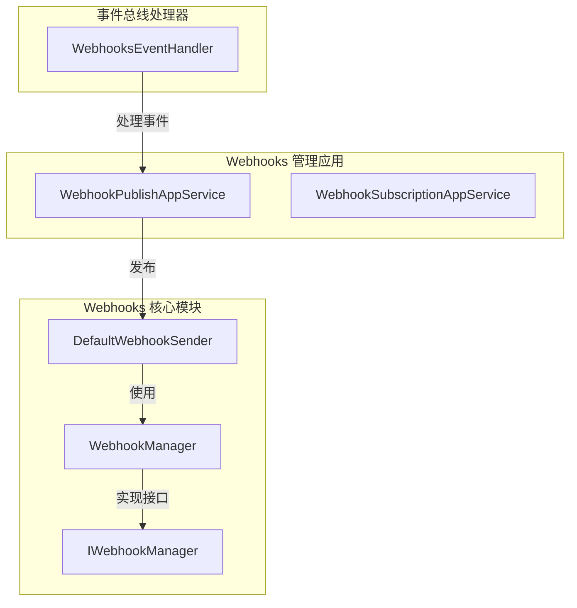
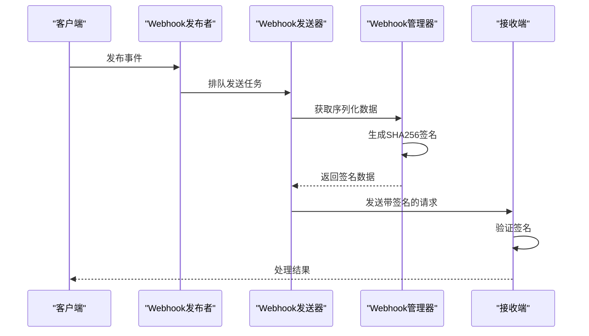
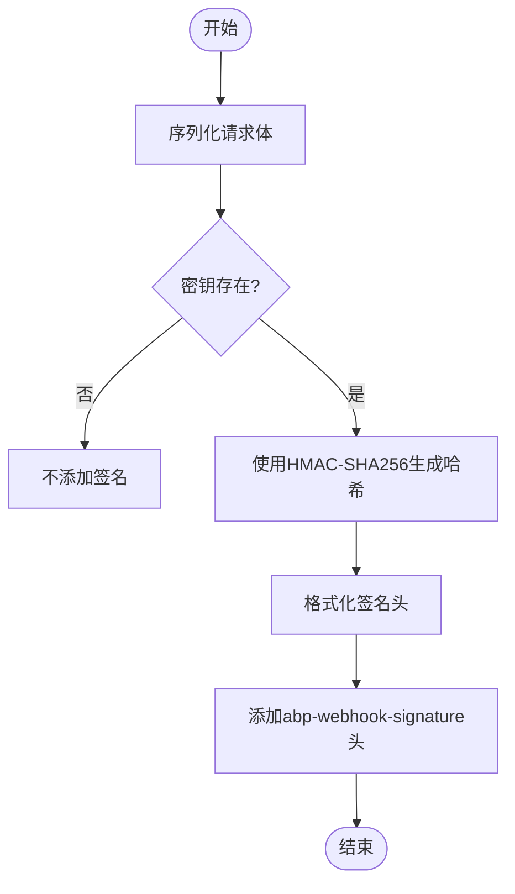
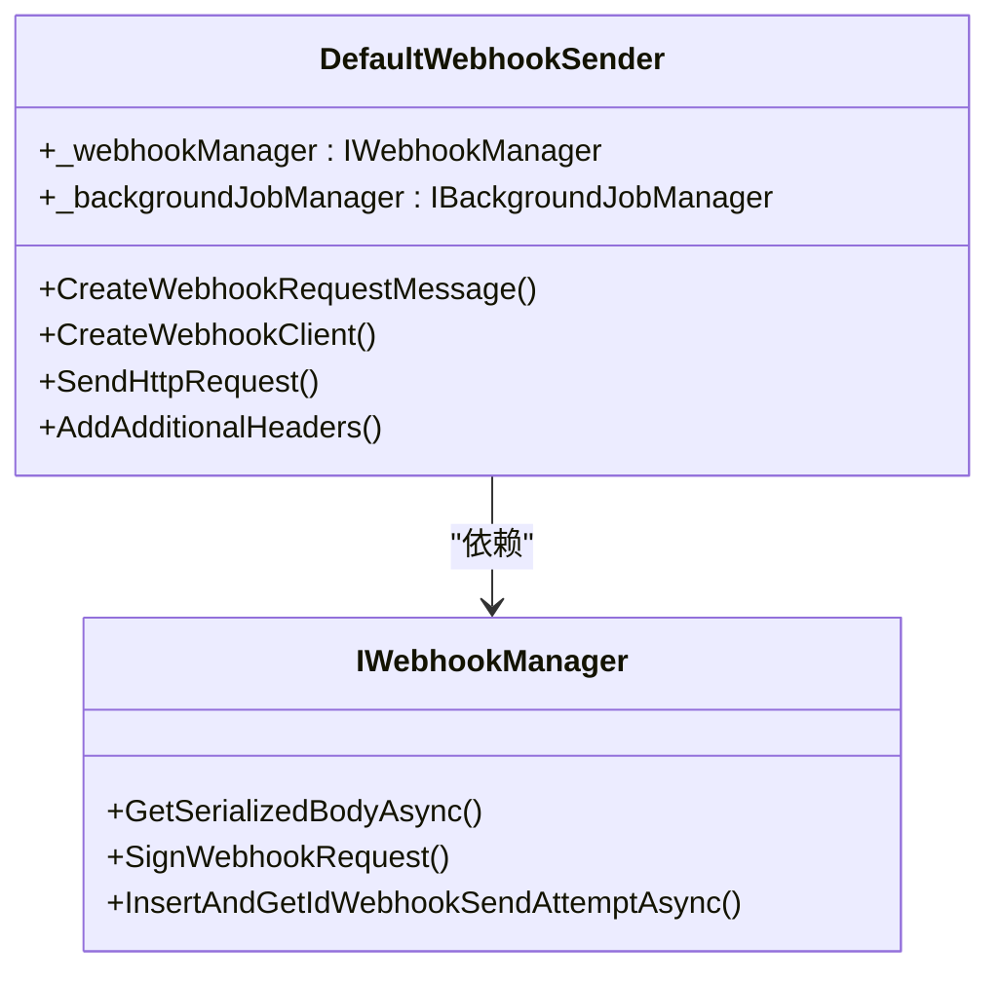
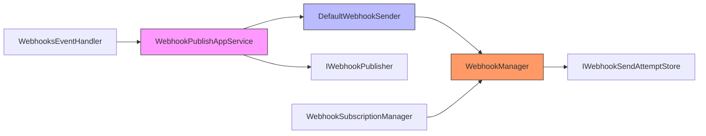

# 安全验证

<cite>
**本文档中引用的文件**
- [WebhookManager.cs](file://aspnet-core/modules/webhooks/LINGYUN.Abp.Webhooks/LINGYUN/Abp/Webhooks/WebhookManager.cs)
- [DefaultWebhookSender.cs](file://aspnet-core/modules/webhooks/LINGYUN.Abp.Webhooks/LINGYUN/Abp/Webhooks/DefaultWebhookSender.cs)
- [IWebhookManager.cs](file://aspnet-core/modules/webhooks/LINGYUN.Abp.Webhooks/LINGYUN/Abp/Webhooks/IWebhookManager.cs)
- [WebhookPublishAppService.cs](file://aspnet-core/modules/webhooks/LINGYUN.Abp.WebhooksManagement.Application/LINGYUN/Abp/WebhooksManagement/WebhookPublishAppService.cs)
- [WebhooksEventHandler.cs](file://aspnet-core/services/LY.MicroService.WebhooksManagement.HttpApi.Host/EventBus/Handlers/WebhooksEventHandler.cs)
</cite>

## 目录
1. [介绍](#介绍)
2. [项目结构](#项目结构)
3. [核心组件](#核心组件)
4. [架构概述](#架构概述)
5. [详细组件分析](#详细组件分析)
6. [依赖分析](#依赖分析)
7. [性能考虑](#性能考虑)
8. [故障排除指南](#故障排除指南)
9. [结论](#结论)

## 介绍
本文档深入探讨了Webhooks安全验证机制，重点分析了HMAC-SHA256签名算法的实现、密钥管理、时间戳验证和防重放攻击策略。文档涵盖了安全配置选项、密钥轮换机制和安全性最佳实践，并提供了实际代码示例展示如何验证传入的Webhook请求签名以及如何配置安全级别。

## 项目结构
本项目采用模块化架构设计，Webhooks相关功能主要分布在多个模块中。核心的Webhooks安全验证逻辑位于`aspnet-core/modules/webhooks`目录下，而具体的实现和服务则分布在不同的服务项目中。

**图源**
- [WebhookManager.cs](file://aspnet-core/modules/webhooks/LINGYUN.Abp.Webhooks/LINGYUN/Abp/Webhooks/WebhookManager.cs)
- [DefaultWebhookSender.cs](file://aspnet-core/modules/webhooks/LINGYUN.Abp.Webhooks/LINGYUN/Abp/Webhooks/DefaultWebhookSender.cs)
- [WebhookPublishAppService.cs](file://aspnet-core/modules/webhooks/LINGYUN.Abp.WebhooksManagement.Application/LINGYUN/Abp/WebhooksManagement/WebhookPublishAppService.cs)

**节源**
- [WebhookManager.cs](file://aspnet-core/modules/webhooks/LINGYUN.Abp.Webhooks/LINGYUN/Abp/Webhooks/WebhookManager.cs)
- [DefaultWebhookSender.cs](file://aspnet-core/modules/webhooks/LINGYUN.Abp.Webhooks/LINGYUN/Abp/Webhooks/DefaultWebhookSender.cs)

## 核心组件
Webhooks安全验证的核心组件包括WebhookManager、DefaultWebhookSender和相关的接口定义。这些组件共同实现了Webhook请求的签名生成和验证机制。

**节源**
- [WebhookManager.cs](file://aspnet-core/modules/webhooks/LINGYUN.Abp.Webhooks/LINGYUN/Abp/Webhooks/WebhookManager.cs)
- [IWebhookManager.cs](file://aspnet-core/modules/webhooks/LINGYUN.Abp.Webhooks/LINGYUN/Abp/Webhooks/IWebhookManager.cs)

## 架构概述
Webhooks安全验证系统采用分层架构设计，从请求接收、签名验证到事件发布形成完整的处理管道。系统通过HMAC-SHA256算法确保消息的完整性和真实性。

**图源**
- [WebhookManager.cs](file://aspnet-core/modules/webhooks/LINGYUN.Abp.Webhooks/LINGYUN/Abp/Webhooks/WebhookManager.cs)
- [DefaultWebhookSender.cs](file://aspnet-core/modules/webhooks/LINGYUN.Abp.Webhooks/LINGYUN/Abp/Webhooks/DefaultWebhookSender.cs)

## 详细组件分析
### WebhookManager 分析
WebhookManager是Webhooks安全验证的核心类，负责签名生成和数据序列化。

#### 签名生成机制

**图源**
- [WebhookManager.cs](file://aspnet-core/modules/webhooks/LINGYUN.Abp.Webhooks/LINGYUN/Abp/Webhooks/WebhookManager.cs)

**节源**
- [WebhookManager.cs](file://aspnet-core/modules/webhooks/LINGYUN.Abp.Webhooks/LINGYUN/Abp/Webhooks/WebhookManager.cs#L0-L70)

### DefaultWebhookSender 分析
DefaultWebhookSender负责实际的Webhook请求发送，集成安全验证逻辑。

#### 请求发送流程

**图源**
- [DefaultWebhookSender.cs](file://aspnet-core/modules/webhooks/LINGYUN.Abp.Webhooks/LINGYUN/Abp/Webhooks/DefaultWebhookSender.cs)
- [IWebhookManager.cs](file://aspnet-core/modules/webhooks/LINGYUN.Abp.Webhooks/LINGYUN/Abp/Webhooks/IWebhookManager.cs)

**节源**
- [DefaultWebhookSender.cs](file://aspnet-core/modules/webhooks/LINGYUN.Abp.Webhooks/LINGYUN/Abp/Webhooks/DefaultWebhookSender.cs#L37-L70)

## 依赖分析
Webhooks安全验证系统与其他组件有明确的依赖关系，确保了系统的模块化和可维护性。

**图源**
- [WebhookPublishAppService.cs](file://aspnet-core/modules/webhooks/LINGYUN.Abp.WebhooksManagement.Application/LINGYUN/Abp/WebhooksManagement/WebhookPublishAppService.cs)
- [DefaultWebhookSender.cs](file://aspnet-core/modules/webhooks/LINGYUN.Abp.Webhooks/LINGYUN/Abp/Webhooks/DefaultWebhookSender.cs)
- [WebhookManager.cs](file://aspnet-core/modules/webhooks/LINGYUN.Abp.Webhooks/LINGYUN/Abp/Webhooks/WebhookManager.cs)

**节源**
- [WebhookPublishAppService.cs](file://aspnet-core/modules/webhooks/LINGYUN.Abp.WebhooksManagement.Application/LINGYUN/Abp/WebhooksManagement/WebhookPublishAppService.cs)
- [WebhooksEventHandler.cs](file://aspnet-core/services/LY.MicroService.WebhooksManagement.HttpApi.Host/EventBus/Handlers/WebhooksEventHandler.cs)

## 性能考虑
Webhooks安全验证机制在保证安全性的同时也考虑了性能优化：
- 使用异步方法避免阻塞主线程
- 将签名计算等CPU密集型操作与网络请求分离
- 通过后台作业队列处理大量Webhook发送任务
- 缓存常用的加密操作以提高效率

## 故障排除指南
当Webhooks安全验证出现问题时，可以参考以下常见问题及解决方案：

**节源**
- [WebhookManager.cs](file://aspnet-core/modules/webhooks/LINGYUN.Abp.Webhooks/LINGYUN/Abp/Webhooks/WebhookManager.cs)
- [DefaultWebhookSender.cs](file://aspnet-core/modules/webhooks/LINGYUN.Abp.Webhooks/LINGYUN/Abp/Webhooks/DefaultWebhookSender.cs)

## 结论
本文档详细分析了Webhooks安全验证机制的实现细节，包括HMAC-SHA256签名算法的应用、密钥管理和防重放攻击策略。系统通过清晰的分层架构和模块化设计，实现了安全可靠的Webhook通信机制，为系统的安全性和稳定性提供了保障。