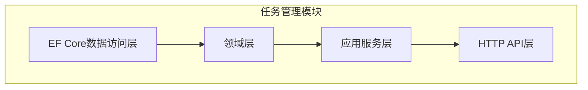
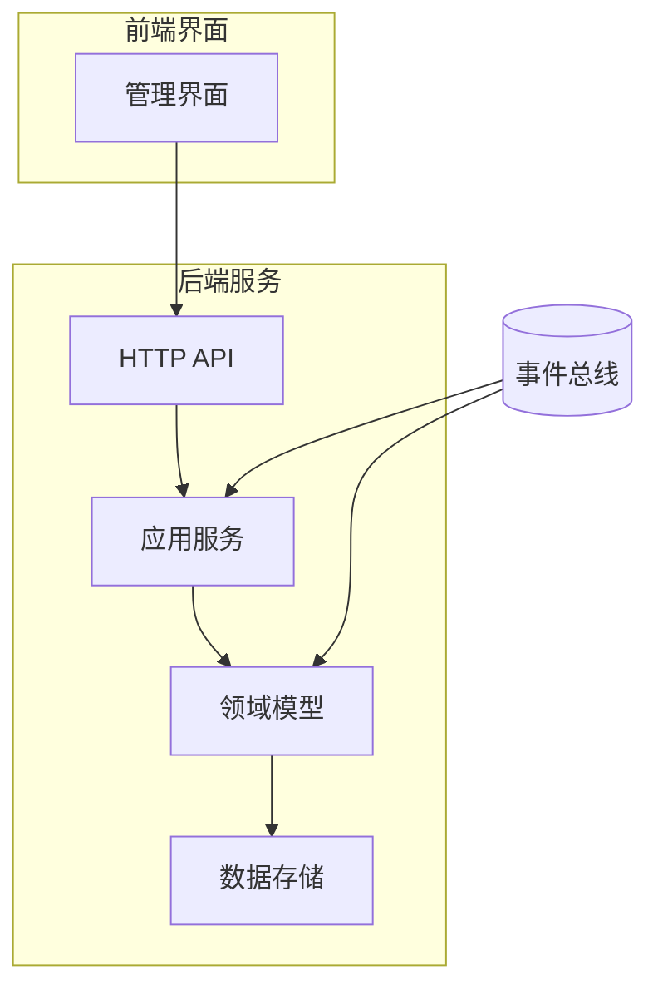
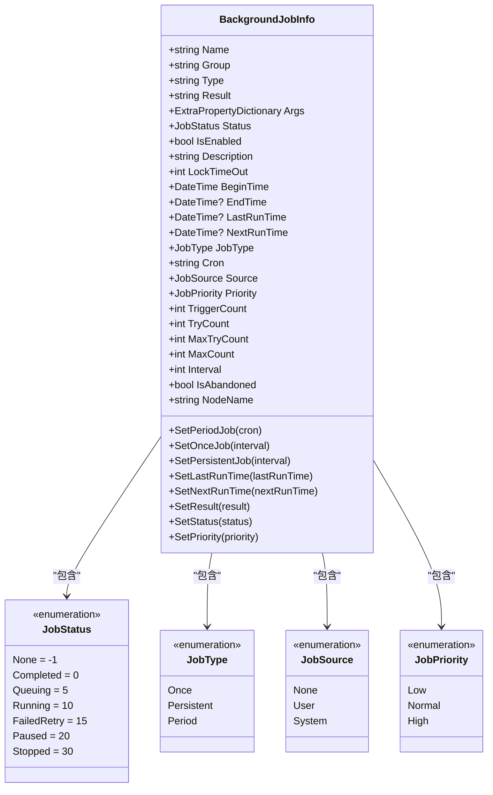
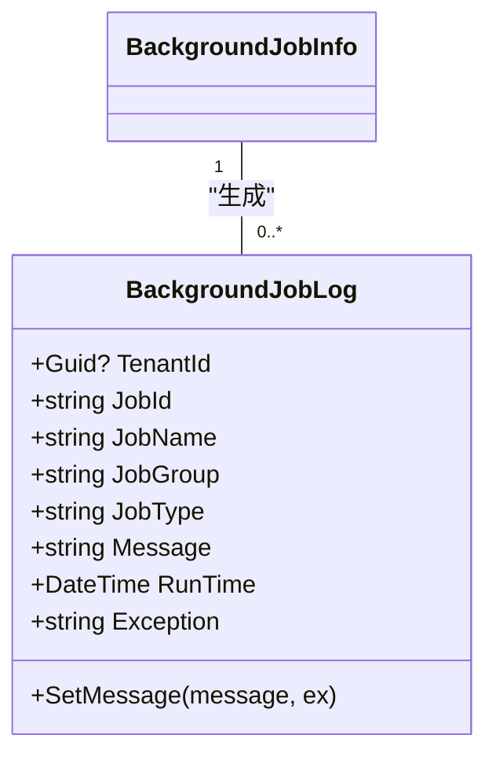
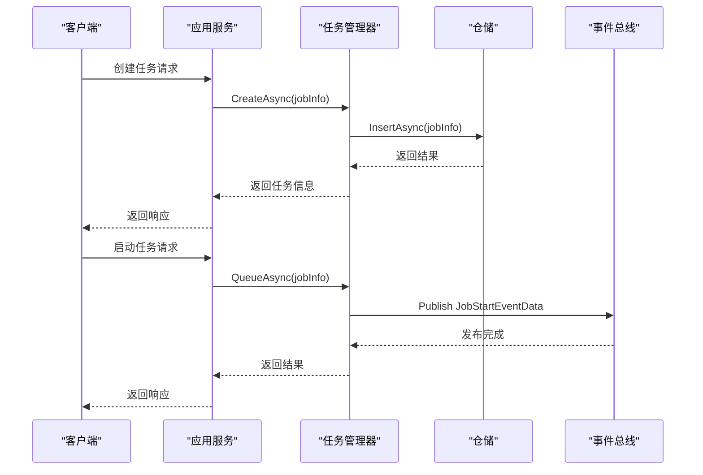
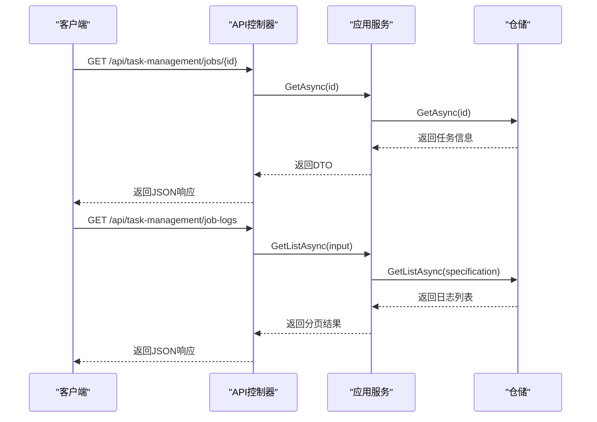
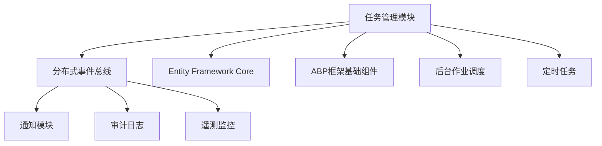

# 任务执行监控

<cite>
**本文档引用的文件**
- [BackgroundJobInfo.cs](file://aspnet-core/modules/task-management/LINGYUN.Abp.TaskManagement.Domain/LINGYUN/Abp/TaskManagement/BackgroundJobInfo.cs)
- [BackgroundJobLog.cs](file://aspnet-core/modules/task-management/LINGYUN.Abp.TaskManagement.Domain/LINGYUN/Abp/TaskManagement/BackgroundJobLog.cs)
- [BackgroundJobManager.cs](file://aspnet-core/modules/task-management/LINGYUN.Abp.TaskManagement.Domain/LINGYUN/Abp/TaskManagement/BackgroundJobManager.cs)
- [BackgroundJobInfoAppService.cs](file://aspnet-core/modules/task-management/LINGYUN.Abp.TaskManagement.Application/LINGYUN/Abp/TaskManagement/BackgroundJobInfoAppService.cs)
- [BackgroundJobLogAppService.cs](file://aspnet-core/modules/task-management/LINGYUN.Abp.TaskManagement.Application/LINGYUN/Abp/TaskManagement/BackgroundJobLogAppService.cs)
- [JobStatus.cs](file://aspnet-core/modules/task-management/LINGYUN.Abp.BackgroundTasks.Abstractions/LINGYUN/Abp/BackgroundTasks/JobStatus.cs)
- [TaskManagementDbContextModelCreatingExtensions.cs](file://aspnet-core/modules/task-management/LINGYUN.Abp.TaskManagement.EntityFrameworkCore/LINGYUN/Abp/TaskManagement/EntityFrameworkCore/TaskManagementDbContextModelCreatingExtensions.cs)
</cite>

## 目录
1. [项目结构](#项目结构)
2. [核心组件](#核心组件)
3. [架构概述](#架构概述)
4. [详细组件分析](#详细组件分析)
5. [依赖分析](#依赖分析)

## 项目结构

该任务执行监控系统是ABP框架中的一个模块，主要位于`aspnet-core/modules/task-management`目录下。系统由多个子模块组成，包括领域层、应用服务层和HTTP API层。

**图示来源**
- [BackgroundJobInfo.cs](file://aspnet-core/modules/task-management/LINGYUN.Abp.TaskManagement.Domain/LINGYUN/Abp/TaskManagement/BackgroundJobInfo.cs)
- [BackgroundJobInfoAppService.cs](file://aspnet-core/modules/task-management/LINGYUN.Abp.TaskManagement.Application/LINGYUN/Abp/TaskManagement/BackgroundJobInfoAppService.cs)

**章节来源**
- [BackgroundJobInfo.cs](file://aspnet-core/modules/task-management/LINGYUN.Abp.TaskManagement.Domain/LINGYUN/Abp/TaskManagement/BackgroundJobInfo.cs)

## 核心组件

任务执行监控系统的核心组件包括任务信息实体（BackgroundJobInfo）、任务日志实体（BackgroundJobLog）、任务管理器（BackgroundJobManager）以及相应的应用服务。这些组件共同实现了任务的创建、执行、监控和日志记录功能。

**章节来源**
- [BackgroundJobInfo.cs](file://aspnet-core/modules/task-management/LINGYUN.Abp.TaskManagement.Domain/LINGYUN/Abp/TaskManagement/BackgroundJobInfo.cs)
- [BackgroundJobLog.cs](file://aspnet-core/modules/task-management/LINGYUN.Abp.TaskManagement.Domain/LINGYUN/Abp/TaskManagement/BackgroundJobLog.cs)

## 架构概述

任务执行监控系统采用分层架构设计，主要包括数据存储层、领域层、应用服务层和API接口层。系统通过事件总线实现各组件间的解耦通信，确保了系统的可扩展性和可维护性。

**图示来源**
- [BackgroundJobManager.cs](file://aspnet-core/modules/task-management/LINGYUN.Abp.TaskManagement.Domain/LINGYUN/Abp/TaskManagement/BackgroundJobManager.cs)
- [BackgroundJobInfoAppService.cs](file://aspnet-core/modules/task-management/LINGYUN.Abp.TaskManagement.Application/LINGYUN/Abp/TaskManagement/BackgroundJobInfoAppService.cs)

## 详细组件分析

### 任务信息实体分析

任务信息实体（BackgroundJobInfo）是任务执行监控的核心数据模型，包含了任务的各种属性和状态信息。

#### 类图

**图示来源**
- [BackgroundJobInfo.cs](file://aspnet-core/modules/task-management/LINGYUN.Abp.TaskManagement.Domain/LINGYUN/Abp/TaskManagement/BackgroundJobInfo.cs)
- [JobStatus.cs](file://aspnet-core/modules/task-management/LINGYUN.Abp.BackgroundTasks.Abstractions/LINGYUN/Abp/BackgroundTasks/JobStatus.cs)

**章节来源**
- [BackgroundJobInfo.cs](file://aspnet-core/modules/task-management/LINGYUN.Abp.TaskManagement.Domain/LINGYUN/Abp/TaskManagement/BackgroundJobInfo.cs)

### 任务日志实体分析

任务日志实体（BackgroundJobLog）用于记录任务执行过程中的详细信息，包括执行时间、消息和异常等。

#### 类图

**图示来源**
- [BackgroundJobLog.cs](file://aspnet-core/modules/task-management/LINGYUN.Abp.TaskManagement.Domain/LINGYUN/Abp/TaskManagement/BackgroundJobLog.cs)
- [BackgroundJobInfo.cs](file://aspnet-core/modules/task-management/LINGYUN.Abp.TaskManagement.Domain/LINGYUN/Abp/TaskManagement/BackgroundJobInfo.cs)

**章节来源**
- [BackgroundJobLog.cs](file://aspnet-core/modules/task-management/LINGYUN.Abp.TaskManagement.Domain/LINGYUN/Abp/TaskManagement/BackgroundJobLog.cs)

### 任务管理器分析

任务管理器（BackgroundJobManager）负责处理任务的生命周期管理，包括创建、更新、删除、启动、暂停等操作。

#### 序列图

**图示来源**
- [BackgroundJobManager.cs](file://aspnet-core/modules/task-management/LINGYUN.Abp.TaskManagement.Domain/LINGYUN/Abp/TaskManagement/BackgroundJobManager.cs)
- [BackgroundJobInfoAppService.cs](file://aspnet-core/modules/task-management/LINGYUN.Abp.TaskManagement.Application/LINGYUN/Abp/TaskManagement/BackgroundJobInfoAppService.cs)

**章节来源**
- [BackgroundJobManager.cs](file://aspnet-core/modules/task-management/LINGYUN.Abp.TaskManagement.Domain/LINGYUN/Abp/TaskManagement/BackgroundJobManager.cs)

### 应用服务分析

应用服务层提供了任务管理和日志查询的API接口，实现了业务逻辑与数据访问的分离。

#### 序列图

**图示来源**
- [BackgroundJobInfoAppService.cs](file://aspnet-core/modules/task-management/LINGYUN.Abp.TaskManagement.Application/LINGYUN/Abp/TaskManagement/BackgroundJobInfoAppService.cs)
- [BackgroundJobLogAppService.cs](file://aspnet-core/modules/task-management/LINGYUN.Abp.TaskManagement.Application/LINGYUN/Abp/TaskManagement/BackgroundJobLogAppService.cs)

**章节来源**
- [BackgroundJobInfoAppService.cs](file://aspnet-core/modules/task-management/LINGYUN.Abp.TaskManagement.Application/LINGYUN/Abp/TaskManagement/BackgroundJobInfoAppService.cs)

## 依赖分析

任务执行监控系统与其他模块存在明确的依赖关系，通过事件总线实现松耦合的通信机制。

**图示来源**
- [BackgroundJobManager.cs](file://aspnet-core/modules/task-management/LINGYUN.Abp.TaskManagement.Domain/LINGYUN/Abp/TaskManagement/BackgroundJobManager.cs)
- [go.mod](file://aspnet-core/modules/task-management/go.mod)

**章节来源**
- [BackgroundJobManager.cs](file://aspnet-core/modules/task-management/LINGYUN.Abp.TaskManagement.Domain/LINGYUN/Abp/TaskManagement/BackgroundJobManager.cs)