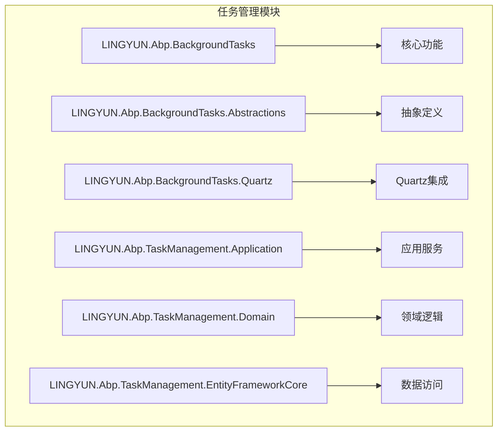
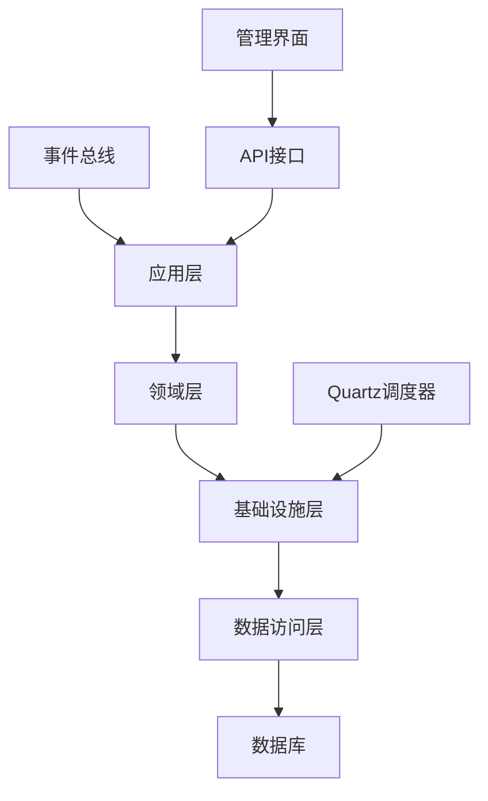
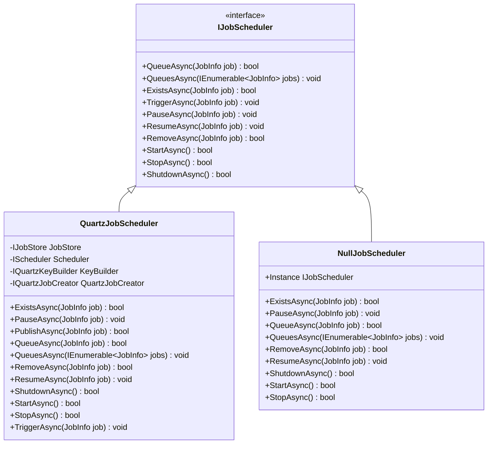
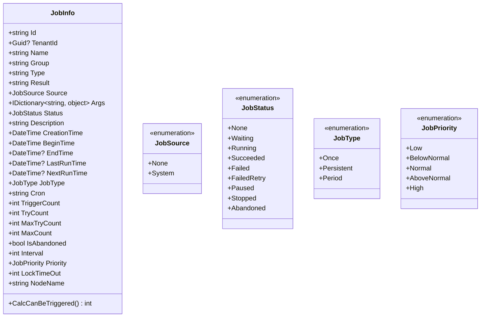

# 任务管理模块

<cite>
**本文档引用的文件**
- [AbpBackgroundTasksModule.cs](file://aspnet-core/modules/task-management/LINGYUN.Abp.BackgroundTasks/LINGYUN/Abp/BackgroundTasks/AbpBackgroundTasksModule.cs)
- [IJobScheduler.cs](file://aspnet-core/modules/task-management/LINGYUN.Abp.BackgroundTasks/LINGYUN/Abp/BackgroundTasks/IJobScheduler.cs)
- [BackgroundJobManager.cs](file://aspnet-core/modules/task-management/LINGYUN.Abp.BackgroundTasks/LINGYUN/Abp/BackgroundTasks/BackgroundJobManager.cs)
- [JobInfo.cs](file://aspnet-core/modules/task-management/LINGYUN.Abp.BackgroundTasks.Abstractions/LINGYUN/Abp/BackgroundTasks/JobInfo.cs)
- [QuartzJobScheduler.cs](file://aspnet-core/modules/task-management/LINGYUN.Abp.BackgroundTasks.Quartz/LINGYUN/Abp/BackgroundTasks/Quartz/QuartzJobScheduler.cs)
- [IQuartzJobCreator.cs](file://aspnet-core/modules/task-management/LINGYUN.Abp.BackgroundTasks.Quartz/LINGYUN/Abp/BackgroundTasks/Quartz/IQuartzJobCreator.cs)
- [BackgroundJobInfoAppService.cs](file://aspnet-core/modules/task-management/LINGYUN.Abp.TaskManagement.Application/LINGYUN/Abp/TaskManagement/BackgroundJobInfoAppService.cs)
- [BackgroundJobSynchronizer.cs](file://aspnet-core/modules/task-management/LINGYUN.Abp.TaskManagement.Domain/LINGYUN/Abp/TaskManagement/BackgroundJobSynchronizer.cs)
- [BackgroundJobManager.cs](file://aspnet-core/modules/task-management/LINGYUN.Abp.TaskManagement.Domain/LINGYUN/Abp/TaskManagement/BackgroundJobManager.cs)
- [TaskManagementJobPublisher.cs](file://aspnet-core/modules/task-management/LINGYUN.Abp.BackgroundTasks.TaskManagement/LINGYUN/Abp/BackgroundTasks/TaskManagement/TaskManagementJobPublisher.cs)
- [BackgroundJobEto.cs](file://aspnet-core/modules/task-management/LINGYUN.Abp.TaskManagement.Domain.Shared/LINGYUN/Abp/TaskManagement/BackgroundJobEto.cs)
</cite>

## 目录
1. [简介](#简介)
2. [项目结构](#项目结构)
3. [核心组件](#核心组件)
4. [架构概述](#架构概述)
5. [详细组件分析](#详细组件分析)
6. [依赖分析](#依赖分析)
7. [性能考虑](#性能考虑)
8. [故障排除指南](#故障排除指南)
9. [结论](#结论)

## 简介
任务管理模块是ABP框架中的一个关键组件，负责后台任务和定时作业的管理。该模块提供了任务的创建、调度、执行监控和日志记录功能。它集成了Quartz调度框架，支持任务的分布式执行和锁机制。模块采用分层架构，定义了多种任务类型，并实现了失败重试策略。此外，它还与事件总线集成，提供了API接口和管理界面功能，使开发者能够轻松地定义、注册和管理后台任务。

## 项目结构
任务管理模块位于`aspnet-core/modules/task-management`目录下，采用模块化设计，包含多个子模块，每个子模块负责不同的功能。主要子模块包括：
- `LINGYUN.Abp.BackgroundTasks`：核心任务管理功能
- `LINGYUN.Abp.BackgroundTasks.Abstractions`：任务管理抽象定义
- `LINGYUN.Abp.BackgroundTasks.Quartz`：Quartz调度框架集成
- `LINGYUN.Abp.TaskManagement.Application`：应用服务层
- `LINGYUN.Abp.TaskManagement.Domain`：领域逻辑层
- `LINGYUN.Abp.TaskManagement.EntityFrameworkCore`：数据访问层



**图示来源**
- [AbpBackgroundTasksModule.cs](file://aspnet-core/modules/task-management/LINGYUN.Abp.BackgroundTasks/LINGYUN/Abp/BackgroundTasks/AbpBackgroundTasksModule.cs)

**本节来源**
- [AbpBackgroundTasksModule.cs](file://aspnet-core/modules/task-management/LINGYUN.Abp.BackgroundTasks/LINGYUN/Abp/BackgroundTasks/AbpBackgroundTasksModule.cs)

## 核心组件
任务管理模块的核心组件包括任务调度器、任务存储、任务发布器和任务执行器。这些组件协同工作，实现了任务的全生命周期管理。

**本节来源**
- [IJobScheduler.cs](file://aspnet-core/modules/task-management/LINGYUN.Abp.BackgroundTasks/LINGYUN/Abp/BackgroundTasks/IJobScheduler.cs)
- [BackgroundJobManager.cs](file://aspnet-core/modules/task-management/LINGYUN.Abp.BackgroundTasks/LINGYUN/Abp/BackgroundTasks/BackgroundJobManager.cs)
- [JobInfo.cs](file://aspnet-core/modules/task-management/LINGYUN.Abp.BackgroundTasks.Abstractions/LINGYUN/Abp/BackgroundTasks/JobInfo.cs)

## 架构概述
任务管理模块采用分层架构，从上到下分为应用层、领域层、基础设施层和数据访问层。各层之间通过接口进行通信，实现了高内聚低耦合的设计原则。



**图示来源**
- [AbpBackgroundTasksModule.cs](file://aspnet-core/modules/task-management/LINGYUN.Abp.BackgroundTasks/LINGYUN/Abp/BackgroundTasks/AbpBackgroundTasksModule.cs)
- [BackgroundJobInfoAppService.cs](file://aspnet-core/modules/task-management/LINGYUN.Abp.TaskManagement.Application/LINGYUN/Abp/TaskManagement/BackgroundJobInfoAppService.cs)

## 详细组件分析

### 任务调度器分析
任务调度器是任务管理模块的核心组件，负责任务的调度和执行。它实现了`IJobScheduler`接口，提供了任务入队、触发、暂停、恢复和移除等操作。



**图示来源**
- [IJobScheduler.cs](file://aspnet-core/modules/task-management/LINGYUN.Abp.BackgroundTasks/LINGYUN/Abp/BackgroundTasks/IJobScheduler.cs)
- [QuartzJobScheduler.cs](file://aspnet-core/modules/task-management/LINGYUN.Abp.BackgroundTasks.Quartz/LINGYUN/Abp/BackgroundTasks/Quartz/QuartzJobScheduler.cs)
- [NullJobScheduler.cs](file://aspnet-core/modules/task-management/LINGYUN.Abp.BackgroundTasks/LINGYUN/Abp/BackgroundTasks/NullJobScheduler.cs)

**本节来源**
- [IJobScheduler.cs](file://aspnet-core/modules/task-management/LINGYUN.Abp.BackgroundTasks/LINGYUN/Abp/BackgroundTasks/IJobScheduler.cs)
- [QuartzJobScheduler.cs](file://aspnet-core/modules/task-management/LINGYUN.Abp.BackgroundTasks.Quartz/LINGYUN/Abp/BackgroundTasks/Quartz/QuartzJobScheduler.cs)

### 任务信息分析
`JobInfo`类是任务的核心数据结构，包含了任务的所有元数据和状态信息。它定义了任务的标识、名称、分组、类型、参数、状态、优先级、执行时间等属性。



**图示来源**
- [JobInfo.cs](file://aspnet-core/modules/task-management/LINGYUN.Abp.BackgroundTasks.Abstractions/LINGYUN/Abp/BackgroundTasks/JobInfo.cs)

**本节来源**
- [JobInfo.cs](file://aspnet-core/modules/task-management/LINGYUN.Abp.BackgroundTasks.Abstractions/LINGYUN/Abp/BackgroundTasks/JobInfo.cs)

### 应用服务分析
`BackgroundJobInfoAppService`是任务管理模块的应用服务，提供了RESTful API接口，用于管理后台任务。它实现了`IBackgroundJobInfoAppService`接口，提供了任务的创建、读取、更新、删除和批量操作功能。

```mermaid
sequenceDiagram
    participant Client as "客户端"
    participant AppService as "BackgroundJobInfoAppService"
    participant DomainService as "BackgroundJobManager"
    participant Repository as "BackgroundJobInfoRepository"
    participant Scheduler as "QuartzJobScheduler"
    
    Client->>AppService: CreateAsync(input)
    AppService->>Repository: CheckNameAsync()
    Repository-->>AppService: bool
    AppService->>DomainService: CreateAsync()
    DomainService->>Repository