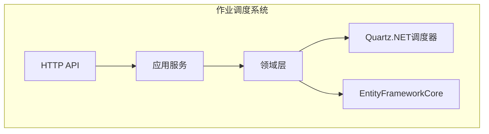
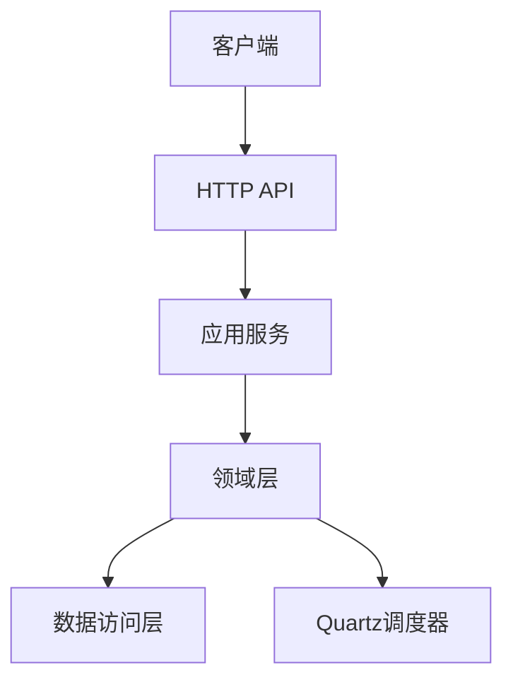
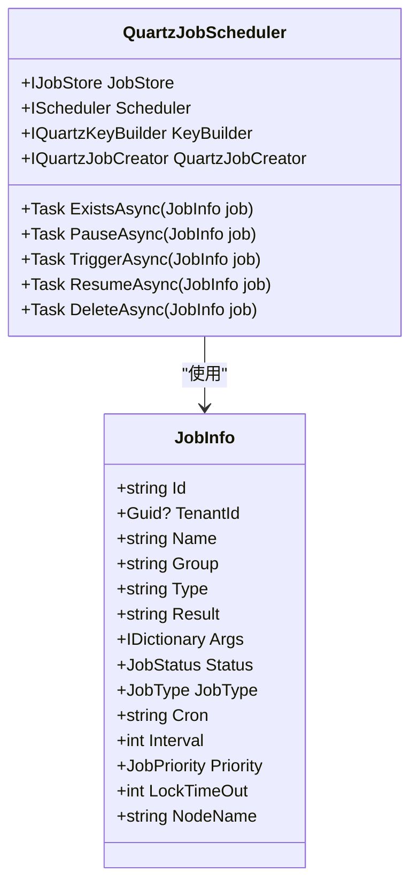
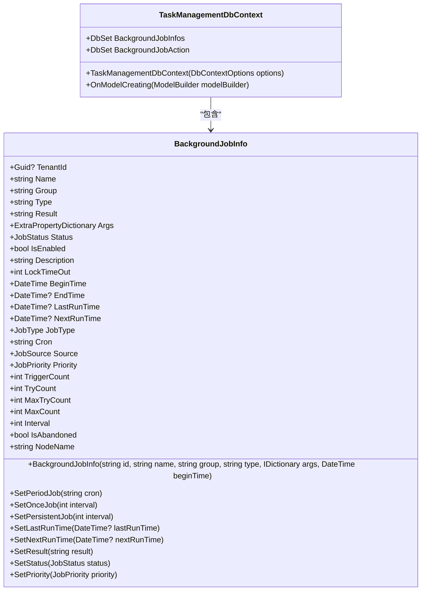
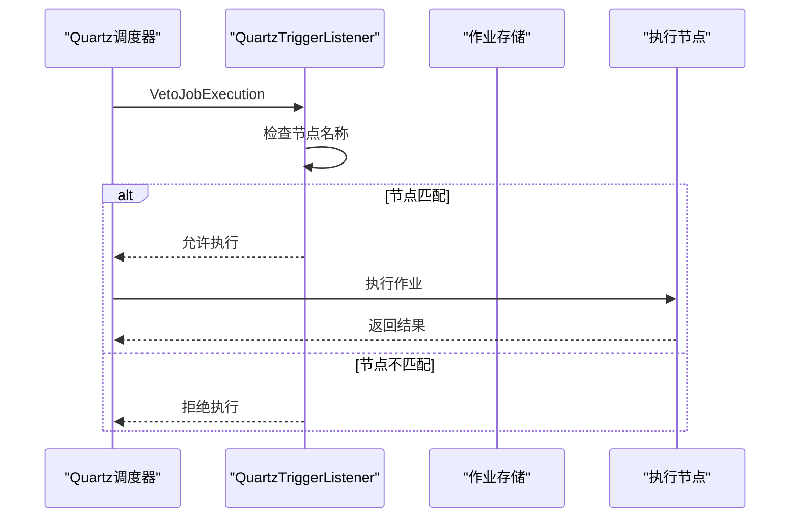
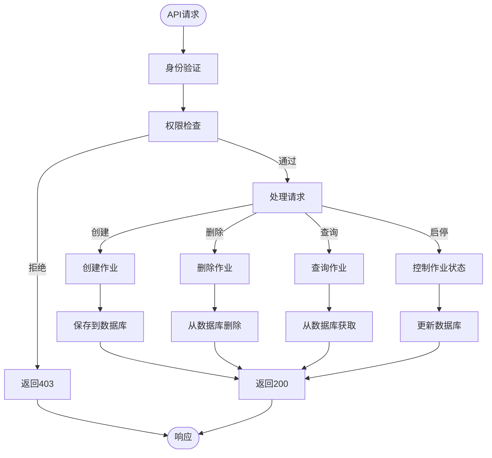
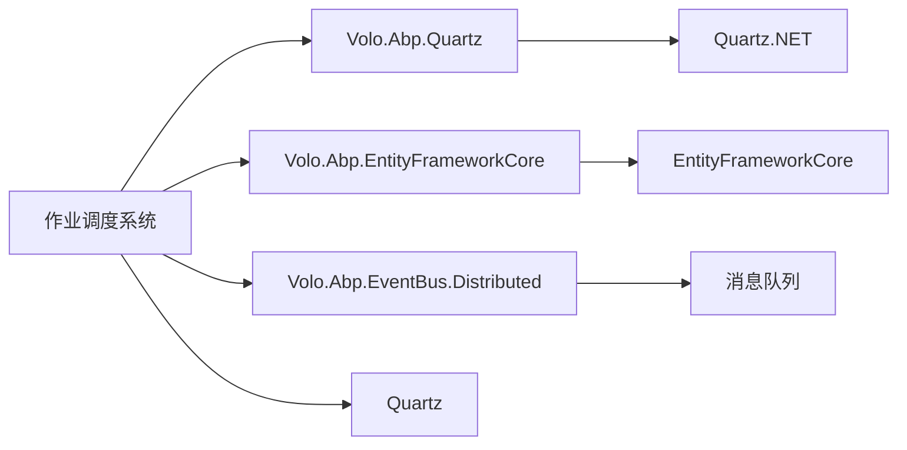

# 作业调度

<cite>
**本文档中引用的文件**  
- [QuartzJobScheduler.cs](file://aspnet-core/modules/task-management/LINGYUN.Abp.BackgroundTasks.Quartz/LINGYUN/Abp/BackgroundTasks/Quartz/QuartzJobScheduler.cs)
- [BackgroundJobInfo.cs](file://aspnet-core/modules/task-management/LINGYUN.Abp.TaskManagement.Domain/LINGYUN/Abp/TaskManagement/BackgroundJobInfo.cs)
- [TaskManagementDbContext.cs](file://aspnet-core/modules/task-management/LINGYUN.Abp.TaskManagement.EntityFrameworkCore/LINGYUN/Abp/TaskManagement/EntityFrameworkCore/TaskManagementDbContext.cs)
- [AbpBackgroundTasksOptions.cs](file://aspnet-core/modules/task-management/LINGYUN.Abp.BackgroundTasks.Abstractions/LINGYUN/Abp/BackgroundTasks/AbpBackgroundTasksOptions.cs)
- [BackgroundJobInfoAppService.cs](file://aspnet-core/modules/task-management/LINGYUN.Abp.TaskManagement.Application/LINGYUN/Abp/TaskManagement/BackgroundJobInfoAppService.cs)
- [BackgroundJobManager.cs](file://aspnet-core/modules/task-management/LINGYUN.Abp.TaskManagement.Domain/LINGYUN/Abp/TaskManagement/BackgroundJobManager.cs)
- [BackgroundJobInfoController.cs](file://aspnet-core/modules/task-management/LINGYUN.Abp.TaskManagement.HttpApi/LINGYUN/Abp/TaskManagement/BackgroundJobInfoController.cs)
- [JobInfo.cs](file://aspnet-core/modules/task-management/LINGYUN.Abp.BackgroundTasks.Abstractions/LINGYUN/Abp/BackgroundTasks/JobInfo.cs)
- [QuartzJobListener.cs](file://aspnet-core/modules/task-management/LINGYUN.Abp.BackgroundTasks.Quartz/LINGYUN/Abp/BackgroundTasks/Quartz/QuartzJobListener.cs)
- [QuartzTriggerListener.cs](file://aspnet-core/modules/task-management/LINGYUN.Abp.BackgroundTasks.Quartz/LINGYUN/Abp/BackgroundTasks/Quartz/QuartzTriggerListener.cs)
</cite>

## 目录
1. [简介](#简介)
2. [项目结构](#项目结构)
3. [核心组件](#核心组件)
4. [架构概述](#架构概述)
5. [详细组件分析](#详细组件分析)
6. [依赖分析](#依赖分析)
7. [性能考虑](#性能考虑)
8. [故障排除指南](#故障排除指南)
9. [结论](#结论)

## 简介
本项目是一个基于Quartz.NET的作业调度系统，集成在ABP框架中，提供完整的后台任务管理功能。系统支持作业的创建、调度、执行监控和持久化存储，适用于分布式环境下的任务协调。通过EntityFrameworkCore实现作业信息的数据库存储，并提供API接口进行作业状态的实时监控和管理。

## 项目结构
作业调度系统主要位于`aspnet-core/modules/task-management`目录下，包含多个子模块：
- `LINGYUN.Abp.BackgroundTasks.Quartz`：基于Quartz.NET的作业调度实现
- `LINGYUN.Abp.TaskManagement.Domain`：领域模型和业务逻辑
- `LINGYUN.Abp.TaskManagement.EntityFrameworkCore`：实体框架核心实现
- `LINGYUN.Abp.TaskManagement.Application`：应用服务
- `LINGYUN.Abp.TaskManagement.HttpApi`：HTTP API接口

**图源**
- [QuartzJobScheduler.cs](file://aspnet-core/modules/task-management/LINGYUN.Abp.BackgroundTasks.Quartz/LINGYUN/Abp/BackgroundTasks/Quartz/QuartzJobScheduler.cs)
- [BackgroundJobInfo.cs](file://aspnet-core/modules/task-management/LINGYUN.Abp.TaskManagement.Domain/LINGYUN/Abp/TaskManagement/BackgroundJobInfo.cs)
- [TaskManagementDbContext.cs](file://aspnet-core/modules/task-management/LINGYUN.Abp.TaskManagement.EntityFrameworkCore/LINGYUN/Abp/TaskManagement/EntityFrameworkCore/TaskManagementDbContext.cs)

**节源**
- [QuartzJobScheduler.cs](file://aspnet-core/modules/task-management/LINGYUN.Abp.BackgroundTasks.Quartz/LINGYUN/Abp/BackgroundTasks/Quartz/QuartzJobScheduler.cs)
- [BackgroundJobInfo.cs](file://aspnet-core/modules/task-management/LINGYUN.Abp.TaskManagement.Domain/LINGYUN/Abp/TaskManagement/BackgroundJobInfo.cs)

## 核心组件
系统的核心组件包括作业调度器、作业信息实体、数据库上下文和配置选项。作业调度基于Quartz.NET实现，通过`QuartzJobScheduler`类提供作业的创建、暂停、触发等操作。作业信息通过`BackgroundJobInfo`实体类表示，包含作业名称、分组、类型、Cron表达式等属性。系统使用EntityFrameworkCore进行数据持久化，通过`TaskManagementDbContext`管理数据库连接和实体映射。

**节源**
- [QuartzJobScheduler.cs](file://aspnet-core/modules/task-management/LINGYUN.Abp.BackgroundTasks.Quartz/LINGYUN/Abp/BackgroundTasks/Quartz/QuartzJobScheduler.cs)
- [BackgroundJobInfo.cs](file://aspnet-core/modules/task-management/LINGYUN.Abp.TaskManagement.Domain/LINGYUN/Abp/TaskManagement/BackgroundJobInfo.cs)
- [TaskManagementDbContext.cs](file://aspnet-core/modules/task-management/LINGYUN.Abp.TaskManagement.EntityFrameworkCore/LINGYUN/Abp/TaskManagement/EntityFrameworkCore/TaskManagementDbContext.cs)
- [AbpBackgroundTasksOptions.cs](file://aspnet-core/modules/task-management/LINGYUN.Abp.BackgroundTasks.Abstractions/LINGYUN/Abp/BackgroundTasks/AbpBackgroundTasksOptions.cs)

## 架构概述
系统采用分层架构，从上到下分为HTTP API层、应用服务层、领域层和数据访问层。HTTP API层提供RESTful接口，应用服务层处理业务逻辑，领域层包含核心业务规则和实体，数据访问层负责与数据库交互。作业调度通过Quartz.NET实现，结合ABP框架的事件总线机制，在作业状态变化时发布相应事件。

**图源**
- [BackgroundJobInfoController.cs](file://aspnet-core/modules/task-management/LINGYUN.Abp.TaskManagement.HttpApi/LINGYUN/Abp/TaskManagement/BackgroundJobInfoController.cs)
- [BackgroundJobInfoAppService.cs](file://aspnet-core/modules/task-management/LINGYUN.Abp.TaskManagement.Application/LINGYUN/Abp/TaskManagement/BackgroundJobInfoAppService.cs)
- [BackgroundJobManager.cs](file://aspnet-core/modules/task-management/LINGYUN.Abp.TaskManagement.Domain/LINGYUN/Abp/TaskManagement/BackgroundJobManager.cs)
- [QuartzJobScheduler.cs](file://aspnet-core/modules/task-management/LINGYUN.Abp.BackgroundTasks.Quartz/LINGYUN/Abp/BackgroundTasks/Quartz/QuartzJobScheduler.cs)

## 详细组件分析

### 作业调度机制分析
系统基于Quartz.NET实现作业调度，通过`QuartzJobScheduler`类提供作业的创建、暂停、触发等操作。作业信息通过`JobInfo`对象传递，包含作业名称、分组、类型、Cron表达式等属性。调度器通过`IScheduler`接口与Quartz.NET交互，实现作业的生命周期管理。

**图源**
- [QuartzJobScheduler.cs](file://aspnet-core/modules/task-management/LINGYUN.Abp.BackgroundTasks.Quartz/LINGYUN/Abp/BackgroundTasks/Quartz/QuartzJobScheduler.cs)
- [JobInfo.cs](file://aspnet-core/modules/task-management/LINGYUN.Abp.BackgroundTasks.Abstractions/LINGYUN/Abp/BackgroundTasks/JobInfo.cs)

**节源**
- [QuartzJobScheduler.cs](file://aspnet-core/modules/task-management/LINGYUN.Abp.BackgroundTasks.Quartz/LINGYUN/Abp/BackgroundTasks/Quartz/QuartzJobScheduler.cs)
- [JobInfo.cs](file://aspnet-core/modules/task-management/LINGYUN.Abp.BackgroundTasks.Abstractions/LINGYUN/Abp/BackgroundTasks/JobInfo.cs)

### 作业持久化存储分析
作业信息通过EntityFrameworkCore持久化到数据库，主要实体为`BackgroundJobInfo`。该实体继承自`AuditedAggregateRoot<string>`，包含作业的完整信息，如名称、分组、类型、状态、执行时间等。系统通过`TaskManagementDbContext`管理数据库连接和实体映射。

**图源**
- [BackgroundJobInfo.cs](file://aspnet-core/modules/task-management/LINGYUN.Abp.TaskManagement.Domain/LINGYUN/Abp/TaskManagement/BackgroundJobInfo.cs)
- [TaskManagementDbContext.cs](file://aspnet-core/modules/task-management/LINGYUN.Abp.TaskManagement.EntityFrameworkCore/LINGYUN/Abp/TaskManagement/EntityFrameworkCore/TaskManagementDbContext.cs)

**节源**
- [BackgroundJobInfo.cs](file://aspnet-core/modules/task-management/LINGYUN.Abp.TaskManagement.Domain/LINGYUN/Abp/TaskManagement/BackgroundJobInfo.cs)
- [TaskManagementDbContext.cs](file://aspnet-core/modules/task-management/LINGYUN.Abp.TaskManagement.EntityFrameworkCore/LINGYUN/Abp/TaskManagement/EntityFrameworkCore/TaskManagementDbContext.cs)

### 分布式协调机制分析
在分布式环境下，系统通过作业锁和故障转移策略实现作业调度的协调。`QuartzTriggerListener`监听器在触发作业前检查节点名称，确保作业在指定节点执行。系统还提供了作业清理、轮询和检查功能，通过Cron表达式配置执行频率。

**图源**
- [QuartzTriggerListener.cs](file://aspnet-core/modules/task-management/LINGYUN.Abp.BackgroundTasks.Quartz/LINGYUN/Abp/BackgroundTasks/Quartz/QuartzTriggerListener.cs)
- [QuartzJobScheduler.cs](file://aspnet-core/modules/task-management/LINGYUN.Abp.BackgroundTasks.Quartz/LINGYUN/Abp/BackgroundTasks/Quartz/QuartzJobScheduler.cs)

**节源**
- [QuartzTriggerListener.cs](file://aspnet-core/modules/task-management/LINGYUN.Abp.BackgroundTasks.Quartz/LINGYUN/Abp/BackgroundTasks/Quartz/QuartzTriggerListener.cs)
- [AbpBackgroundTasksOptions.cs](file://aspnet-core/modules/task-management/LINGYUN.Abp.BackgroundTasks.Abstractions/LINGYUN/Abp/BackgroundTasks/AbpBackgroundTasksOptions.cs)

### API接口分析
系统提供RESTful API接口，通过`BackgroundJobInfoController`类暴露作业管理功能。接口支持作业的创建、删除、查询、启停、触发等操作，并通过ABP框架的授权机制控制访问权限。

**图源**
- [BackgroundJobInfoController.cs](file://aspnet-core/modules/task-management/LINGYUN.Abp.TaskManagement.HttpApi/LINGYUN/Abp/TaskManagement/BackgroundJobInfoController.cs)
- [BackgroundJobInfoAppService.cs](file://aspnet-core/modules/task-management/LINGYUN.Abp.TaskManagement.Application/LINGYUN/Abp/TaskManagement/BackgroundJobInfoAppService.cs)

**节源**
- [BackgroundJobInfoController.cs](file://aspnet-core/modules/task-management/LINGYUN.Abp.TaskManagement.HttpApi/LINGYUN/Abp/TaskManagement/BackgroundJobInfoController.cs)
- [BackgroundJobInfoAppService.cs](file://aspnet-core/modules/task-management/LINGYUN.Abp.TaskManagement.Application/LINGYUN/Abp/TaskManagement/BackgroundJobInfoAppService.cs)

## 依赖分析
系统依赖于多个ABP框架模块和第三方库，主要依赖包括：
- `Volo.Abp.Quartz`：Quartz.NET集成
- `Volo.Abp.EntityFrameworkCore`：实体框架核心
- `Volo.Abp.EventBus.Distributed`：分布式事件总线
- `Quartz`：作业调度引擎

**图源**
- [AbpBackgroundTasksQuartzModule.cs](file://aspnet-core/modules/task-management/LINGYUN.Abp.BackgroundTasks.Quartz/LINGYUN/Abp/BackgroundTasks/Quartz/AbpBackgroundTasksQuartzModule.cs)
- [TaskManagementEntityFrameworkCoreModule.cs](file://aspnet-core/modules/task-management/LINGYUN.Abp.TaskManagement.EntityFrameworkCore/LINGYUN/Abp/TaskManagement/EntityFrameworkCore/TaskManagementEntityFrameworkCoreModule.cs)

**节源**
- [AbpBackgroundTasksQuartzModule.cs](file://aspnet-core/modules/task-management/LINGYUN.Abp.BackgroundTasks.Quartz/LINGYUN/Abp/BackgroundTasks/Quartz/AbpBackgroundTasksQuartzModule.cs)
- [TaskManagementEntityFrameworkCoreModule.cs](file://aspnet-core/modules/task-management/LINGYUN.Abp.TaskManagement.EntityFrameworkCore/LINGYUN/Abp/TaskManagement/EntityFrameworkCore/TaskManagementEntityFrameworkCoreModule.cs)

## 性能考虑
系统在设计时考虑了性能优化，主要体现在：
1. 使用批量操作减少数据库交互次数
2. 通过Cron表达式合理配置作业执行频率
3. 作业参数最小化，仅存储关键信息
4. 使用分布式锁避免重复执行
5. 异步处理提高响应速度

建议根据实际负载调整以下配置：
- `JobFetchCronExpression`：轮询任务的频率
- `MaxJobFetchCount`：每次轮询的任务数量
- `JobCleanCronExpression`：清理过期任务的频率
- `MaxJobCleanCount`：每次清理的任务数量

## 故障排除指南
常见问题及解决方案：

1. **作业未执行**
   - 检查作业的`NextRunTime`是否正确
   - 确认作业状态为`Queuing`或`Running`
   - 检查节点名称配置是否正确
   - 查看日志是否有异常信息

2. **作业重复执行**
   - 检查`QuartzTriggerListener`的节点名称匹配逻辑
   - 确