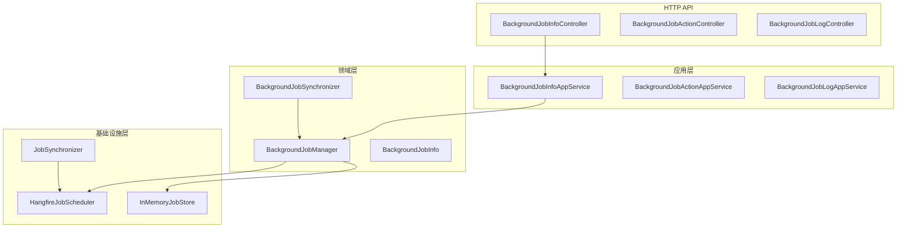

# 后台任务

<cite>
**本文档引用的文件**  
- [BackgroundJobInfoAppService.cs](file://aspnet-core/modules/task-management/LINGYUN.Abp.TaskManagement.Application/LINGYUN/Abp/TaskManagement/BackgroundJobInfoAppService.cs)
- [BackgroundJobManager.cs](file://aspnet-core/modules/task-management/LINGYUN.Abp.TaskManagement.Domain/LINGYUN/Abp/TaskManagement/BackgroundJobManager.cs)
- [JobInfo.cs](file://aspnet-core/modules/task-management/LINGYUN.Abp.BackgroundTasks.Abstractions/LINGYUN/Abp/BackgroundTasks/JobInfo.cs)
- [IJobScheduler.cs](file://aspnet-core/modules/task-management/LINGYUN.Abp.BackgroundTasks/LINGYUN/Abp/BackgroundTasks/IJobScheduler.cs)
- [IJobStore.cs](file://aspnet-core/modules/task-management/LINGYUN.Abp.BackgroundTasks/LINGYUN/Abp/BackgroundTasks/IJobStore.cs)
- [HangfireJobScheduler.cs](file://aspnet-core/modules/task-management/LINGYUN.Abp.BackgroundTasks.Hangfire/LINGYUN/Abp/BackgroundTasks/Hangfire/HangfireJobScheduler.cs)
- [JobSynchronizer.cs](file://aspnet-core/modules/task-management/LINGYUN.Abp.BackgroundTasks.EventBus/LINGYUN/Abp/BackgroundTasks/EventBus/JobSynchronizer.cs)
- [BackgroundJobInfoController.cs](file://aspnet-core/modules/task-management/LINGYUN.Abp.TaskManagement.HttpApi/LINGYUN/Abp/TaskManagement/BackgroundJobInfoController.cs)
- [AbpBackgroundTasksOptions.cs](file://aspnet-core/modules/task-management/LINGYUN.Abp.BackgroundTasks.Abstractions/LINGYUN/Abp/BackgroundTasks/AbpBackgroundTasksOptions.cs)
- [BackgroundJobSynchronizer.cs](file://aspnet-core/modules/task-management/LINGYUN.Abp.TaskManagement.Domain/LINGYUN/Abp/TaskManagement/BackgroundJobSynchronizer.cs)
</cite>

## 目录
1. [引言](#引言)
2. [项目结构](#项目结构)
3. [核心组件](#核心组件)
4. [架构概述](#架构概述)
5. [详细组件分析](#详细组件分析)
6. [依赖分析](#依赖分析)
7. [性能考虑](#性能考虑)
8. [故障排除指南](#故障排除指南)
9. [结论](#结论)
10. [附录](#附录)（如有必要）

## 引言
本文档详细介绍了后台任务机制的设计与实现。该机制基于ABP框架构建，采用分层架构设计，支持任务的定义、注册、执行、监控和管理。系统通过Hangfire作为底层调度引擎，结合分布式事件总线实现跨节点任务同步，提供了完整的后台任务生命周期管理功能。

## 项目结构
后台任务相关模块分布在多个目录中，形成了清晰的分层架构：

**图源**  
- [BackgroundJobInfoAppService.cs](file://aspnet-core/modules/task-management/LINGYUN.Abp.TaskManagement.Application/LINGYUN/Abp/TaskManagement/BackgroundJobInfoAppService.cs)
- [BackgroundJobManager.cs](file://aspnet-core/modules/task-management/LINGYUN.Abp.TaskManagement.Domain/LINGYUN/Abp/TaskManagement/BackgroundJobManager.cs)
- [HangfireJobScheduler.cs](file://aspnet-core/modules/task-management/LINGYUN.Abp.BackgroundTasks.Hangfire/LINGYUN/Abp/BackgroundTasks/Hangfire/HangfireJobScheduler.cs)
- [JobSynchronizer.cs](file://aspnet-core/modules/task-management/LINGYUN.Abp.BackgroundTasks.EventBus/LINGYUN/Abp/BackgroundTasks/EventBus/JobSynchronizer.cs)
- [BackgroundJobInfoController.cs](file://aspnet-core/modules/task-management/LINGYUN.Abp.TaskManagement.HttpApi/LINGYUN/Abp/TaskManagement/BackgroundJobInfoController.cs)

**本节来源**  
- [BackgroundJobInfoAppService.cs](file://aspnet-core