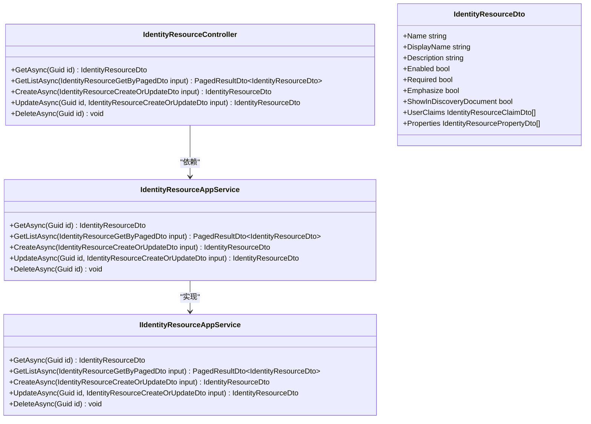
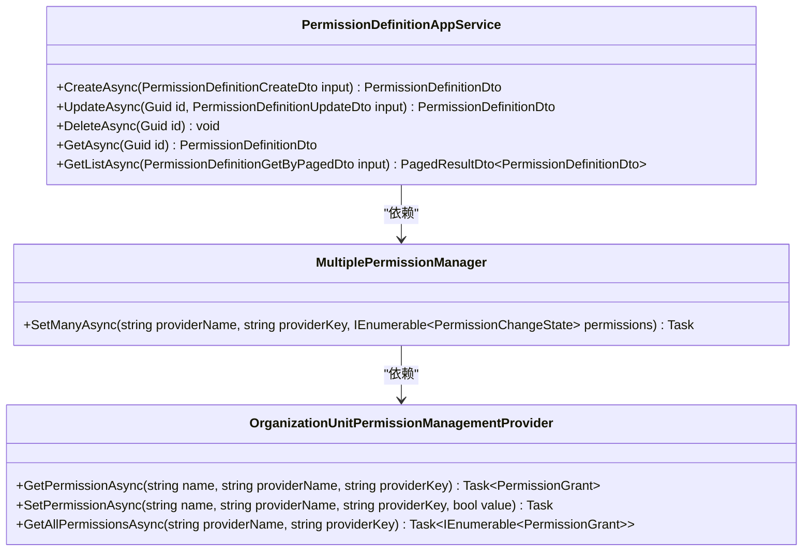
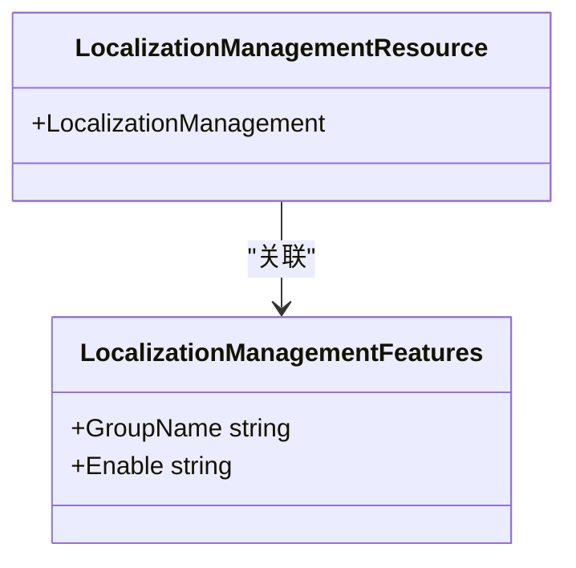
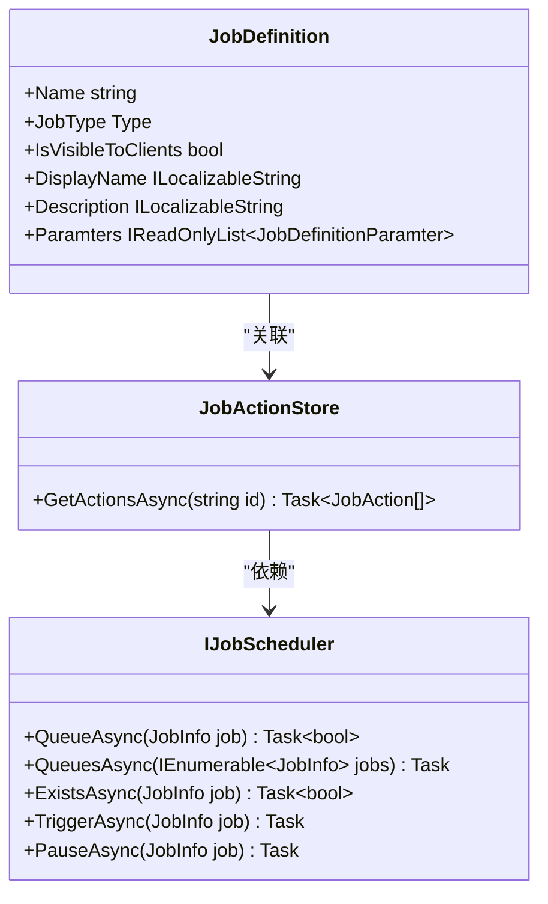
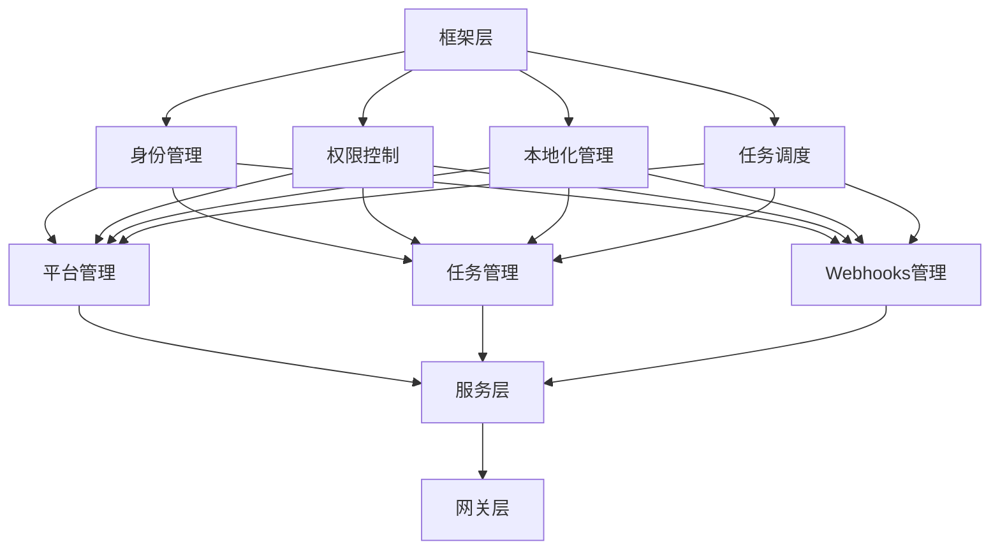
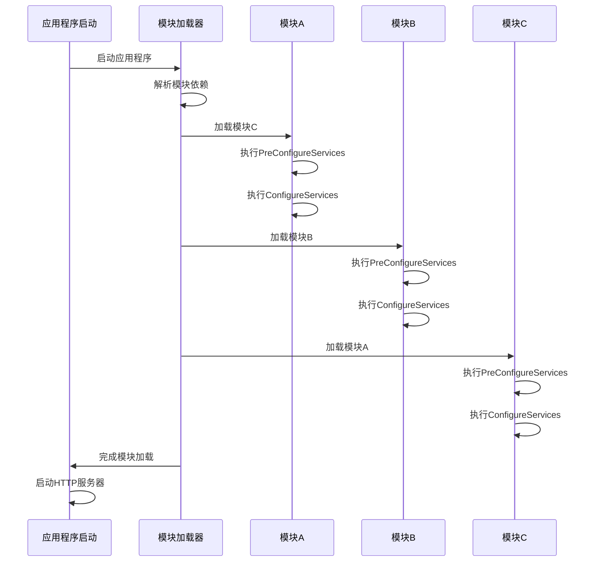

# 功能模块

<cite>
**本文档中引用的文件**  
- [IdentityResourceAppService.cs](file://aspnet-core/modules/identityServer/LINGYUN.Abp.IdentityServer.Application/LINGYUN/Abp/IdentityServer/IdentityResources/IdentityResourceAppService.cs)
- [IdentityResourceController.cs](file://aspnet-core/modules/identityServer/LINGYUN.Abp.IdentityServer.HttpApi/LINGYUN/Abp/IdentityServer/IdentityResources/IdentityResourceController.cs)
- [IIdentityResourceAppService.cs](file://aspnet-core/modules/identityServer/LINGYUN.Abp.IdentityServer.Application.Contracts/LINGYUN/Abp/IdentityServer/IdentityResources/IIdentityResourceAppService.cs)
- [IdentityResourceDto.cs](file://aspnet-core/modules/identityServer/LINGYUN.Abp.IdentityServer.Application.Contracts/LINGYUN/Abp/IdentityServer/IdentityResources/Dto/IdentityResourceDto.cs)
- [MultiplePermissionManager.cs](file://aspnet-core/modules/permissions-management/LINGYUN.Abp.PermissionManagement.Application/LINGYUN/Abp/PermissionManagement/MultiplePermissionManager.cs)
- [OrganizationUnitPermissionManagementProvider.cs](file://aspnet-core/modules/permissions-management/LINGYUN.Abp.PermissionManagement.Domain.OrganizationUnits/LINGYUN/Abp/PermissionManagement/OrganizationUnits/OrganizationUnitPermissionManagementProvider.cs)
- [PermissionDefinitionAppService.cs](file://aspnet-core/modules/permissions-management/LINGYUN.Abp.PermissionManagement.Application/LINGYUN/Abp/PermissionManagement/Definitions/PermissionDefinitionAppService.cs)
- [LocalizationManagementResource.cs](file://aspnet-core/modules/localization-management/LINGYUN.Abp.LocalizationManagement.Domain.Shared/LINGYUN/Abp/LocalizationManagement/Localization/LocalizationManagementResource.cs)
- [LocalizationManagementFeatures.cs](file://aspnet-core/modules/localization-management/LINGYUN.Abp.LocalizationManagement.Domain.Shared/LINGYUN/Abp/LocalizationManagement/Features/LocalizationManagementFeatures.cs)
- [JobDefinition.cs](file://aspnet-core/modules/task-management/LINGYUN.Abp.BackgroundTasks.Abstractions/LINGYUN/Abp/BackgroundTasks/JobDefinition.cs)
- [IJobScheduler.cs](file://aspnet-core/modules/task-management/LINGYUN.Abp.BackgroundTasks/LINGYUN/Abp/BackgroundTasks/IJobScheduler.cs)
- [JobActionStore.cs](file://aspnet-core/modules/task-management/LINGYUN.Abp.TaskManagement.Domain/LINGYUN/Abp/TaskManagement/JobActionStore.cs)
- [VueVbenAdminSettingDefinitionProvider.cs](file://aspnet-core/modules/platform/LINGYUN.Platform.Settings.VueVbenAdmin/LINGYUN/Platform/Settings/VueVbenAdmin/VueVbenAdminSettingDefinitionProvider.cs)
- [AbpUINavigationVueVbenAdminNavigationDefinitionProvider.cs](file://aspnet-core/modules/platform/LINGYUN.Abp.UI.Navigation.VueVbenAdmin/LINGYUN/Abp/UI/Navigation/VueVbenAdmin/AbpUINavigationVueVbenAdminNavigationDefinitionProvider.cs)
</cite>

## 目录

1. [引言](#引言)
2. [项目结构](#项目结构)
3. [核心功能模块](#核心功能模块)
4. [模块分层架构](#模块分层架构)
5. [模块依赖关系](#模块依赖关系)
6. [模块注册与加载机制](#模块注册与加载机制)
7. [模块开发规范](#模块开发规范)
8. [结论](#结论)

## 引言

本项目是一个基于ABP框架的微服务管理平台，提供了身份管理、权限控制、本地化管理、任务调度等核心业务功能。系统采用模块化设计，每个功能模块都遵循统一的分层架构，包括Application、Domain、EntityFrameworkCore、HttpApi等层次。本文档将深入分析这些核心功能模块的设计与实现，为开发者提供详细的开发规范和指导。

## 项目结构

项目采用微服务架构，主要分为框架层、迁移层、模块层、服务层和网关层。模块层包含了各个独立的功能模块，如身份管理、权限管理、本地化管理、任务调度等。每个模块都遵循相同的分层结构，确保代码的一致性和可维护性。

**图示来源**
- [项目结构](file://aspnet-core/modules/)

## 核心功能模块

### 身份管理模块

身份管理模块负责用户、角色、身份标识和组织机构的管理。通过IdentityResourceAppService提供身份资源的增删改查功能，支持分页查询和权限验证。

**图示来源**
- [IdentityResourceAppService.cs](file://aspnet-core/modules/identityServer/LINGYUN.Abp.IdentityServer.Application/LINGYUN/Abp/IdentityServer/IdentityResources/IdentityResourceAppService.cs)
- [IdentityResourceController.cs](file://aspnet-core/modules/identityServer/LINGYUN.Abp.IdentityServer.HttpApi/LINGYUN/Abp/IdentityServer/IdentityResources/IdentityResourceController.cs)
- [IIdentityResourceAppService.cs](file://aspnet-core/modules/identityServer/LINGYUN.Abp.IdentityServer.Application.Contracts/LINGYUN/Abp/IdentityServer/IdentityResources/IIdentityResourceAppService.cs)
- [IdentityResourceDto.cs](file://aspnet-core/modules/identityServer/LINGYUN.Abp.IdentityServer.Application.Contracts/LINGYUN/Abp/IdentityServer/IdentityResources/Dto/IdentityResourceDto.cs)

### 权限控制模块

权限控制模块通过MultiplePermissionManager和OrganizationUnitPermissionManagementProvider实现多级权限管理。支持基于角色和用户的权限分配，以及组织机构的权限继承。

**图示来源**
- [MultiplePermissionManager.cs](file://aspnet-core/modules/permissions-management/LINGYUN.Abp.PermissionManagement.Application/LINGYUN/Abp/PermissionManagement/MultiplePermissionManager.cs)
- [OrganizationUnitPermissionManagementProvider.cs](file://aspnet-core/modules/permissions-management/LINGYUN.Abp.PermissionManagement.Domain.OrganizationUnits/LINGYUN/Abp/PermissionManagement/OrganizationUnits/OrganizationUnitPermissionManagementProvider.cs)
- [PermissionDefinitionAppService.cs](file://aspnet-core/modules/permissions-management/LINGYUN.Abp.PermissionManagement.Application/LINGYUN/Abp/PermissionManagement/Definitions/PermissionDefinitionAppService.cs)

### 本地化管理模块

本地化管理模块通过LocalizationManagementResource和LocalizationManagementFeatures实现多语言支持。支持资源、语言和文本的管理，以及本地化缓存配置。

**图示来源**
- [LocalizationManagementResource.cs](file://aspnet-core/modules/localization-management/LINGYUN.Abp.LocalizationManagement.Domain.Shared/LINGYUN/Abp/LocalizationManagement/Localization/LocalizationManagementResource.cs)
- [LocalizationManagementFeatures.cs](file://aspnet-core/modules/localization-management/LINGYUN.Abp.LocalizationManagement.Domain.Shared/LINGYUN/Abp/LocalizationManagement/Features/LocalizationManagementFeatures.cs)

### 任务调度模块

任务调度模块通过JobDefinition、IJobScheduler和JobActionStore实现后台任务的管理和调度。支持任务的定义、调度、执行和监控。

**图示来源**
- [JobDefinition.cs](file://aspnet-core/modules/task-management/LINGYUN.Abp.BackgroundTasks.Abstractions/LINGYUN/Abp/BackgroundTasks/JobDefinition.cs)
- [IJobScheduler.cs](file://aspnet-core/modules/task-management/LINGYUN.Abp.BackgroundTasks/LINGYUN/Abp/BackgroundTasks/IJobScheduler.cs)
- [JobActionStore.cs](file://aspnet-core/modules/task-management/LINGYUN.Abp.TaskManagement.Domain/LINGYUN/Abp/TaskManagement/JobActionStore.cs)

## 模块分层架构

### Application层

Application层负责业务逻辑的编排和协调，提供应用服务接口和实现。每个模块都有独立的Application和Application.Contracts子模块，分别负责服务实现和接口定义。

### Domain层

Domain层包含领域模型和领域服务，是业务逻辑的核心。包括Domain、Domain.Shared和EntityFrameworkCore子模块，分别负责领域实体、共享定义和数据访问。

### EntityFrameworkCore层

EntityFrameworkCore层负责数据持久化，通过Entity Framework Core实现数据库操作。包含数据迁移、仓储实现和数据库上下文定义。

### HttpApi层

HttpApi层提供HTTP API接口，将应用服务暴露为RESTful API。通过控制器实现API端点，支持远程服务调用和区域化路由。

## 模块依赖关系

模块之间通过依赖注入和接口调用建立关系。核心模块如身份管理、权限控制等被其他模块广泛依赖。框架层提供基础服务，被所有业务模块依赖。迁移层负责数据库迁移，依赖于各模块的EntityFrameworkCore层。

**图示来源**
- [项目结构](file://aspnet-core/modules/)

## 模块注册与加载机制

模块通过ABP框架的模块系统进行注册和加载。每个模块都有一个Module类，通过[DependsOn]特性声明依赖关系。在应用程序启动时，框架按依赖顺序加载模块，完成服务注册和配置初始化。

**图示来源**
- [项目结构](file://aspnet-core/modules/)

## 模块开发规范

### 代码组织

每个功能模块应包含以下子模块：
- Application: 应用服务实现
- Application.Contracts: 应用服务接口
- Domain: 领域模型和领域服务
- Domain.Shared: 共享定义
- EntityFrameworkCore: 数据访问实现
- HttpApi: HTTP API接口
- HttpApi.Client: API客户端代理

### 接口设计

应用服务接口应继承ICrudAppService或自定义接口，遵循RESTful设计原则。DTO对象用于数据传输，包含必要的验证属性。

### 异常处理

使用ABP框架的异常处理机制，通过UserFriendlyException提供用户友好的错误信息。自定义错误码通过ErrorCodes类定义，确保全局唯一。

### 测试策略

每个模块应包含单元测试和集成测试。