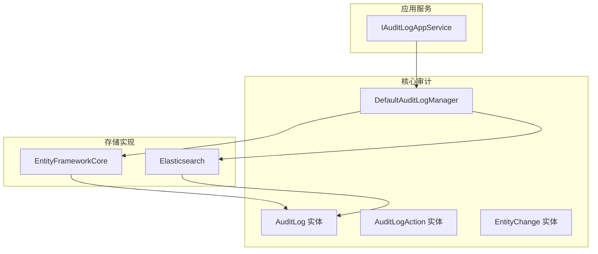
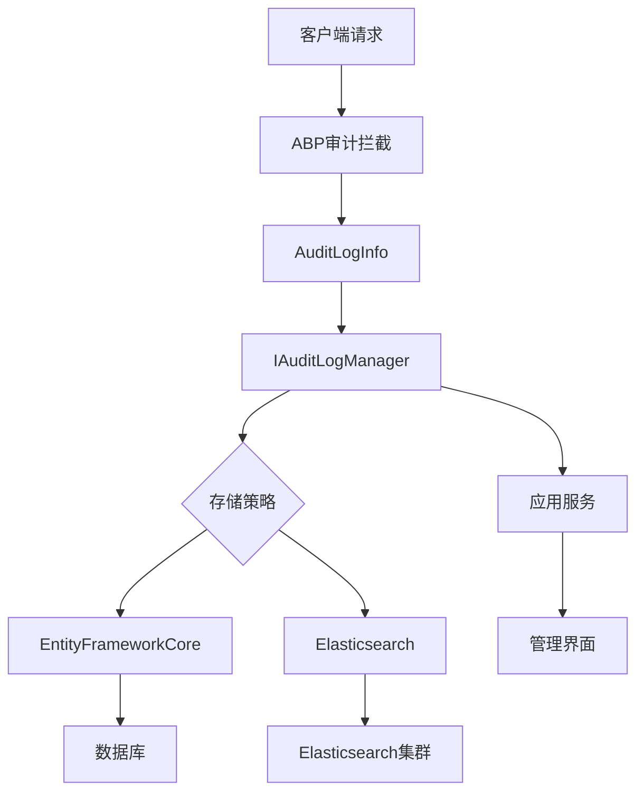
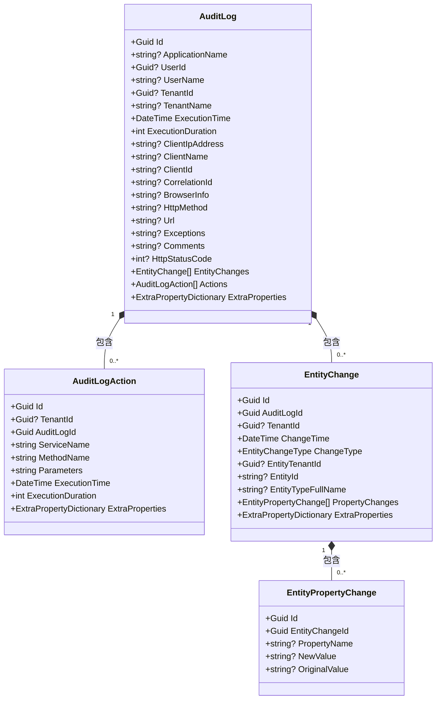
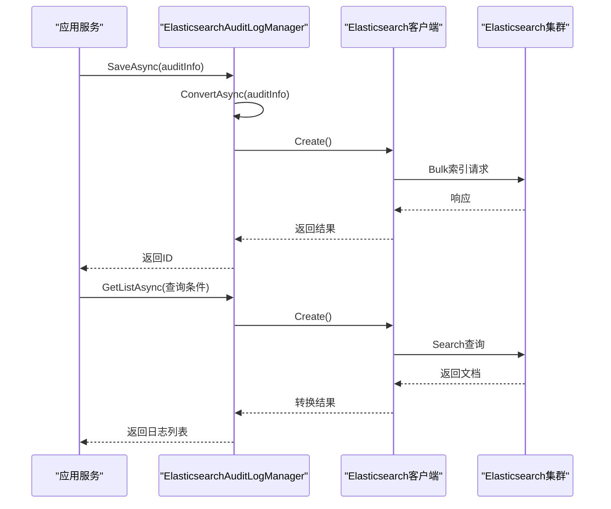
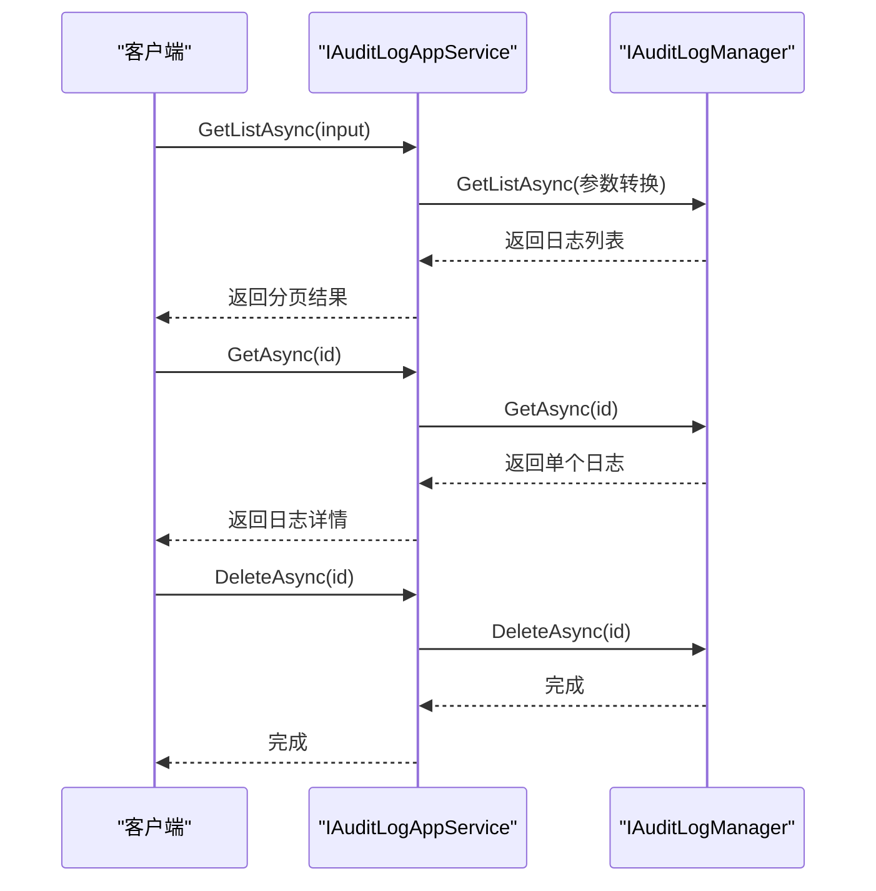
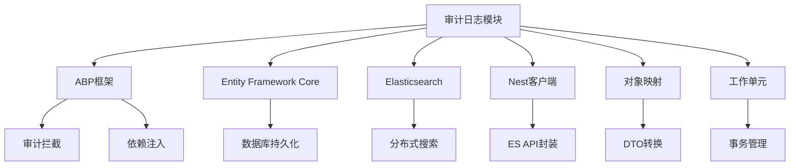

# 审计日志模块

<cite>
**本文档引用的文件**  
- [AuditLog.cs](file://aspnet-core/framework/auditing/LINGYUN.Abp.AuditLogging/LINGYUN/Abp/AuditLogging/AuditLog.cs)
- [AuditLogAction.cs](file://aspnet-core/framework/auditing/LINGYUN.Abp.AuditLogging/LINGYUN/Abp/AuditLogging/AuditLogAction.cs)
- [EntityChange.cs](file://aspnet-core/framework/auditing/LINGYUN.Abp.AuditLogging/LINGYUN/Abp/AuditLogging/EntityChange.cs)
- [DefaultAuditLogManager.cs](file://aspnet-core/framework/auditing/LINGYUN.Abp.AuditLogging/LINGYUN/Abp/AuditLogging/DefaultAuditLogManager.cs)
- [ElasticsearchAuditLogManager.cs](file://aspnet-core/framework/auditing/LINGYUN.Abp.AuditLogging.Elasticsearch/LINGYUN/Abp/AuditLogging/Elasticsearch/ElasticsearchAuditLogManager.cs)
- [AbpAuditLoggingElasticsearchOptions.cs](file://aspnet-core/framework/auditing/LINGYUN.Abp.AuditLogging.Elasticsearch/LINGYUN/Abp/AuditLogging/Elasticsearch/AbpAuditLoggingElasticsearchOptions.cs)
- [AuditLogManager.cs](file://aspnet-core/framework/auditing/LINGYUN.Abp.AuditLogging.EntityFrameworkCore/LINGYUN/Abp/AuditLogging/EntityFrameworkCore/AuditLogManager.cs)
- [IAuditLogAppService.cs](file://aspnet-core/modules/auditing/LINGYUN.Abp.Auditing.Application.Contracts/LINGYUN/Abp/Auditing/AuditLogs/IAuditLogAppService.cs)
</cite>

## 目录
1. [简介](#简介)
2. [项目结构](#项目结构)
3. [核心组件](#核心组件)
4. [架构概述](#架构概述)
5. [详细组件分析](#详细组件分析)
6. [依赖分析](#依赖分析)
7. [性能考虑](#性能考虑)
8. [故障排除指南](#故障排除指南)
9. [结论](#结论)

## 简介
本文档详细介绍了基于ABP框架的审计日志模块，涵盖操作日志的自动记录机制、日志数据结构与存储方式、Elasticsearch集成用于高效查询分析、API接口设计、管理界面展示及配置选项等内容。该模块实现了对系统操作的全面审计功能，支持多种存储后端和灵活的查询能力。

## 项目结构
审计日志模块采用分层架构设计，包含核心审计功能、数据库持久化、Elasticsearch集成和应用服务层。模块通过ABP框架的审计机制自动捕获操作日志，并提供丰富的查询和管理功能。

**图示来源**
- [AuditLog.cs](file://aspnet-core/framework/auditing/LINGYUN.Abp.AuditLogging/LINGYUN/Abp/AuditLogging/AuditLog.cs)
- [AuditLogAction.cs](file://aspnet-core/framework/auditing/LINGYUN.Abp.AuditLogging/LINGYUN/Abp/AuditLogging/AuditLogAction.cs)
- [EntityChange.cs](file://aspnet-core/framework/auditing/LINGYUN.Abp.AuditLogging/LINGYUN/Abp/AuditLogging/EntityChange.cs)
- [DefaultAuditLogManager.cs](file://aspnet-core/framework/auditing/LINGYUN.Abp.AuditLogging/LINGYUN/Abp/AuditLogging/DefaultAuditLogManager.cs)
- [ElasticsearchAuditLogManager.cs](file://aspnet-core/framework/auditing/LINGYUN.Abp.AuditLogging.Elasticsearch/LINGYUN/Abp/AuditLogging/Elasticsearch/ElasticsearchAuditLogManager.cs)
- [AuditLogManager.cs](file://aspnet-core/framework/auditing/LINGYUN.Abp.AuditLogging.EntityFrameworkCore/LINGYUN/Abp/AuditLogging/EntityFrameworkCore/AuditLogManager.cs)

**节来源**
- [AuditLog.cs](file://aspnet-core/framework/auditing/LINGYUN.Abp.AuditLogging/LINGYUN/Abp/AuditLogging/AuditLog.cs)
- [AuditLogAction.cs](file://aspnet-core/framework/auditing/LINGYUN.Abp.AuditLogging/LINGYUN/Abp/AuditLogging/AuditLogAction.cs)
- [EntityChange.cs](file://aspnet-core/framework/auditing/LINGYUN.Abp.AuditLogging/LINGYUN/Abp/AuditLogging/EntityChange.cs)

## 核心组件
审计日志模块的核心组件包括审计日志实体、审计日志管理器和应用服务接口。这些组件共同实现了操作日志的记录、存储和查询功能。

**节来源**
- [AuditLog.cs](file://aspnet-core/framework/auditing/LINGYUN.Abp.AuditLogging/LINGYUN/Abp/AuditLogging/AuditLog.cs#L1-L120)
- [AuditLogAction.cs](file://aspnet-core/framework/auditing/LINGYUN.Abp.AuditLogging/LINGYUN/Abp/AuditLogging/AuditLogAction.cs#L1-L47)
- [EntityChange.cs](file://aspnet-core/framework/auditing/LINGYUN.Abp.AuditLogging/LINGYUN/Abp/AuditLogging/EntityChange.cs#L1-L70)

## 架构概述
审计日志模块采用分层架构，基于ABP框架的审计功能实现。模块支持多种存储后端，包括Entity Framework Core和Elasticsearch，通过依赖注入实现灵活的存储策略切换。

**图示来源**
- [DefaultAuditLogManager.cs](file://aspnet-core/framework/auditing/LINGYUN.Abp.AuditLogging/LINGYUN/Abp/AuditLogging/DefaultAuditLogManager.cs)
- [ElasticsearchAuditLogManager.cs](file://aspnet-core/framework/auditing/LINGYUN.Abp.AuditLogging.Elasticsearch/LINGYUN/Abp/AuditLogging/Elasticsearch/ElasticsearchAuditLogManager.cs)
- [AuditLogManager.cs](file://aspnet-core/framework/auditing/LINGYUN.Abp.AuditLogging.EntityFrameworkCore/LINGYUN/Abp/AuditLogging/EntityFrameworkCore/AuditLogManager.cs)

## 详细组件分析
### 审计日志实体分析
审计日志实体定义了操作日志的数据结构，包含用户信息、请求信息、执行时间和变更记录等。

#### 类图

**图示来源**
- [AuditLog.cs](file://aspnet-core/framework/auditing/LINGYUN.Abp.AuditLogging/LINGYUN/Abp/AuditLogging/AuditLog.cs)
- [AuditLogAction.cs](file://aspnet-core/framework/auditing/LINGYUN.Abp.AuditLogging/LINGYUN/Abp/AuditLogging/AuditLogAction.cs)
- [EntityChange.cs](file://aspnet-core/framework/auditing/LINGYUN.Abp.AuditLogging/LINGYUN/Abp/AuditLogging/EntityChange.cs)

**节来源**
- [AuditLog.cs](file://aspnet-core/framework/auditing/LINGYUN.Abp.AuditLogging/LINGYUN/Abp/AuditLogging/AuditLog.cs#L1-L120)
- [AuditLogAction.cs](file://aspnet-core/framework/auditing/LINGYUN.Abp.AuditLogging/LINGYUN/Abp/AuditLogging/AuditLogAction.cs#L1-L47)
- [EntityChange.cs](file://aspnet-core/framework/auditing/LINGYUN.Abp.AuditLogging/LINGYUN/Abp/AuditLogging/EntityChange.cs#L1-L70)

### Elasticsearch集成分析
Elasticsearch实现提供了高性能的日志存储和查询能力，利用Elasticsearch的全文搜索和聚合功能实现高效的日志分析。

#### 序列图

**图示来源**
- [ElasticsearchAuditLogManager.cs](file://aspnet-core/framework/auditing/LINGYUN.Abp.AuditLogging.Elasticsearch/LINGYUN/Abp/AuditLogging/Elasticsearch/ElasticsearchAuditLogManager.cs)
- [AbpAuditLoggingElasticsearchOptions.cs](file://aspnet-core/framework/auditing/LINGYUN.Abp.AuditLogging.Elasticsearch/LINGYUN/Abp/AuditLogging/Elasticsearch/AbpAuditLoggingElasticsearchOptions.cs)

**节来源**
- [ElasticsearchAuditLogManager.cs](file://aspnet-core/framework/auditing/LINGYUN.Abp.AuditLogging.Elasticsearch/LINGYUN/Abp/AuditLogging/Elasticsearch/ElasticsearchAuditLogManager.cs#L1-L385)
- [AbpAuditLoggingElasticsearchOptions.cs](file://aspnet-core/framework/auditing/LINGYUN.Abp.AuditLogging.Elasticsearch/LINGYUN/Abp/AuditLogging/Elasticsearch/AbpAuditLoggingElasticsearchOptions.cs#L1-L16)

### 应用服务分析
应用服务层提供了审计日志的API接口，支持分页查询、详情获取和删除操作。

#### 序列图

**图示来源**
- [IAuditLogAppService.cs](file://aspnet-core/modules/auditing/LINGYUN.Abp.Auditing.Application.Contracts/LINGYUN/Abp/Auditing/AuditLogs/IAuditLogAppService.cs)

**节来源**
- [IAuditLogAppService.cs](file://aspnet-core/modules/auditing/LINGYUN.Abp.Auditing.Application.Contracts/LINGYUN/Abp/Auditing/AuditLogs/IAuditLogAppService.cs#L1-L17)

## 依赖分析
审计日志模块依赖于ABP框架的核心审计功能，并与多种技术栈集成以提供完整的日志管理解决方案。

**图示来源**
- [ElasticsearchAuditLogManager.cs](file://aspnet-core/framework/auditing/LINGYUN.Abp.AuditLogging.Elasticsearch/LINGYUN/Abp/AuditLogging/Elasticsearch/ElasticsearchAuditLogManager.cs)
- [AuditLogManager.cs](file://aspnet-core/framework/auditing/LINGYUN.Abp.AuditLogging.EntityFrameworkCore/LINGYUN/Abp/AuditLogging/EntityFrameworkCore/AuditLogManager.cs)
- [DefaultAuditLogManager.cs](file://aspnet-core/framework/auditing/LINGYUN.Abp.AuditLogging/LINGYUN/Abp/AuditLogging/DefaultAuditLogManager.cs)

**节来源**
- [ElasticsearchAuditLogManager.cs](file://aspnet-core/framework/auditing/LINGYUN.Abp.AuditLogging.Elasticsearch/LINGYUN/Abp/AuditLogging/Elasticsearch/ElasticsearchAuditLogManager.cs#L1-L385)
- [AuditLogManager.cs](file://aspnet-core/framework/auditing/LINGYUN.Abp.AuditLogging.EntityFrameworkCore/LINGYUN/Abp/AuditLogging/EntityFrameworkCore/AuditLogManager.cs#L1-L189)
- [DefaultAuditLogManager.cs](file://aspnet-core/framework/auditing/LINGYUN.Abp.AuditLogging/LINGYUN/Abp/AuditLogging/DefaultAuditLogManager.cs#L1-L101)

## 性能考虑
Elasticsearch实现通过批量索引操作和优化的查询构建器提高了日志写入和查询性能。使用Bulk API减少网络往返次数，通过字段映射优化查询效率，支持大规模日志数据的高效处理。

## 故障排除指南
当审计日志功能出现问题时，可检查以下方面：
1. 确认审计模块已正确注册到依赖注入容器
2. 检查Elasticsearch连接配置是否正确
3. 验证索引名称规范化设置
4. 查看日志输出中的错误信息
5. 确认审计开关配置是否启用

**节来源**
- [ElasticsearchAuditLogManager.cs](file://aspnet-core/framework/auditing/LINGYUN.Abp.AuditLogging.Elasticsearch/LINGYUN/Abp/AuditLogging/Elasticsearch/ElasticsearchAuditLogManager.cs#L1-L385)
- [DefaultAuditLogManager.cs](file://aspnet-core/framework/auditing/LINGYUN.Abp.AuditLogging/LINGYUN/Abp/AuditLogging/DefaultAuditLogManager.cs#L1-L101)

## 结论
审计日志模块提供了完整的操作审计解决方案，通过ABP框架的审计机制自动记录系统操作，支持多种存储后端和高效的查询分析功能。Elasticsearch集成提供了卓越的搜索性能，适用于大规模日志数据的管理和分析场景。