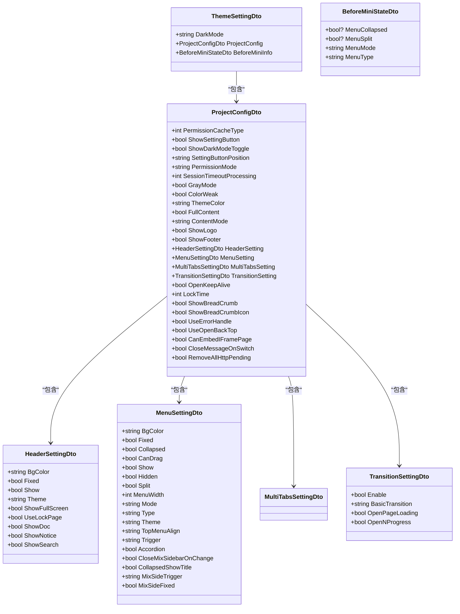
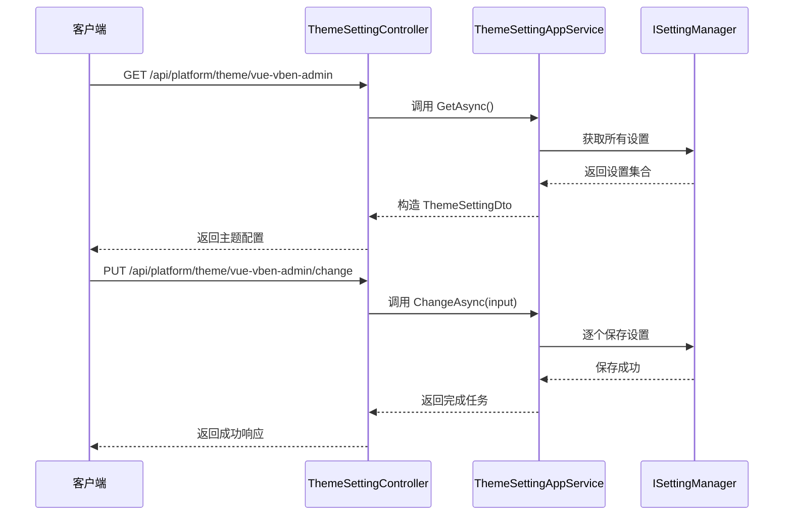
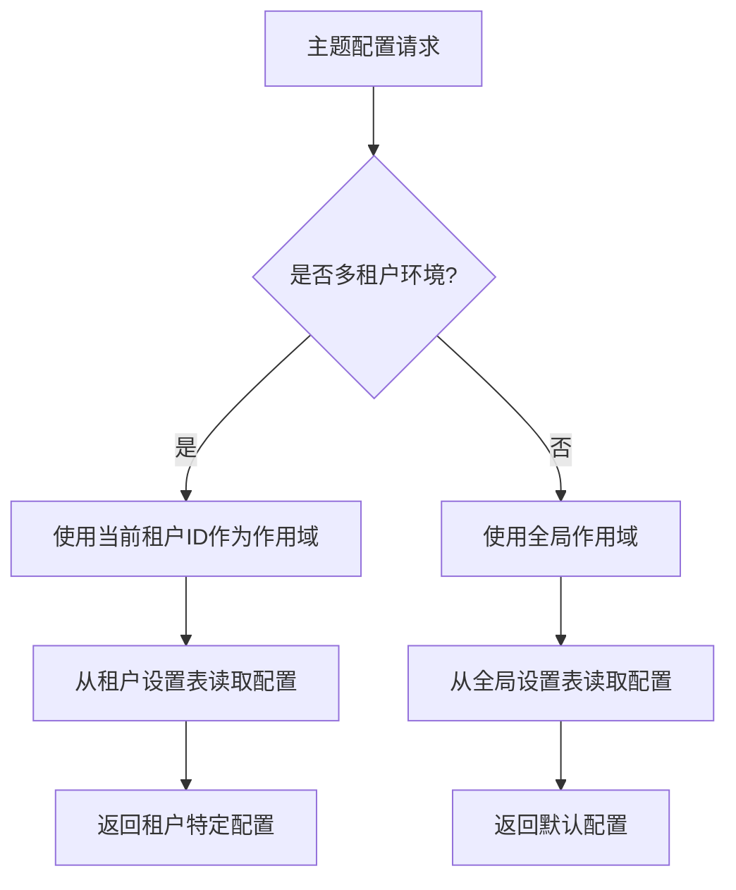
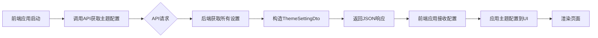

# 主题与品牌化

<cite>
**本文档中引用的文件**  
- [PlatformThemeVueVbenAdminModule.cs](file://aspnet-core/modules/platform/LINGYUN.Platform.Theme.VueVbenAdmin/LINGYUN/Platform/Theme/VueVbenAdmin/PlatformThemeVueVbenAdminModule.cs)
- [ThemeSettingAppService.cs](file://aspnet-core/modules/platform/LINGYUN.Platform.Theme.VueVbenAdmin/LINGYUN/Platform/Theme/VueVbenAdmin/ThemeSettingAppService.cs)
- [ThemeSettingController.cs](file://aspnet-core/modules/platform/LINGYUN.Platform.Theme.VueVbenAdmin/LINGYUN/Platform/Theme/VueVbenAdmin/ThemeSettingController.cs)
- [ThemeSettingDto.cs](file://aspnet-core/modules/platform/LINGYUN.Platform.Theme.VueVbenAdmin/LINGYUN/Platform/Theme/VueVbenAdmin/ThemeSettingDto.cs)
- [ProjectConfigDto.cs](file://aspnet-core/modules/platform/LINGYUN.Platform.Theme.VueVbenAdmin/LINGYUN/Platform/Theme/VueVbenAdmin/ProjectConfigDto.cs)
- [HeaderSettingDto.cs](file://aspnet-core/modules/platform/LINGYUN.Platform.Theme.VueVbenAdmin/LINGYUN/Platform/Theme/VueVbenAdmin/HeaderSettingDto.cs)
- [MenuSettingDto.cs](file://aspnet-core/modules/platform/LINGYUN.Platform.Theme.VueVbenAdmin/LINGYUN/Platform/Theme/VueVbenAdmin/MenuSettingDto.cs)
- [TransitionSettingDto.cs](file://aspnet-core/modules/platform/LINGYUN.Platform.Theme.VueVbenAdmin/LINGYUN/Platform/Theme/VueVbenAdmin/TransitionSettingDto.cs)
- [BeforeMiniStateDto.cs](file://aspnet-core/modules/platform/LINGYUN.Platform.Theme.VueVbenAdmin/LINGYUN/Platform/Theme/VueVbenAdmin/BeforeMiniStateDto.cs)
- [VueVbenAdminSettingNames.cs](file://aspnet-core/modules/platform/LINGYUN.Platform.Settings.VueVbenAdmin/LINGYUN/Platform/Settings/VueVbenAdmin/VueVbenAdminSettingNames.cs)
- [VueVbenAdminSettingDefinitionProvider.cs](file://aspnet-core/modules/platform/LINGYUN.Platform.Settings.VueVbenAdmin/LINGYUN/Platform/Settings/VueVbenAdmin/VueVbenAdminSettingDefinitionProvider.cs)
- [PlatformSettingsVueVbenAdminModule.cs](file://aspnet-core/modules/platform/LINGYUN.Platform.Settings.VueVbenAdmin/LINGYUN/Platform/Settings/VueVbenAdmin/PlatformSettingsVueVbenAdminModule.cs)
- [README.md](file://aspnet-core/modules/platform/LINGYUN.Platform.Theme.VueVbenAdmin/README.md)
</cite>

## 目录
1. [简介](#简介)
2. [主题配置结构](#主题配置结构)
3. [后端实现机制](#后端实现机制)
4. [API接口设计](#api接口设计)
5. [多租户环境下的主题隔离](#多租户环境下的主题隔离)
6. [前端集成方案](#前端集成方案)
7. [配置持久化策略](#配置持久化策略)

## 简介

LINGYUN.Platform.Theme.VueVbenAdmin 模块为 VueVbenAdmin 前端框架提供了一套完整的主题管理解决方案，支持系统外观的全面定制。该模块允许管理员动态配置主题颜色、布局样式、Logo 和品牌信息等视觉元素，从而实现系统的个性化展示。

本模块提供了丰富的配置选项，包括暗黑模式、灰色模式、色弱模式等特殊视觉效果，以及菜单、头部、标签页等界面组件的详细设置。通过与 ABP 框架的深度集成，实现了配置的持久化存储和多租户环境下的独立管理。

**Section sources**
- [README.md](file://aspnet-core/modules/platform/LINGYUN.Platform.Theme.VueVbenAdmin/README.md#L0-L93)

## 主题配置结构

主题配置采用分层的数据结构，将相关设置组织在不同的 DTO 类中，便于管理和维护。



**Diagram sources**
- [ThemeSettingDto.cs](file://aspnet-core/modules/platform/LINGYUN.Platform.Theme.VueVbenAdmin/LINGYUN/Platform/Theme/VueVbenAdmin/ThemeSettingDto.cs#L0-L7)
- [ProjectConfigDto.cs](file://aspnet-core/modules/platform/LINGYUN.Platform.Theme.VueVbenAdmin/LINGYUN/Platform/Theme/VueVbenAdmin/ProjectConfigDto.cs#L0-L30)
- [HeaderSettingDto.cs](file://aspnet-core/modules/platform/LINGYUN.Platform.Theme.VueVbenAdmin/LINGYUN/Platform/Theme/VueVbenAdmin/HeaderSettingDto.cs#L0-L13)
- [MenuSettingDto.cs](file://aspnet-core/modules/platform/LINGYUN.Platform.Theme.VueVbenAdmin/LINGYUN/Platform/Theme/VueVbenAdmin/MenuSettingDto.cs#L0-L22)
- [TransitionSettingDto.cs](file://aspnet-core/modules/platform/LINGYUN.Platform.Theme.VueVbenAdmin/LINGYUN/Platform/Theme/VueVbenAdmin/TransitionSettingDto.cs#L0-L8)
- [BeforeMiniStateDto.cs](file://aspnet-core/modules/platform/LINGYUN.Platform.Theme.VueVbenAdmin/LINGYUN/Platform/Theme/VueVbenAdmin/BeforeMiniStateDto.cs#L0-L9)

## 后端实现机制

主题管理模块的后端实现基于 ABP 框架的设置管理功能，通过定义设置名称常量和设置定义提供程序来管理所有可配置项。

### 设置名称定义

所有主题相关的设置名称都定义在 `VueVbenAdminSettingNames` 静态类中，采用分组命名的方式组织：

```csharp
public static class VueVbenAdminSettingNames
{
    public const string GroupName = PlatformSettingNames.GroupName + ".Theme.VueVbenAdmin";
    
    public const string DarkMode = GroupName + ".DarkMode";
    
    public static class ProjectConfig
    {
        public const string Prefix = GroupName + ".ProjectConfig";
        public const string PermissionCacheType = Prefix + ".PermissionCacheType";
        public const string ShowSettingButton = Prefix + ".ShowSettingButton";
        // ... 其他设置
    }
}
```

### 设置定义提供程序

`VueVbenAdminSettingDefinitionProvider` 类负责注册所有主题相关的设置定义，包括默认值、显示名称和描述信息：

```mermaid
flowchart TD
A[VueVbenAdminSettingDefinitionProvider] --> B[Define 方法]
B --> C[添加主题基础设置]
B --> D[添加项目配置设置]
B --> E[添加头部配置设置]
B --> F[添加菜单配置设置]
B --> G[添加多标签页配置设置]
B --> H[添加过渡动画设置]
B --> I[添加迷你状态配置]
C --> J[DarkMode: 默认值 "light"]
D --> K[PermissionCacheType: 默认值 "1"]
D --> L[ShowSettingButton: 默认值 "true"]
D --> M[ThemeColor: 默认值 "#0960bd"]
E --> N[BgColor: 默认值 "#ffffff"]
E --> O[Theme: 默认值 "light"]
F --> P[Mode: 默认值 "inline"]
F --> Q[Theme: 默认值 "dark"]
G --> R[Cache: 默认值 "true"]
H --> S[Enable: 默认值 "true"]
```

**Diagram sources**
- [VueVbenAdminSettingNames.cs](file://aspnet-core/modules/platform/LINGYUN.Platform.Settings.VueVbenAdmin/LINGYUN/Platform/Settings/VueVbenAdmin/VueVbenAdminSettingNames.cs#L0-L24)
- [VueVbenAdminSettingDefinitionProvider.cs](file://aspnet-core/modules/platform/LINGYUN.Platform.Settings.VueVbenAdmin/LINGYUN/Platform/Settings/VueVbenAdmin/VueVbenAdminSettingDefinitionProvider.cs#L0-L38)

## API接口设计

主题管理模块提供了 RESTful API 接口，用于获取和更新主题配置。

### 控制器实现

`ThemeSettingController` 是主题配置的 API 控制器，继承自 `AbpControllerBase` 并实现了 `IThemeSettingAppService` 接口：



**Diagram sources**
- [ThemeSettingController.cs](file://aspnet-core/modules/platform/LINGYUN.Platform.Theme.VueVbenAdmin/LINGYUN/Platform/Theme/VueVbenAdmin/ThemeSettingController.cs#L0-L34)
- [ThemeSettingAppService.cs](file://aspnet-core/modules/platform/LINGYUN.Platform.Theme.VueVbenAdmin/LINGYUN/Platform/Theme/VueVbenAdmin/ThemeSettingAppService.cs#L0-L34)

### 应用服务实现

`ThemeSettingAppService` 是主题配置的应用服务，负责具体的业务逻辑处理：

```csharp
public class ThemeSettingAppService : ApplicationService, IThemeSettingAppService
{
    protected ISettingManager SettingManager { get; }

    public ThemeSettingAppService(ISettingManager settingManager)
    {
        SettingManager = settingManager;
        LocalizationResource = typeof(PlatformResource);
    }

    public async virtual Task<ThemeSettingDto> GetAsync()
    {
        var theme = new ThemeSettingDto();
        var settings = await SettingProvider.GetAllAsync(GetAllSettingNames());

        // 从设置中提取主题配置
        theme.DarkMode = GetSettingValue(settings, VueVbenAdminSettingNames.DarkMode);
        
        // 项目配置
        theme.ProjectConfig.PermissionCacheType = GetSettingValue(settings, VueVbenAdminSettingNames.ProjectConfig.PermissionCacheType, 1);
        theme.ProjectConfig.ShowSettingButton = GetSettingValue(settings, VueVbenAdminSettingNames.ProjectConfig.ShowSettingButton, true);
        // ... 其他配置项
        
        return theme;
    }

    [Authorize]
    public async virtual Task ChangeAsync(ThemeSettingDto input)
    {
        // 保存主题配置到设置管理器
        await SettingManager.SetForCurrentUserAsync(VueVbenAdminSettingNames.DarkMode, input.DarkMode);
        await SettingManager.SetForCurrentUserAsync(VueVbenAdminSettingNames.ProjectConfig.PermissionCacheType, input.ProjectConfig.PermissionCacheType.ToString());
        // ... 保存其他配置项
    }
}
```

**Section sources**
- [ThemeSettingAppService.cs](file://aspnet-core/modules/platform/LINGYUN.Platform.Theme.VueVbenAdmin/LINGYUN/Platform/Theme/VueVbenAdmin/ThemeSettingAppService.cs#L0-L34)

## 多租户环境下的主题隔离

主题管理模块完全支持 ABP 框架的多租户特性，确保不同租户的主题配置相互隔离。

### 租户级别配置

所有主题设置都存储在租户级别的设置表中，通过 `ISettingManager` 的租户感知功能自动处理租户隔离：



当调用 `SettingManager.SetForCurrentUserAsync` 方法时，ABP 框架会自动根据当前用户所属的租户来确定设置的作用域，确保每个租户都有独立的主题配置。

### 配置继承机制

系统支持配置的继承机制，允许在不同层级上定义默认值：

1. **全局默认值**：在 `VueVbenAdminSettingDefinitionProvider` 中定义的默认值
2. **租户默认值**：租户管理员可以设置租户级别的默认配置
3. **用户覆盖值**：用户可以根据个人偏好覆盖部分配置

这种分层的配置机制既保证了品牌一致性，又提供了足够的灵活性。

**Section sources**
- [ThemeSettingAppService.cs](file://aspnet-core/modules/platform/LINGYUN.Platform.Theme.VueVbenAdmin/LINGYUN/Platform/Theme/VueVbenAdmin/ThemeSettingAppService.cs#L95-L113)

## 前端集成方案

主题管理模块与 VueVbenAdmin 前端框架深度集成，通过 API 接口实现主题配置的动态加载。

### 模块依赖

后端模块需要正确引用以启用主题管理功能：

```csharp
[DependsOn(
    typeof(PlatformDomainModule),
    typeof(PlatformSettingsVueVbenAdminModule),
    typeof(PlatformApplicationContractModule),
    typeof(AbpAspNetCoreMvcModule))]
public class PlatformThemeVueVbenAdminModule : AbpModule
{
    public override void PreConfigureServices(ServiceConfigurationContext context)
    {
        PreConfigure<IMvcBuilder>(mvcBuilder =>
        {
            mvcBuilder.AddApplicationPartIfNotExists(typeof(PlatformThemeVueVbenAdminModule).Assembly);
        });
    }
}
```

### 语言映射配置

为了支持国际化，系统配置了 VueVbenAdmin 前端的语言映射：

```csharp
options.AddLanguagesMapOrUpdate(
    "vben-admin-ui",
    new NameValue("zh_CN", "zh-Hans"));
```

这确保了前端界面的语言与后端保持一致。

**Section sources**
- [PlatformThemeVueVbenAdminModule.cs](file://aspnet-core/modules/platform/LINGYUN.Platform.Theme.VueVbenAdmin/LINGYUN/Platform/Theme/VueVbenAdmin/PlatformThemeVueVbenAdminModule.cs#L0-L21)
- [MicroServiceApplicationsSingleModule.Configure.cs](file://aspnet-core/services/LY.AIO.Applications.Single/MicroServiceApplicationsSingleModule.Configure.cs#L733-L775)

## 配置持久化策略

主题配置的持久化基于 ABP 框架的设置管理基础设施，确保配置的安全存储和高效访问。

### 存储结构

所有主题配置都存储在数据库的 `AbpSettings` 表中，每条记录包含以下关键字段：

- **Name**: 设置名称（如 `LINGYUN.Platform.Theme.VueVbenAdmin.ProjectConfig.ThemeColor`）
- **Value**: 设置值（如 `#0960bd`）
- **TenantId**: 租户ID（null 表示全局设置）
- **UserId**: 用户ID（null 表示租户级别设置）

### 批量获取优化

为了提高性能，`ThemeSettingAppService` 在获取配置时采用批量获取策略：

```csharp
protected virtual string[] GetAllSettingNames()
{
    return new string[]
    {
        VueVbenAdminSettingNames.DarkMode,
        VueVbenAdminSettingNames.ProjectConfig.PermissionCacheType,
        VueVbenAdminSettingNames.ProjectConfig.ShowSettingButton,
        // ... 所有相关设置名称
    };
}

// 批量获取所有设置，减少数据库查询次数
var settings = await SettingProvider.GetAllAsync(GetAllSettingNames());
```

这种方法将多个单独的数据库查询合并为一次批量查询，显著提高了性能。

### 动态加载流程

前端应用启动时的主题配置加载流程如下：



这种设计确保了每次用户登录时都能获取到最新的主题配置，实现了配置的实时生效。

**Section sources**
- [ThemeSettingAppService.cs](file://aspnet-core/modules/platform/LINGYUN.Platform.Theme.VueVbenAdmin/LINGYUN/Platform/Theme/VueVbenAdmin/ThemeSettingAppService.cs#L176-L239)