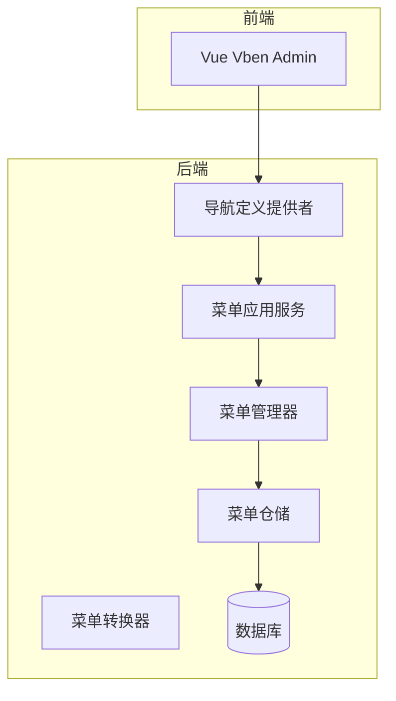
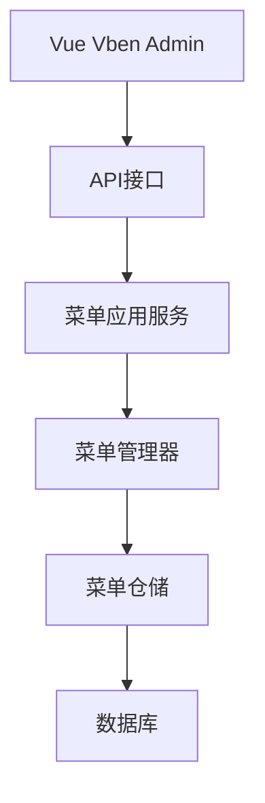
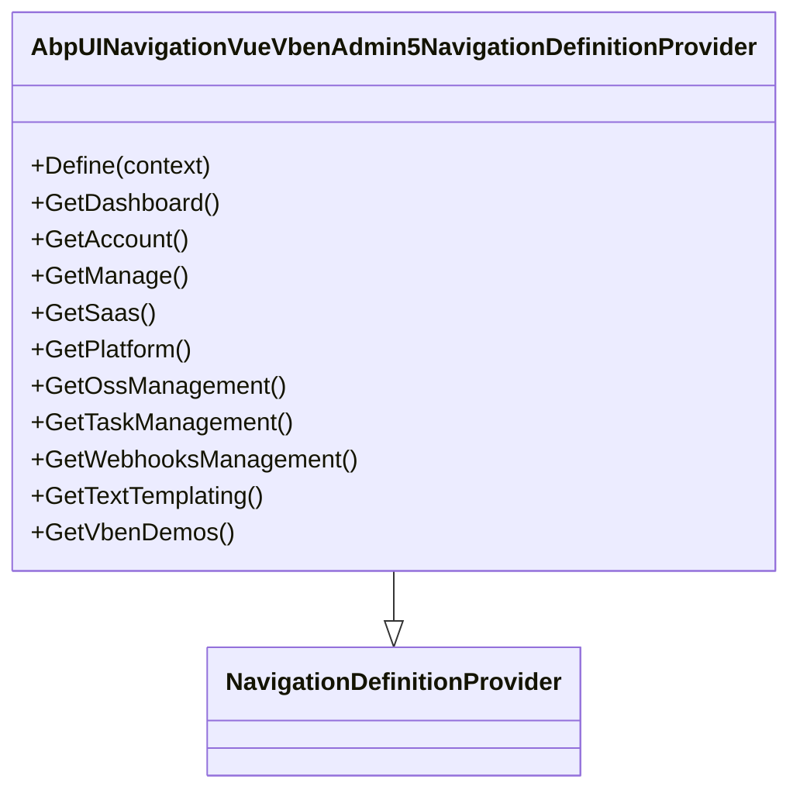
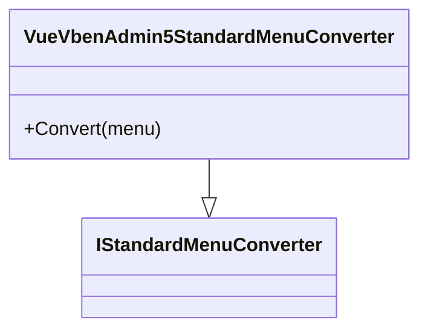
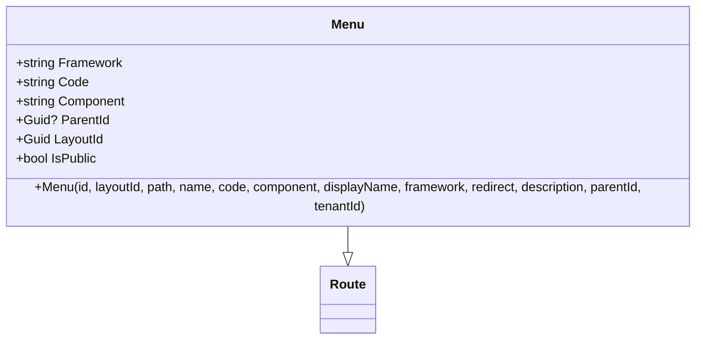
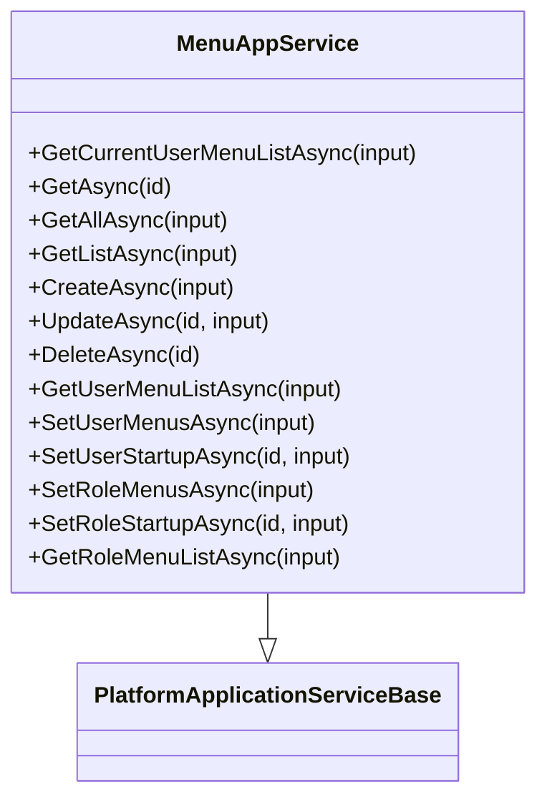
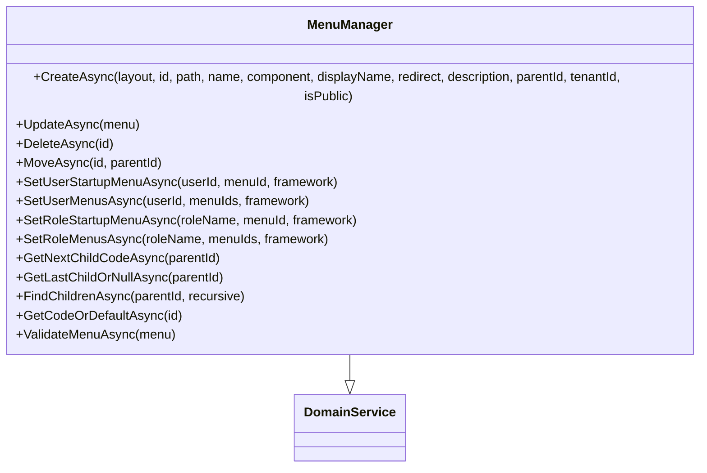
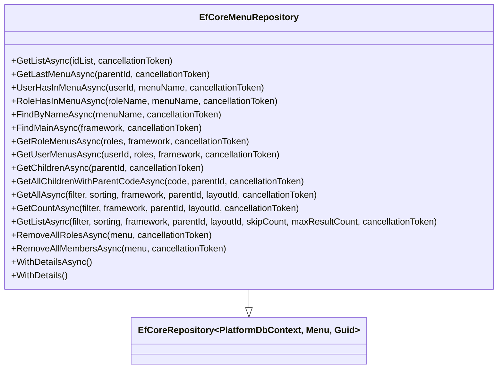
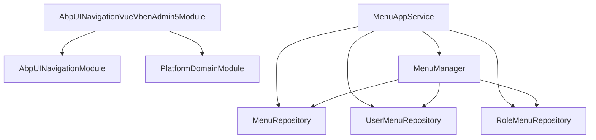

# 导航菜单管理

<cite>
**本文档引用的文件**   
- [AbpUINavigationVueVbenAdmin5NavigationDefinitionProvider.cs](file://aspnet-core/modules/platform/LINGYUN.Abp.UI.Navigation.VueVbenAdmin5/LINGYUN/Abp/UI/Navigation/VueVbenAdmin5/AbpUINavigationVueVbenAdmin5NavigationDefinitionProvider.cs)
- [VueVbenAdmin5StandardMenuConverter.cs](file://aspnet-core/modules/platform/LINGYUN.Abp.UI.Navigation.VueVbenAdmin5/LINGYUN/Abp/UI/Navigation/VueVbenAdmin5/VueVbenAdmin5StandardMenuConverter.cs)
- [Menu.cs](file://aspnet-core/modules/platform/LINGYUN.Platform.Domain/LINGYUN/Platform/Menus/Menu.cs)
- [MenuAppService.cs](file://aspnet-core/modules/platform/LINGYUN.Platform.Application/LINGYUN/Platform/Menus/MenuAppService.cs)
- [MenuManager.cs](file://aspnet-core/modules/platform/LINGYUN.Platform.Domain/LINGYUN/Platform/Menus/MenuManager.cs)
- [EfCoreMenuRepository.cs](file://aspnet-core/modules/platform/LINGYUN.Platform.EntityFrameworkCore/LINGYUN/Platform/Menus/EfCoreMenuRepository.cs)
</cite>

## 目录
1. [简介](#简介)
2. [项目结构](#项目结构)
3. [核心组件](#核心组件)
4. [架构概述](#架构概述)
5. [详细组件分析](#详细组件分析)
6. [依赖分析](#依赖分析)
7. [性能考虑](#性能考虑)
8. [故障排除指南](#故障排除指南)
9. [结论](#结论)

## 简介
本文档全面阐述了平台管理模块如何实现动态导航系统的构建，包括菜单项的定义、层级结构管理、权限绑定以及与Vue Vben Admin前端框架的无缝集成。文档详细说明了导航定义的API接口、菜单数据的序列化格式、以及如何通过代码或配置动态生成菜单。此外，文档还涵盖了导航提供者（Navigation Provider）的实现机制、菜单缓存策略以及在多租户环境下的个性化菜单支持。

## 项目结构
本项目采用模块化设计，导航菜单管理功能主要分布在`aspnet-core/modules/platform`目录下的多个模块中。核心功能由`LINGYUN.Abp.UI.Navigation.VueVbenAdmin5`模块提供，该模块负责与Vue Vben Admin前端框架集成。菜单数据模型和业务逻辑则由`LINGYUN.Platform.Domain`和`LINGYUN.Platform.Application`模块管理。

**图源**
- [AbpUINavigationVueVbenAdmin5NavigationDefinitionProvider.cs](file://aspnet-core/modules/platform/LINGYUN.Abp.UI.Navigation.VueVbenAdmin5/LINGYUN/Abp/UI/Navigation/VueVbenAdmin5/AbpUINavigationVueVbenAdmin5NavigationDefinitionProvider.cs)
- [VueVbenAdmin5StandardMenuConverter.cs](file://aspnet-core/modules/platform/LINGYUN.Abp.UI.Navigation.VueVbenAdmin5/LINGYUN/Abp/UI/Navigation/VueVbenAdmin5/VueVbenAdmin5StandardMenuConverter.cs)
- [MenuAppService.cs](file://aspnet-core/modules/platform/LINGYUN.Platform.Application/LINGYUN/Platform/Menus/MenuAppService.cs)
- [MenuManager.cs](file://aspnet-core/modules/platform/LINGYUN.Platform.Domain/LINGYUN/Platform/Menus/MenuManager.cs)
- [EfCoreMenuRepository.cs](file://aspnet-core/modules/platform/LINGYUN.Platform.EntityFrameworkCore/LINGYUN/Platform/Menus/EfCoreMenuRepository.cs)

**节源**
- [AbpUINavigationVueVbenAdmin5NavigationDefinitionProvider.cs](file://aspnet-core/modules/platform/LINGYUN.Abp.UI.Navigation.VueVbenAdmin5/LINGYUN/Abp/UI/Navigation/VueVbenAdmin5/AbpUINavigationVueVbenAdmin5NavigationDefinitionProvider.cs)
- [VueVbenAdmin5StandardMenuConverter.cs](file://aspnet-core/modules/platform/LINGYUN.Abp.UI.Navigation.VueVbenAdmin5/LINGYUN/Abp/UI/Navigation/VueVbenAdmin5/VueVbenAdmin5StandardMenuConverter.cs)

## 核心组件
导航菜单管理系统的核心组件包括导航定义提供者、菜单转换器、菜单应用服务、菜单管理器和菜单仓储。这些组件协同工作，实现了从菜单定义到前端展示的完整流程。

**节源**
- [AbpUINavigationVueVbenAdmin5NavigationDefinitionProvider.cs](file://aspnet-core/modules/platform/LINGYUN.Abp.UI.Navigation.VueVbenAdmin5/LINGYUN/Abp/UI/Navigation/VueVbenAdmin5/AbpUINavigationVueVbenAdmin5NavigationDefinitionProvider.cs)
- [VueVbenAdmin5StandardMenuConverter.cs](file://aspnet-core/modules/platform/LINGYUN.Abp.UI.Navigation.VueVbenAdmin5/LINGYUN/Abp/UI/Navigation/VueVbenAdmin5/VueVbenAdmin5StandardMenuConverter.cs)
- [MenuAppService.cs](file://aspnet-core/modules/platform/LINGYUN.Platform.Application/LINGYUN/Platform/Menus/MenuAppService.cs)
- [MenuManager.cs](file://aspnet-core/modules/platform/LINGYUN.Platform.Domain/LINGYUN/Platform/Menus/MenuManager.cs)
- [EfCoreMenuRepository.cs](file://aspnet-core/modules/platform/LINGYUN.Platform.EntityFrameworkCore/LINGYUN/Platform/Menus/EfCoreMenuRepository.cs)

## 架构概述
系统采用分层架构，前端Vue Vben Admin通过API调用获取菜单数据，后端服务层负责处理业务逻辑，数据访问层负责与数据库交互。导航定义提供者动态生成菜单结构，菜单转换器将内部菜单模型转换为前端可识别的格式。

**图源**
- [MenuAppService.cs](file://aspnet-core/modules/platform/LINGYUN.Platform.Application/LINGYUN/Platform/Menus/MenuAppService.cs)
- [MenuManager.cs](file://aspnet-core/modules/platform/LINGYUN.Platform.Domain/LINGYUN/Platform/Menus/MenuManager.cs)
- [EfCoreMenuRepository.cs](file://aspnet-core/modules/platform/LINGYUN.Platform.EntityFrameworkCore/LINGYUN/Platform/Menus/EfCoreMenuRepository.cs)

## 详细组件分析
### 导航定义提供者分析
导航定义提供者负责定义系统中的所有菜单项及其层级结构。它通过实现`NavigationDefinitionProvider`接口来动态生成菜单。

**图源**
- [AbpUINavigationVueVbenAdmin5NavigationDefinitionProvider.cs](file://aspnet-core/modules/platform/LINGYUN.Abp.UI.Navigation.VueVbenAdmin5/LINGYUN/Abp/UI/Navigation/VueVbenAdmin5/AbpUINavigationVueVbenAdmin5NavigationDefinitionProvider.cs)

**节源**
- [AbpUINavigationVueVbenAdmin5NavigationDefinitionProvider.cs](file://aspnet-core/modules/platform/LINGYUN.Abp.UI.Navigation.VueVbenAdmin5/LINGYUN/Abp/UI/Navigation/VueVbenAdmin5/AbpUINavigationVueVbenAdmin5NavigationDefinitionProvider.cs)

### 菜单转换器分析
菜单转换器负责将内部菜单模型转换为前端框架可识别的标准格式。它实现了`IStandardMenuConverter`接口，确保菜单数据能够正确地传递给Vue Vben Admin。

**图源**
- [VueVbenAdmin5StandardMenuConverter.cs](file://aspnet-core/modules/platform/LINGYUN.Abp.UI.Navigation.VueVbenAdmin5/LINGYUN/Abp/UI/Navigation/VueVbenAdmin5/VueVbenAdmin5StandardMenuConverter.cs)

**节源**
- [VueVbenAdmin5StandardMenuConverter.cs](file://aspnet-core/modules/platform/LINGYUN.Abp.UI.Navigation.VueVbenAdmin5/LINGYUN/Abp/UI/Navigation/VueVbenAdmin5/VueVbenAdmin5StandardMenuConverter.cs)

### 菜单实体分析
菜单实体定义了菜单项的基本属性，包括路径、名称、显示名称、重定向、描述、图标等。它继承自`Route`类，并添加了特定于菜单的属性。

**图源**
- [Menu.cs](file://aspnet-core/modules/platform/LINGYUN.Platform.Domain/LINGYUN/Platform/Menus/Menu.cs)

**节源**
- [Menu.cs](file://aspnet-core/modules/platform/LINGYUN.Platform.Domain/LINGYUN/Platform/Menus/Menu.cs)

### 菜单应用服务分析
菜单应用服务提供了对菜单的CRUD操作，包括创建、读取、更新和删除菜单项。它还提供了获取当前用户菜单列表、设置用户菜单等功能。

**图源**
- [MenuAppService.cs](file://aspnet-core/modules/platform/LINGYUN.Platform.Application/LINGYUN/Platform/Menus/MenuAppService.cs)

**节源**
- [MenuAppService.cs](file://aspnet-core/modules/platform/LINGYUN.Platform.Application/LINGYUN/Platform/Menus/MenuAppService.cs)

### 菜单管理器分析
菜单管理器负责处理菜单的业务逻辑，包括创建、更新、删除、移动菜单项，以及设置用户和角色的启动菜单。

**图源**
- [MenuManager.cs](file://aspnet-core/modules/platform/LINGYUN.Platform.Domain/LINGYUN/Platform/Menus/MenuManager.cs)

**节源**
- [MenuManager.cs](file://aspnet-core/modules/platform/LINGYUN.Platform.Domain/LINGYUN/Platform/Menus/MenuManager.cs)

### 菜单仓储分析
菜单仓储负责与数据库交互，提供对菜单数据的持久化操作。它实现了`IMenuRepository`接口，提供了多种查询方法来获取菜单数据。

**图源**
- [EfCoreMenuRepository.cs](file://aspnet-core/modules/platform/LINGYUN.Platform.EntityFrameworkCore/LINGYUN/Platform/Menus/EfCoreMenuRepository.cs)

**节源**
- [EfCoreMenuRepository.cs](file://aspnet-core/modules/platform/LINGYUN.Platform.EntityFrameworkCore/LINGYUN/Platform/Menus/EfCoreMenuRepository.cs)

## 依赖分析
导航菜单管理系统依赖于多个模块和组件，包括ABP框架的核心模块、平台域模块、UI导航模块等。这些依赖关系确保了系统的稳定性和可扩展性。

**图源**
- [AbpUINavigationVueVbenAdmin5Module.cs](file://aspnet-core/modules/platform/LINGYUN.Abp.UI.Navigation.VueVbenAdmin5/LINGYUN/Abp/UI/Navigation/VueVbenAdmin5/AbpUINavigationVueVbenAdmin5Module.cs)
- [MenuAppService.cs](file://aspnet-core/modules/platform/LINGYUN.Platform.Application/LINGYUN/Platform/Menus/MenuAppService.cs)
- [MenuManager.cs](file://aspnet-core/modules/platform/LINGYUN.Platform.Domain/LINGYUN/Platform/Menus/MenuManager.cs)
- [EfCoreMenuRepository.cs](file://aspnet-core/modules/platform/LINGYUN.Platform.EntityFrameworkCore/LINGYUN/Platform/Menus/EfCoreMenuRepository.cs)

**节源**
- [AbpUINavigationVueVbenAdmin5Module.cs](file://aspnet-core/modules/platform/LINGYUN.Abp.UI.Navigation.VueVbenAdmin5/LINGYUN/Abp/UI/Navigation/VueVbenAdmin5/AbpUINavigationVueVbenAdmin5Module.cs)
- [MenuAppService.cs](file://aspnet-core/modules/platform/LINGYUN.Platform.Application/LINGYUN/Platform/Menus/MenuAppService.cs)
- [MenuManager.cs](file://aspnet-core/modules/platform/LINGYUN.Platform.Domain/LINGYUN/Platform/Menus/MenuManager.cs)
- [EfCoreMenuRepository.cs](file://aspnet-core/modules/platform/LINGYUN.Platform.EntityFrameworkCore/LINGYUN/Platform/Menus/EfCoreMenuRepository.cs)

## 性能考虑
为了提高性能，系统采用了多种优化策略，包括缓存机制、批量操作和异步处理。菜单数据在首次加载后会被缓存，减少数据库查询次数。同时，系统支持批量设置用户和角色的菜单权限，提高了操作效率。

## 故障排除指南
在使用导航菜单管理系统时，可能会遇到一些常见问题，如菜单无法显示、权限设置不生效等。建议检查菜单定义是否正确、用户角色是否具有相应权限、缓存是否需要刷新等。

**节源**
- [MenuAppService.cs](file://aspnet-core/modules/platform/LINGYUN.Platform.Application/LINGYUN/Platform/Menus/MenuAppService.cs)
- [MenuManager.cs](file://aspnet-core/modules/platform/LINGYUN.Platform.Domain/LINGYUN/Platform/Menus/MenuManager.cs)
- [EfCoreMenuRepository.cs](file://aspnet-core/modules/platform/LINGYUN.Platform.EntityFrameworkCore/LINGYUN/Platform/Menus/EfCoreMenuRepository.cs)

## 结论
本文档详细介绍了导航菜单管理系统的实现机制，包括菜单项的定义、层级结构管理、权限绑定以及与Vue Vben Admin前端框架的无缝集成。通过分析核心组件和架构设计，展示了系统如何高效地管理和展示菜单数据。未来可以进一步优化缓存策略，提升系统性能。