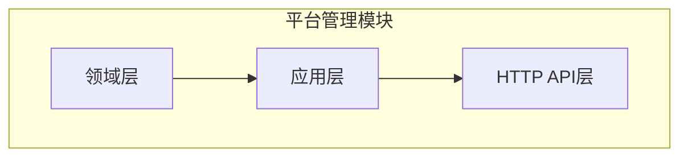
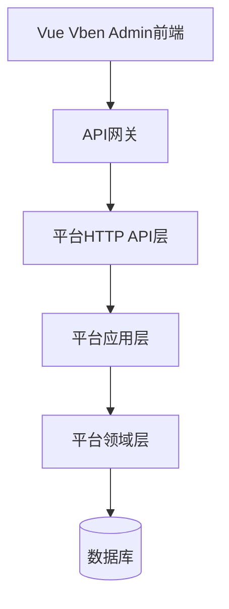
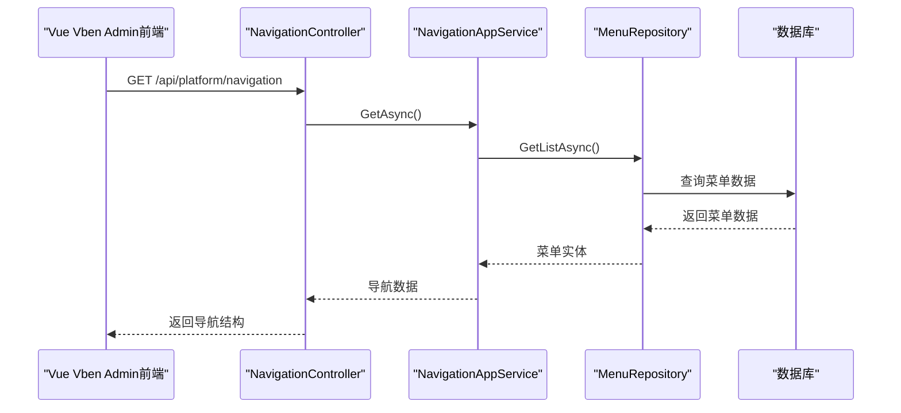
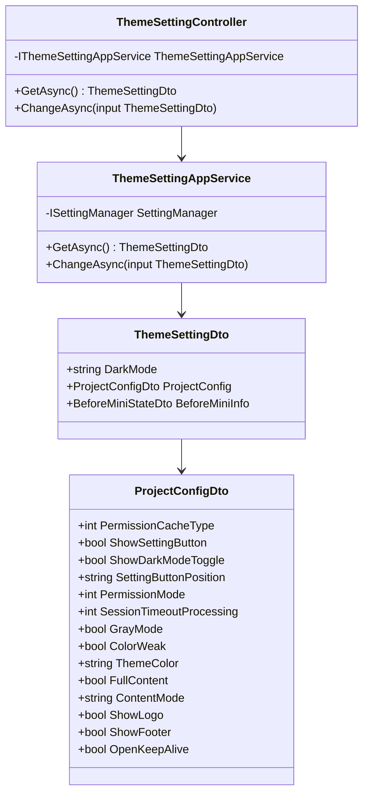

# 平台管理模块

<cite>
**本文档引用的文件**
- [AbpUINavigationVueVbenAdmin5NavigationDefinitionProvider.cs](file://aspnet-core\modules\platform\LINGYUN.Abp.UI.Navigation.VueVbenAdmin5\LINGYUN\Abp\UI\Navigation\VueVbenAdmin5\AbpUINavigationVueVbenAdmin5NavigationDefinitionProvider.cs)
- [VueVbenAdminNavigationSeedContributor.cs](file://aspnet-core\modules\platform\LINGYUN.Abp.UI.Navigation.VueVbenAdmin\LINGYUN\Abp\UI\Navigation\VueVbenAdmin\VueVbenAdminNavigationSeedContributor.cs)
- [ThemeSettingController.cs](file://aspnet-core\modules\platform\LINGYUN.Platform.Theme.VueVbenAdmin\LINGYUN\Platform\Theme\VueVbenAdmin\ThemeSettingController.cs)
- [ThemeSettingAppService.cs](file://aspnet-core\modules\platform\LINGYUN.Platform.Theme.VueVbenAdmin\LINGYUN\Platform\Theme\VueVbenAdmin\ThemeSettingAppService.cs)
- [VueVbenAdminSettingNames.cs](file://aspnet-core\modules\platform\LINGYUN.Platform.Settings.VueVbenAdmin\LINGYUN\Platform\Settings\VueVbenAdmin\VueVbenAdminSettingNames.cs)
- [TenantConfigurationCache.cs](file://aspnet-core\services\LY.MicroService.PlatformManagement.HttpApi.Host\MultiTenancy\TenantConfigurationCache.cs)
- [PlatformDomainModule.cs](file://aspnet-core\modules\platform\LINGYUN.Platform.Domain\LINGYUN\Platform\PlatformDomainModule.cs)
- [PlatformApplicationModule.cs](file://aspnet-core\modules\platform\LINGYUN.Platform.Application\LINGYUN\Platform\PlatformApplicationModule.cs)
- [PlatformHttpApiModule.cs](file://aspnet-core\modules\platform\LINGYUN.Platform.HttpApi\LINGYUN\Platform\PlatformHttpApiModule.cs)
</cite>

## 目录
1. [简介](#简介)
2. [项目结构](#项目结构)
3. [核心组件](#核心组件)
4. [架构概述](#架构概述)
5. [详细组件分析](#详细组件分析)
6. [依赖分析](#依赖分析)
7. [性能考虑](#性能考虑)
8. [故障排除指南](#故障排除指南)
9. [结论](#结论)

## 简介
平台管理模块是整个系统的基础支撑平台，负责提供统一的UI组件、导航结构和主题配置。该模块与Vue Vben Admin前端框架深度集成，为其他微服务提供一致的用户体验。模块实现了系统设置、导航菜单管理、品牌化配置等核心功能，并支持多租户环境下的配置隔离。

## 项目结构
平台管理模块采用分层架构设计，包含领域层、应用层和HTTP API层。模块通过AbpUINavigationVueVbenAdmin5提供与Vue Vben Admin前端框架的集成，通过PlatformThemeVueVbenAdmin提供主题和样式自定义功能。

**图示来源**
- [PlatformDomainModule.cs](file://aspnet-core\modules\platform\LINGYUN.Platform.Domain\LINGYUN\Platform\PlatformDomainModule.cs)
- [PlatformApplicationModule.cs](file://aspnet-core\modules\platform\LINGYUN.Platform.Application\LINGYUN\Platform\PlatformApplicationModule.cs)
- [PlatformHttpApiModule.cs](file://aspnet-core\modules\platform\LINGYUN.Platform.HttpApi\LINGYUN\Platform\PlatformHttpApiModule.cs)

**本节来源**
- [PlatformDomainModule.cs](file://aspnet-core\modules\platform\LINGYUN.Platform.Domain\LINGYUN\Platform\PlatformDomainModule.cs)
- [PlatformApplicationModule.cs](file://aspnet-core\modules\platform\LINGYUN.Platform.Application\LINGYUN\Platform\PlatformApplicationModule.cs)

## 核心组件
平台管理模块的核心组件包括导航管理、主题配置和多租户支持。导航管理组件负责定义和加载动态菜单，主题配置组件提供API接口用于自定义前端样式，多租户支持组件确保不同租户的配置隔离。

**本节来源**
- [AbpUINavigationVueVbenAdmin5NavigationDefinitionProvider.cs](file://aspnet-core\modules\platform\LINGYUN.Abp.UI.Navigation.VueVbenAdmin5\LINGYUN\Abp\UI\Navigation\VueVbenAdmin5\AbpUINavigationVueVbenAdmin5NavigationDefinitionProvider.cs)
- [ThemeSettingAppService.cs](file://aspnet-core\modules\platform\LINGYUN.Platform.Theme.VueVbenAdmin\LINGYUN\Platform\Theme\VueVbenAdmin\ThemeSettingAppService.cs)
- [TenantConfigurationCache.cs](file://aspnet-core\services\LY.MicroService.PlatformManagement.HttpApi.Host\MultiTenancy\TenantConfigurationCache.cs)

## 架构概述
平台管理模块采用典型的分层架构，包括领域层、应用层和HTTP API层。领域层负责业务逻辑和数据持久化，应用层提供应用服务接口，HTTP API层暴露RESTful API供前端调用。

**图示来源**
- [PlatformHttpApiModule.cs](file://aspnet-core\modules\platform\LINGYUN.Platform.HttpApi\LINGYUN\Platform\PlatformHttpApiModule.cs)
- [PlatformApplicationModule.cs](file://aspnet-core\modules\platform\LINGYUN.Platform.Application\LINGYUN\Platform\PlatformApplicationModule.cs)
- [PlatformDomainModule.cs](file://aspnet-core\modules\platform\LINGYUN.Platform.Domain\LINGYUN\Platform\PlatformDomainModule.cs)

## 详细组件分析

### 导航管理组件分析
导航管理组件负责为Vue Vben Admin前端框架提供动态菜单。通过AbpUINavigationVueVbenAdmin5NavigationDefinitionProvider定义导航结构，VueVbenAdminNavigationSeedContributor负责将导航数据种子化到数据库。

**图示来源**
- [AbpUINavigationVueVbenAdmin5NavigationDefinitionProvider.cs](file://aspnet-core\modules\platform\LINGYUN.Abp.UI.Navigation.VueVbenAdmin5\LINGYUN\Abp\UI\Navigation\VueVbenAdmin5\AbpUINavigationVueVbenAdmin5NavigationDefinitionProvider.cs)
- [VueVbenAdminNavigationSeedContributor.cs](file://aspnet-core\modules\platform\LINGYUN.Abp.UI.Navigation.VueVbenAdmin\LINGYUN\Abp\UI\Navigation\VueVbenAdmin\VueVbenAdminNavigationSeedContributor.cs)

**本节来源**
- [AbpUINavigationVueVbenAdmin5NavigationDefinitionProvider.cs](file://aspnet-core\modules\platform\LINGYUN.Abp.UI.Navigation.VueVbenAdmin5\LINGYUN\Abp\UI\Navigation\VueVbenAdmin5\AbpUINavigationVueVbenAdmin5NavigationDefinitionProvider.cs)
- [VueVbenAdminNavigationSeedContributor.cs](file://aspnet-core\modules\platform\LINGYUN.Abp.UI.Navigation.VueVbenAdmin\LINGYUN\Abp\UI\Navigation\VueVbenAdmin\VueVbenAdminNavigationSeedContributor.cs)

### 主题配置组件分析
主题配置组件提供API接口用于自定义前端样式和布局。通过ThemeSettingAppService管理主题设置，支持暗色模式、布局配置、菜单样式等自定义选项。

**图示来源**
- [ThemeSettingDto.cs](file://aspnet-core\modules\platform\LINGYUN.Platform.Theme.VueVbenAdmin\LINGYUN\Platform\Theme\VueVbenAdmin\ThemeSettingDto.cs)
- [ThemeSettingAppService.cs](file://aspnet-core\modules\platform\LINGYUN.Platform.Theme.VueVbenAdmin\LINGYUN\Platform\Theme\VueVbenAdmin\ThemeSettingAppService.cs)
- [ThemeSettingController.cs](file://aspnet-core\modules\platform\LINGYUN.Platform.Theme.VueVbenAdmin\LINGYUN\Platform\Theme\VueVbenAdmin\ThemeSettingController.cs)

**本节来源**
- [ThemeSettingDto.cs](file://