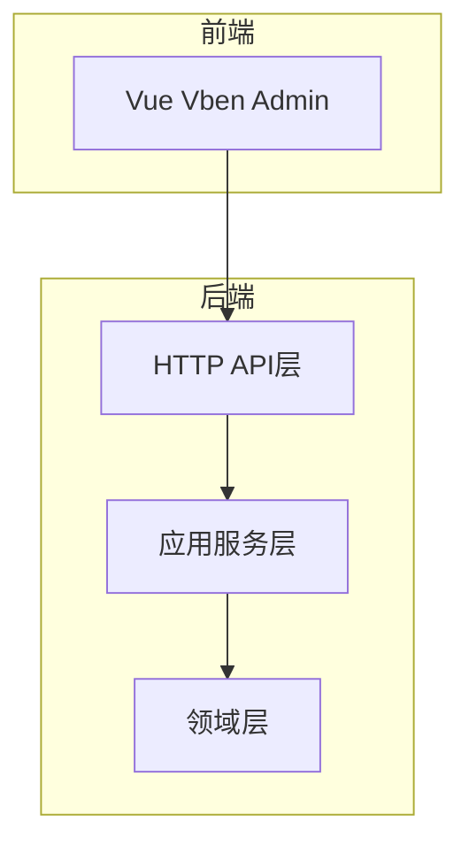
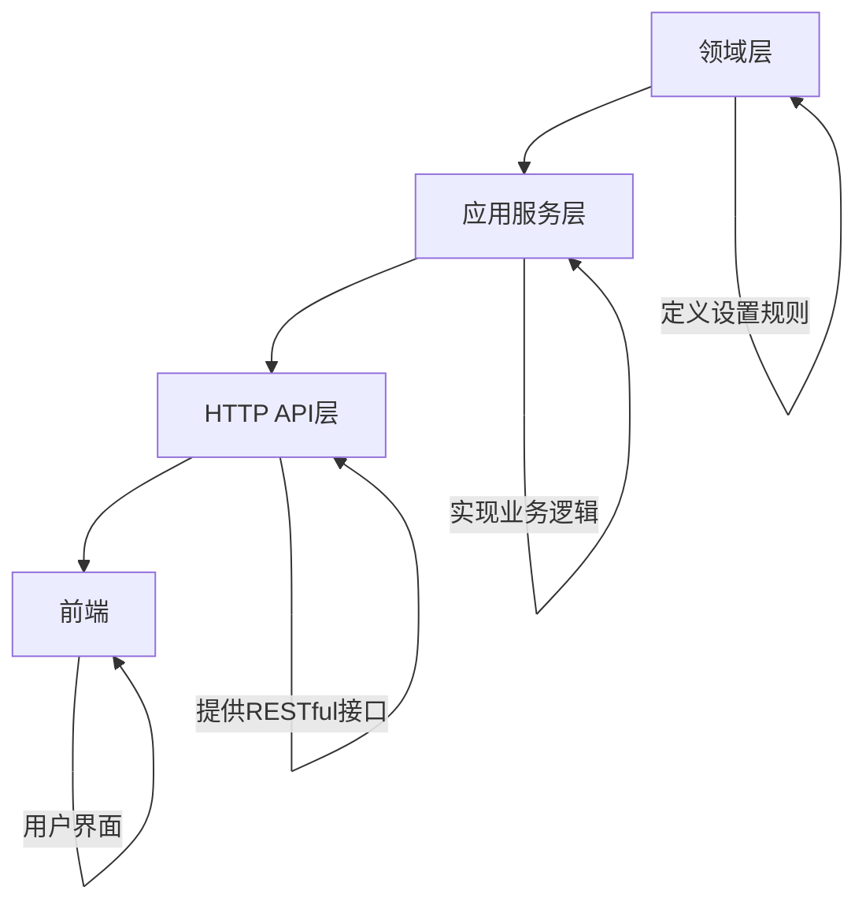
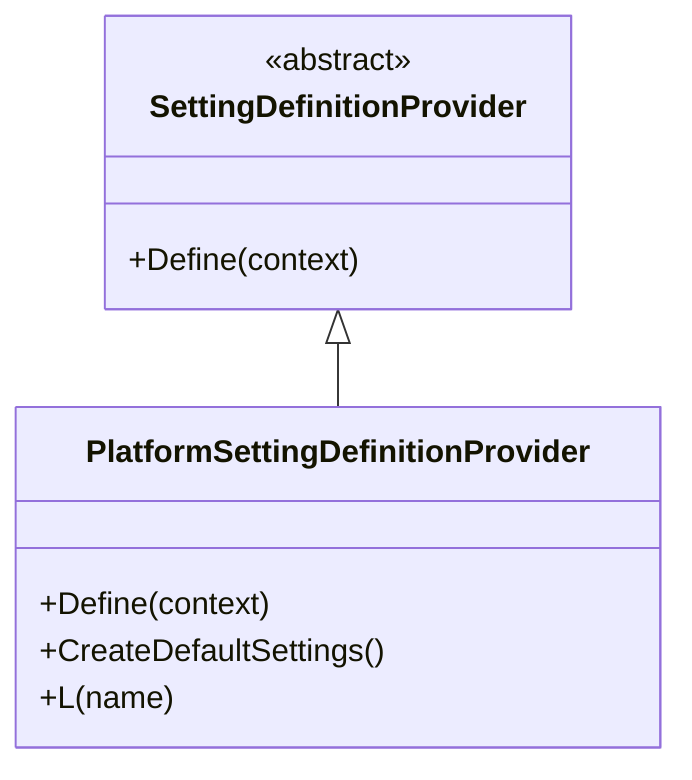
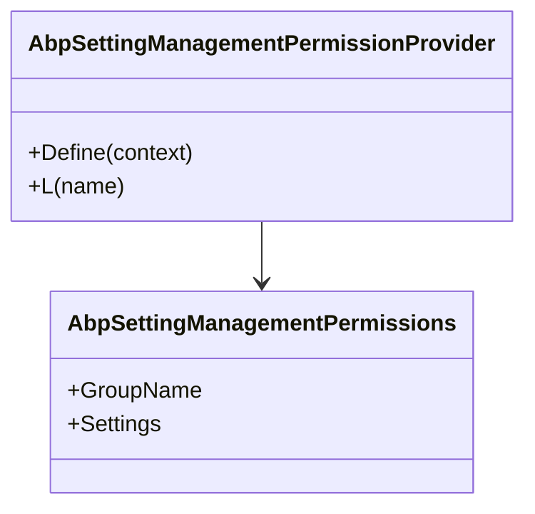
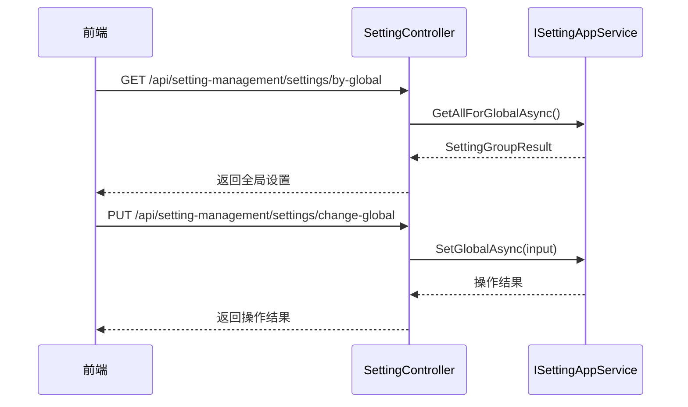
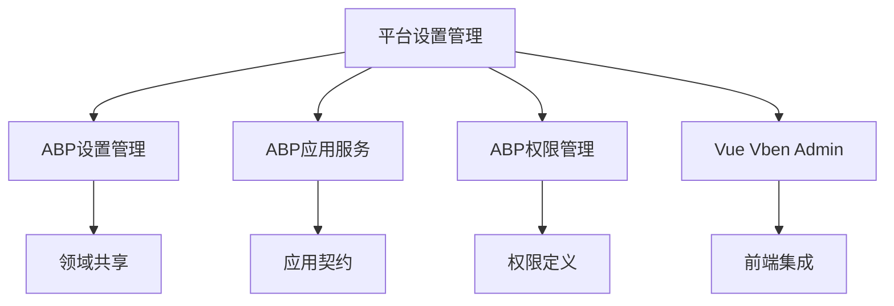

# 平台设置管理

<cite>
**本文档引用的文件**  
- [PlatformSettingDefinitionProvider.cs](file://aspnet-core/modules/platform/LINGYUN.Platform.Domain/LINGYUN/Platform/Settings/PlatformSettingDefinitionProvider.cs)
- [SettingManagementAppServiceBase.cs](file://aspnet-core/modules/settings/LINGYUN.Abp.SettingManagement.Application/LINGYUN/Abp/SettingManagement/SettingManagementAppServiceBase.cs)
- [AbpSettingManagementPermissions.cs](file://aspnet-core/framework/settings/LINGYUN.Abp.SettingManagement.Application.Contracts/LINGYUN/Abp/SettingManagement/AbpSettingManagementPermissions.cs)
- [AbpSettingManagementPermissionProvider.cs](file://aspnet-core/framework/settings/LINGYUN.Abp.SettingManagement.Application.Contracts/LINGYUN/Abp/SettingManagement/AbpSettingManagementPermissionProvider.cs)
- [SettingController.cs](file://aspnet-core/modules/settings/LINGYUN.Abp.SettingManagement.HttpApi/LINGYUN/Abp/SettingManagement/SettingController.cs)
- [README.md](file://aspnet-core/modules/settings/LINGYUN.Abp.SettingManagement.HttpApi/README.md)
- [LINGYUN.Platform.Settings.VueVbenAdmin](file://aspnet-core/modules/platform/LINGYUN.Platform.Settings.VueVbenAdmin)
</cite>

## 目录
1. [简介](#简介)
2. [项目结构](#项目结构)
3. [核心组件](#核心组件)
4. [架构概述](#架构概述)
5. [详细组件分析](#详细组件分析)
6. [依赖分析](#依赖分析)
7. [性能考虑](#性能考虑)
8. [故障排除指南](#故障排除指南)
9. [结论](#结论)

## 简介
本项目是一个基于ABP框架的微服务架构平台，专注于提供全面的平台设置管理功能。系统实现了多层级的设置管理机制，包括全局设置、租户特定设置和用户个性化设置。通过模块化设计，平台支持灵活的配置管理，同时与Vue Vben Admin前端框架深度集成，为用户提供直观的设置界面。系统采用分层架构，包含领域模型、应用服务和HTTP API层，确保了代码的可维护性和扩展性。

## 项目结构
平台设置管理模块采用清晰的分层架构，主要包含以下几个核心部分：领域层负责定义设置的实体和业务规则，应用服务层实现具体的业务逻辑，HTTP API层提供RESTful接口供前端调用。模块之间通过依赖注入进行解耦，确保了系统的可测试性和可维护性。

**Diagram sources**
- [SettingController.cs](file://aspnet-core/modules/settings/LINGYUN.Abp.SettingManagement.HttpApi/LINGYUN/Abp/SettingManagement/SettingController.cs)
- [SettingManagementAppServiceBase.cs](file://aspnet-core/modules/settings/LINGYUN.Abp.SettingManagement.Application/LINGYUN/Abp/SettingManagement/SettingManagementAppServiceBase.cs)
- [PlatformSettingDefinitionProvider.cs](file://aspnet-core/modules/platform/LINGYUN.Platform.Domain/LINGYUN/Platform/Settings/PlatformSettingDefinitionProvider.cs)

**Section sources**
- [PlatformSettingDefinitionProvider.cs](file://aspnet-core/modules/platform/LINGYUN.Platform.Domain/LINGYUN/Platform/Settings/PlatformSettingDefinitionProvider.cs)
- [SettingManagementAppServiceBase.cs](file://aspnet-core/modules/settings/LINGYUN.Abp.SettingManagement.Application/LINGYUN/Abp/SettingManagement/SettingManagementAppServiceBase.cs)

## 核心组件
平台设置管理模块的核心组件包括设置定义提供者、应用服务基类、权限管理器和HTTP API控制器。这些组件共同构成了一个完整的设置管理系统，支持动态配置、权限控制和多租户隔离。

**Section sources**
- [PlatformSettingDefinitionProvider.cs](file://aspnet-core/modules/platform/LINGYUN.Platform.Domain/LINGYUN/Platform/Settings/PlatformSettingDefinitionProvider.cs)
- [SettingManagementAppServiceBase.cs](file://aspnet-core/modules/settings/LINGYUN.Abp.SettingManagement.Application/LINGYUN/Abp/SettingManagement/SettingManagementAppServiceBase.cs)
- [AbpSettingManagementPermissions.cs](file://aspnet-core/framework/settings/LINGYUN.Abp.SettingManagement.Application.Contracts/LINGYUN/Abp/SettingManagement/AbpSettingManagementPermissions.cs)

## 架构概述
平台设置管理采用典型的分层架构设计，从下到上依次为领域层、应用服务层和HTTP API层。领域层定义了设置的基本概念和规则，应用服务层实现了具体的业务逻辑，HTTP API层则负责与前端进行交互。这种分层设计确保了系统的可维护性和可扩展性。

**Diagram sources**
- [PlatformSettingDefinitionProvider.cs](file://aspnet-core/modules/platform/LINGYUN.Platform.Domain/LINGYUN/Platform/Settings/PlatformSettingDefinitionProvider.cs)
- [SettingManagementAppServiceBase.cs](file://aspnet-core/modules/settings/LINGYUN.Abp.SettingManagement.Application/LINGYUN/Abp/SettingManagement/SettingManagementAppServiceBase.cs)
- [SettingController.cs](file://aspnet-core/modules/settings/LINGYUN.Abp.SettingManagement.HttpApi/LINGYUN/Abp/SettingManagement/SettingController.cs)

## 详细组件分析
### 平台设置定义分析
平台设置定义组件负责管理所有可用的设置项，包括主题、布局、菜单等配置。通过实现`SettingDefinitionProvider`接口，系统能够动态注册和管理各种设置项。

#### 类图

**Diagram sources**
- [PlatformSettingDefinitionProvider.cs](file://aspnet-core/modules/platform/LINGYUN.Platform.Domain/LINGYUN/Platform/Settings/PlatformSettingDefinitionProvider.cs)

#### 设置管理权限分析
设置管理权限组件定义了系统中所有与设置相关的权限，包括设置更新、组管理等操作的权限控制。

**Diagram sources**
- [AbpSettingManagementPermissions.cs](file://aspnet-core/framework/settings/LINGYUN.Abp.SettingManagement.Application.Contracts/LINGYUN/Abp/SettingManagement/AbpSettingManagementPermissions.cs)
- [AbpSettingManagementPermissionProvider.cs](file://aspnet-core/framework/settings/LINGYUN.Abp.SettingManagement.Application.Contracts/LINGYUN/Abp/SettingManagement/AbpSettingManagementPermissionProvider.cs)

#### HTTP API控制器分析
HTTP API控制器组件提供了RESTful接口，使前端能够通过标准的HTTP方法进行设置的读取和更新操作。

**Diagram sources**
- [SettingController.cs](file://aspnet-core/modules/settings/LINGYUN.Abp.SettingManagement.HttpApi/LINGYUN/Abp/SettingManagement/SettingController.cs)

**Section sources**
- [SettingController.cs](file://aspnet-core/modules/settings/LINGYUN.Abp.SettingManagement.HttpApi/LINGYUN/Abp/SettingManagement/SettingController.cs)
- [AbpSettingManagementPermissions.cs](file://aspnet-core/framework/settings/LINGYUN.Abp.SettingManagement.Application.Contracts/LINGYUN/Abp/SettingManagement/AbpSettingManagementPermissions.cs)

## 依赖分析
平台设置管理模块依赖于ABP框架的核心组件，包括设置管理、应用服务和权限管理模块。同时，它与其他模块如Vue Vben Admin前端集成，实现了完整的设置管理功能。

**Diagram sources**
- [README.md](file://aspnet-core/modules/settings/LINGYUN.Abp.SettingManagement.HttpApi/README.md)
- [LINGYUN.Platform.Settings.VueVbenAdmin](file://aspnet-core/modules/platform/LINGYUN.Platform.Settings.VueVbenAdmin)

## 性能考虑
在设计平台设置管理时，考虑了缓存机制以提高性能。通过合理使用ABP框架提供的缓存功能，可以减少数据库查询次数，提高系统响应速度。同时，API接口设计遵循RESTful原则，确保了良好的可扩展性和兼容性。

## 故障排除指南
当遇到设置无法保存或读取的问题时，首先检查权限配置是否正确。确保当前用户具有`SettingManagement.Settings.Update`权限。其次，验证数据库连接是否正常，以及设置表是否存在。最后，检查日志文件以获取更详细的错误信息。

**Section sources**
- [AbpSettingManagementPermissions.cs](file://aspnet-core/framework/settings/LINGYUN.Abp.SettingManagement.Application.Contracts/LINGYUN/Abp/SettingManagement/AbpSettingManagementPermissions.cs)
- [SettingController.cs](file://aspnet-core/modules/settings/LINGYUN.Abp.SettingManagement.HttpApi/LINGYUN/Abp/SettingManagement/SettingController.cs)

## 结论
平台设置管理模块提供了一个完整、灵活且安全的配置管理解决方案。通过分层架构设计和模块化实现，系统能够满足不同场景下的配置需求。与Vue Vben Admin前端的深度集成，为用户提供了友好的配置界面。未来可以进一步优化缓存策略，提高系统性能。