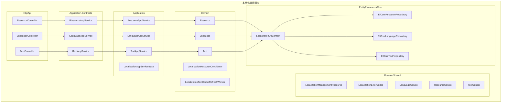
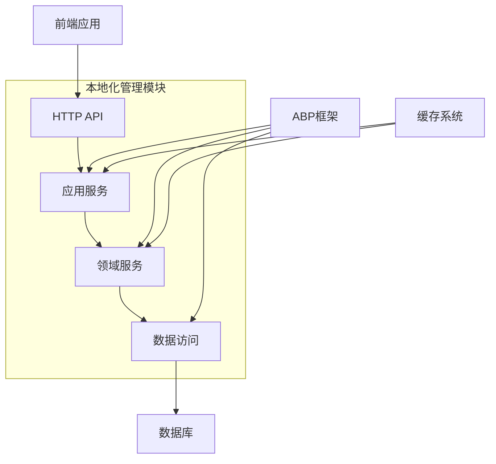

# 本地化管理模块

<cite>
**本文档中引用的文件**  
- [AbpLocalizationManagementDomainSharedModule.cs](file://aspnet-core/modules/localization-management/LINGYUN.Abp.LocalizationManagement.Domain.Shared/LINGYUN/Abp/LocalizationManagement/AbpLocalizationManagementDomainSharedModule.cs)
- [AbpLocalizationManagementDomainModule.cs](file://aspnet-core/modules/localization-management/LINGYUN.Abp.LocalizationManagement.Domain/LINGYUN/Abp/LocalizationManagement/AbpLocalizationManagementDomainModule.cs)
- [AbpLocalizationManagementApplicationModule.cs](file://aspnet-core/modules/localization-management/LINGYUN.Abp.LocalizationManagement.Application/LINGYUN/Abp/LocalizationManagement/AbpLocalizationManagementApplicationModule.cs)
- [LocalizationDbContext.cs](file://aspnet-core/modules/localization-management/LINGYUN.Abp.LocalizationManagement.EntityFrameworkCore/LINGYUN/Abp/LocalizationManagement/EntityFrameworkCore/LocalizationDbContext.cs)
- [Resource.cs](file://aspnet-core/modules/localization-management/LINGYUN.Abp.LocalizationManagement.Domain/LINGYUN/Abp/LocalizationManagement/Resource.cs)
- [Language.cs](file://aspnet-core/modules/localization-management/LINGYUN.Abp.LocalizationManagement.Domain/LINGYUN/Abp/LocalizationManagement/Language.cs)
- [Text.cs](file://aspnet-core/modules/localization-management/LINGYUN.Abp.LocalizationManagement.Domain/LINGYUN/Abp/LocalizationManagement/Text.cs)
- [LocalizationManagementResource.cs](file://aspnet-core/modules/localization-management/LINGYUN.Abp.LocalizationManagement.Domain.Shared/LINGYUN/Abp/LocalizationManagement/Localization/LocalizationManagementResource.cs)
- [LocalizationErrorCodes.cs](file://aspnet-core/modules/localization-management/LINGYUN.Abp.LocalizationManagement.Domain.Shared/LINGYUN/Abp/LocalizationManagement/LocalizationErrorCodes.cs)
- [LanguageConsts.cs](file://aspnet-core/modules/localization-management/LINGYUN.Abp.LocalizationManagement.Domain.Shared/LINGYUN/Abp/LocalizationManagement/LanguageConsts.cs)
- [ResourceConsts.cs](file://aspnet-core/modules/localization-management/LINGYUN.Abp.LocalizationManagement.Domain.Shared/LINGYUN/Abp/LocalizationManagement/ResourceConsts.cs)
- [TextConsts.cs](file://aspnet-core/modules/localization-management/LINGYUN.Abp.LocalizationManagement.Domain.Shared/LINGYUN/Abp/LocalizationManagement/TextConsts.cs)
- [LocalizationAppServiceBase.cs](file://aspnet-core/modules/localization-management/LINGYUN.Abp.LocalizationManagement.Application/LINGYUN/Abp/LocalizationManagement/LocalizationAppServiceBase.cs)
- [ResourceAppService.cs](file://aspnet-core/modules/localization-management/LINGYUN.Abp.LocalizationManagement.Application/LINGYUN/Abp/LocalizationManagement/ResourceAppService.cs)
- [LanguageAppService.cs](file://aspnet-core/modules/localization-management/LINGYUN.Abp.LocalizationManagement.Application/LINGYUN/Abp/LocalizationManagement/LanguageAppService.cs)
- [TextAppService.cs](file://aspnet-core/modules/localization-management/LINGYUN.Abp.LocalizationManagement.Application/LINGYUN/Abp/LocalizationManagement/TextAppService.cs)
- [IResourceAppService.cs](file://aspnet-core/modules/localization-management/LINGYUN.Abp.LocalizationManagement.Application.Contracts/LINGYUN/Abp/LocalizationManagement/IResourceAppService.cs)
- [ILanguageAppService.cs](file://aspnet-core/modules/localization-management/LINGYUN.Abp.LocalizationManagement.Application.Contracts/LINGYUN/Abp/LocalizationManagement/ILanguageAppService.cs)
- [ITextAppService.cs](file://aspnet-core/modules/localization-management/LINGYUN.Abp.LocalizationManagement.Application.Contracts/LINGYUN/Abp/LocalizationManagement/ITextAppService.cs)
- [ResourceDto.cs](file://aspnet-core/modules/localization-management/LINGYUN.Abp.LocalizationManagement.Application.Contracts/LINGYUN/Abp/LocalizationManagement/ResourceDto.cs)
- [LanguageDto.cs](file://aspnet-core/modules/localization-management/LINGYUN.Abp.LocalizationManagement.Application.Contracts/LINGYUN/Abp/LocalizationManagement/LanguageDto.cs)
- [SetTextInput.cs](file://aspnet-core/modules/localization-management/LINGYUN.Abp.LocalizationManagement.Application.Contracts/LINGYUN/Abp/LocalizationManagement/SetTextInput.cs)
- [ResourceController.cs](file://aspnet-core/modules/localization-management/LINGYUN.Abp.LocalizationManagement.HttpApi/LINGYUN/Abp/LocalizationManagement/ResourceController.cs)
- [LanguageController.cs](file://aspnet-core/modules/localization-management/LINGYUN.Abp.LocalizationManagement.HttpApi/LINGYUN/Abp/LocalizationManagement/LanguageController.cs)
- [TextController.cs](file://aspnet-core/modules/localization-management/LINGYUN.Abp.LocalizationManagement.HttpApi/LINGYUN/Abp/LocalizationManagement/TextController.cs)
- [LocalizationManagementPermissionDefinitionProvider.cs](file://aspnet-core/modules/localization-management/LINGYUN.Abp.LocalizationManagement.Application.Contracts/LINGYUN/Abp/LocalizationManagement/Permissions/LocalizationManagementPermissionDefinitionProvider.cs)
- [LocalizationTextCacheRefreshWorker.cs](file://aspnet-core/modules/localization-management/LINGYUN.Abp.LocalizationManagement.Domain/LINGYUN/Abp/LocalizationManagement/LocalizationTextCacheRefreshWorker.cs)
- [LocalizationResourceContributor.cs](file://aspnet-core/modules/localization-management/LINGYUN.Abp.LocalizationManagement.Domain/LINGYUN/Abp/LocalizationManagement/LocalizationResourceContributor.cs)
- [LocalizationTextStoreCache.cs](file://aspnet-core/modules/localization-management/LINGYUN.Abp.LocalizationManagement.Domain/LINGYUN/Abp/LocalizationManagement/LocalizationTextStoreCache.cs)
- [LocalizationLanguageStoreCache.cs](file://aspnet-core/modules/localization-management/LINGYUN.Abp.LocalizationManagement.Domain/LINGYUN/Abp/LocalizationManagement/LocalizationLanguageStoreCache.cs)
</cite>

## 目录
1. [简介](#简介)
2. [项目结构](#项目结构)
3. [核心组件](#核心组件)
4. [架构概述](#架构概述)
5. [详细组件分析](#详细组件分析)
6. [依赖分析](#依赖分析)
7. [性能考虑](#性能考虑)
8. [故障排除指南](#故障排除指南)
9. [结论](#结论)

## 简介
本地化管理模块是一个用于动态管理多语言资源的系统，支持语言、资源和文本的增删改查操作。该模块通过EntityFrameworkCore实现数据持久化，通过应用服务层提供业务逻辑，并通过HTTP API接口暴露功能。模块支持内存缓存和分布式缓存同步，能够无缝集成到ABP框架中，为前后端应用提供灵活的本地化支持。

## 项目结构
本地化管理模块采用分层架构设计，包含共享域模型、领域层、应用层、实体框架核心层和HTTP API层。各层职责分明，遵循ABP框架的最佳实践。

**图示来源**
- [AbpLocalizationManagementApplicationModule.cs](file://aspnet-core/modules/localization-management/LINGYUN.Abp.LocalizationManagement.Application/LINGYUN/Abp/LocalizationManagement/AbpLocalizationManagementApplicationModule.cs)
- [AbpLocalizationManagementDomainModule.cs](file://aspnet-core/modules/localization-management/LINGYUN.Abp.LocalizationManagement.Domain/LINGYUN/Abp/LocalizationManagement/AbpLocalizationManagementDomainModule.cs)
- [AbpLocalizationManagementDomainSharedModule.cs](file://aspnet-core/modules/localization-management/LINGYUN.Abp.LocalizationManagement.Domain.Shared/LINGYUN/Abp/LocalizationManagement/AbpLocalizationManagementDomainSharedModule.cs)
- [LocalizationDbContext.cs](file://aspnet-core/modules/localization-management/LINGYUN.Abp.LocalizationManagement.EntityFrameworkCore/LINGYUN/Abp/LocalizationManagement/EntityFrameworkCore/LocalizationDbContext.cs)

**本节来源**
- [README.EN.md](file://aspnet-core/modules/localization-management/README.EN.md)

## 核心组件
本地化管理模块的核心组件包括资源（Resource）、语言（Language）和文本（Text）三个实体，分别代表本地化资源包、支持的语言种类和具体的本地化文本。这些实体通过领域服务进行管理，并通过应用服务暴露给外部系统。

**本节来源**
- [Resource.cs](file://aspnet-core/modules/localization-management/LINGYUN.Abp.LocalizationManagement.Domain/LINGYUN/Abp/LocalizationManagement/Resource.cs)
- [Language.cs](file://aspnet-core/modules/localization-management/LINGYUN.Abp.LocalizationManagement.Domain/LINGYUN/Abp/LocalizationManagement/Language.cs)
- [Text.cs](file://aspnet-core/modules/localization-management/LINGYUN.Abp.LocalizationManagement.Domain/LINGYUN/Abp/LocalizationManagement/Text.cs)

## 架构概述
本地化管理模块采用典型的分层架构，从下到上依次为数据访问层、领域层、应用层和表现层。模块通过ABP框架的依赖注入机制实现各层之间的松耦合。

**图示来源**
- [AbpLocalizationManagementHttpApiModule.cs](file://aspnet-core/modules/localization-management/LINGYUN.Abp.LocalizationManagement.HttpApi/LINGYUN/Abp/LocalizationManagement/AbpLocalizationManagementHttpApiModule.cs)
- [AbpLocalizationManagementApplicationModule.cs](file://aspnet-core/modules/localization-management/LINGYUN.Abp.LocalizationManagement.Application/LINGYUN/Abp/LocalizationManagement/AbpLocalizationManagementApplicationModule.cs)
- [AbpLocalizationManagementDomainModule.cs](file://aspnet-core/modules/localization-management/LINGYUN.Abp.LocalizationManagement.Domain/LINGYUN/Abp/LocalizationManagement/AbpLocalizationManagementDomainModule.cs)
- [AbpLocalizationManagementEntityFrameworkCoreModule.cs](file://aspnet-core/modules/localization-management/LINGYUN.Abp.LocalizationManagement.EntityFrameworkCore/LINGYUN/Abp/LocalizationManagement/EntityFrameworkCore/AbpLocalizationManagementEntityFrameworkCoreModule.cs)

## 详细组件分析

### 实体模型分析
本地化管理模块包含三个核心实体：资源、语言和文本，它们构成了本地化系统的数据模型。

#### 实体类图
