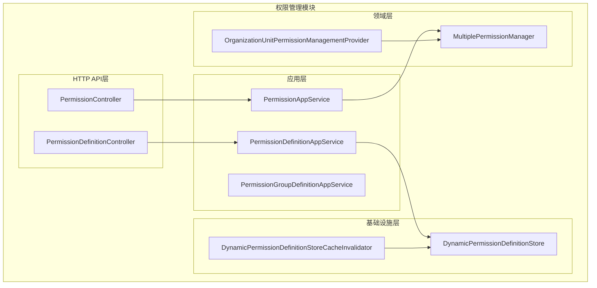
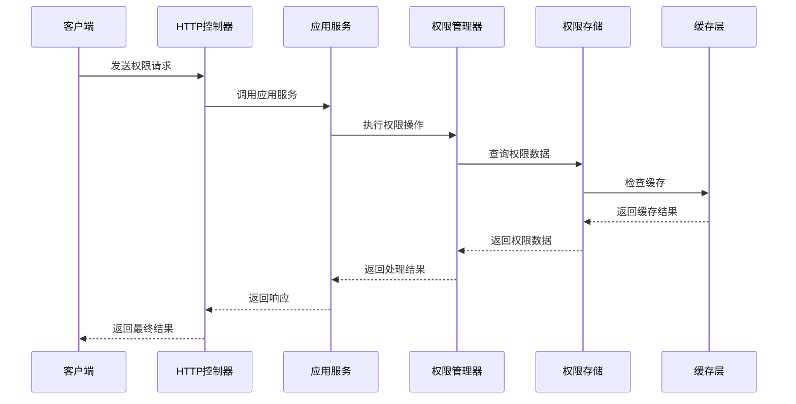
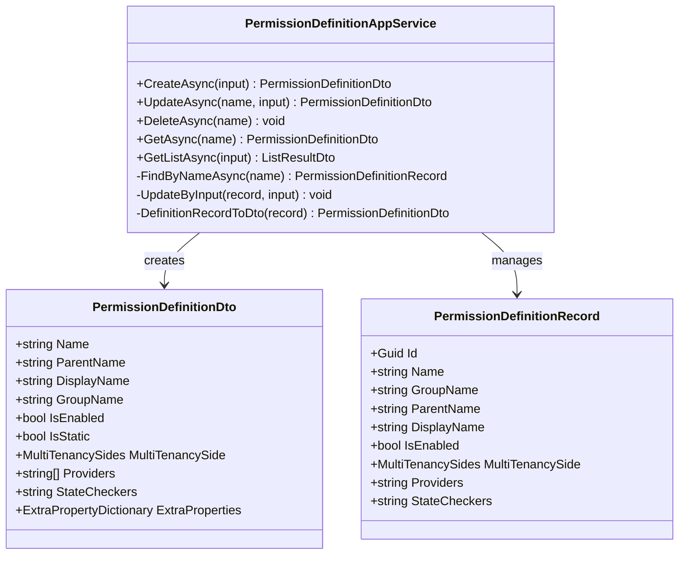
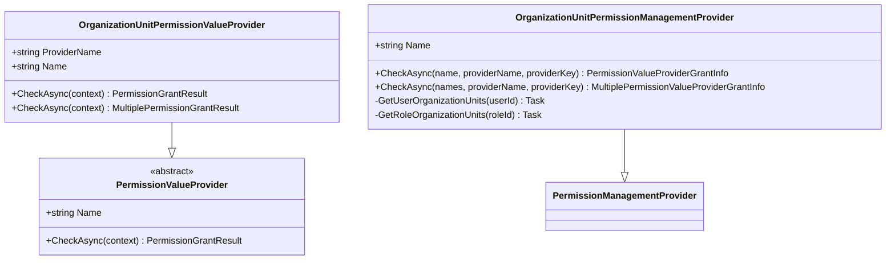
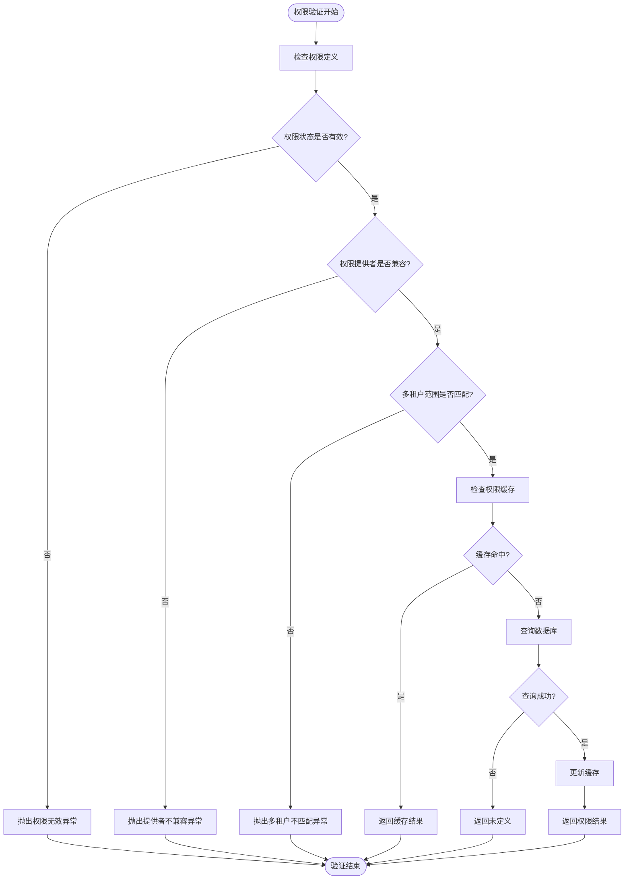
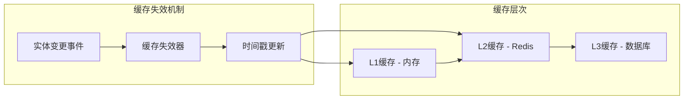
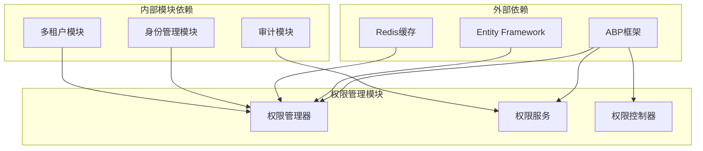

# 权限管理模块

<cite>
**本文档中引用的文件**
- [MultiplePermissionManager.cs](file://aspnet-core/modules/permissions-management/LINGYUN.Abp.PermissionManagement.Application/LINGYUN/Abp/PermissionManagement/MultiplePermissionManager.cs)
- [PermissionAppService.cs](file://aspnet-core/modules/permissions-management/LINGYUN.Abp.PermissionManagement.Application/LINGYUN/Abp/PermissionManagement/PermissionAppService.cs)
- [PermissionDefinitionAppService.cs](file://aspnet-core/modules/permissions-management/LINGYUN.Abp.PermissionManagement.Application/LINGYUN/Abp/PermissionManagement/Definitions/PermissionDefinitionAppService.cs)
- [PermissionManagementPermissionDefinitionProvider.cs](file://aspnet-core/modules/permissions-management/LINGYUN.Abp.PermissionManagement.Application.Contracts/LINGYUN/Abp/PermissionManagement/Permissions/PermissionManagementPermissionDefinitionProvider.cs)
- [OrganizationUnitPermissionValueProvider.cs](file://aspnet-core/framework/authorization/LINGYUN.Abp.Authorization.OrganizationUnits/LINGYUN/Abp/Authorization/Permissions/OrganizationUnitPermissionValueProvider.cs)
- [OrganizationUnitPermissionManagementProvider.cs](file://aspnet-core/modules/permissions-management/LINGYUN.Abp.PermissionManagement.Domain.OrganizationUnits/LINGYUN/Abp/PermissionManagement/OrganizationUnits/OrganizationUnitPermissionManagementProvider.cs)
- [PermissionDefinitionController.cs](file://aspnet-core/modules/permissions-management/LINGYUN.Abp.PermissionManagement.HttpApi/LINGYUN/Abp/PermissionManagement/HttpApi/Definitions/PermissionDefinitionController.cs)
- [AbpPermissionManagementApplicationModule.cs](file://aspnet-core/modules/permissions-management/LINGYUN.Abp.PermissionManagement.Application/LINGYUN/Abp/PermissionManagement/AbpPermissionManagementApplicationModule.cs)
- [DynamicPermissionDefinitionStoreCacheInvalidator.cs](file://aspnet-core/modules/permissions-management/LINGYUN.Abp.PermissionManagement.Application/LINGYUN/Abp/PermissionManagement/Definitions/DynamicPermissionDefinitionStoreCacheInvalidator.cs)
</cite>

## 目录
1. [简介](#简介)
2. [项目结构](#项目结构)
3. [核心组件](#核心组件)
4. [架构概览](#架构概览)
5. [详细组件分析](#详细组件分析)
6. [依赖关系分析](#依赖关系分析)
7. [性能考虑](#性能考虑)
8. [故障排除指南](#故障排除指南)
9. [结论](#结论)

## 简介

权限管理模块是基于ABP框架构建的完整权限控制系统，提供了强大的权限定义、分配和验证机制。该模块支持多租户环境下的权限隔离，集成了身份管理模块，实现了用户、角色、组织机构的权限控制。

模块的核心特性包括：
- 基于ABP框架的权限系统实现
- 多租户权限隔离机制
- 组织单元权限管理
- 动态权限管理
- 权限缓存策略
- 权限验证拦截器
- REST API接口支持

## 项目结构

权限管理模块采用分层架构设计，包含以下主要组件：



**图表来源**
- [MultiplePermissionManager.cs](file://aspnet-core/modules/permissions-management/LINGYUN.Abp.PermissionManagement.Application/LINGYUN/Abp/PermissionManagement/MultiplePermissionManager.cs#L1-L109)
- [PermissionAppService.cs](file://aspnet-core/modules/permissions-management/LINGYUN.Abp.PermissionManagement.Application/LINGYUN/Abp/PermissionManagement/PermissionAppService.cs#L1-L45)

## 核心组件

### MultiplePermissionManager

`MultiplePermissionManager`是权限管理系统的核心组件，负责处理多个权限的批量设置和验证。

```csharp
[Dependency(ReplaceServices = true)]
[ExposeServices(
    typeof(IMultiplePermissionManager),
    typeof(PermissionManager),
    typeof(MultiplePermissionManager))]
public class MultiplePermissionManager : PermissionManager, IMultiplePermissionManager, ISingletonDependency
```

该类的主要功能：
- 批量设置权限状态
- 权限状态验证
- 多租户权限检查
- 权限提供者兼容性检查

### PermissionAppService

`PermissionAppService`提供了权限管理的API接口，支持权限的增删改查操作。

```csharp
[Dependency(ReplaceServices = true)]
[ExposeServices(
    typeof(IPermissionAppService), 
    typeof(VoloPermissionAppService),
    typeof(PermissionAppService))]
public class PermissionAppService : VoloPermissionAppService
```

**章节来源**
- [MultiplePermissionManager.cs](file://aspnet-core/modules/permissions-management/LINGYUN.Abp.PermissionManagement.Application/LINGYUN/Abp/PermissionManagement/MultiplePermissionManager.cs#L15-L25)
- [PermissionAppService.cs](file://aspnet-core/modules/permissions-management/LINGYUN.Abp.PermissionManagement.Application/LINGYUN/Abp/PermissionManagement/PermissionAppService.cs#L11-L21)

## 架构概览

权限管理模块采用分层架构，结合ABP框架的权限管理机制，实现了完整的权限控制体系：



**图表来源**
- [PermissionAppService.cs](file://aspnet-core/modules/permissions-management/LINGYUN.Abp.PermissionManagement.Application/LINGYUN/Abp/PermissionManagement/PermissionAppService.cs#L25-L40)
- [MultiplePermissionManager.cs](file://aspnet-core/modules/permissions-management/LINGYUN.Abp.PermissionManagement.Application/LINGYUN/Abp/PermissionManagement/MultiplePermissionManager.cs#L40-L85)

## 详细组件分析

### 权限定义管理

权限定义管理是权限系统的基础，负责权限的创建、更新、删除和查询操作。



**图表来源**
- [PermissionDefinitionAppService.cs](file://aspnet-core/modules/permissions-management/LINGYUN.Abp.PermissionManagement.Application/LINGYUN/Abp/PermissionManagement/Definitions/PermissionDefinitionAppService.cs#L25-L35)
- [PermissionDefinitionDto.cs](file://aspnet-core/modules/permissions-management/LINGYUN.Abp.PermissionManagement.Application.Contracts/LINGYUN/Abp/PermissionManagement/Definitions/Dto/PermissionDefinitionDto.cs#L1-L27)

### 组织单元权限提供者

组织单元权限提供者实现了基于组织单元的权限验证机制：



**图表来源**
- [OrganizationUnitPermissionValueProvider.cs](file://aspnet-core/framework/authorization/LINGYUN.Abp.Authorization.OrganizationUnits/LINGYUN/Abp/Authorization/Permissions/OrganizationUnitPermissionValueProvider.cs#L8-L15)
- [OrganizationUnitPermissionManagementProvider.cs](file://aspnet-core/modules/permissions-management/LINGYUN.Abp.PermissionManagement.Domain.OrganizationUnits/LINGYUN/Abp/PermissionManagement/OrganizationUnits/OrganizationUnitPermissionManagementProvider.cs#L15-L25)

### 权限验证流程

权限验证是整个系统的核心，确保只有授权用户才能访问特定资源：



**图表来源**
- [MultiplePermissionManager.cs](file://aspnet-core/modules/permissions-management/LINGYUN.Abp.PermissionManagement.Application/LINGYUN/Abp/PermissionManagement/MultiplePermissionManager.cs#L40-L85)

**章节来源**
- [PermissionDefinitionAppService.cs](file://aspnet-core/modules/permissions-management/LINGYUN.Abp.PermissionManagement.Application/LINGYUN/Abp/PermissionManagement/Definitions/PermissionDefinitionAppService.cs#L40-L100)
- [OrganizationUnitPermissionValueProvider.cs](file://aspnet-core/framework/authorization/LINGYUN.Abp.Authorization.OrganizationUnits/LINGYUN/Abp/Authorization/Permissions/OrganizationUnitPermissionValueProvider.cs#L20-L40)

### 多租户权限隔离

多租户权限隔离确保不同租户之间的权限完全隔离：

```csharp
// 检查权限多租户范围
var multiTenancySide = CurrentTenant.GetMultiTenancySide();
var invalidMultiTenancySidePermissions = existsPermissions
    .Where(x => !x.Definition.MultiTenancySide.HasFlag(multiTenancySide))
    .Select(x => x.Definition.Name);
if (invalidMultiTenancySidePermissions.Any())
{
    throw new ApplicationException($"The permission named '{invalidMultiTenancySidePermissions.JoinAsString(";")}' has multitenancy side which is not compatible with the current multitenancy side '{multiTenancySide}'");
}
```

### 权限缓存策略

系统采用分布式缓存策略来提高权限验证性能：



**图表来源**
- [DynamicPermissionDefinitionStoreCacheInvalidator.cs](file://aspnet-core/modules/permissions-management/LINGYUN.Abp.PermissionManagement.Application/LINGYUN/Abp/PermissionManagement/Definitions/DynamicPermissionDefinitionStoreCacheInvalidator.cs#L31-L63)

**章节来源**
- [MultiplePermissionManager.cs](file://aspnet-core/modules/permissions-management/LINGYUN.Abp.PermissionManagement.Application/LINGYUN/Abp/PermissionManagement/MultiplePermissionManager.cs#L75-L85)
- [DynamicPermissionDefinitionStoreCacheInvalidator.cs](file://aspnet-core/modules/permissions-management/LINGYUN.Abp.PermissionManagement.Application/LINGYUN/Abp/PermissionManagement/Definitions/DynamicPermissionDefinitionStoreCacheInvalidator.cs#L1-L35)

## 依赖关系分析

权限管理模块的依赖关系体现了清晰的分层架构：



**图表来源**
- [AbpPermissionManagementApplicationModule.cs](file://aspnet-core/modules/permissions-management/LINGYUN.Abp.PermissionManagement.Application/LINGYUN/Abp/PermissionManagement/AbpPermissionManagementApplicationModule.cs#L6-L11)

**章节来源**
- [AbpPermissionManagementApplicationModule.cs](file://aspnet-core/modules/permissions-management/LINGYUN.Abp.PermissionManagement.Application/LINGYUN/Abp/PermissionManagement/AbpPermissionManagementApplicationModule.cs#L1-L13)

## 性能考虑

### 缓存优化策略

1. **多级缓存架构**：使用内存缓存和分布式缓存相结合的方式
2. **缓存失效机制**：基于实体变更事件的智能缓存失效
3. **批量操作优化**：支持批量权限设置以减少数据库交互

### 查询优化

1. **索引优化**：在权限表上建立适当的索引
2. **分页查询**：对大量权限数据进行分页处理
3. **延迟加载**：按需加载权限相关信息

### 并发控制

1. **事务管理**：确保权限操作的原子性
2. **锁机制**：防止并发权限修改冲突
3. **乐观锁**：使用版本号控制并发更新

## 故障排除指南

### 常见权限问题

1. **权限验证失败**
   - 检查权限定义是否存在
   - 验证权限提供者配置
   - 确认多租户范围设置

2. **缓存不一致**
   - 清理本地缓存
   - 检查分布式缓存连接
   - 触发缓存失效事件

3. **权限继承问题**
   - 检查权限层级关系
   - 验证父权限状态
   - 确认权限提供者兼容性

### 调试技巧

1. **启用详细日志**：开启权限验证日志记录
2. **监控缓存命中率**：跟踪缓存性能指标
3. **性能分析**：使用性能分析工具识别瓶颈

**章节来源**
- [MultiplePermissionManager.cs](file://aspnet-core/modules/permissions-management/LINGYUN.Abp.PermissionManagement.Application/LINGYUN/Abp/PermissionManagement/MultiplePermissionManager.cs#L60-L75)

## 结论

权限管理模块是一个功能完整、架构清晰的权限控制系统。它基于ABP框架构建，提供了强大的权限定义、分配和验证能力。模块的主要优势包括：

1. **完整的权限生命周期管理**：从权限定义到验证的全流程支持
2. **多租户友好设计**：确保不同租户间的权限完全隔离
3. **高性能缓存策略**：通过多级缓存提升系统性能
4. **灵活的扩展机制**：支持自定义权限提供者和验证逻辑
5. **完善的错误处理**：提供详细的错误信息和异常处理

该模块为企业级应用提供了可靠的权限管理基础，能够满足复杂业务场景下的权限控制需求。通过合理的配置和使用，可以构建安全、高效的应用系统。