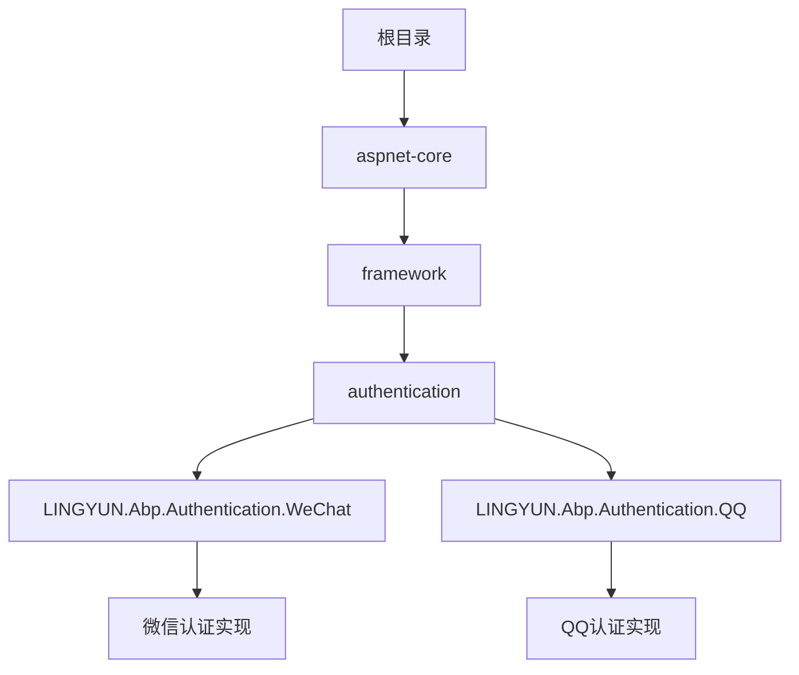
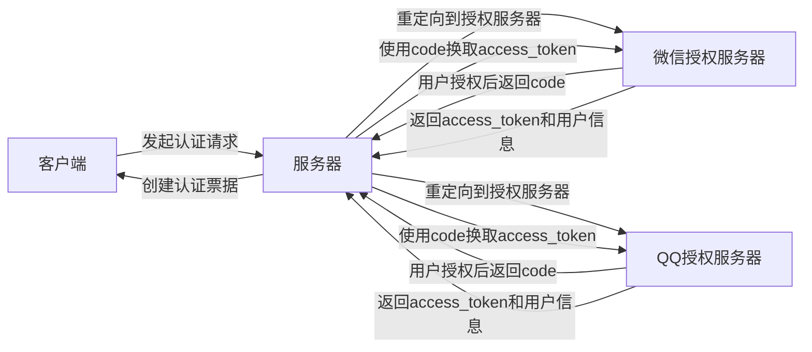
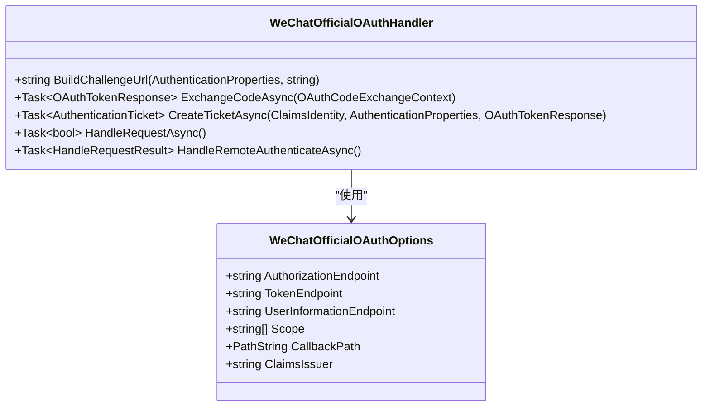
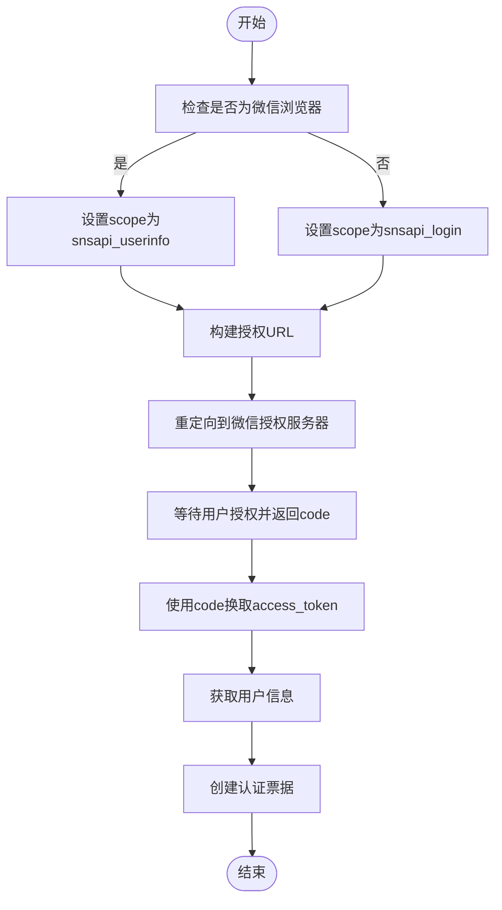
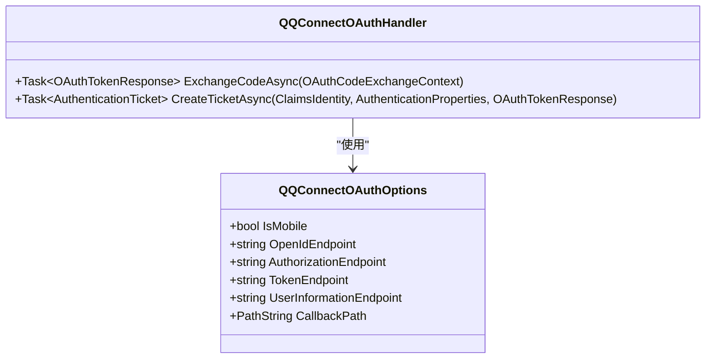
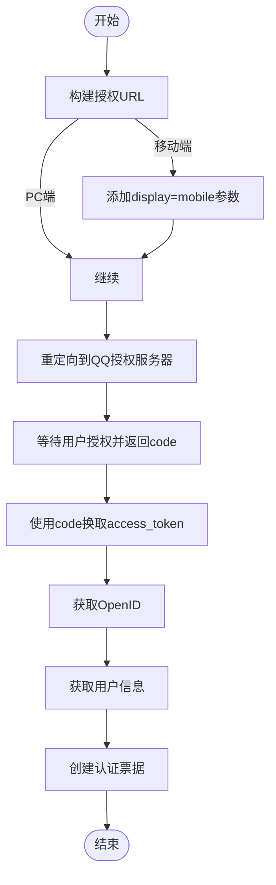
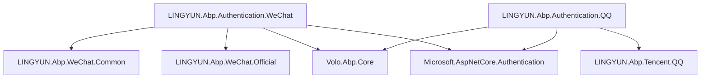

# OAuth集成

<cite>
**本文档引用的文件**
- [WeChatOfficialOAuthHandler.cs](file://aspnet-core/framework/authentication/LINGYUN.Abp.Authentication.WeChat/Microsoft/AspNetCore/Authentication/WeChat/Official/WeChatOfficialOAuthHandler.cs)
- [QQConnectOAuthHandler.cs](file://aspnet-core/framework/authentication/LINGYUN.Abp.Authentication.QQ/Microsoft/AspNetCore/Authentication/QQ/QQConnectOAuthHandler.cs)
- [AbpAuthenticationWeChatModule.cs](file://aspnet-core/framework/authentication/LINGYUN.Abp.Authentication.WeChat/LINGYUN/Abp/Authentication/WeChat/AbpAuthenticationWeChatModule.cs)
- [AbpAuthenticationQQModule.cs](file://aspnet-core/framework/authentication/LINGYUN.Abp.Authentication.QQ/LINGYUN/Abp/Authentication/QQ/AbpAuthenticationQQModule.cs)
- [WeChatOfficialOAuthOptions.cs](file://aspnet-core/framework/authentication/LINGYUN.Abp.Authentication.WeChat/Microsoft/AspNetCore/Authentication/WeChat/Official/WeChatOfficialOAuthOptions.cs)
- [QQConnectOAuthOptions.cs](file://aspnet-core/framework/authentication/LINGYUN.Abp.Authentication.QQ/Microsoft/AspNetCore/Authentication/QQ/QQConnectOAuthOptions.cs)
- [AbpAuthenticationWeChatConsts.cs](file://aspnet-core/framework/authentication/LINGYUN.Abp.Authentication.WeChat/LINGYUN/Abp/Authentication/WeChat/AbpAuthenticationWeChatConsts.cs)
- [AbpAuthenticationQQConsts.cs](file://aspnet-core/framework/authentication/LINGYUN.Abp.Authentication.QQ/LINGYUN/Abp/Authentication/QQ/AbpAuthenticationQQConsts.cs)
- [WeChatAuthenticationExtensions.cs](file://aspnet-core/framework/authentication/LINGYUN.Abp.Authentication.WeChat/Microsoft/AspNetCore/Authentication/WeChatAuthenticationExtensions.cs)
- [QQAuthenticationExtensions.cs](file://aspnet-core/framework/authentication/LINGYUN.Abp.Authentication.QQ/Microsoft/AspNetCore/Authentication/QQAuthenticationExtensions.cs)
- [AbpQQClaimTypes.cs](file://aspnet-core/framework/authentication/LINGYUN.Abp.Authentication.QQ/LINGYUN/Abp/Authentication/QQ/AbpQQClaimTypes.cs)
</cite>

## 目录
1. [简介](#简介)
2. [项目结构](#项目结构)
3. [核心组件](#核心组件)
4. [架构概述](#架构概述)
5. [详细组件分析](#详细组件分析)
6. [依赖关系分析](#依赖关系分析)
7. [性能考虑](#性能考虑)
8. [故障排除指南](#故障排除指南)
9. [结论](#结论)

## 简介
本文档详细介绍了ABP Next Admin项目中微信和QQ第三方登录提供商的OAuth集成机制。文档涵盖了OAuth配置、令牌交换流程、用户信息映射策略、添加新的第三方登录提供商的方法、OAuth回调处理以及错误处理机制。同时提供了安全考虑，包括令牌存储、作用域管理和用户数据隐私保护。

## 项目结构
该项目是一个基于ABP框架的微服务架构应用，包含多个模块和服务。与OAuth集成相关的代码主要位于`aspnet-core/framework/authentication`目录下，分别有针对微信和QQ的认证模块。

**图示来源**
- [WeChatOfficialOAuthHandler.cs](file://aspnet-core/framework/authentication/LINGYUN.Abp.Authentication.WeChat/Microsoft/AspNetCore/Authentication/WeChat/Official/WeChatOfficialOAuthHandler.cs)
- [QQConnectOAuthHandler.cs](file://aspnet-core/framework/authentication/LINGYUN.Abp.Authentication.QQ/Microsoft/AspNetCore/Authentication/QQ/QQConnectOAuthHandler.cs)

**章节来源**
- [WeChatOfficialOAuthHandler.cs](file://aspnet-core/framework/authentication/LINGYUN.Abp.Authentication.WeChat/Microsoft/AspNetCore/Authentication/WeChat/Official/WeChatOfficialOAuthHandler.cs)
- [QQConnectOAuthHandler.cs](file://aspnet-core/framework/authentication/LINGYUN.Abp.Authentication.QQ/Microsoft/AspNetCore/Authentication/QQ/QQConnectOAuthHandler.cs)

## 核心组件
本系统的核心OAuth组件包括微信和QQ两个独立的认证模块，每个模块都实现了完整的OAuth 2.0协议流程。这些组件通过继承ASP.NET Core的OAuthHandler基类来实现标准的认证流程，并与ABP框架的身份系统无缝集成。

**章节来源**
- [AbpAuthenticationWeChatModule.cs](file://aspnet-core/framework/authentication/LINGYUN.Abp.Authentication.WeChat/LINGYUN/Abp/Authentication/WeChat/AbpAuthenticationWeChatModule.cs)
- [AbpAuthenticationQQModule.cs](file://aspnet-core/framework/authentication/LINGYUN.Abp.Authentication.QQ/LINGYUN/Abp/Authentication/QQ/AbpAuthenticationQQModule.cs)

## 架构概述
系统的OAuth架构采用模块化设计，每个第三方登录提供商都有独立的模块实现。这种设计使得添加新的登录提供商变得简单且不会影响现有功能。

**图示来源**
- [WeChatOfficialOAuthHandler.cs](file://aspnet-core/framework/authentication/LINGYUN.Abp.Authentication.WeChat/Microsoft/AspNetCore/Authentication/WeChat/Official/WeChatOfficialOAuthHandler.cs)
- [QQConnectOAuthHandler.cs](file://aspnet-core/framework/authentication/LINGYUN.Abp.Authentication.QQ/Microsoft/AspNetCore/Authentication/QQ/QQConnectOAuthHandler.cs)

## 详细组件分析

### 微信认证组件分析
微信认证组件实现了完整的OAuth 2.0流程，支持公众号和PC端扫码登录两种模式。组件能够根据用户代理自动判断登录场景并选择合适的授权端点。

#### 类图

**图示来源**
- [WeChatOfficialOAuthHandler.cs](file://aspnet-core/framework/authentication/LINGYUN.Abp.Authentication.WeChat/Microsoft/AspNetCore/Authentication/WeChat/Official/WeChatOfficialOAuthHandler.cs)
- [WeChatOfficialOAuthOptions.cs](file://aspnet-core/framework/authentication/LINGYUN.Abp.Authentication.WeChat/Microsoft/AspNetCore/Authentication/WeChat/Official/WeChatOfficialOAuthOptions.cs)

#### 流程图

**图示来源**
- [WeChatOfficialOAuthHandler.cs](file://aspnet-core/framework/authentication/LINGYUN.Abp.Authentication.WeChat/Microsoft/AspNetCore/Authentication/WeChat/Official/WeChatOfficialOAuthHandler.cs)

**章节来源**
- [WeChatOfficialOAuthHandler.cs](file://aspnet-core/framework/authentication/LINGYUN.Abp.Authentication.WeChat/Microsoft/AspNetCore/Authentication/WeChat/Official/WeChatOfficialOAuthHandler.cs)
- [WeChatOfficialOAuthOptions.cs](file://aspnet-core/framework/authentication/LINGYUN.Abp.Authentication.WeChat/Microsoft/AspNetCore/Authentication/WeChat/Official/WeChatOfficialOAuthOptions.cs)

### QQ认证组件分析
QQ认证组件实现了QQ互联的OAuth 2.0认证流程，支持移动端和PC端的不同样式展示。

#### 类图

**图示来源**
- [QQConnectOAuthHandler.cs](file://aspnet-core/framework/authentication/LINGYUN.Abp.Authentication.QQ/Microsoft/AspNetCore/Authentication/QQ/QQConnectOAuthHandler.cs)
- [QQConnectOAuthOptions.cs](file://aspnet-core/framework/authentication/LINGYUN.Abp.Authentication.QQ/Microsoft/AspNetCore/Authentication/QQ/QQConnectOAuthOptions.cs)

#### 流程图

**图示来源**
- [QQConnectOAuthHandler.cs](file://aspnet-core/framework/authentication/LINGYUN.Abp.Authentication.QQ/Microsoft/AspNetCore/Authentication/QQ/QQConnectOAuthHandler.cs)

**章节来源**
- [QQConnectOAuthHandler.cs](file://aspnet-core/framework/authentication/LINGYUN.Abp.Authentication.QQ/Microsoft/AspNetCore/Authentication/QQ/QQConnectOAuthHandler.cs)
- [QQConnectOAuthOptions.cs](file://aspnet-core/framework/authentication/LINGYUN.Abp.Authentication.QQ/Microsoft/AspNetCore/Authentication/QQ/QQConnectOAuthOptions.cs)

## 依赖关系分析
OAuth认证模块与其他系统组件存在明确的依赖关系，确保了功能的完整性和可扩展性。

**图示来源**
- [AbpAuthenticationWeChatModule.cs](file://aspnet-core/framework/authentication/LINGYUN.Abp.Authentication.WeChat/LINGYUN/Abp/Authentication/WeChat/AbpAuthenticationWeChatModule.cs)
- [AbpAuthenticationQQModule.cs](file://aspnet-core/framework/authentication/LINGYUN.Abp.Authentication.QQ/LINGYUN/Abp/Authentication/QQ/AbpAuthenticationQQModule.cs)

**章节来源**
- [AbpAuthenticationWeChatModule.cs](file://aspnet-core/framework/authentication/LINGYUN.Abp.Authentication.WeChat/LINGYUN/Abp/Authentication/WeChat/AbpAuthenticationWeChatModule.cs)
- [AbpAuthenticationQQModule.cs](file://aspnet-core/framework/authentication/LINGYUN.Abp.Authentication.QQ/LINGYUN/Abp/Authentication/QQ/AbpAuthenticationQQModule.cs)

## 性能考虑
在OAuth集成中，性能主要受网络延迟和API调用次数的影响。当前实现已经过优化，减少了不必要的API调用：

1. 在获取用户信息时，直接使用access_token查询，避免了额外的验证步骤
2. 令牌交换和用户信息获取合并为最少的HTTP请求
3. 使用异步方法处理所有网络操作，避免阻塞线程

对于高并发场景，建议：
- 实现access_token缓存机制
- 对用户信息进行本地缓存
- 使用连接池管理HTTP客户端

## 故障排除指南
以下是常见的OAuth集成问题及其解决方案：

**章节来源**
- [WeChatOfficialOAuthHandler.cs](file://aspnet-core/framework/authentication/LINGYUN.Abp.Authentication.WeChat/Microsoft/AspNetCore/Authentication/WeChat/Official/WeChatOfficialOAuthHandler.cs)
- [QQConnectOAuthHandler.cs](file://aspnet-core/framework/authentication/LINGYUN.Abp.Authentication.QQ/Microsoft/AspNetCore/Authentication/QQ/QQConnectOAuthHandler.cs)

### 常见错误及处理

| 错误类型 | 可能原因 | 解决方案 |
|---------|--------|---------|
| code未找到 | 回调URL配置错误或用户取消授权 | 检查appsettings.json中的CallbackPath配置，确认授权域名已正确配置 |
| access_token获取失败 | AppId或AppSecret错误 | 核对微信/QQ开放平台的应用凭证 |
| 用户信息获取失败 | access_token过期或权限不足 | 检查scope配置是否包含必要权限，如snsapi_userinfo |
| Correlation failed | CSRF验证失败 | 确保会话状态正常工作，检查SameSite Cookie设置 |

### 调试技巧
1. 启用详细的日志记录，查看具体的错误响应
2. 使用Fiddler或类似工具捕获HTTP流量，分析请求和响应
3. 检查时间同步，OAuth对时间敏感
4. 验证重定向URI是否完全匹配配置

## 结论
ABP Next Admin项目的OAuth集成设计良好，具有以下优势：
- 模块化架构，易于扩展新的第三方登录提供商
- 完整的错误处理机制
- 与ABP框架身份系统的无缝集成
- 支持多种登录场景（移动端、PC端、微信内浏览器）

要添加新的第三方登录提供商，可以参照现有实现创建类似的模块，主要需要实现：
1. 继承OAuthHandler的处理程序
2. 定义相应的选项类
3. 创建扩展方法简化注册
4. 配置必要的常量和声明类型

该设计模式清晰，代码复用度高，便于维护和扩展。