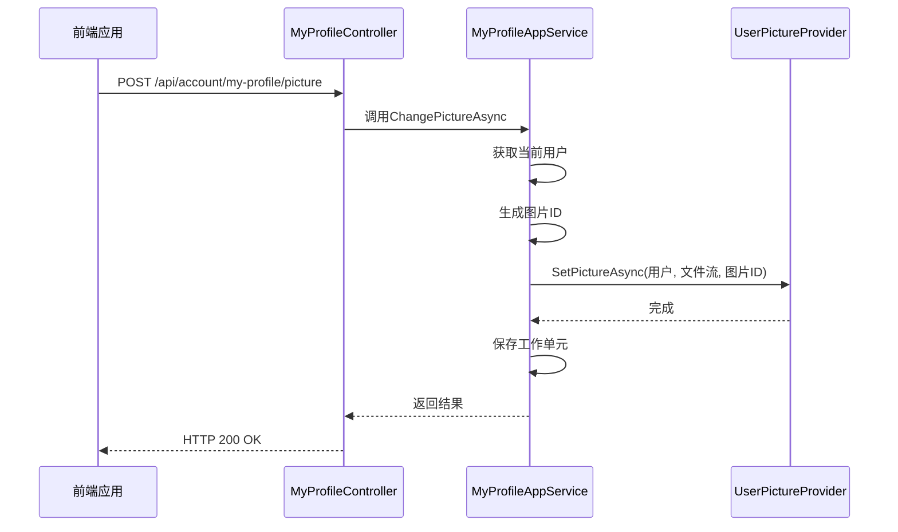
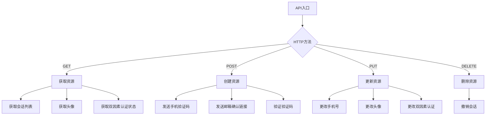
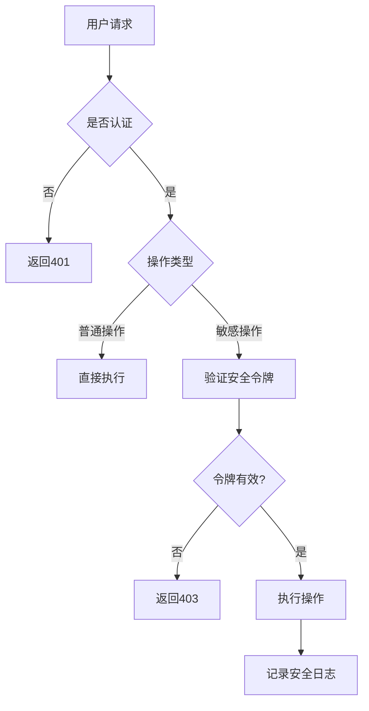
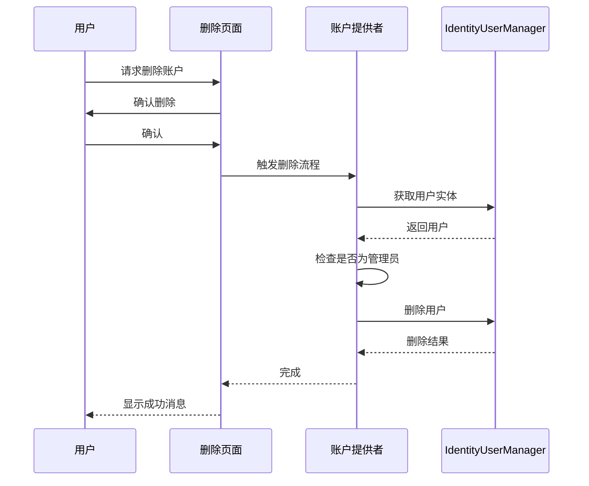

# 账户信息管理

<cite>
**本文档引用的文件**
- [MyProfileAppService.cs](file://aspnet-core/modules/account/LINGYUN.Abp.Account.Application/LINGYUN/Abp/Account/MyProfileAppService.cs)
- [MyProfileController.cs](file://aspnet-core/modules/account/LINGYUN.Abp.Account.HttpApi/LINGYUN/Abp/Account/MyProfileController.cs)
- [IMyProfileAppService.cs](file://aspnet-core/modules/account/LINGYUN.Abp.Account.Application.Contracts/LINGYUN/Abp/Account/IMyProfileAppService.cs)
- [ChangePictureInput.cs](file://aspnet-core/modules/account/LINGYUN.Abp.Account.Application.Contracts/LINGYUN/Abp/Account/Dto/ChangePictureInput.cs)
- [AbpGdprIdentityUserAccountProvider.cs](file://aspnet-core/modules/gdpr/LINGYUN.Abp.Gdpr.Domain.Identity/LINGYUN/Abp/Gdpr/Identity/AbpGdprIdentityUserAccountProvider.cs)
</cite>

## 目录
1. [简介](#简介)
2. [核心功能实现](#核心功能实现)
3. [API接口设计](#api接口设计)
4. [数据验证规则](#数据验证规则)
5. [权限控制策略](#权限控制策略)
6. [隐私保护措施](#隐私保护措施)
7. [自定义用户属性扩展](#自定义用户属性扩展)
8. [账户注销流程](#账户注销流程)
9. [结论](#结论)

## 简介
本系统提供全面的账户信息管理功能，支持用户个人资料编辑、头像上传、联系方式更新等核心操作。系统基于ABP框架构建，采用模块化设计，确保了高可维护性和可扩展性。账户管理功能涵盖了从个人信息修改到安全设置的各个方面，同时提供了完善的隐私保护机制和账户注销流程。

## 核心功能实现

### 个人资料编辑
个人资料编辑功能通过`MyProfileAppService`服务类实现，该服务继承自`AccountApplicationServiceBase`并实现了`IMyProfileAppService`接口。服务通过依赖注入获取必要的仓储和服务实例，包括用户仓储、短信安全码发送器、身份安全日志管理器和分布式缓存。

### 头像上传与管理
头像上传功能由`ChangePictureAsync`方法实现，该方法接收包含文件流的`ChangePictureInput`输入对象。系统使用`IUserPictureProvider`接口来处理图片存储，支持多种存储后端（如本地文件系统、云存储等）。图片ID基于GUID生成，确保唯一性。



**图示来源**
- [MyProfileAppService.cs](file://aspnet-core/modules/account/LINGYUN.Abp.Account.Application/LINGYUN/Abp/Account/MyProfileAppService.cs#L34-L45)
- [MyProfileController.cs](file://aspnet-core/modules/account/LINGYUN.Abp.Account.HttpApi/LINGYUN/Abp/Account/MyProfileController.cs#L100-L105)

### 联系方式更新
联系方式更新主要涉及手机号和邮箱的变更。系统采用安全的验证码机制来验证用户身份，防止未经授权的修改。手机号变更需要发送验证码到新号码进行验证，而邮箱变更则通过发送确认链接到新邮箱地址。

**节来源**
- [MyProfileAppService.cs](file://aspnet-core/modules/account/LINGYUN.Abp.Account.Application/LINGYUN/Abp/Account/MyProfileAppService.cs#L100-L150)

## API接口设计

### RESTful API结构
系统采用RESTful风格的API设计，所有账户相关接口都位于`/api/account/my-profile`基础路径下。接口设计遵循HTTP方法语义，使用标准的状态码返回操作结果。



**图示来源**
- [MyProfileController.cs](file://aspnet-core/modules/account/LINGYUN.Abp.Account.HttpApi/LINGYUN/Abp/Account/MyProfileController.cs#L10-L119)

### 主要API端点
| 端点 | HTTP方法 | 功能描述 |
|------|---------|---------|
| `/api/account/my-profile/sessions` | GET | 获取用户会话列表 |
| `/api/account/my-profile/sessions/{sessionId}/revoke` | DELETE | 撤销指定会话 |
| `/api/account/my-profile/change-phone-number` | PUT | 更改绑定手机号 |
| `/api/account/my-profile/send-phone-number-change-code` | POST | 发送手机变更验证码 |
| `/api/account/my-profile/picture` | POST | 上传用户头像 |
| `/api/account/my-profile/picture` | GET | 获取用户头像 |

**节来源**
- [MyProfileController.cs](file://aspnet-core/modules/account/LINGYUN.Abp.Account.HttpApi/LINGYUN/Abp/Account/MyProfileController.cs#L30-L119)

## 数据验证规则

### 输入验证
系统采用多层数据验证机制，确保输入数据的完整性和安全性。在DTO层面使用数据注解进行基本验证，在服务层面进行业务逻辑验证。

```csharp
public class ChangePictureInput
{
    [Required]
    [DisableAuditing]
    public IRemoteStreamContent File { get; set; }
}
```

上述代码展示了头像上传的输入验证规则，要求文件字段必须提供且不参与审计记录。

### 业务规则验证
除了基本的数据类型验证外，系统还实施了多项业务规则验证：
- 手机号唯一性验证：确保新手机号未被其他用户绑定
- 验证码时效性验证：验证码在指定时间内有效，防止重复发送
- 并发控制：使用用户并发戳确保操作的一致性

**节来源**
- [ChangePictureInput.cs](file://aspnet-core/modules/account/LINGYUN.Abp.Account.Application.Contracts/LINGYUN/Abp/Account/Dto/ChangePictureInput.cs#L5-L12)
- [MyProfileAppService.cs](file://aspnet-core/modules/account/LINGYUN.Abp.Account.Application/LINGYUN/Abp/Account/MyProfileAppService.cs#L120-L150)

## 权限控制策略

### 认证与授权
所有账户管理API都受到严格的权限控制。通过`[Authorize]`特性确保只有经过身份验证的用户才能访问相关功能。系统使用ABP框架的权限管理系统，可以细粒度地控制不同用户的操作权限。

### 敏感操作保护
对于敏感操作（如手机号变更、双因素认证设置），系统实施额外的安全措施：
- 操作前需要验证用户身份
- 记录详细的安全日志
- 在分布式缓存中存储临时安全令牌



**图示来源**
- [MyProfileController.cs](file://aspnet-core/modules/account/LINGYUN.Abp.Account.HttpApi/LINGYUN/Abp/Account/MyProfileController.cs#L10-L15)
- [MyProfileAppService.cs](file://aspnet-core/modules/account/LINGYUN.Abp.Account.Application/LINGYUN/Abp/Account/MyProfileAppService.cs#L100-L150)

## 隐私保护措施

### 数据最小化原则
系统遵循数据最小化原则，只收集和存储必要的用户信息。用户可以随时查看、修改或删除自己的个人信息。

### 审计日志
所有敏感操作都会被记录在审计日志中，包括：
- 登录/登出事件
- 个人信息变更
- 安全设置修改
- 会话管理操作

这些日志有助于追踪异常行为和满足合规要求。

**节来源**
- [MyProfileAppService.cs](file://aspnet-core/modules/account/LINGYUN.Abp.Account.Application/LINGYUN/Abp/Account/MyProfileAppService.cs#L250-L260)

## 自定义用户属性扩展

### 扩展点设计
系统提供了灵活的扩展机制，允许开发者添加自定义用户属性。通过ABP框架的用户属性系统，可以在不修改核心代码的情况下扩展用户模型。

### 实现方式
自定义属性可以通过以下方式实现：
1. 继承`AccountApplicationServiceBase`类
2. 使用`SetProperty`和`GetProperty`方法管理自定义属性
3. 在DTO中定义相应的属性字段

这种设计模式确保了系统的可扩展性，同时保持了核心代码的稳定性。

## 账户注销流程

### 注销机制
账户注销功能由GDPR模块提供，实现了符合通用数据保护条例（GDPR）要求的用户账户删除流程。系统通过`IGdprUserAccountProvider`接口定义账户删除契约，具体的实现由`AbpGdprIdentityUserAccountProvider`类完成。



**图示来源**
- [AbpGdprIdentityUserAccountProvider.cs](file://aspnet-core/modules/gdpr/LINGYUN.Abp.Gdpr.Domain.Identity/LINGYUN/Abp/Gdpr/Identity/AbpGdprIdentityUserAccountProvider.cs#L15-L30)

### 数据清理策略
在账户删除过程中，系统实施严格的数据清理策略：
- 删除用户主记录
- 清理相关的会话信息
- 移除用户权限分配
- 保留必要的审计日志以满足合规要求

特别地，系统会保护默认管理员账户（用户名为"admin"）不被删除，确保系统始终有管理入口。

**节来源**
- [AbpGdprIdentityUserAccountProvider.cs](file://aspnet-core/modules/gdpr/LINGYUN.Abp.Gdpr.Domain.Identity/LINGYUN/Abp/Gdpr/Identity/AbpGdprIdentityUserAccountProvider.cs#L20-L30)

## 结论
本账户信息管理系统提供了完整的用户信息管理解决方案，涵盖了从基本资料编辑到高级安全设置的各个方面。系统设计注重安全性、隐私保护和可扩展性，符合现代Web应用的最佳实践。通过模块化架构和清晰的接口定义，系统既满足了当前需求，又为未来的功能扩展留下了充足的空间。