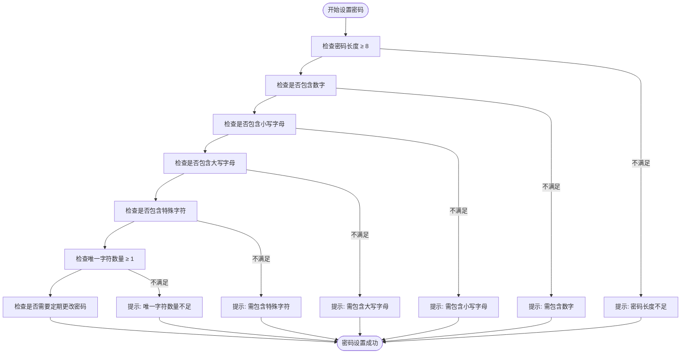
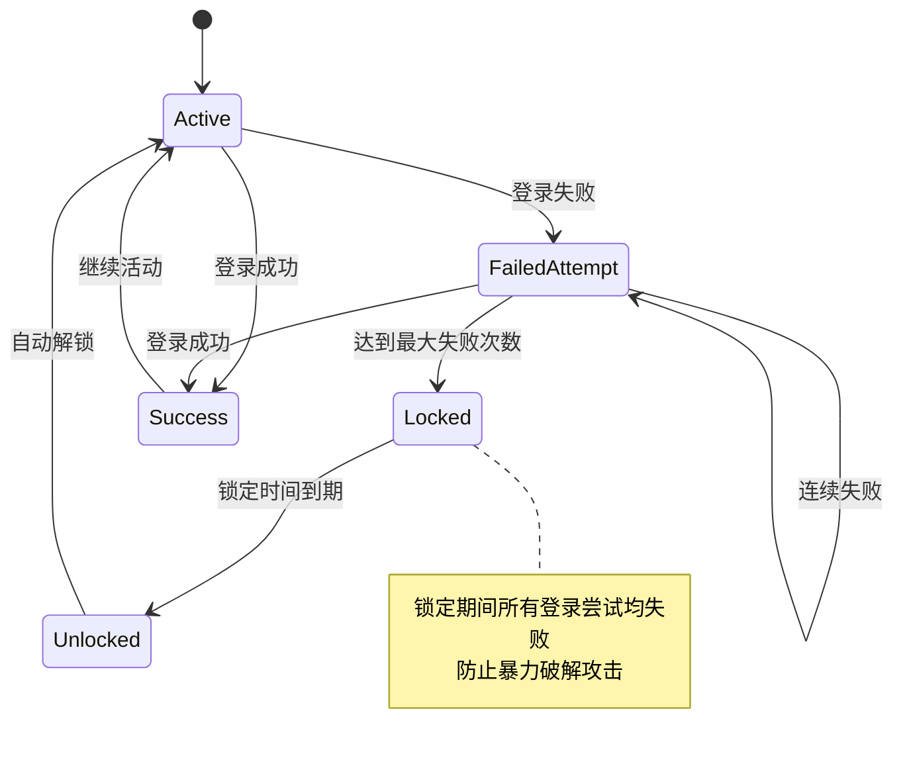
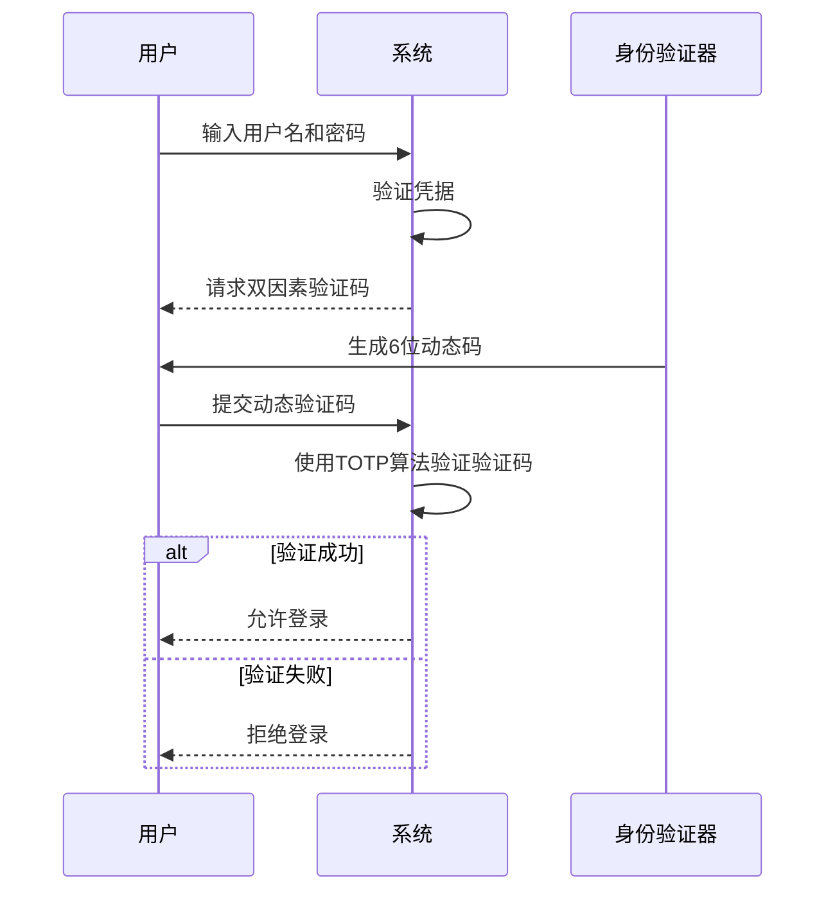
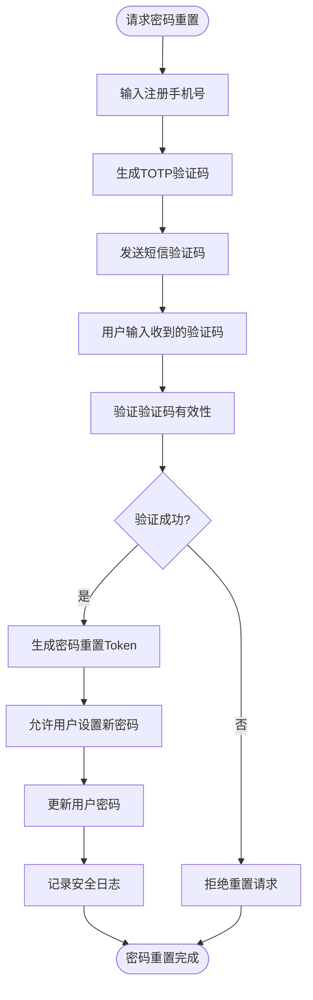
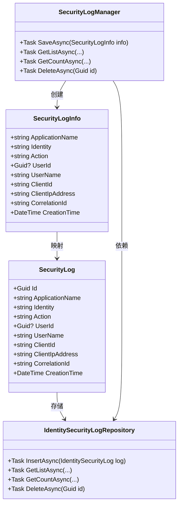

# 账户安全策略

<cite>
**本文档中引用的文件**  
- [IdentitySettingNames.cs](file://aspnet-core/modules/identity/LINGYUN.Abp.Identity.Domain.Shared/LINGYUN/Abp/Identity/Settings/IdentitySettingNames.cs)
- [SettingAppService.cs](file://aspnet-core/modules/settings/LINGYUN.Abp.SettingManagement.Application/LINGYUN/Abp/SettingManagement/SettingAppService.cs)
- [UserSettingAppService.cs](file://aspnet-core/modules/settings/LINGYUN.Abp.SettingManagement.Application/LINGYUN/Abp/SettingManagement/UserSettingAppService.cs)
- [AccountAppService.cs](file://aspnet-core/modules/account/LINGYUN.Abp.Account.Application/LINGYUN/Abp/Account/AccountAppService.cs)
- [SecurityLogManager.cs](file://aspnet-core/framework/auditing/LINGYUN.Abp.AuditLogging.EntityFrameworkCore/LINGYUN/Abp/AuditLogging/EntityFrameworkCore/SecurityLogManager.cs)
- [MySecurityLogAppService.cs](file://aspnet-core/modules/account/LINGYUN.Abp.Account.Application/LINGYUN/Abp/Account/MySecurityLogAppService.cs)
- [DefaultTotpService.cs](file://aspnet-core/modules/identity/LINGYUN.Abp.Identity.Domain/LINGYUN/Abp/Identity/Security/DefaultTotpService.cs)
</cite>

## 目录
1. [引言](#引言)
2. [密码强度策略](#密码强度策略)
3. [账户锁定机制](#账户锁定机制)
4. [双因素认证](#双因素认证)
5. [密码重置流程](#密码重置流程)
6. [安全审计日志](#安全审计日志)
7. [会话管理与并发登录控制](#会话管理与并发登录控制)
8. [异常登录检测](#异常登录检测)
9. [配置选项与默认值](#配置选项与默认值)
10. [合规性扩展](#合规性扩展)

## 引言
本文档详细阐述了ABP框架中的账户安全策略实现机制。系统提供了全面的安全功能，包括密码强度验证、账户锁定、双因素认证、安全审计等，旨在保护用户账户免受未经授权的访问和攻击。通过灵活的配置选项，管理员可以根据业务需求调整安全策略，确保系统既安全又易于使用。

## 密码强度策略
系统实现了严格的密码强度策略，通过多维度验证确保用户密码的安全性。密码策略包含长度要求、字符类型要求以及唯一字符数量要求等多个方面。

**图源**
- [SettingAppService.cs](file://aspnet-core/modules/settings/LINGYUN.Abp.SettingManagement.Application/LINGYUN/Abp/SettingManagement/SettingAppService.cs#L301-L346)

**本节来源**
- [SettingAppService.cs](file://aspnet-core/modules/settings/LINGYUN.Abp.SettingManagement.Application/LINGYUN/Abp/SettingManagement/SettingAppService.cs#L301-L346)
- [IdentitySettingNames.cs](file://aspnet-core/modules/identity/LINGYUN.Abp.Identity.Domain.Shared/LINGYUN/Abp/Identity/Settings/IdentitySettingNames.cs)

## 账户锁定机制
系统实现了智能的账户锁定机制，防止暴力破解攻击。当用户连续多次输入错误密码时，账户将被临时锁定，增加攻击者破解账户的难度。

**图源**
- [SettingAppService.cs](file://aspnet-core/modules/settings/LINGYUN.Abp.SettingManagement.Application/LINGYUN/Abp/SettingManagement/SettingAppService.cs#L191-L217)

**本节来源**
- [SettingAppService.cs](file://aspnet-core/modules/settings/LINGYUN.Abp.SettingManagement.Application/LINGYUN/Abp/SettingManagement/SettingAppService.cs#L191-L217)
- [IdentitySettingNames.cs](file://aspnet-core/modules/identity/LINGYUN.Abp.Identity.Domain.Shared/LINGYUN/Abp/Identity/Settings/IdentitySettingNames.cs)

## 双因素认证
系统支持基于TOTP（基于时间的一次性密码）算法的双因素认证机制，为账户提供额外的安全层。用户在登录时除了输入密码外，还需要提供通过身份验证应用程序生成的动态验证码。

**图源**
- [DefaultTotpService.cs](file://aspnet-core/modules/identity/LINGYUN.Abp.Identity.Domain/LINGYUN/Abp/Identity/Security/DefaultTotpService.cs)
- [AccountAppService.cs](file://aspnet-core/modules/account/LINGYUN.Abp.Account.Application/LINGYUN/Abp/Account/AccountAppService.cs)

**本节来源**
- [DefaultTotpService.cs](file://aspnet-core/modules/identity/LINGYUN.Abp.Identity.Domain/LINGYUN/Abp/Identity/Security/DefaultTotpService.cs)
- [AccountAppService.cs](file://aspnet-core/modules/account/LINGYUN.Abp.Account.Application/LINGYUN/Abp/Account/AccountAppService.cs)

## 密码重置流程
系统提供了安全的密码重置流程，通过手机号验证来确认用户身份，确保只有合法用户才能重置密码。该流程结合了短信验证码和TOTP算法，提高了安全性。

**图源**
- [AccountAppService.cs](file://aspnet-core/modules/account/LINGYUN.Abp.Account.Application/LINGYUN/Abp/Account/AccountAppService.cs#L203-L282)

**本节来源**
- [AccountAppService.cs](file://aspnet-core/modules/account/LINGYUN.Abp.Account.Application/LINGYUN/Abp/Account/AccountAppService.cs#L203-L282)
- [SecurityTokenCacheItem.cs](file://aspnet-core/modules/identity/LINGYUN.Abp.Identity.Domain/LINGYUN/Abp/Identity/SecurityTokenCacheItem.cs)

## 安全审计日志
系统集成了全面的安全审计日志功能，记录所有与安全相关的操作，包括登录尝试、密码更改、双因素认证状态变更等。这些日志可用于安全分析、故障排除和合规性审计。

**图源**
- [SecurityLogManager.cs](file://aspnet-core/framework/auditing/LINGYUN.Abp.AuditLogging.EntityFrameworkCore/LINGYUN/Abp/AuditLogging/EntityFrameworkCore/SecurityLogManager.cs)
- [MySecurityLogAppService.cs](file://aspnet-core/modules/account/LINGYUN.Abp.Account.Application/LINGYUN/Abp/Account/MySecurityLogAppService.cs)

**本节来源**
- [SecurityLogManager.cs](file://aspnet-core/framework/auditing/LINGYUN.Abp.AuditLogging.EntityFrameworkCore/LINGYUN/Abp/AuditLogging/EntityFrameworkCore/SecurityLogManager.cs)
- [MySecurityLogAppService.cs](file://aspnet-core/modules/account/LINGYUN.Abp.Account.Application/LINGYUN/Abp/Account/MySecurityLogAppService.cs)

## 会话管理与并发登录控制
系统提供了会话管理功能，支持对用户并发登录行为的控制。管理员可以配置策略，限制同一用户在不同设备上的同时登录数量，增强账户安全性。

**本节来源**
- [IdentitySettingNames.cs](file://aspnet-core/modules/identity/LINGYUN.Abp.Identity.Domain.Shared/LINGYUN/Abp/Identity/Settings/IdentitySettingNames.cs#L30-L44)

## 异常登录检测
系统通过安全审计日志和账户锁定机制实现异常登录检测。当检测到短时间内大量失败的登录尝试时，系统会自动触发保护机制，锁定相关账户以防止暴力破解攻击。

**本节来源**
- [SecurityLogManager.cs](file://aspnet-core/framework/auditing/LINGYUN.Abp.AuditLogging.EntityFrameworkCore/LINGYUN/Abp/AuditLogging/EntityFrameworkCore/SecurityLogManager.cs)
- [SettingAppService.cs](file://aspnet-core/modules/settings/LINGYUN.Abp.SettingManagement.Application/LINGYUN/Abp/SettingManagement/SettingAppService.cs#L191-L217)

## 配置选项与默认值
系统提供了丰富的安全策略配置选项，允许管理员根据组织的安全需求进行定制。以下是主要安全配置项及其默认值：

| 配置项 | 描述 | 默认值 | 类型 |
|--------|------|--------|------|
| Abp.Identity.Password.RequiredLength | 密码最小长度 | 8 | 数字 |
| Abp.Identity.Password.RequireDigit | 是否需要包含数字 | true | 布尔值 |
| Abp.Identity.Password.RequireLowercase | 是否需要包含小写字母 | true | 布尔值 |
| Abp.Identity.Password.RequireUppercase | 是否需要包含大写字母 | true | 布尔值 |
| Abp.Identity.Password.RequireNonAlphanumeric | 是否需要包含特殊字符 | true | 布尔值 |
| Abp.Identity.Password.RequiredUniqueChars | 所需唯一字符的最小数量 | 1 | 数字 |
| Abp.Identity.Lockout.AllowedForNewUsers | 新用户是否允许被锁定 | true | 布尔值 |
| Abp.Identity.Lockout.MaxFailedAccessAttempts | 最大失败访问尝试次数 | 5 | 数字 |
| Abp.Identity.Lockout.LockoutDuration | 锁定持续时间（分钟） | 5 | 数字 |
| Abp.Identity.Password.ForceUsersToPeriodicallyChangePassword | 是否强制用户定期更改密码 | false | 布尔值 |
| Abp.Identity.Password.PasswordChangePeriodDays | 密码更改周期（天） | 90 | 数字 |

**本节来源**
- [IdentitySettingNames.cs](file://aspnet-core/modules/identity/LINGYUN.Abp.Identity.Domain.Shared/LINGYUN/Abp/Identity/Settings/IdentitySettingNames.cs)
- [SettingAppService.cs](file://aspnet-core/modules/settings/LINGYUN.Abp.SettingManagement.Application/LINGYUN/Abp/SettingManagement/SettingAppService.cs)

## 合规性扩展
系统设计考虑了合规性需求，提供了可扩展的安全策略框架。通过自定义安全日志管理器和事件处理程序，可以集成到SIEM（安全信息和事件管理）系统，满足GDPR、HIPAA等法规的审计要求。

**本节来源**
- [SecurityLogManager.cs](file://aspnet-core/framework/auditing/LINGYUN.Abp.AuditLogging.EntityFrameworkCore/LINGYUN/Abp/AuditLogging/EntityFrameworkCore/SecurityLogManager.cs)
- [DefaultSecurityLogManager.cs](file://aspnet-core/framework/auditing/LINGYUN.Abp.AuditLogging/LINGYUN/Abp/AuditLogging/DefaultSecurityLogManager.cs)