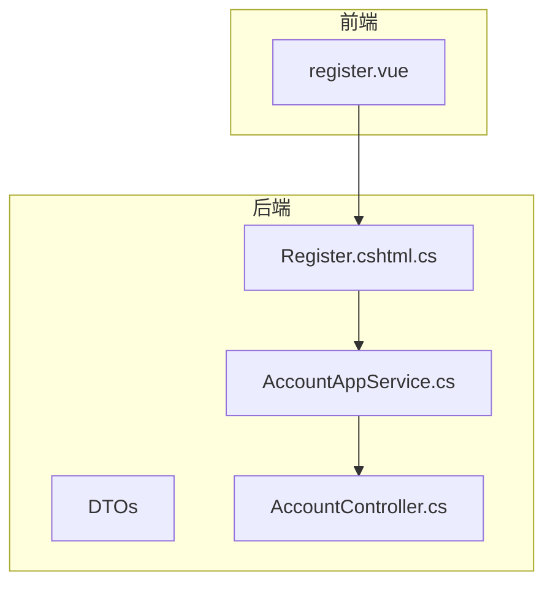
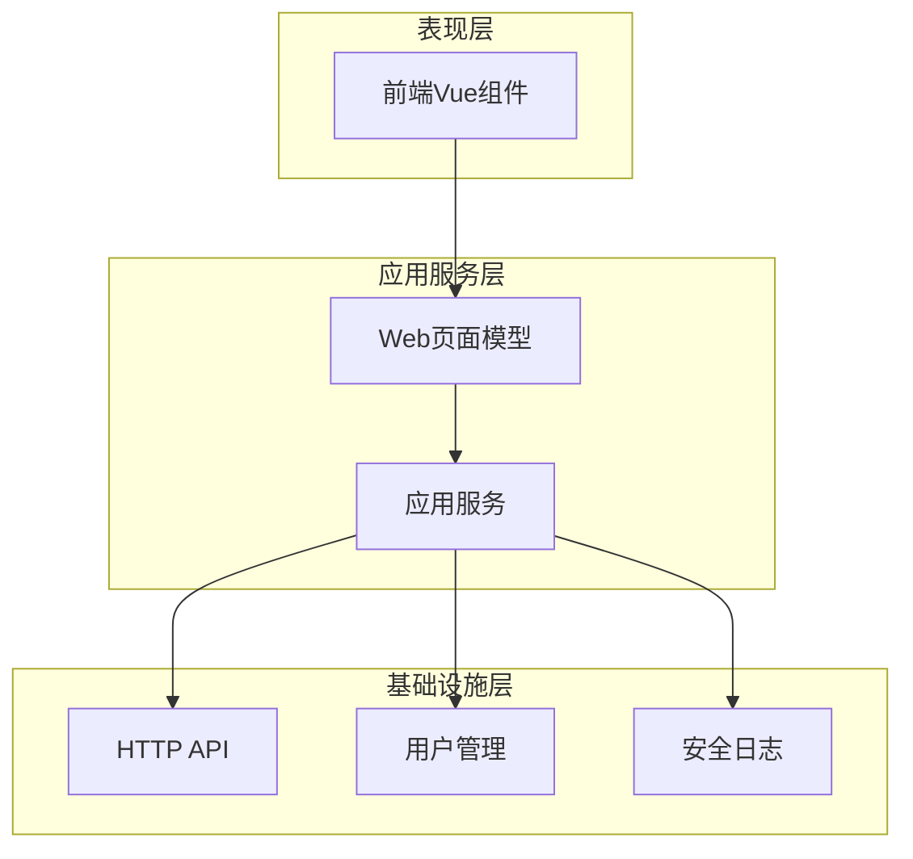
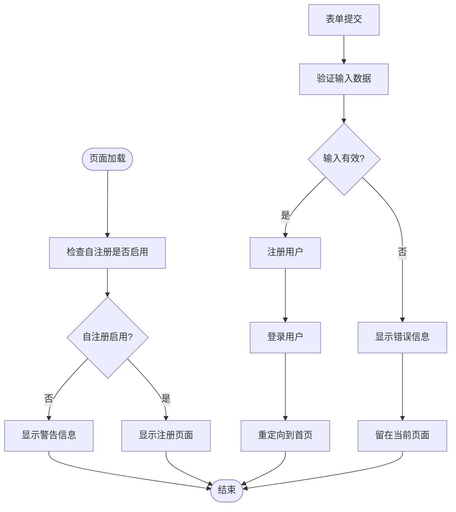
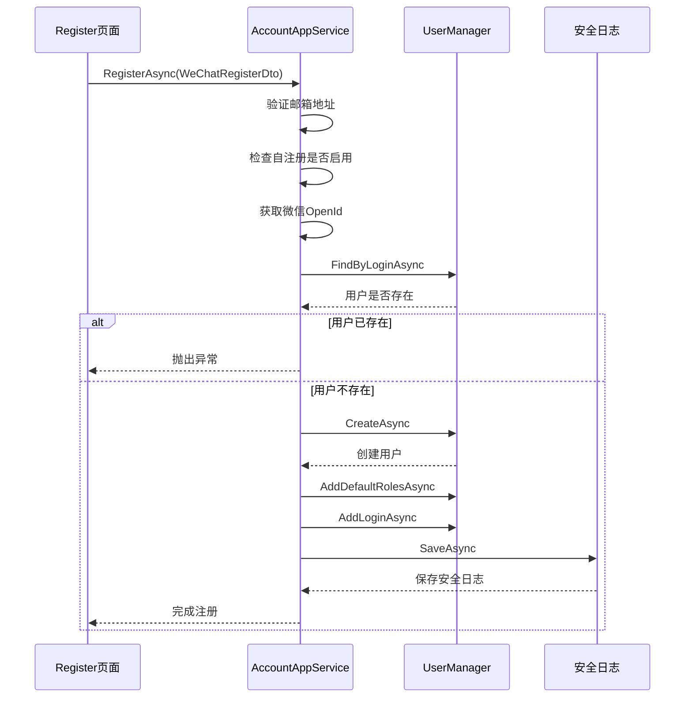
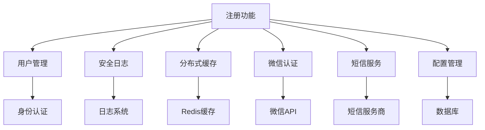

# 账户注册功能

<cite>
**本文档引用的文件**  
- [Register.cshtml.cs](file://aspnet-core\modules\account\LINGYUN.Abp.Account.Web\Pages\Account\Register.cshtml.cs)
- [AccountAppService.cs](file://aspnet-core\modules\account\LINGYUN.Abp.Account.Application\LINGYUN\Abp\Account\AccountAppService.cs)
- [AccountController.cs](file://aspnet-core\modules\account\LINGYUN.Abp.Account.HttpApi\LINGYUN\Abp\Account\AccountController.cs)
- [WeChatRegisterDto.cs](file://aspnet-core\modules\account\LINGYUN.Abp.Account.Application.Contracts\LINGYUN\Abp\Account\Dto\WeChatRegisterDto.cs)
- [PhoneRegisterDto.cs](file://aspnet-core\modules\account\LINGYUN.Abp.Account.Application.Contracts\LINGYUN\Abp\Account\Dto\PhoneRegisterDto.cs)
- [SendPhoneRegisterCodeDto.cs](file://aspnet-core\modules\account\LINGYUN.Abp.Account.Application.Contracts\LINGYUN\Abp\Account\Dto\SendPhoneRegisterCodeDto.cs)
- [AccountSettingDefinitionProvider.cs](file://aspnet-core\services\LY.MicroService.BackendAdmin.HttpApi.Host\Settings\AccountSettingDefinitionProvider.cs)
- [register.vue](file://apps\vben5\apps\app-antd\src\views\_core\authentication\register.vue)
</cite>

## 目录
1. [简介](#简介)
2. [项目结构](#项目结构)
3. [核心组件](#核心组件)
4. [架构概述](#架构概述)
5. [详细组件分析](#详细组件分析)
6. [依赖分析](#依赖分析)
7. [性能考虑](#性能考虑)
8. [故障排除指南](#故障排除指南)
9. [结论](#结论)

## 简介
本文档详细描述了账户注册功能的实现机制，涵盖前端注册页面、后端API接口和数据验证逻辑。文档重点介绍注册过程中使用的DTO对象、验证规则和异常处理机制，包括邮箱验证、手机号验证等安全验证方式的实现。同时说明如何通过配置启用或禁用特定验证方式，并提供自定义注册流程的扩展点说明。

## 项目结构
账户注册功能分布在多个模块中，主要包括前端Vue组件、后端应用服务、HTTP API控制器和数据传输对象（DTO）。注册功能主要位于account模块中，涉及Web、Application、Application.Contracts和HttpApi四个子模块。



**图示来源**
- [register.vue](file://apps\vben5\apps\app-antd\src\views\_core\authentication\register.vue)
- [Register.cshtml.cs](file://aspnet-core\modules\account\LINGYUN.Abp.Account.Web\Pages\Account\Register.cshtml.cs)

**章节来源**
- [register.vue](file://apps\vben5\apps\app-antd\src\views\_core\authentication\register.vue)
- [Register.cshtml.cs](file://aspnet-core\modules\account\LINGYUN.Abp.Account.Web\Pages\Account\Register.cshtml.cs)

## 核心组件
账户注册功能的核心组件包括前端注册页面、后端应用服务和数据验证逻辑。前端使用Vue框架实现用户界面，后端通过ABP框架提供应用服务和API接口。注册流程支持多种方式，包括本地注册、微信注册和手机号注册。

**章节来源**
- [AccountAppService.cs](file://aspnet-core\modules\account\LINGYUN.Abp.Account.Application\LINGYUN\Abp\Account\AccountAppService.cs)
- [register.vue](file://apps\vben5\apps\app-antd\src\views\_core\authentication\register.vue)

## 架构概述
账户注册功能采用分层架构设计，从前端到后端分为表现层、应用服务层和基础设施层。表现层负责用户界面展示和交互，应用服务层处理业务逻辑和数据验证，基础设施层提供用户管理和安全日志等基础服务。



**图示来源**
- [AccountAppService.cs](file://aspnet-core\modules\account\LINGYUN.Abp.Account.Application\LINGYUN\Abp\Account\AccountAppService.cs)
- [AccountController.cs](file://aspnet-core\modules\account\LINGYUN.Abp.Account.HttpApi\LINGYUN\Abp\Account\AccountController.cs)

## 详细组件分析
### 注册页面分析
注册页面采用Razor Pages技术实现，处理GET和POST请求。页面模型包含输入验证、外部登录支持和自注册检查等功能。

#### 页面流程图


**图示来源**
- [Register.cshtml.cs](file://aspnet-core\modules\account\LINGYUN.Abp.Account.Web\Pages\Account\Register.cshtml.cs)

**章节来源**
- [Register.cshtml.cs](file://aspnet-core\modules\account\LINGYUN.Abp.Account.Web\Pages\Account\Register.cshtml.cs)

### 应用服务分析
应用服务层实现了多种注册方式，包括微信注册、手机号注册等。服务通过DTO对象接收和验证数据，并调用用户管理器创建用户。

#### 微信注册序列图


**图示来源**
- [AccountAppService.cs](file://aspnet-core\modules\account\LINGYUN.Abp.Account.Application\LINGYUN\Abp\Account\AccountAppService.cs)

**章节来源**
- [AccountAppService.cs](file://aspnet-core\modules\account\LINGYUN.Abp.Account.Application\LINGYUN\Abp\Account\AccountAppService.cs)

### 数据传输对象分析
注册功能使用多种DTO对象来传输和验证数据，每种注册方式都有对应的DTO类。

#### DTO类图
```mermaid
classDiagram
class WeChatRegisterDto {
+string Code
+string Password
+string UserName
+string EmailAddress
}
class PhoneRegisterDto {
+string PhoneNumber
+string Name
+string UserName
+string EmailAddress
+string Password
+string Code
}
class SendPhoneRegisterCodeDto {
+string PhoneNumber
}
WeChatRegisterDto : 注册方式 : 微信
PhoneRegisterDto : 注册方式 : 手机号
SendPhoneRegisterCodeDto : 功能 : 发送手机验证码
```

**图示来源**
- [WeChatRegisterDto.cs](file://aspnet-core\modules\account\LINGYUN.Abp.Account.Application.Contracts\LINGYUN\Abp\Account\Dto\WeChatRegisterDto.cs)
- [PhoneRegisterDto.cs](file://aspnet-core\modules\account\LINGYUN.Abp.Account.Application.Contracts\LINGYUN\Abp\Account\Dto\PhoneRegisterDto.cs)
- [SendPhoneRegisterCodeDto.cs](file://aspnet-core\modules\account\LINGYUN.Abp.Account.Application.Contracts\LINGYUN\Abp\Account\Dto\SendPhoneRegisterCodeDto.cs)

**章节来源**
- [WeChatRegisterDto.cs](file://aspnet-core\modules\account\LINGYUN.Abp.Account.Application.Contracts\LINGYUN\Abp\Account\Dto\WeChatRegisterDto.cs)
- [PhoneRegisterDto.cs](file://aspnet-core\modules\account\LINGYUN.Abp.Account.Application.Contracts\LINGYUN\Abp\Account\Dto\PhoneRegisterDto.cs)
- [SendPhoneRegisterCodeDto.cs](file://aspnet-core\modules\account\LINGYUN.Abp.Account.Application.Contracts\LINGYUN\Abp\Account\Dto\SendPhoneRegisterCodeDto.cs)

## 依赖分析
账户注册功能依赖于多个核心服务和模块，包括用户管理、安全日志、缓存服务和外部认证服务。



**图示来源**
- [AccountAppService.cs](file://aspnet-core\modules\account\LINGYUN.Abp.Account.Application\LINGYUN\Abp\Account\AccountAppService.cs)
- [AccountSettingDefinitionProvider.cs](file://aspnet-core\services\LY.MicroService.BackendAdmin.HttpApi.Host\Settings\AccountSettingDefinitionProvider.cs)

**章节来源**
- [AccountAppService.cs](file://aspnet-core\modules\account\LINGYUN.Abp.Account.Application\LINGYUN\Abp\Account\AccountAppService.cs)
- [AccountSettingDefinitionProvider.cs](file://aspnet-core\services\LY.MicroService.BackendAdmin.HttpApi.Host\Settings\AccountSettingDefinitionProvider.cs)

## 性能考虑
账户注册功能在设计时考虑了性能优化，主要体现在以下几个方面：
1. 使用分布式缓存存储验证码，减少数据库访问
2. 异步处理注册请求，提高响应速度
3. 合理设置验证码过期时间，平衡安全性和用户体验
4. 批量处理用户角色分配，减少数据库操作次数

## 故障排除指南
### 常见问题及解决方案
1. **注册失败但无明确错误信息**
   - 检查日志中的详细错误信息
   - 验证输入数据是否符合格式要求
   - 确认自注册功能是否已启用

2. **验证码无法发送**
   - 检查短信服务商配置是否正确
   - 确认手机号码格式是否有效
   - 查看缓存服务是否正常运行

3. **微信注册失败**
   - 验证微信AppId和AppSecret配置
   - 检查网络连接是否正常
   - 确认微信OpenId获取是否成功

**章节来源**
- [AccountAppService.cs](file://aspnet-core\modules\account\LINGYUN.Abp.Account.Application\LINGYUN\Abp\Account\AccountAppService.cs)
- [Register.cshtml.cs](file://aspnet-core\modules\account\LINGYUN.Abp.Account.Web\Pages\Account\Register.cshtml.cs)

## 结论
账户注册功能实现了多种注册方式，包括本地注册、微信注册和手机号注册。系统通过DTO对象进行数据传输和验证，确保数据的完整性和安全性。注册流程中集成了邮箱验证、手机号验证等安全机制，并通过配置管理实现灵活的验证方式控制。前端使用Vue框架提供友好的用户界面，后端采用分层架构确保代码的可维护性和可扩展性。