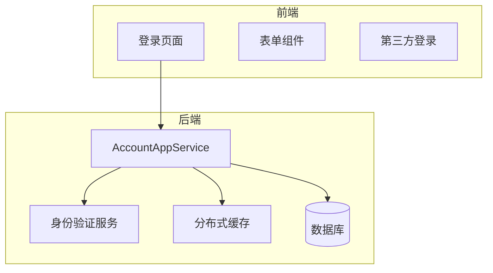
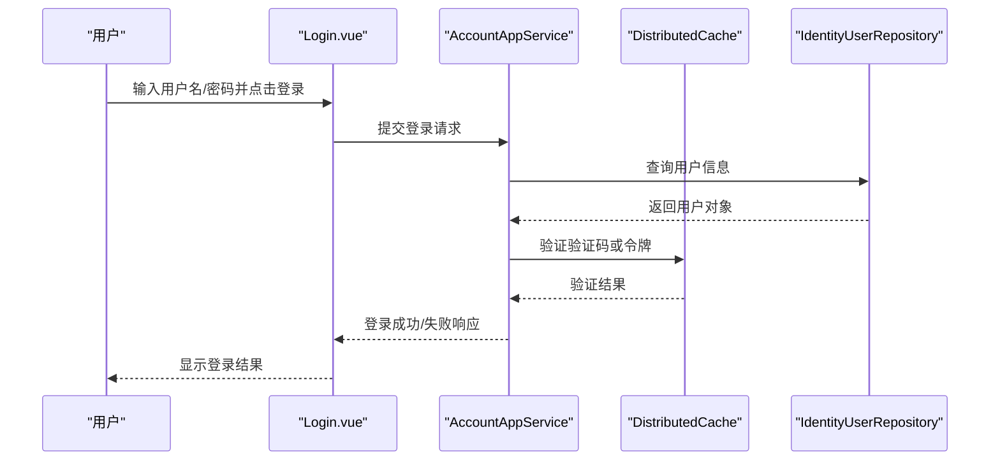
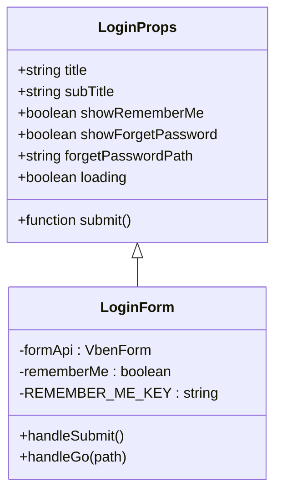
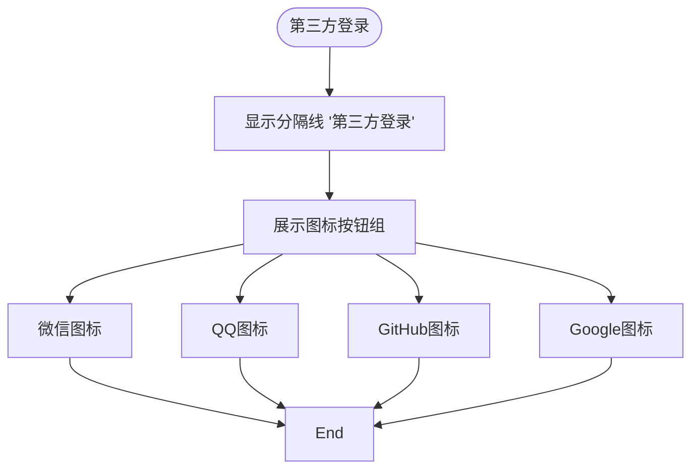
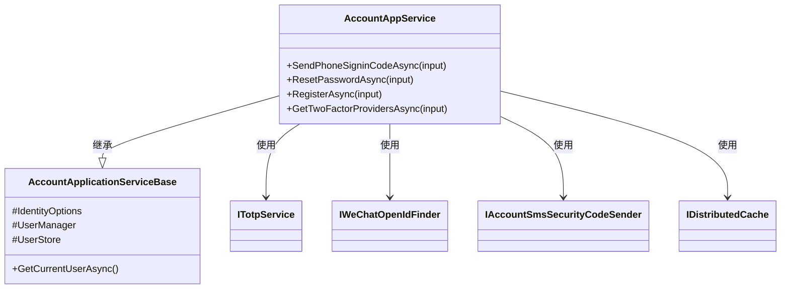
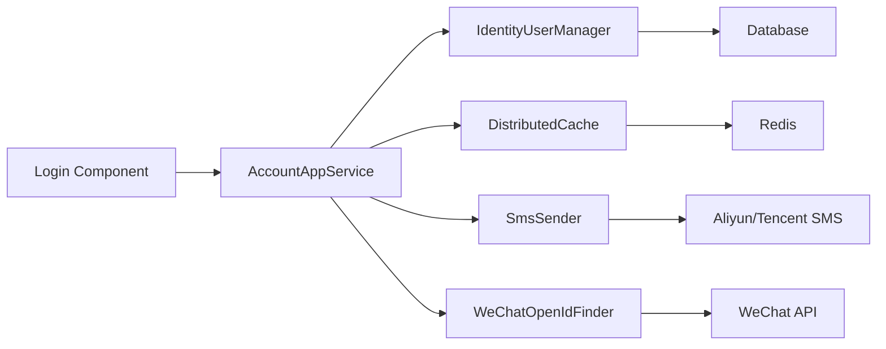

# 账户登录功能

<cite>
**本文档引用的文件**
- [login.vue](file://apps/vben5/packages/effects/common-ui/src/ui/authentication/login.vue)
- [types.ts](file://apps/vben5/packages/effects/common-ui/src/ui/authentication/types.ts)
- [third-party-login.vue](file://apps/vben5/packages/effects/common-ui/src/ui/authentication/third-party-login.vue)
- [code-login.vue](file://apps/vben5/packages/effects/common-ui/src/ui/authentication/code-login.vue)
- [qrcode-login.vue](file://apps/vben5/packages/effects/common-ui/src/ui/authentication/qrcode-login.vue)
- [AccountAppService.cs](file://aspnet-core/modules/account/LINGYUN.Abp.Account.Application/LINGYUN/Abp/Account/AccountAppService.cs)
- [AccountApplicationServiceBase.cs](file://aspnet-core/modules/account/LINGYUN.Abp.Account.Application/LINGYUN/Abp/Account/AccountApplicationServiceBase.cs)
</cite>

## 目录
1. [简介](#简介)
2. [项目结构](#项目结构)
3. [核心组件](#核心组件)
4. [架构概述](#架构概述)
5. [详细组件分析](#详细组件分析)
6. [依赖分析](#依赖分析)
7. [性能考虑](#性能考虑)
8. [故障排除指南](#故障排除指南)
9. [结论](#结论)

## 简介
本文档详细描述了ABP框架中账户登录功能的实现机制，涵盖本地账户登录、第三方OAuth登录、UI组件设计、API接口规范以及会话管理策略。同时深入解析了“记住我”功能、登录失败处理、账户锁定等安全特性，并提供配置指南以支持自定义登录页面外观和调整安全策略。

## 项目结构
系统采用前后端分离架构，前端基于Vue Vben Admin框架实现用户界面，后端使用ASP.NET Core构建服务逻辑。登录功能主要分布在`apps/vben5`前端模块与`aspnet-core/modules/account`后端模块中。

**图示来源**
- [login.vue](file://apps/vben5/packages/effects/common-ui/src/ui/authentication/login.vue#L1-L187)
- [AccountAppService.cs](file://aspnet-core/modules/account/LINGYUN.Abp.Account.Application/LINGYUN/Abp/Account/AccountAppService.cs#L1-L387)

**章节来源**
- [login.vue](file://apps/vben5/packages/effects/common-ui/src/ui/authentication/login.vue#L1-L187)
- [AccountAppService.cs](file://aspnet-core/modules/account/LINGYUN.Abp.Account.Application/LINGYUN/Abp/Account/AccountAppService.cs#L1-L387)

## 核心组件
核心组件包括前端登录表单、验证码登录、二维码登录、第三方登录按钮组，以及后端的`AccountAppService`服务类，负责处理所有登录相关业务逻辑，如短信验证码发送、密码重置、手机号登录等。

**章节来源**
- [login.vue](file://apps/vben5/packages/effects/common-ui/src/ui/authentication/login.vue#L1-L187)
- [AccountAppService.cs](file://aspnet-core/modules/account/LINGYUN.Abp.Account.Application/LINGYUN/Abp/Account/AccountAppService.cs#L1-L387)

## 架构概述
系统通过Vue组件封装登录流程，支持多种登录方式（账号密码、手机验证码、二维码、第三方）。前端通过事件提交数据至后端API，由`AccountAppService`协调身份管理、缓存验证与安全日志记录。

**图示来源**
- [login.vue](file://apps/vben5/packages/effects/common-ui/src/ui/authentication/login.vue#L1-L187)
- [AccountAppService.cs](file://aspnet-core/modules/account/LINGYUN.Abp.Account.Application/LINGYUN/Abp/Account/AccountAppService.cs#L1-L387)

## 详细组件分析

### 登录表单组件分析
该组件实现了标准账号密码登录界面，支持“记住我”功能，利用本地存储保存用户名，提升用户体验。

#### 组件结构

**图示来源**
- [login.vue](file://apps/vben5/packages/effects/common-ui/src/ui/authentication/login.vue#L1-L187)
- [types.ts](file://apps/vben5/packages/effects/common-ui/src/ui/authentication/types.ts#L1-L70)

**章节来源**
- [login.vue](file://apps/vben5/packages/effects/common-ui/src/ui/authentication/login.vue#L1-L187)
- [types.ts](file://apps/vben5/packages/effects/common-ui/src/ui/authentication/types.ts#L1-L70)

### 第三方登录组件分析
提供微信、QQ、GitHub、Google等第三方平台快捷登录入口，增强用户注册与登录便利性。

#### UI布局

**图示来源**
- [third-party-login.vue](file://apps/vben5/packages/effects/common-ui/src/ui/authentication/third-party-login.vue#L1-L38)

**章节来源**
- [third-party-login.vue](file://apps/vben5/packages/effects/common-ui/src/ui/authentication/third-party-login.vue#L1-L38)

### 验证码登录组件分析
支持通过手机号获取验证码进行登录，适用于移动端场景。

**章节来源**
- [code-login.vue](file://apps/vben5/packages/effects/common-ui/src/ui/authentication/code-login.vue#L1-L118)

### 二维码登录组件分析
生成动态二维码供移动设备扫描登录，常用于桌面端快速认证。

**章节来源**
- [qrcode-login.vue](file://apps/vben5/packages/effects/common-ui/src/ui/authentication/qrcode-login.vue#L1-L96)

### 后端服务逻辑分析
`AccountAppService`是核心服务类，继承自`AccountApplicationServiceBase`，封装了注册、短信验证码发送、密码重置、手机登录等功能。

#### 服务依赖关系

**图示来源**
- [AccountAppService.cs](file://aspnet-core/modules/account/LINGYUN.Abp.Account.Application/LINGYUN/Abp/Account/AccountAppService.cs#L1-L387)
- [AccountApplicationServiceBase.cs](file://aspnet-core/modules/account/LINGYUN.Abp.Account.Application/LINGYUN/Abp/Account/AccountApplicationServiceBase.cs#L1-L30)

**章节来源**
- [AccountAppService.cs](file://aspnet-core/modules/account/LINGYUN.Abp.Account.Application/LINGYUN/Abp/Account/AccountAppService.cs#L1-L387)
- [AccountApplicationServiceBase.cs](file://aspnet-core/modules/account/LINGYUN.Abp.Account.Application/LINGYUN/Abp/Account/AccountApplicationServiceBase.cs#L1-L30)

## 依赖分析
系统依赖于ABP框架的身份管理模块、分布式缓存（如Redis）、短信服务提供商（阿里云、腾讯云）及外部OAuth服务（微信、QQ）。

**图示来源**
- [AccountAppService.cs](file://aspnet-core/modules/account/LINGYUN.Abp.Account.Application/LINGYUN/Abp/Account/AccountAppService.cs#L1-L387)

**章节来源**
- [AccountAppService.cs](file://aspnet-core/modules/account/LINGYUN.Abp.Account.Application/LINGYUN/Abp/Account/AccountAppService.cs#L1-L387)

## 性能考虑
- 所有敏感操作均使用缓存防止重复提交（如短信验证码）
- 利用TOTP算法生成有时效性的验证码，减少数据库压力
- 异步调用避免阻塞主线程
- 分布式缓存支持横向扩展

## 故障排除指南
常见问题包括验证码未收到、登录失败无提示、第三方登录回调异常等。建议检查：
- 短信服务配置是否正确
- Redis缓存是否正常运行
- 微信/OpenID配置参数是否准确
- CORS设置是否允许前端域名访问

**章节来源**
- [AccountAppService.cs](file://aspnet-core/modules/account/LINGYUN.Abp.Account.Application/LINGYUN/Abp/Account/AccountAppService.cs#L1-L387)
- [login.vue](file://apps/vben5/packages/effects/common-ui/src/ui/authentication/login.vue#L1-L187)

## 结论
本系统提供了完整的多模式登录解决方案，结合现代前端框架与稳健的后端服务，具备良好的可维护性和扩展性。通过合理运用缓存、异步处理和安全校验机制，确保了系统的高性能与高安全性。