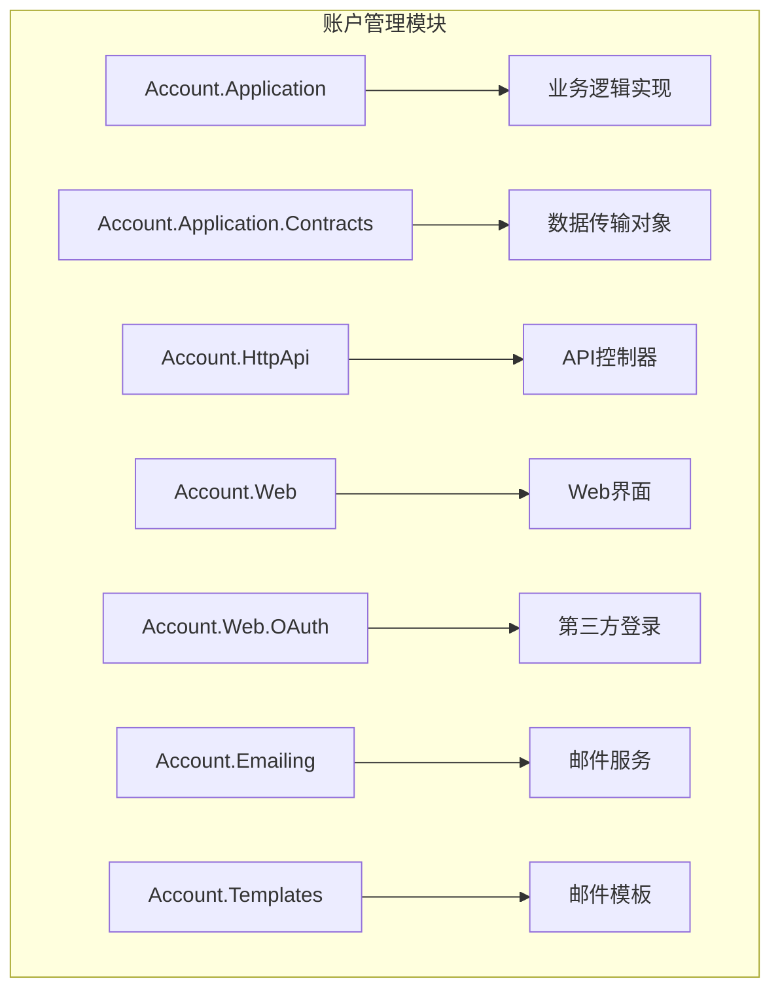
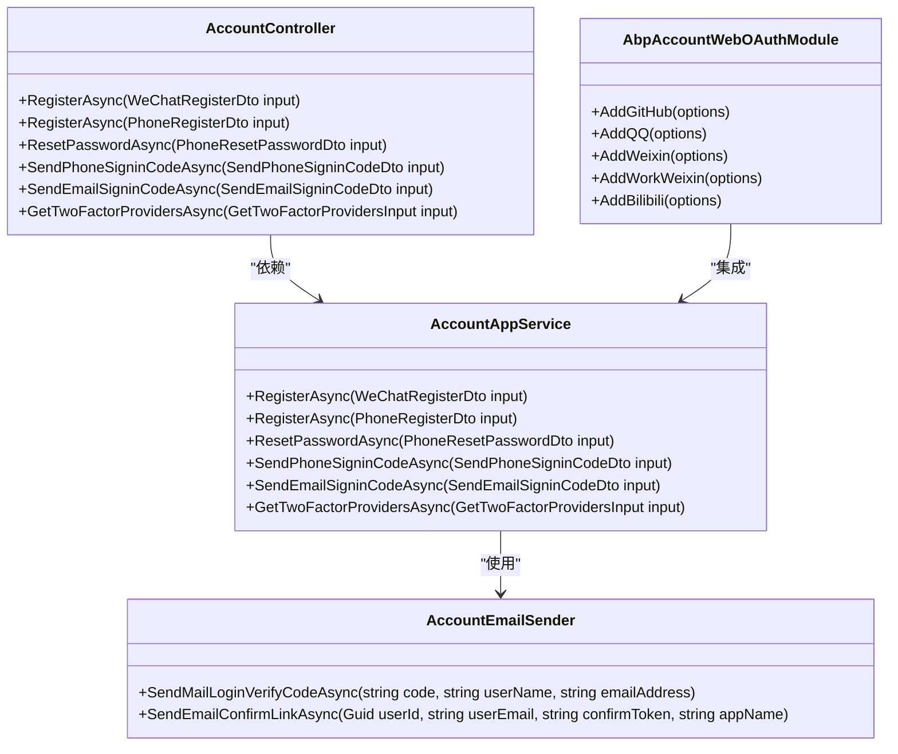
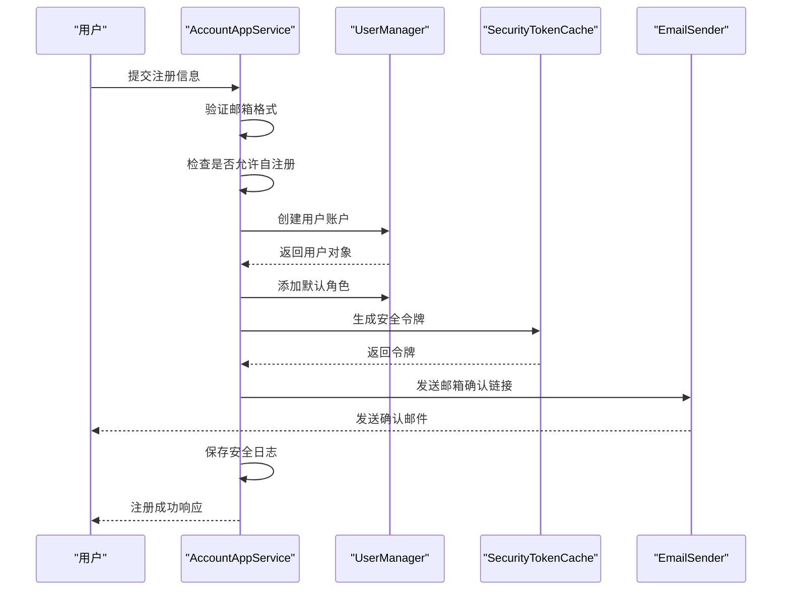
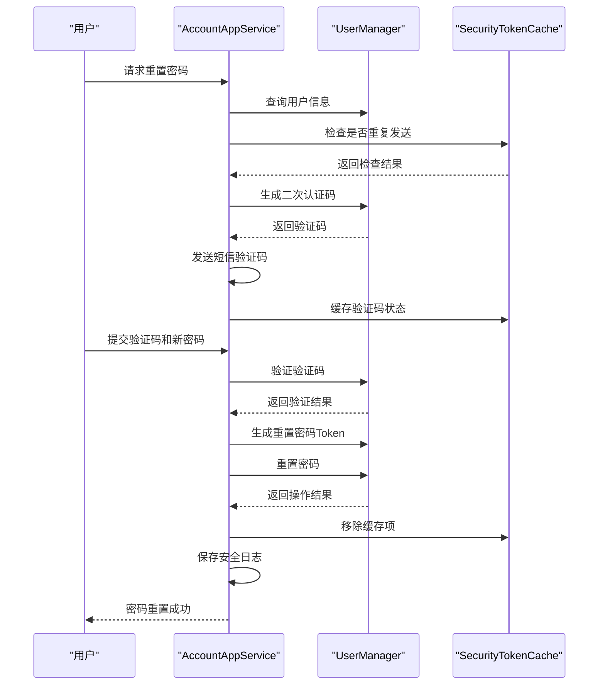
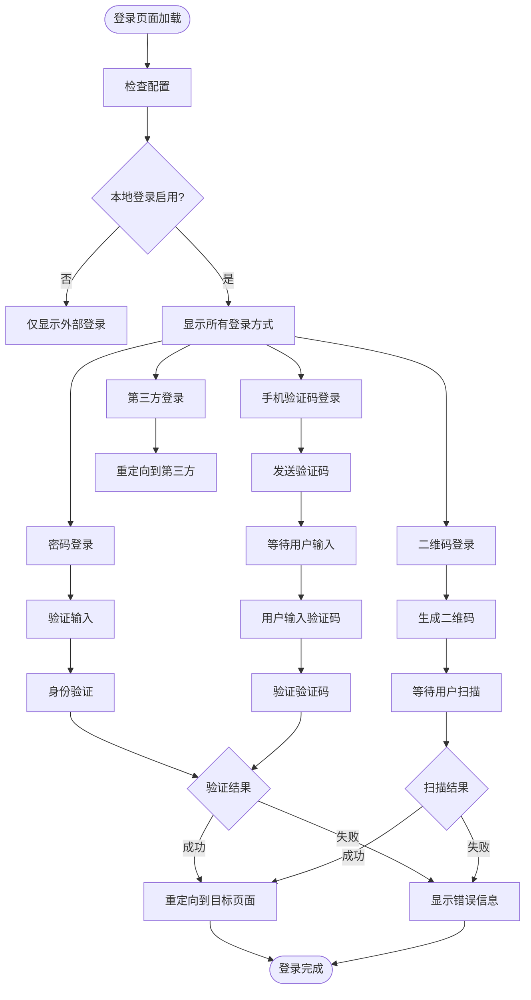
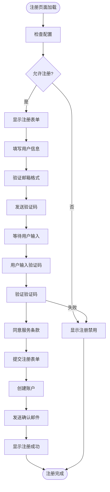
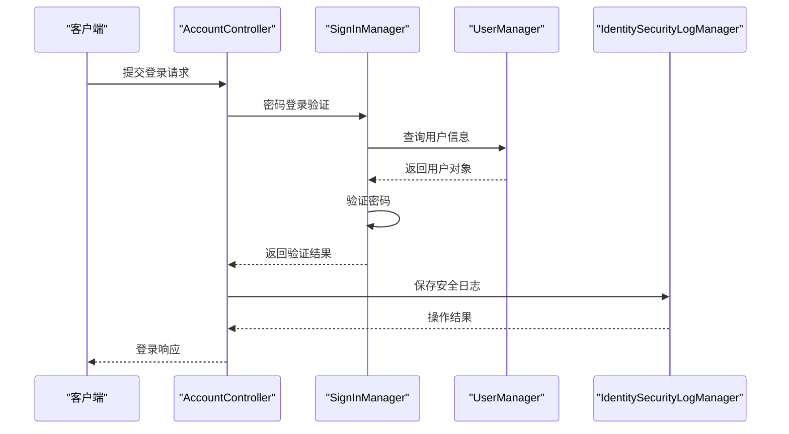

# 账户管理模块

<cite>
**本文档引用的文件**   
- [AccountAppService.cs](file://aspnet-core/modules/account/LINGYUN.Abp.Account.Application/LINGYUN/Abp/Account/AccountAppService.cs)
- [AccountController.cs](file://aspnet-core/modules/account/LINGYUN.Abp.Account.Web/Areas/Account/Controllers/AccountController.cs)
- [Login.cshtml.cs](file://aspnet-core/modules/account/LINGYUN.Abp.Account.Web/Pages/Account/Login.cshtml.cs)
- [AbpAccountWebOAuthModule.cs](file://aspnet-core/modules/account/LINGYUN.Abp.Account.Web.OAuth/AbpAccountWebOAuthModule.cs)
- [AccountEmailSender.cs](file://aspnet-core/modules/account/LINGYUN.Abp.Account.Emailing/LINGYUN/Abp/Account/Emailing/AccountEmailSender.cs)
- [AccountOAuthSettingDefinitionProvider.cs](file://aspnet-core/modules/account/LINGYUN.Abp.Account.OAuth/LINGYUN/Abp/Account/OAuth/Settings/AccountOAuthSettingDefinitionProvider.cs)
- [AccountSettingDefinitionProvider.cs](file://aspnet-core/services/LY.MicroService.BackendAdmin.HttpApi.Host/Settings/AccountSettingDefinitionProvider.cs)
- [VerifyAuthenticatorCode.cshtml.cs](file://aspnet-core/modules/account/LINGYUN.Abp.Account.Web/Pages/Account/VerifyAuthenticatorCode.cshtml.cs)
- [AccountContainer.cs](file://aspnet-core/modules/account/LINGYUN.Abp.Account.Application/LINGYUN/Abp/Account/AccountContainer.cs)
</cite>

## 目录
1. [项目结构](#项目结构)
2. [核心组件](#核心组件)
3. [账户生命周期管理](#账户生命周期管理)
4. [Web界面实现](#web界面实现)
5. [API接口设计](#api接口设计)
6. [身份认证服务集成](#身份认证服务集成)
7. [账户安全策略](#账户安全策略)
8. [账户信息维护](#账户信息维护)
9. [邮件模板集成](#邮件模板集成)
10. [配置指南](#配置指南)
11. [扩展点说明](#扩展点说明)

## 项目结构

账户管理模块采用分层架构设计，包含多个子模块，每个子模块负责不同的功能领域。模块主要分为应用层、契约层、HTTP API层、Web界面层、OAuth集成层和邮件服务层。

**图示来源**
- [AccountAppService.cs](file://aspnet-core/modules/account/LINGYUN.Abp.Account.Application/LINGYUN/Abp/Account/AccountAppService.cs)
- [AccountController.cs](file://aspnet-core/modules/account/LINGYUN.Abp.Account.Web/Areas/Account/Controllers/AccountController.cs)
- [AccountEmailSender.cs](file://aspnet-core/modules/account/LINGYUN.Abp.Account.Emailing/LINGYUN/Abp/Account/Emailing/AccountEmailSender.cs)

**本节来源**
- [AccountAppService.cs](file://aspnet-core/modules/account/LINGYUN.Abp.Account.Application/LINGYUN/Abp/Account/AccountAppService.cs)
- [AccountController.cs](file://aspnet-core/modules/account/LINGYUN.Abp.Account.Web/Areas/Account/Controllers/AccountController.cs)

## 核心组件

账户管理模块的核心组件包括账户应用服务、账户控制器、邮件发送服务和OAuth集成模块。这些组件协同工作，实现了完整的账户管理功能。

**图示来源**
- [AccountAppService.cs](file://aspnet-core/modules/account/LINGYUN.Abp.Account.Application/LINGYUN/Abp/Account/AccountAppService.cs)
- [AccountController.cs](file://aspnet-core/modules/account/LINGYUN.Abp.Account.HttpApi/LINGYUN/Abp/Account/AccountController.cs)
- [AccountEmailSender.cs](file://aspnet-core/modules/account/LINGYUN.Abp.Account.Emailing/LINGYUN/Abp/Account/Emailing/AccountEmailSender.cs)
- [AbpAccountWebOAuthModule.cs](file://aspnet-core/modules/account/LINGYUN.Abp.Account.Web.OAuth/AbpAccountWebOAuthModule.cs)

**本节来源**
- [AccountAppService.cs](file://aspnet-core/modules/account/LINGYUN.Abp.Account.Application/LINGYUN/Abp/Account/AccountAppService.cs)
- [AccountController.cs](file://aspnet-core/modules/account/LINGYUN.Abp.Account.HttpApi/LINGYUN/Abp/Account/AccountController.cs)
- [AccountEmailSender.cs](file://aspnet-core/modules/account/LINGYUN.Abp.Account.Emailing/LINGYUN/Abp/Account/Emailing/AccountEmailSender.cs)

## 账户生命周期管理

账户管理模块提供了完整的用户账户生命周期管理功能，包括注册、登录、密码管理和账户注销等核心功能。

### 注册流程

系统支持多种注册方式，包括微信小程序注册、手机号注册和邮箱注册。注册流程遵循严格的安全验证机制。

**图示来源**
- [AccountAppService.cs](file://aspnet-core/modules/account/LINGYUN.Abp.Account.Application/LINGYUN/Abp/Account/AccountAppService.cs)
- [AccountEmailSender.cs](file://aspnet-core/modules/account/LINGYUN.Abp.Account.Emailing/LINGYUN/Abp/Account/Emailing/AccountEmailSender.cs)

### 密码管理

系统提供了完整的密码管理功能，包括密码重置、密码修改和密码强度验证。

**图示来源**
- [AccountAppService.cs](file://aspnet-core/modules/account/LINGYUN.Abp.Account.Application/LINGYUN/Abp/Account/AccountAppService.cs)

**本节来源**
- [AccountAppService.cs](file://aspnet-core/modules/account/LINGYUN.Abp.Account.Application/LINGYUN/Abp/Account/AccountAppService.cs)

## Web界面实现

账户管理模块的Web界面基于Razor Pages技术实现，提供了用户友好的交互体验。

### 登录界面

登录界面支持多种登录方式，包括密码登录、手机验证码登录和二维码登录。

**图示来源**
- [Login.cshtml.cs](file://aspnet-core/modules/account/LINGYUN.Abp.Account.Web/Pages/Account/Login.cshtml.cs)

### 注册界面

注册界面提供了完整的用户注册流程，包括信息填写、验证码验证和协议确认。

**图示来源**
- [Login.cshtml.cs](file://aspnet-core/modules/account/LINGYUN.Abp.Account.Web/Pages/Account/Login.cshtml.cs)

**本节来源**
- [Login.cshtml.cs](file://aspnet-core/modules/account/LINGYUN.Abp.Account.Web/Pages/Account/Login.cshtml.cs)

## API接口设计

账户管理模块提供了RESTful API接口，支持前后端分离架构。

### API端点

| 接口路径 | HTTP方法 | 功能描述 | 请求参数 | 响应类型 |
|--------|--------|--------|--------|--------|
| /api/account/wechat/register | POST | 微信注册 | WeChatRegisterDto | void |
| /api/account/phone/register | POST | 手机注册 | PhoneRegisterDto | void |
| /api/account/phone/reset-password | PUT | 重置密码 | PhoneResetPasswordDto | void |
| /api/account/phone/send-signin-code | POST | 发送登录验证码 | SendPhoneSigninCodeDto | void |
| /api/account/email/send-signin-code | POST | 发送邮箱登录验证码 | SendEmailSigninCodeDto | void |
| /api/account/phone/send-register-code | POST | 发送注册验证码 | SendPhoneRegisterCodeDto | void |
| /api/account/phone/send-password-reset-code | POST | 发送密码重置验证码 | SendPhoneResetPasswordCodeDto | void |
| /api/account/two-factor-providers | GET | 获取双因素认证提供者 | GetTwoFactorProvidersInput | ListResultDto<NameValue> |

**本节来源**
- [AccountController.cs](file://aspnet-core/modules/account/LINGYUN.Abp.Account.HttpApi/LINGYUN/Abp/Account/AccountController.cs)

## 身份认证服务集成

账户管理模块与身份认证服务深度集成，支持多种认证方式。

### 认证流程

**图示来源**
- [AccountController.cs](file://aspnet-core/modules/account/LINGYUN.Abp.Account.Web/Areas/Account/Controllers/AccountController.cs