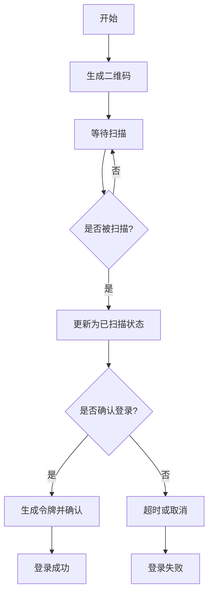
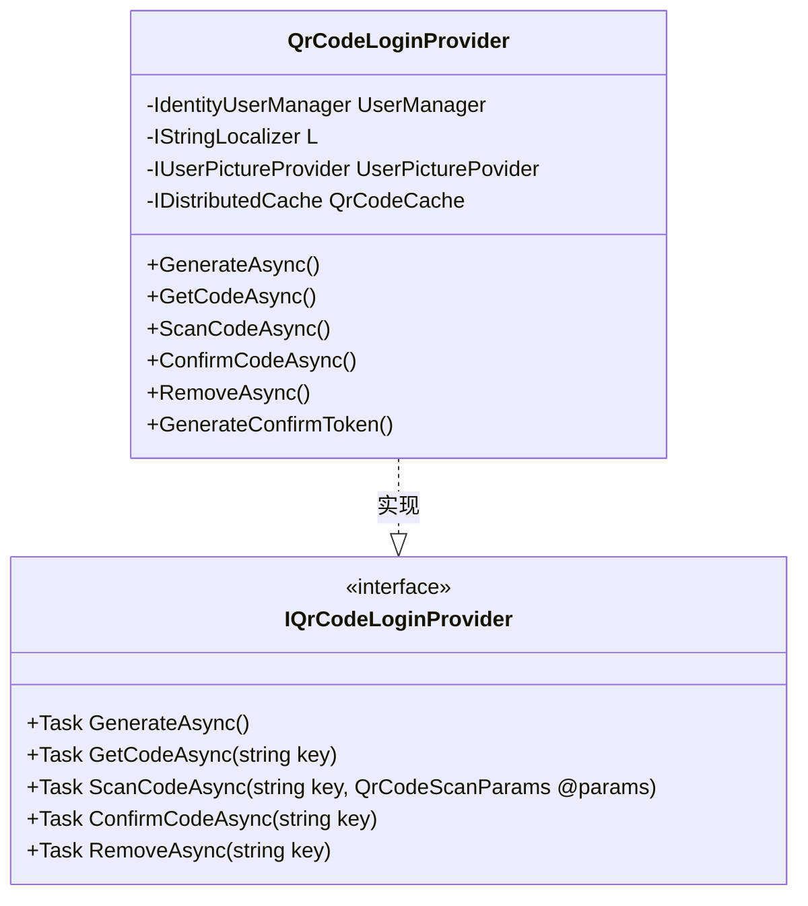
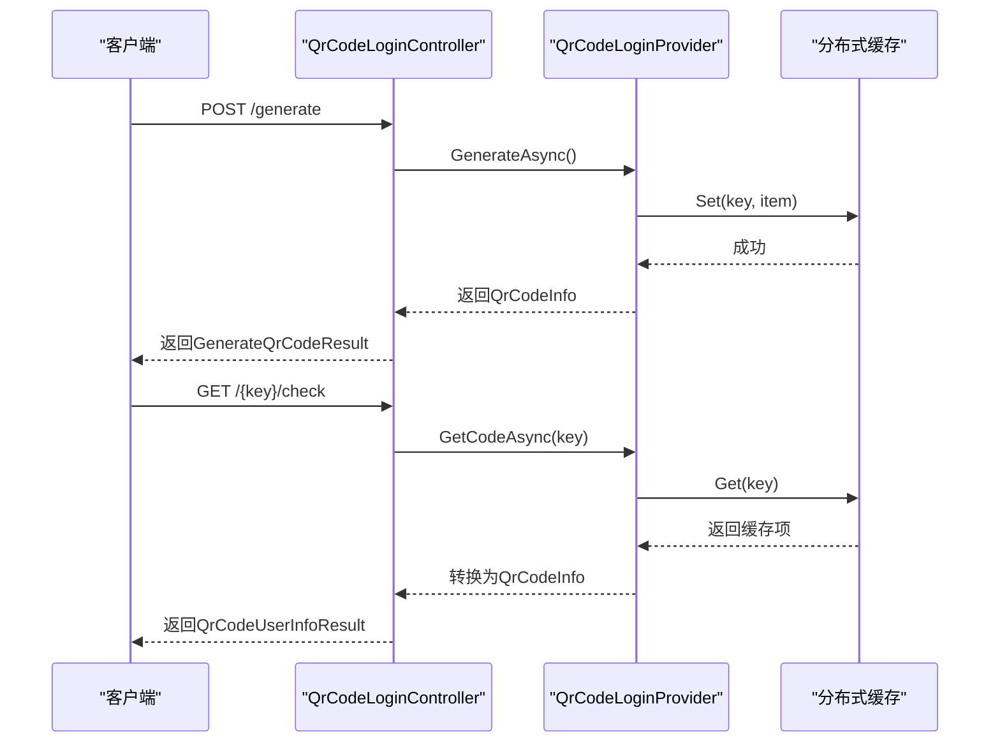

# 二维码登录

<cite>
**本文档中引用的文件**
- [QrCodeLoginController.cs](file://aspnet-core/modules/account/LINGYUN.Abp.Account.Web/Areas/Account/Controllers/QrCodeLoginController.cs)
- [IQrCodeLoginProvider.cs](file://aspnet-core/modules/identity/LINGYUN.Abp.Identity.QrCode/LINGYUN/Abp/Identity/QrCode/IQrCodeLoginProvider.cs)
- [QrCodeLoginProvider.cs](file://aspnet-core/modules/identity/LINGYUN.Abp.Identity.QrCode/LINGYUN/Abp/Identity/QrCode/QrCodeLoginProvider.cs)
- [QrCodeLoginProviderConsts.cs](file://aspnet-core/modules/identity/LINGYUN.Abp.Identity.QrCode/LINGYUN/Abp/Identity/QrCode/QrCodeLoginProviderConsts.cs)
- [QrCodeInfo.cs](file://aspnet-core/modules/identity/LINGYUN.Abp.Identity.QrCode/LINGYUN/Abp/Identity/QrCode/QrCodeInfo.cs)
- [QrCodeScanParams.cs](file://aspnet-core/modules/identity/LINGYUN.Abp.Identity.QrCode/LINGYUN/Abp/Identity/QrCode/QrCodeScanParams.cs)
- [QrCodeCacheItem.cs](file://aspnet-core/modules/identity/LINGYUN.Abp.Identity.QrCode/LINGYUN/Abp/Identity/QrCode/QrCodeCacheItem.cs)
- [QrCodeStatus.cs](file://aspnet-core/modules/identity/LINGYUN.Abp.Identity.QrCode/LINGYUN/Abp/Identity/QrCode/QrCodeStatus.cs)
- [QrCodeUserInfoResult.cs](file://aspnet-core/modules/account/LINGYUN.Abp.Account.Web/Areas/Account/Controllers/Models/QrCodeUserInfoResult.cs)
- [QrCodeInfoResult.cs](file://aspnet-core/modules/account/LINGYUN.Abp.Account.Web/Areas/Account/Controllers/Models/QrCodeInfoResult.cs)
- [GenerateQrCodeResult.cs](file://aspnet-core/modules/account/LINGYUN.Abp.Account.Web/Areas/Account/Controllers/Models/GenerateQrCodeResult.cs)
</cite>

## 目录
1. [简介](#简介)
2. [核心组件](#核心组件)
3. [流程设计](#流程设计)
4. [应用服务接口与实现](#应用服务接口与实现)
5. [API接口说明](#api接口说明)
6. [前端集成指南](#前端集成指南)
7. [安全性考虑](#安全性考虑)
8. [配置选项与扩展点](#配置选项与扩展点)

## 简介
本系统实现了基于二维码的身份验证功能，允许用户通过扫描动态生成的二维码完成安全登录。该机制结合了分布式缓存、状态管理和令牌验证技术，提供了一种便捷且安全的无密码登录方式。整个流程包括二维码生成、状态轮询、扫码确认和身份验证等关键环节。

## 核心组件

二维码登录功能由多个核心组件构成，主要包括控制器层、服务提供者、数据模型和状态管理。控制器负责暴露REST API接口；服务提供者封装了业务逻辑；数据模型定义了信息结构；而状态机则确保了流程的安全性。

**Section sources**
- [QrCodeLoginController.cs](file://aspnet-core/modules/account/LINGYUN.Abp.Account.Web/Areas/Account/Controllers/QrCodeLoginController.cs)
- [QrCodeLoginProvider.cs](file://aspnet-core/modules/identity/LINGYUN.Abp.Identity.QrCode/LINGYUN/Abp/Identity/QrCode/QrCodeLoginProvider.cs)
- [QrCodeInfo.cs](file://aspnet-core/modules/identity/LINGYUN.Abp.Identity.QrCode/LINGYUN/Abp/Identity/QrCode/QrCodeInfo.cs)
- [QrCodeStatus.cs](file://aspnet-core/modules/identity/LINGYUN.Abp.Identity.QrCode/LINGYUN/Abp/Identity/QrCode/QrCodeStatus.cs)

## 流程设计

二维码登录流程包含四个主要阶段：二维码生成、客户端轮询检查、用户扫码以及最终确认。每个阶段都通过明确的状态转换来保证操作的原子性和安全性。

**Diagram sources**
- [QrCodeLoginProvider.cs](file://aspnet-core/modules/identity/LINGYUN.Abp.Identity.QrCode/LINGYUN/Abp/Identity/QrCode/QrCodeLoginProvider.cs)
- [QrCodeStatus.cs](file://aspnet-core/modules/identity/LINGYUN.Abp.Identity.QrCode/LINGYUN/Abp/Identity/QrCode/QrCodeStatus.cs)

## 应用服务接口与实现

### 接口定义
`IQrCodeLoginProvider` 定义了二维码登录所需的核心操作，包括生成、查询、扫描、确认和移除二维码。

#### 方法说明：
- `GenerateAsync`: 创建新的二维码并返回其唯一标识
- `GetCodeAsync`: 查询指定二维码的当前状态
- `ScanCodeAsync`: 记录用户扫描行为并更新信息
- `ConfirmCodeAsync`: 验证并完成登录确认
- `RemoveAsync`: 清理过期或无效的二维码记录

**Diagram sources**
- [IQrCodeLoginProvider.cs](file://aspnet-core/modules/identity/LINGYUN.Abp.Identity.QrCode/LINGYUN/Abp/Identity/QrCode/IQrCodeLoginProvider.cs)
- [QrCodeLoginProvider.cs](file://aspnet-core/modules/identity/LINGYUN.Abp.Identity.QrCode/LINGYUN/Abp/Identity/QrCode/QrCodeLoginProvider.cs)

### 实现细节
`QrCodeLoginProvider` 使用分布式缓存存储二维码状态，避免了数据库频繁读写。每次生成二维码时会创建一个带有滑动和绝对过期时间的缓存项（默认180秒滑动，300秒绝对）。当用户扫码后，系统将填充用户头像、名称等信息，并在确认阶段生成一次性令牌用于后续身份验证。

**Section sources**
- [QrCodeLoginProvider.cs](file://aspnet-core/modules/identity/LINGYUN.Abp.Identity.QrCode/LINGYUN/Abp/Identity/QrCode/QrCodeLoginProvider.cs)
- [QrCodeCacheItem.cs](file://aspnet-core/modules/identity/LINGYUN.Abp.Identity.QrCode/LINGYUN/Abp/Identity/QrCode/QrCodeCacheItem.cs)

## API接口说明

以下是二维码登录相关的HTTP API接口详细说明：

### 生成二维码
- **方法**: POST
- **路径**: `/api/account/qrcode/generate`
- **认证**: 无需认证
- **请求体**: 无
- **响应**: `GenerateQrCodeResult` 包含二维码唯一Key

### 检查二维码状态
- **方法**: GET
- **路径**: `/api/account/qrcode/{key}/check`
- **认证**: 无需认证
- **参数**: key (二维码唯一标识)
- **响应**: `QrCodeUserInfoResult` 包含状态、用户信息等

### 扫码操作
- **方法**: POST
- **路径**: `/api/account/qrcode/{key}/scan`
- **认证**: 需要认证
- **参数**: key
- **响应**: 更新后的 `QrCodeUserInfoResult`

### 确认登录
- **方法**: POST
- **路径**: `/api/account/qrcode/{key}/confirm`
- **认证**: 需要认证
- **参数**: key
- **响应**: 包含令牌的 `QrCodeUserInfoResult`

**Diagram sources**
- [QrCodeLoginController.cs](file://aspnet-core/modules/account/LINGYUN.Abp.Account.Web/Areas/Account/Controllers/QrCodeLoginController.cs)
- [QrCodeLoginProvider.cs](file://aspnet-core/modules/identity/LINGYUN.Abp.Identity.QrCode/LINGYUN/Abp/Identity/QrCode/QrCodeLoginProvider.cs)

## 前端集成指南

### Web端实现
Web前端可通过轮询方式定期调用 `/check` 接口获取二维码状态变化。建议使用WebSocket替代轮询以提高实时性。二维码图像可由后端直接返回Base64编码或通过独立URL访问。

### 移动端实现
移动端应具备相机权限以扫描二维码。扫描成功后跳转至确认页面，调用 `/scan` 和 `/confirm` 接口完成绑定与验证。推荐使用原生扫码组件提升体验。

**Section sources**
- [QrCodeLoginController.cs](file://aspnet-core/modules/account/LINGYUN.Abp.Account.Web/Areas/Account/Controllers/QrCodeLoginController.cs)
- [QrCodeUserInfoResult.cs](file://aspnet-core/modules/account/LINGYUN.Abp.Account.Web/Areas/Account/Controllers/Models/QrCodeUserInfoResult.cs)

## 安全性考虑

### 有效期控制
所有二维码均设置双重过期策略：180秒滑动过期 + 300秒绝对过期，防止长期有效带来的风险。

### 防重放攻击
采用一次性令牌机制，在 `ConfirmCodeAsync` 中生成仅能使用一次的验证令牌，有效防止重放攻击。

### 状态一致性
通过枚举 `QrCodeStatus` 严格控制状态流转，禁止非法跳转（如从“已创建”直接到“已确认”）。

### 敏感信息保护
用户头像以Data URI形式嵌入，不暴露真实存储路径；用户ID等敏感字段仅在认证后返回。

**Section sources**
- [QrCodeLoginProvider.cs](file://aspnet-core/modules/identity/LINGYUN.Abp.Identity.QrCode/LINGYUN/Abp/Identity/QrCode/QrCodeLoginProvider.cs)
- [QrCodeStatus.cs](file://aspnet-core/modules/identity/LINGYUN.Abp.Identity.QrCode/LINGYUN/Abp/Identity/QrCode/QrCodeStatus.cs)
- [QrCodeLoginProviderConsts.cs](file://aspnet-core/modules/identity/LINGYUN.Abp.Identity.QrCode/LINGYUN/Abp/Identity/QrCode/QrCodeLoginProviderConsts.cs)

## 配置选项与扩展点

### 可配置项
- `QrCodeLoginProviderConsts.Name`: 令牌提供者名称
- `QrCodeLoginProviderConsts.Purpose`: 令牌用途
- `QrCodeLoginProviderConsts.GrantType`: 授权类型
- 缓存过期时间可在代码中调整

### 扩展点
- `IUserPictureProvider`: 自定义用户头像获取逻辑
- `IQrCodeLoginProvider`: 可替换为其他实现（如短信+二维码混合验证）
- 分布式缓存可替换为Redis或其他支持IDistributedCache的实现

**Section sources**
- [QrCodeLoginProviderConsts.cs](file://aspnet-core/modules/identity/LINGYUN.Abp.Identity.QrCode/LINGYUN/Abp/Identity/QrCode/QrCodeLoginProviderConsts.cs)
- [QrCodeLoginProvider.cs](file://aspnet-core/modules/identity/LINGYUN.Abp.Identity.QrCode/LINGYUN/Abp/Identity/QrCode/QrCodeLoginProvider.cs)
- [IUserPictureProvider](file://aspnet-core/modules/identity/LINGYUN.Abp.Identity.QrCode/LINGYUN/Abp/Identity/QrCode/IUserPictureProvider.cs)