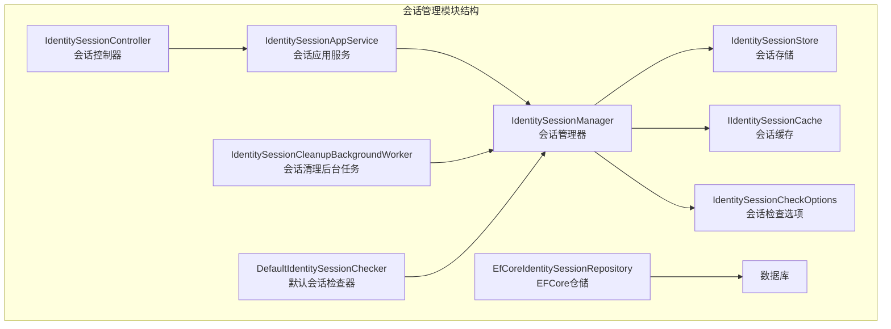
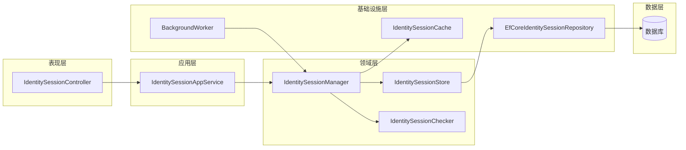
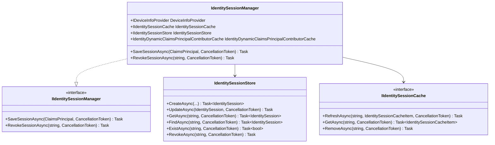
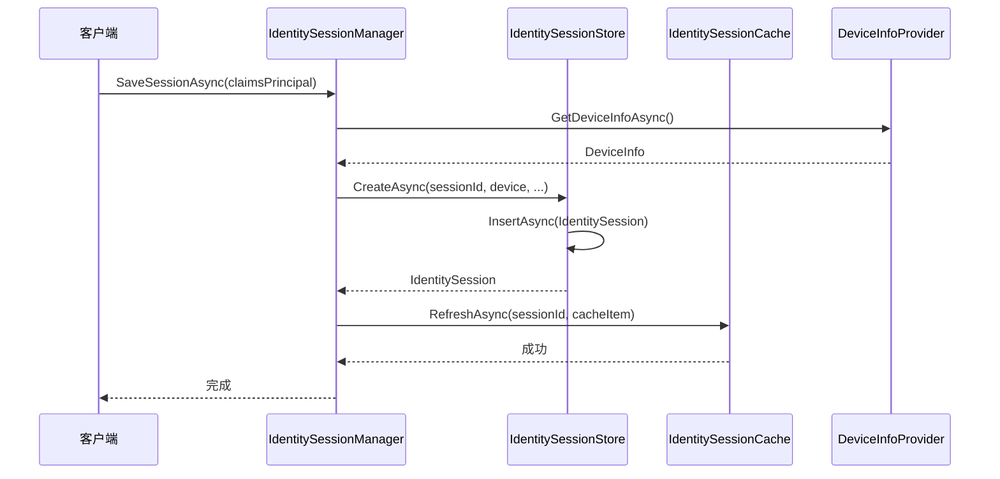
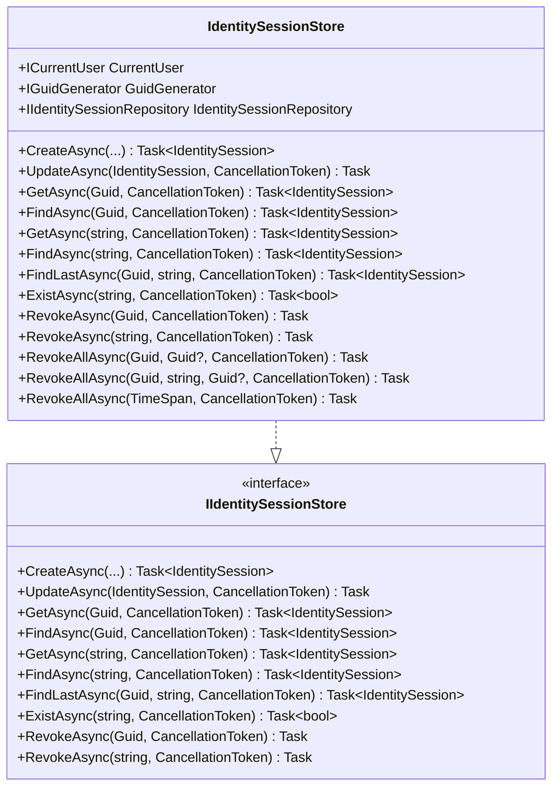
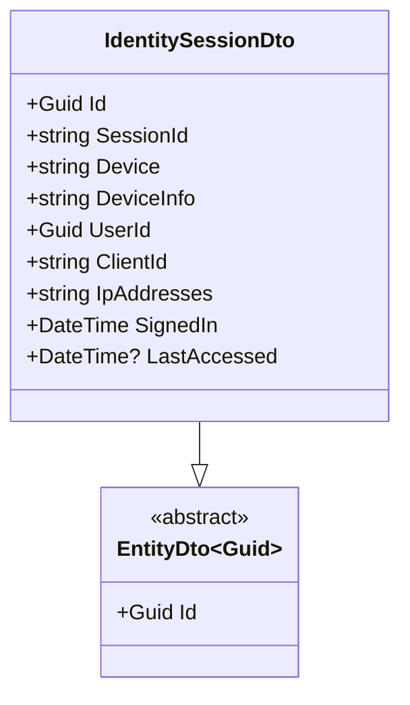
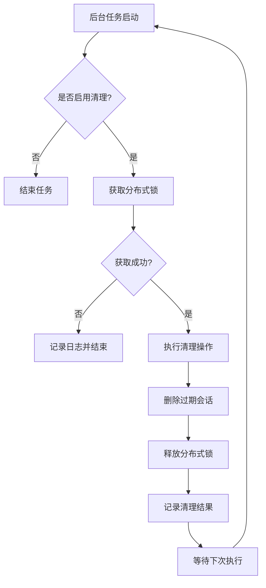
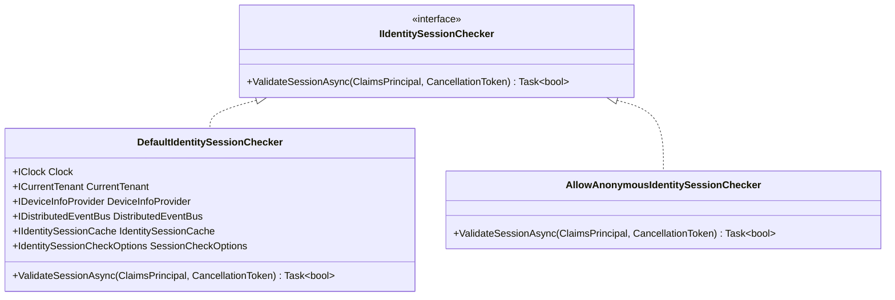
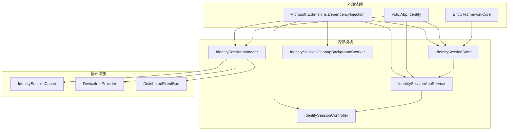

# 会话管理

<cite>
**本文档引用的文件**
- [IdentitySessionManager.cs](file://aspnet-core/modules/identity/LINGYUN.Abp.Identity.Domain/LINGYUN/Abp/Identity/Session/IdentitySessionManager.cs)
- [IdentitySessionStore.cs](file://aspnet-core/modules/identity/LINGYUN.Abp.Identity.Domain/LINGYUN/Abp/Identity/Session/IdentitySessionStore.cs)
- [IIdentitySessionStore.cs](file://aspnet-core/modules/identity/LINGYUN.Abp.Identity.Domain/LINGYUN/Abp/Identity/Session/IIdentitySessionStore.cs)
- [IIdentitySessionManager.cs](file://aspnet-core/modules/identity/LINGYUN.Abp.Identity.Domain/LINGYUN/Abp/Identity/Session/IIdentitySessionManager.cs)
- [IdentitySessionAppService.cs](file://aspnet-core/modules/identity/LINGYUN.Abp.Identity.Application/LINGYUN/Abp/Identity/IdentitySessionAppService.cs)
- [IdentitySessionController.cs](file://aspnet-core/modules/identity/LINGYUN.Abp.Identity.HttpApi/LINGYUN/Abp/Identity/IdentitySessionController.cs)
- [IdentitySessionDto.cs](file://aspnet-core/modules/identity/LINGYUN.Abp.Identity.Application.Contracts/LINGYUN/Abp/Identity/Dto/IdentitySessionDto.cs)
- [EfCoreIdentitySessionRepository.cs](file://aspnet-core/modules/identity/LINGYUN.Abp.Identity.EntityFrameworkCore/LINGYUN/Abp/Identity/EntityFrameworkCore/EfCoreIdentitySessionRepository.cs)
- [IdentitySessionCleanupBackgroundWorker.cs](file://aspnet-core/modules/identity/LINGYUN.Abp.Identity.Domain/LINGYUN/Abp/Identity/Session/IdentitySessionCleanupBackgroundWorker.cs)
- [IdentitySessionCheckOptions.cs](file://aspnet-core/modules/identity/LINGYUN.Abp.Identity.Session/LINGYUN/Abp/Identity/Session/IdentitySessionCheckOptions.cs)
- [DefaultIdentitySessionChecker.cs](file://aspnet-core/modules/identity/LINGYUN.Abp.Identity.Session/LINGYUN/Abp/Identity\Session/DefaultIdentitySessionChecker.cs)
- [IdentitySessionCacheItem.cs](file://aspnet-core/modules/identity/LINGYUN.Abp.Identity.Session/LINGYUN/Abp/Identity/Session/IdentitySessionCacheItem.cs)
- [IdentitySessionEto.cs](file://aspnet-core/modules/identity/LINGYUN.Abp.Identity.Domain.Shared/LINGYUN/Abp/Identity/IdentitySessionEto.cs)
- [DeviceInfo.cs](file://aspnet-core/modules/identity/LINGYUN.Abp.Identity.Session/LINGYUN/Abp/Identity/Session/DeviceInfo.cs)
</cite>

## 目录
1. [简介](#简介)
2. [项目结构](#项目结构)
3. [核心组件](#核心组件)
4. [架构概览](#架构概览)
5. [详细组件分析](#详细组件分析)
6. [依赖关系分析](#依赖关系分析)
7. [性能考虑](#性能考虑)
8. [故障排除指南](#故障排除指南)
9. [结论](#结论)

## 简介

会话管理系统是 abp-next-admin 项目中身份管理模块的核心组成部分，负责管理用户的会话生命周期。该系统提供了完整的会话跟踪、验证和管理功能，支持多设备登录、会话撤销、自动清理等高级特性。

会话管理系统采用分层架构设计，包含领域服务、应用服务、数据访问层和缓存层，确保了系统的可扩展性和高性能。系统支持分布式环境下的会话同步，并提供了完善的安全机制来保护用户会话。

## 项目结构

会话管理模块在项目中的组织结构如下：



**图表来源**
- [IdentitySessionManager.cs](file://aspnet-core/modules/identity/LINGYUN.Abp.Identity.Domain/LINGYUN/Abp/Identity/Session/IdentitySessionManager.cs#L11-L32)
- [IdentitySessionStore.cs](file://aspnet-core/modules/identity/LINGYUN.Abp.Identity.Domain/LINGYUN/Abp/Identity/Session/IdentitySessionStore.cs#L13-L25)

**章节来源**
- [IdentitySessionManager.cs](file://aspnet-core/modules/identity/LINGYUN.Abp.Identity.Domain/LINGYUN/Abp/Identity/Session/IdentitySessionManager.cs#L1-L102)
- [IdentitySessionStore.cs](file://aspnet-core/modules/identity/LINGYUN.Abp.Identity.Domain/LINGYUN/Abp/Identity/Session/IdentitySessionStore.cs#L1-L179)

## 核心组件

会话管理系统的核心组件包括以下关键部分：

### 1. 会话管理器 (IdentitySessionManager)
负责会话的创建、更新和撤销操作，是整个会话管理的核心协调者。

### 2. 会话存储 (IdentitySessionStore)
提供会话数据的持久化存储功能，支持会话的增删改查操作。

### 3. 应用服务 (IdentitySessionAppService)
提供会话管理的业务逻辑封装，作为API层与领域层之间的桥梁。

### 4. 数据访问层 (EfCoreIdentitySessionRepository)
基于EntityFrameworkCore实现的会话数据访问层，负责与数据库的交互。

### 5. 缓存层 (IdentitySessionCache)
提供会话数据的内存缓存，提高会话验证和查询的性能。

**章节来源**
- [IdentitySessionManager.cs](file://aspnet-core/modules/identity/LINGYUN.Abp.Identity.Domain/LINGYUN/Abp/Identity/Session/IdentitySessionManager.cs#L11-L32)
- [IdentitySessionStore.cs](file://aspnet-core/modules/identity/LINGYUN.Abp.Identity.Domain/LINGYUN/Abp/Identity/Session/IdentitySessionStore.cs#L13-L25)

## 架构概览

会话管理系统采用经典的分层架构模式，各层职责明确，耦合度低：



**图表来源**
- [IdentitySessionController.cs](file://aspnet-core/modules/identity/LINGYUN.Abp.Identity.HttpApi/LINGYUN/Abp/Identity/IdentitySessionController.cs#L16-L38)
- [IdentitySessionAppService.cs](file://aspnet-core/modules/identity/LINGYUN.Abp.Identity.Application/LINGYUN/Abp/Identity/IdentitySessionAppService.cs#L10-L25)

## 详细组件分析

### 会话管理器 (IdentitySessionManager)

会话管理器是会话管理系统的核心组件，负责协调各个子系统的工作：



**图表来源**
- [IdentitySessionManager.cs](file://aspnet-core/modules/identity/LINGYUN.Abp.Identity.Domain/LINGYUN/Abp/Identity/Session/IdentitySessionManager.cs#L11-L32)
- [IIdentitySessionManager.cs](file://aspnet-core/modules/identity/LINGYUN.Abp.Identity.Domain/LINGYUN/Abp/Identity/Session/IIdentitySessionManager.cs#L8-L28)

#### 会话保存流程

会话保存是一个复杂的异步流程，涉及多个步骤：



**图表来源**
- [IdentitySessionManager.cs](file://aspnet-core/modules/identity/LINGYUN.Abp.Identity.Domain/LINGYUN/Abp/Identity/Session/IdentitySessionManager.cs#L28-L102)

**章节来源**
- [IdentitySessionManager.cs](file://aspnet-core/modules/identity/LINGYUN.Abp.Identity.Domain/LINGYUN/Abp/Identity/Session/IdentitySessionManager.cs#L28-L102)

### 会话存储层 (IdentitySessionStore)

会话存储层负责会话数据的持久化操作：



**图表来源**
- [IdentitySessionStore.cs](file://aspnet-core/modules/identity/LINGYUN.Abp.Identity.Domain/LINGYUN/Abp/Identity/Session/IdentitySessionStore.cs#L13-L25)
- [IIdentitySessionStore.cs](file://aspnet-core/modules/identity/LINGYUN.Abp.Identity.Domain/LINGYUN/Abp/Identity/Session/IIdentitySessionStore.cs#L8-L100)

**章节来源**
- [IdentitySessionStore.cs](file://aspnet-core/modules/identity/LINGYUN.Abp.Identity.Domain/LINGYUN/Abp/Identity/Session/IdentitySessionStore.cs#L13-L179)

### 会话数据传输对象 (IdentitySessionDto)

会话数据传输对象用于在不同层之间传递会话信息：



**图表来源**
- [IdentitySessionDto.cs](file://aspnet-core/modules/identity/LINGYUN.Abp.Identity.Application.Contracts/LINGYUN/Abp/Identity/Dto/IdentitySessionDto.cs#L5-L21)

**章节来源**
- [IdentitySessionDto.cs](file://aspnet-core/modules/identity/LINGYUN.Abp.Identity.Application.Contracts/LINGYUN/Abp/Identity/Dto/IdentitySessionDto.cs#L1-L21)

### 会话清理后台任务

会话清理后台任务负责定期清理过期的会话数据：



**图表来源**
- [IdentitySessionCleanupBackgroundWorker.cs](file://aspnet-core/modules/identity/LINGYUN.Abp.Identity.Domain/LINGYUN/Abp/Identity/Session/IdentitySessionCleanupBackgroundWorker.cs#L25-L51)

**章节来源**
- [IdentitySessionCleanupBackgroundWorker.cs](file://aspnet-core/modules/identity/LINGYUN.Abp.Identity.Domain/LINGYUN/Abp/Identity/Session/IdentitySessionCleanupBackgroundWorker.cs#L10-L51)

### 会话检查器 (IdentitySessionChecker)

会话检查器负责验证会话的有效性：



**图表来源**
- [IIdentitySessionChecker.cs](file://aspnet-core/modules/identity/LINGYUN.Abp.Identity.Session/LINGYUN/Abp/Identity/Session/IIdentitySessionChecker.cs#L6-L8)
- [DefaultIdentitySessionChecker.cs](file://aspnet-core/modules/identity/LINGYUN.Abp.Identity.Session/LINGYUN/Abp/Identity/Session/DefaultIdentitySessionChecker.cs#L15-L35)

**章节来源**
- [DefaultIdentitySessionChecker.cs](file://aspnet-core/modules/identity/LINGYUN.Abp.Identity.Session/LINGYUN/Abp/Identity/Session/DefaultIdentitySessionChecker.cs#L15-L65)

## 依赖关系分析

会话管理系统的依赖关系复杂但清晰：



**图表来源**
- [IdentitySessionManager.cs](file://aspnet-core/modules/identity/LINGYUN.Abp.Identity.Domain/LINGYUN/Abp/Identity/Session/IdentitySessionManager.cs#L1-L10)
- [IdentitySessionStore.cs](file://aspnet-core/modules/identity/LINGYUN.Abp.Identity.Domain/LINGYUN/Abp/Identity/Session/IdentitySessionStore.cs#L1-L12)

**章节来源**
- [IdentitySessionManager.cs](file://aspnet-core/modules/identity/LINGYUN.Abp.Identity.Domain/LINGYUN/Abp/Identity/Session/IdentitySessionManager.cs#L1-L32)
- [IdentitySessionStore.cs](file://aspnet-core/modules/identity/LINGYUN.Abp.Identity.Domain/LINGYUN/Abp/Identity/Session/IdentitySessionStore.cs#L1-L42)

## 性能考虑

会话管理系统在设计时充分考虑了性能优化：

### 1. 缓存策略
- 使用内存缓存存储活跃会话信息
- 支持分布式缓存以适应集群环境
- 提供缓存预热和失效机制

### 2. 数据库优化
- 为会话表建立适当的索引
- 支持多种数据库引擎（MySQL、SQL Server、PostgreSQL）
- 提供批量操作支持

### 3. 异步处理
- 所有I/O操作均采用异步模式
- 后台任务处理非实时操作
- 避免阻塞主线程

### 4. 资源管理
- 合理使用连接池
- 及时释放数据库连接
- 避免内存泄漏

## 故障排除指南

### 常见问题及解决方案

#### 1. 会话创建失败
**症状**: 用户登录后无法创建会话
**原因**: 
- 设备信息提供程序异常
- 数据库连接问题
- 会话ID冲突

**解决方案**:
```csharp
// 检查设备信息提供程序配置
var deviceInfo = await DeviceInfoProvider.GetDeviceInfoAsync();
if (deviceInfo == null)
{
    throw new InvalidOperationException("设备信息提供程序返回null");
}

// 检查数据库连接
try
{
    await IdentitySessionStore.CreateAsync(...);
}
catch (Exception ex)
{
    Logger.LogError(ex, "会话创建失败");
    // 实施重试机制或降级策略
}
```

#### 2. 会话验证失败
**症状**: 用户请求被拒绝，提示会话无效
**原因**:
- 缓存数据过期
- 分布式锁竞争
- 时间同步问题

**解决方案**:
```csharp
// 检查会话缓存状态
var cacheItem = await IdentitySessionCache.GetAsync(sessionId);
if (cacheItem == null)
{
    // 尝试从数据库重新加载
    var session = await IdentitySessionStore.FindAsync(sessionId);
    if (session != null)
    {
        await RefreshSessionCache(session);
    }
}
```

#### 3. 清理任务异常
**症状**: 后台清理任务频繁失败
**原因**:
- 分布式锁获取失败
- 数据库锁定超时
- 事务冲突

**解决方案**:
```csharp
// 增加重试机制
var retryCount = 3;
while (retryCount > 0)
{
    try
    {
        await IdentitySessionStore.RevokeAllAsync(inactiveTimeSpan);
        break;
    }
    catch (Exception ex)
    {
        retryCount--;
        if (retryCount == 0)
        {
            Logger.LogError(ex, "会话清理任务连续失败");
            throw;
        }
        await Task.Delay(TimeSpan.FromSeconds(5));
    }
}
```

**章节来源**
- [IdentitySessionManager.cs](file://aspnet-core/modules/identity/LINGYUN.Abp.Identity.Domain/LINGYUN/Abp/Identity/Session/IdentitySessionManager.cs#L28-L102)
- [IdentitySessionCleanupBackgroundWorker.cs](file://aspnet-core/modules/identity/LINGYUN.Abp.Identity.Domain/LINGYUN/Abp/Identity/Session/IdentitySessionCleanupBackgroundWorker.cs#L25-L51)

## 结论

会话管理系统是 abp-next-admin 项目中一个设计精良、功能完备的身份管理组件。它通过分层架构、异步处理和缓存优化，提供了高性能的会话管理能力。

### 主要优势

1. **架构清晰**: 分层设计使得系统易于维护和扩展
2. **性能优异**: 多级缓存和异步处理保证了高并发性能
3. **功能完整**: 支持会话创建、验证、撤销和清理等全生命周期管理
4. **安全可靠**: 分布式锁和事务管理确保了数据一致性
5. **易于集成**: 提供了丰富的API和配置选项

### 最佳实践建议

1. **合理配置缓存**: 根据业务需求调整缓存大小和过期时间
2. **监控系统健康**: 定期检查会话清理任务和缓存命中率
3. **优化数据库**: 为会话表建立合适的索引以提高查询性能
4. **实施监控**: 添加适当的日志记录和指标收集
5. **定期维护**: 清理过期会话数据，避免数据库膨胀

通过遵循这些最佳实践，可以确保会话管理系统在生产环境中稳定高效地运行。