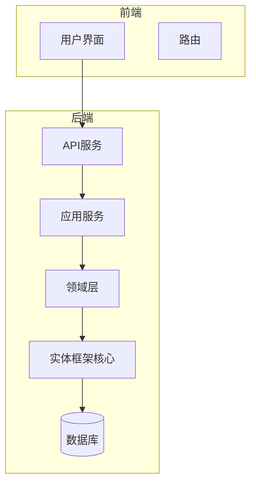
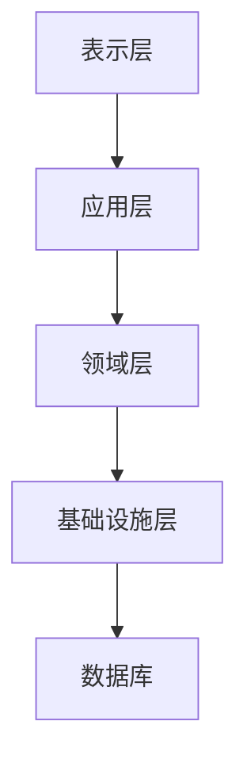
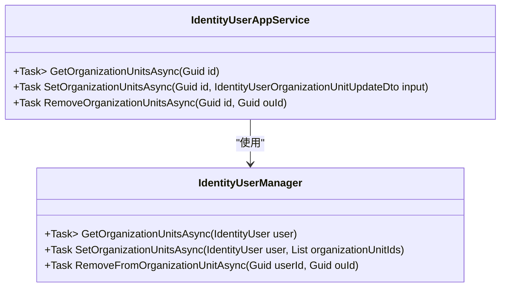
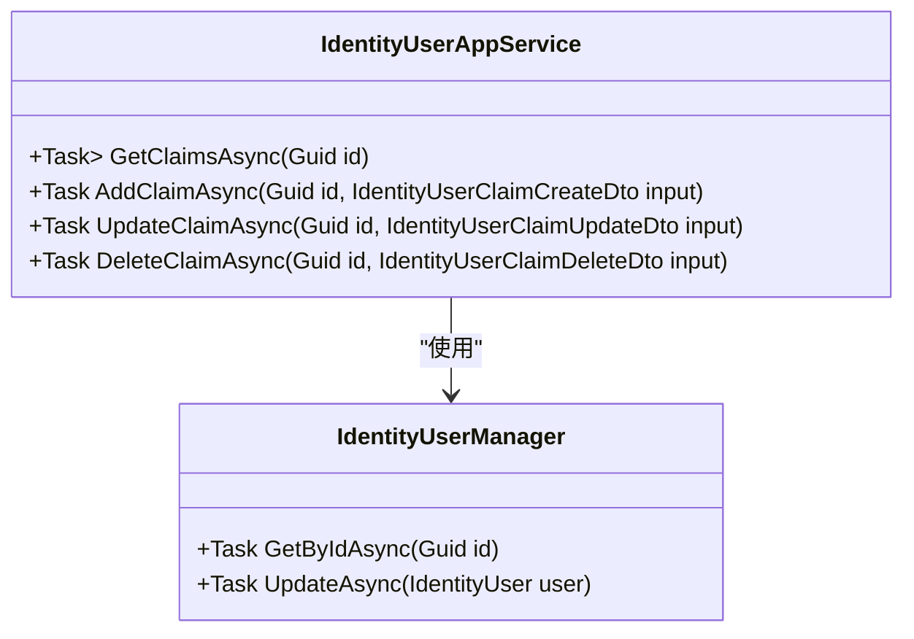
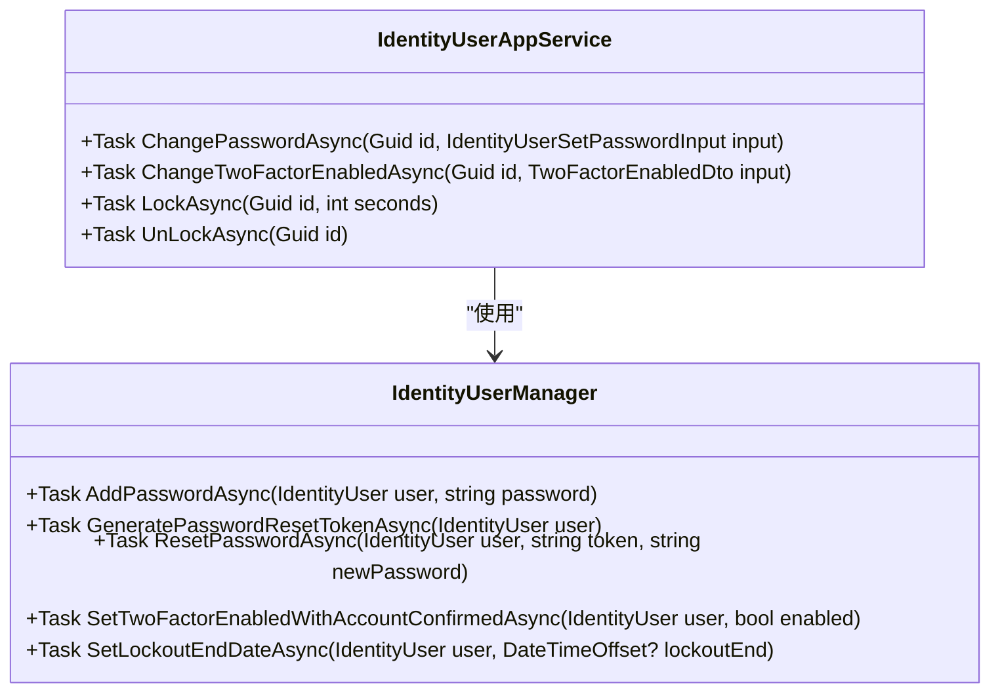

# 用户管理

<cite>
**本文档引用的文件**
- [IdentityUserAppService.cs](file://aspnet-core\modules\identity\LINGYUN.Abp.Identity.Application\LINGYUN\Abp\Identity\IdentityUserAppService.cs)
- [IIdentityUserAppService.cs](file://aspnet-core\modules\identity\LINGYUN.Abp.Identity.Application.Contracts\LINGYUN\Abp\Identity\IIdentityUserAppService.cs)
- [IdentityUserClaimCreateOrUpdateDto.cs](file://aspnet-core\modules\identity\LINGYUN.Abp.Identity.Application.Contracts\LINGYUN\Abp\Identity\Dto\IdentityUserClaimCreateOrUpdateDto.cs)
- [IdentityUserOrganizationUnitUpdateDto.cs](file://aspnet-core\modules\identity\LINGYUN.Abp.Identity.Application.Contracts\LINGYUN\Abp\Identity\Dto\IdentityUserOrganizationUnitUpdateDto.cs)
- [AbpUINavigationVueVbenAdminNavigationDefinitionProvider.cs](file://aspnet-core\modules\platform\LINGYUN.Abp.UI.Navigation.VueVbenAdmin\LINGYUN\Abp\UI\Navigation\VueVbenAdmin\AbpUINavigationVueVbenAdminNavigationDefinitionProvider.cs)
</cite>

## 目录
1. [简介](#简介)
2. [项目结构](#项目结构)
3. [核心组件](#核心组件)
4. [架构概述](#架构概述)
5. [详细组件分析](#详细组件分析)
6. [依赖分析](#依赖分析)
7. [性能考虑](#性能考虑)
8. [故障排除指南](#故障排除指南)
9. [结论](#结论)
10. [附录](#附录)（如有必要）

## 简介
本文档详细介绍了基于ABP框架的身份管理模块中的用户管理功能。文档深入解释了用户实体的领域模型设计，包括用户属性、验证规则和业务逻辑。详细描述了用户管理的应用服务接口和实现，涵盖用户创建、更新、删除、查询等操作。文档还说明了用户数据访问层（EntityFrameworkCore）的实现细节，包括仓储模式和数据库映射。提供了用户管理API接口的详细说明，包括HTTP方法、URL路径、请求/响应数据结构和认证方式。包含实际代码示例展示用户管理的常见操作，并说明了用户状态管理、密码策略、锁定机制等高级功能。同时，阐述了用户管理的测试方法和最佳实践。

## 项目结构
用户管理功能主要分布在ABP框架的identity模块中，包括应用层、应用合约层和实体框架核心层。应用层包含用户应用服务的实现，应用合约层定义了用户应用服务的接口和数据传输对象（DTO），实体框架核心层负责用户数据的持久化。前端Vue应用通过API与后端服务进行交互，实现用户管理的UI功能。



**图示来源**
- [AbpUINavigationVueVbenAdminNavigationDefinitionProvider.cs](file://aspnet-core\modules\platform\LINGYUN.Abp.UI.Navigation.VueVbenAdmin\LINGYUN\Abp\UI\Navigation\VueVbenAdmin\AbpUINavigationVueVbenAdminNavigationDefinitionProvider.cs#L75-L107)

**章节来源**
- [AbpUINavigationVueVbenAdminNavigationDefinitionProvider.cs](file://aspnet-core\modules\platform\LINGYUN.Abp.UI.Navigation.VueVbenAdmin\LINGYUN\Abp\UI\Navigation\VueVbenAdmin\AbpUINavigationVueVbenAdminNavigationDefinitionProvider.cs#L75-L107)

## 核心组件
用户管理的核心组件包括用户应用服务（IdentityUserAppService）、用户应用服务接口（IIdentityUserAppService）、用户声明DTO（IdentityUserClaimCreateOrUpdateDto）和用户组织机构更新DTO（IdentityUserOrganizationUnitUpdateDto）。这些组件共同实现了用户管理的各项功能，包括用户组织机构管理、用户声明管理、密码变更、双因素验证、用户锁定和解锁等。

**章节来源**
- [IdentityUserAppService.cs](file://aspnet-core\modules\identity\LINGYUN.Abp.Identity.Application\LINGYUN\Abp\Identity\IdentityUserAppService.cs#L0-L171)
- [IIdentityUserAppService.cs](file://aspnet-core\modules\identity\LINGYUN.Abp.Identity.Application.Contracts\LINGYUN\Abp\Identity\IIdentityUserAppService.cs#L0-L60)

## 架构概述
用户管理模块采用分层架构，包括表示层、应用层、领域层和基础设施层。表示层负责用户界面的展示和用户交互；应用层负责协调领域层和基础设施层，实现业务逻辑；领域层包含用户实体和业务规则；基础设施层负责数据持久化和外部服务集成。各层之间通过接口进行通信，确保了系统的松耦合和高内聚。



**图示来源**
- [IdentityUserAppService.cs](file://aspnet-core\modules\identity\LINGYUN.Abp.Identity.Application\LINGYUN\Abp\Identity\IdentityUserAppService.cs#L0-L171)

## 详细组件分析
### 用户应用服务分析
用户应用服务（IdentityUserAppService）是用户管理的核心组件，负责处理用户管理的各项操作。该服务通过依赖注入获取用户管理器（IdentityUserManager）和身份选项（IdentityOptions），并利用这些依赖实现具体的业务逻辑。

#### 组织机构管理
用户应用服务提供了获取、设置和移除用户组织机构的方法。通过`GetOrganizationUnitsAsync`方法可以获取指定用户的所有组织机构；通过`SetOrganizationUnitsAsync`方法可以为用户设置组织机构；通过`RemoveOrganizationUnitsAsync`方法可以从用户中移除指定的组织机构。



**图示来源**
- [IdentityUserAppService.cs](file://aspnet-core\modules\identity\LINGYUN.Abp.Identity.Application\LINGYUN\Abp\Identity\IdentityUserAppService.cs#L0-L171)
- [IIdentityUserAppService.cs](file://aspnet-core\modules\identity\LINGYUN.Abp.Identity.Application.Contracts\LINGYUN\Abp\Identity\IIdentityUserAppService.cs#L0-L60)

#### 用户声明管理
用户应用服务提供了获取、添加、更新和删除用户声明的方法。通过`GetClaimsAsync`方法可以获取指定用户的所有声明；通过`AddClaimAsync`方法可以为用户添加声明；通过`UpdateClaimAsync`方法可以更新用户声明；通过`DeleteClaimAsync`方法可以删除用户声明。



**图示来源**
- [IdentityUserAppService.cs](file://aspnet-core\modules\identity\LINGYUN.Abp.Identity.Application\LINGYUN\Abp\Identity\IdentityUserAppService.cs#L0-L171)
- [IIdentityUserAppService.cs](file://aspnet-core\modules\identity\LINGYUN.Abp.Identity.Application.Contracts\LINGYUN\Abp\Identity\IIdentityUserAppService.cs#L0-L60)

#### 密码和安全功能
用户应用服务提供了变更密码、变更双因素验证选项、锁定和解锁用户的方法。通过`ChangePasswordAsync`方法可以变更用户密码；通过`ChangeTwoFactorEnabledAsync`方法可以变更用户双因素验证选项；通过`LockAsync`方法可以锁定用户；通过`UnLockAsync`方法可以解锁用户。



**图示来源**
- [IdentityUserAppService.cs](file://aspnet-core\modules\identity\LINGYUN.Abp.Identity.Application\LINGYUN\Abp\Identity\IdentityUserAppService.cs#L0-L171)
- [IIdentityUserAppService.cs](file://aspnet-core\modules\identity\LINGYUN.Abp.Identity.Application.Contracts\LINGYUN\Abp\Identity\IIdentityUserAppService.cs#L0-L60)

**章节来源**
- [IdentityUserAppService.cs](file://aspnet-core\modules\identity\LINGYUN.Abp.Identity.Application\LINGYUN\Abp\Identity\IdentityUserAppService.cs#L0-L171)
- [IIdentityUserAppService.cs](file://aspnet-core\modules\identity\LINGYUN.Abp.Identity.Application.Contracts\LINGYUN\Abp\Identity\IIdentityUserAppService.cs#L0-L60)

## 依赖分析
用户管理模块依赖于ABP框架的多个组件，包括身份管理、组织机构管理、声明管理、双因素验证和用户锁定功能。这些依赖通过依赖注入机制注入到用户应用服务中，确保了组件之间的松耦合。

```mermaid
graph TD
IdentityUserAppService --> IdentityUserManager
IdentityUserAppService --> IOptions<IdentityOptions>
IdentityUserManager --> IdentityUser
IdentityUserManager --> OrganizationUnit
IdentityUserManager --> IdentityUserClaim
```

**图示来源**
- [IdentityUserAppService.cs](file://aspnet-core\modules\identity\LINGYUN.Abp.Identity.Application\LINGYUN\Abp\Identity\IdentityUserAppService.cs#L0-L171)

**章节来源**
- [IdentityUserAppService.cs](file://aspnet-core\modules\identity\LINGYUN.Abp.Identity.Application\LINGYUN\Abp\Identity\IdentityUserAppService.cs#L0-L171)

## 性能考虑
用户管理模块在设计时考虑了性能优化，例如通过异步方法避免阻塞主线程，通过批量操作减少数据库访问次数，通过缓存机制提高数据访问速度。此外，模块还支持多租户和分布式部署，能够满足大规模用户管理的需求。

## 故障排除指南
在使用用户管理功能时，可能会遇到一些常见问题，例如用户无法登录、密码重置失败、组织机构设置无效等。这些问题通常与配置错误、数据不一致或权限不足有关。建议检查相关配置文件、数据库状态和用户权限，确保系统正常运行。

**章节来源**
- [IdentityUserAppService.cs](file://aspnet-core\modules\identity\LINGYUN.Abp.Identity.Application\LINGYUN\Abp\Identity\IdentityUserAppService.cs#L0-L171)

## 结论
本文档详细介绍了基于ABP框架的身份管理模块中的用户管理功能。通过分层架构和依赖注入机制，实现了用户管理的各项功能，包括用户组织机构管理、用户声明管理、密码变更、双因素验证、用户锁定和解锁等。模块设计考虑了性能优化和可扩展性，能够满足大规模用户管理的需求。建议在实际使用中遵循最佳实践，确保系统稳定运行。