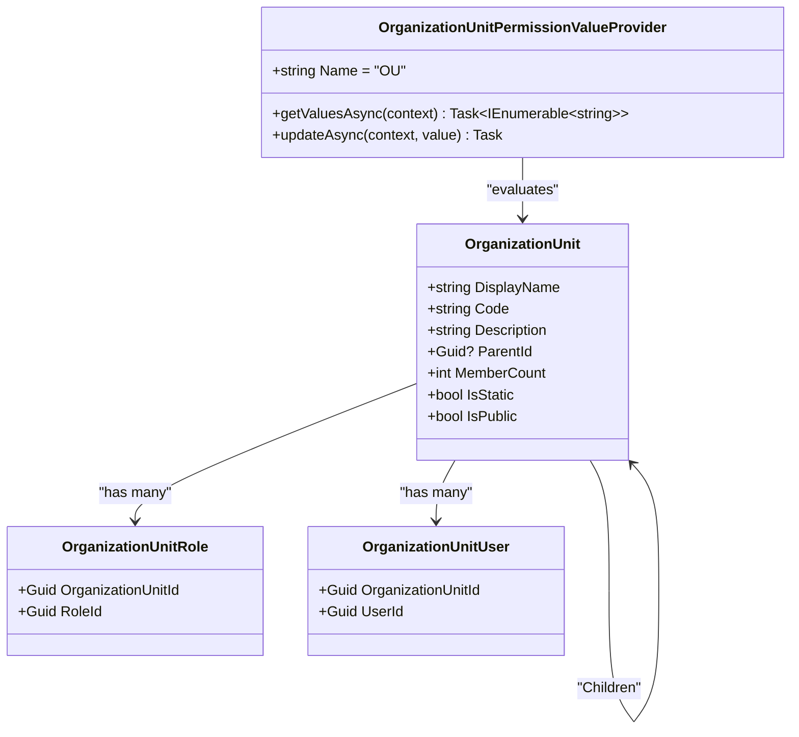
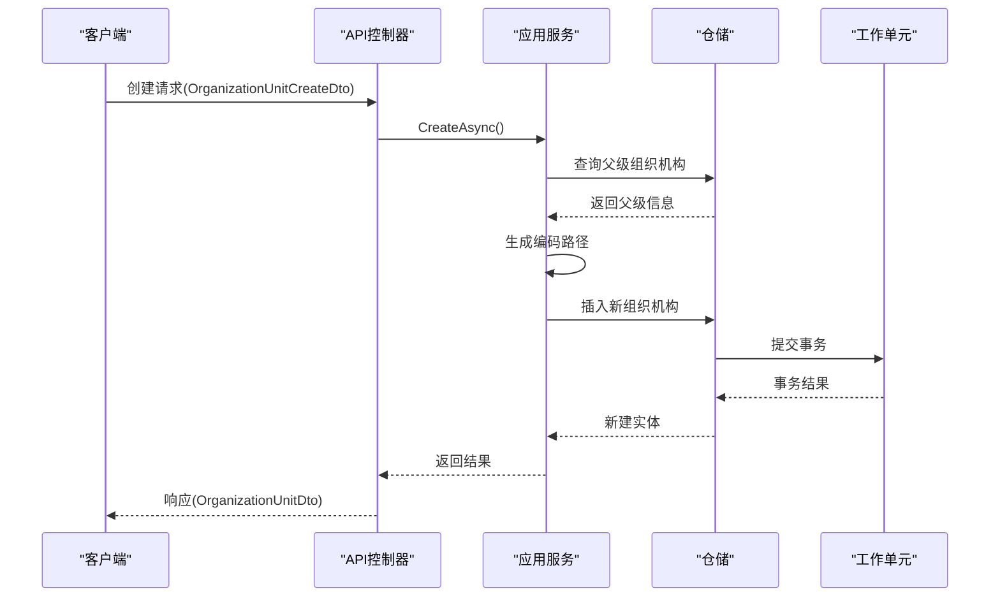
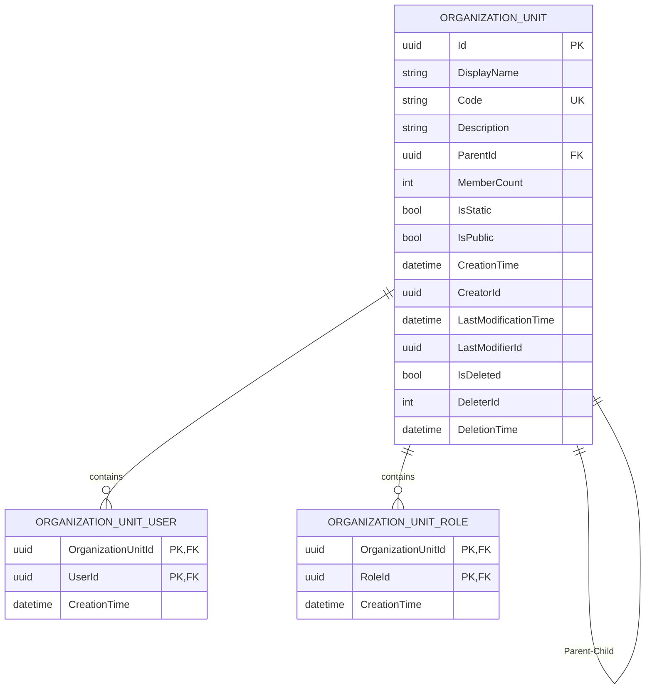
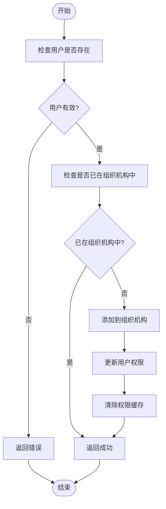

# 组织机构管理

<cite>
**本文档中引用的文件**
- [OrganizationUnitAppService.cs](file://aspnet-core/modules/identity/LINGYUN.Abp.Identity.Application/LINGYUN/Abp/Identity/OrganizationUnitAppService.cs)
- [OrganizationUnitCreateDto.cs](file://aspnet-core/modules/identity/LINGYUN.Abp.Identity.Application.Contracts/LINGYUN/Abp/Identity/Dto/OrganizationUnitCreateDto.cs)
- [OrganizationUnitDto.cs](file://aspnet-core/modules/identity/LINGYUN.Abp.Identity.Application.Contracts/LINGYUN/Abp/Identity/Dto/OrganizationUnitDto.cs)
- [OrganizationUnitGetByPagedDto.cs](file://aspnet-core/modules/identity/LINGYUN.Abp.Identity.Application.Contracts/LINGYUN/Abp/Identity/Dto/OrganizationUnitGetByPagedDto.cs)
- [OrganizationUnitAddUserDto.cs](file://aspnet-core/modules/identity/LINGYUN.Abp.Identity.Application.Contracts/LINGYUN/Abp/Identity/Dto/OrganizationUnitAddUserDto.cs)
- [OrganizationUnitAddRoleDto.cs](file://aspnet-core/modules/identity/LINGYUN.Abp.Identity.Application.Contracts/LINGYUN/Abp/Identity/Dto/OrganizationUnitAddRoleDto.cs)
- [OrganizationUnitGetChildrenDto.cs](file://aspnet-core/modules/identity/LINGYUN.Abp.Identity.Application.Contracts/LINGYUN/Abp/Identity/Dto/OrganizationUnitGetChildrenDto.cs)
- [OrganizationUnitGetUnaddedUserByPagedDto.cs](file://aspnet-core/modules/identity/LINGYUN.Abp.Identity.Application.Contracts/LINGYUN/Abp/Identity/Dto/OrganizationUnitGetUnaddedUserByPagedDto.cs)
- [OrganizationUnitGetUnaddedRoleByPagedDto.cs](file://aspnet-core/modules/identity/LINGYUN.Abp.Identity.Application.Contracts/LINGYUN/Abp/Identity/Dto/OrganizationUnitGetUnaddedRoleByPagedDto.cs)
- [OrganizationUnitGetListSpecification.cs](file://aspnet-core/modules/identity/LINGYUN.Abp.Identity.Application/LINGYUN/Abp/Identity/OrganizationUnitGetListSpecification.cs)
- [OrganizationUnitPermissionValueProvider.cs](file://aspnet-core/framework/authorization/LINGYUN.Abp.Authorization.OrganizationUnits/LINGYUN/Abp/Authorization/Permissions/OrganizationUnitPermissionValueProvider.cs)
- [OrganizationUnitEntityRuleAppService.cs](file://aspnet-core/modules/data-protection/LINGYUN.Abp.DataProtectionManagement.Application/LINGYUN/Abp/DataProtectionManagement/OrganizationUnitEntityRuleAppService.cs)
- [OrganizationUnitEntityRuleController.cs](file://aspnet-core/modules/data-protection/LINGYUN.Abp.DataProtectionManagement.HttpApi/LINGYUN/Abp/DataProtectionManagement/OrganizationUnitEntityRuleController.cs)
</cite>

## 目录
1. [简介](#简介)
2. [领域模型设计](#领域模型设计)
3. [应用服务接口与实现](#应用服务接口与实现)
4. [数据访问层实现](#数据访问层实现)
5. [API接口说明](#api接口说明)
6. [组织机构与用户、角色的关联管理](#组织机构与用户、角色的关联管理)
7. [测试方法与最佳实践](#测试方法与最佳实践)

## 简介
本文档详细阐述了身份管理模块中组织机构管理功能的设计与实现。系统采用树形结构来表示组织机构的层级关系，支持组织机构的创建、移动、删除和查询等操作，并实现了权限继承机制。通过Application Service提供业务逻辑封装，使用EntityFrameworkCore进行数据持久化，并提供了完整的RESTful API接口供前端调用。

## 领域模型设计

组织机构实体采用树形结构设计，每个组织机构节点包含名称、代码、描述等基本信息，并通过ParentId和Code路径字段维护层级关系。系统支持无限层级的组织结构，每个节点可以拥有多个子节点，形成典型的树状拓扑结构。

权限继承机制基于组织机构的层级关系实现，上级组织机构的权限会自动向下级组织机构传递。当用户属于某个组织机构时，不仅拥有该组织机构的直接权限，还继承其所有上级组织机构的权限。这种设计简化了权限分配过程，提高了管理效率。

**图示来源**
- [OrganizationUnitAppService.cs](file://aspnet-core/modules/identity/LINGYUN.Abp.Identity.Application/LINGYUN/Abp/Identity/OrganizationUnitAppService.cs)
- [OrganizationUnitPermissionValueProvider.cs](file://aspnet-core/framework/authorization/LINGYUN.Abp.Authorization.OrganizationUnits/LINGYUN/Abp/Authorization/Permissions/OrganizationUnitPermissionValueProvider.cs)

**本节来源**
- [OrganizationUnitAppService.cs](file://aspnet-core/modules/identity/LINGYUN.Abp.Identity.Application/LINGYUN/Abp/Identity/OrganizationUnitAppService.cs)
- [OrganizationUnitDto.cs](file://aspnet-core/modules/identity/LINGYUN.Abp.Identity.Application.Contracts/LINGYUN/Abp/Identity/Dto/OrganizationUnitDto.cs)

## 应用服务接口与实现

组织机构管理的应用服务（Application Service）提供了完整的CRUD操作接口，包括创建、更新、删除、移动和查询等功能。服务层实现了业务逻辑的封装，确保数据一致性和完整性。

创建组织机构时，系统会自动生成唯一的编码路径，并验证父级组织机构的存在性。移动操作需要检查目标位置是否有效，避免形成循环引用。删除操作采用软删除机制，保留历史数据的同时标记删除状态。

**图示来源**
- [OrganizationUnitAppService.cs](file://aspnet-core/modules/identity/LINGYUN.Abp.Identity.Application/LINGYUN/Abp/Identity/OrganizationUnitAppService.cs)
- [OrganizationUnitCreateDto.cs](file://aspnet-core/modules/identity/LINGYUN.Abp.Identity.Application.Contracts/LINGYUN/Abp/Identity/Dto/OrganizationUnitCreateDto.cs)

**本节来源**
- [OrganizationUnitAppService.cs](file://aspnet-core/modules/identity/LINGYUN.Abp.Identity.Application/LINGYUN/Abp/Identity/OrganizationUnitAppService.cs)
- [OrganizationUnitCreateDto.cs](file://aspnet-core/modules/identity/LINGYUN.Abp.Identity.Application.Contracts/LINGYUN/Abp/Identity/Dto/OrganizationUnitCreateDto.cs)

## 数据访问层实现

数据访问层基于EntityFrameworkCore实现，采用Code First模式管理数据库架构。组织机构表通过ParentId外键和Code字段建立层级关系，其中Code字段存储完整的路径编码，支持高效的层级查询。

为优化查询性能，系统在Code字段上创建了索引，并使用规范化的查询条件。获取指定组织机构的所有子节点时，通过Code字段的前缀匹配实现，避免了递归查询的性能问题。同时，系统实现了缓存机制，减少对数据库的频繁访问。

**图示来源**
- [OrganizationUnitAppService.cs](file://aspnet-core/modules/identity/LINGYUN.Abp.Identity.Application/LINGYUN/Abp/Identity/OrganizationUnitAppService.cs)
- [OrganizationUnitGetListSpecification.cs](file://aspnet-core/modules/identity/LINGYUN.Abp.Identity.Application/LINGYUN/Abp/Identity/OrganizationUnitGetListSpecification.cs)

**本节来源**
- [OrganizationUnitAppService.cs](file://aspnet-core/modules/identity/LINGYUN.Abp.Identity.Application/LINGYUN/Abp/Identity/OrganizationUnitAppService.cs)
- [OrganizationUnitGetListSpecification.cs](file://aspnet-core/modules/identity/LINGYUN.Abp.Identity.Application/LINGYUN/Abp/Identity/OrganizationUnitGetListSpecification.cs)

## API接口说明

组织机构管理提供了一套完整的RESTful API接口，采用标准的HTTP方法和状态码。所有接口都需要身份认证，通常使用JWT令牌进行验证。

| HTTP方法 | URL路径 | 功能描述 | 请求体 | 响应体 | 认证方式 |
|---------|--------|--------|-------|-------|--------|
| POST | /api/identity/organization-units | 创建组织机构 | OrganizationUnitCreateDto | OrganizationUnitDto | JWT |
| PUT | /api/identity/organization-units/{id} | 更新组织机构 | OrganizationUnitUpdateDto | OrganizationUnitDto | JWT |
| DELETE | /api/identity/organization-units/{id} | 删除组织机构 | 无 | 无 | JWT |
| GET | /api/identity/organization-units | 分页查询组织机构 | OrganizationUnitGetByPagedDto | PagedResultDto~OrganizationUnitDto~ | JWT |
| GET | /api/identity/organization-units/{id}/children | 获取子级组织机构 | 无 | List~OrganizationUnitDto~ | JWT |
| POST | /api/identity/organization-units/{id}/users | 添加用户到组织机构 | OrganizationUnitAddUserDto | 无 | JWT |
| POST | /api/identity/organization-units/{id}/roles | 添加角色到组织机构 | OrganizationUnitAddRoleDto | 无 | JWT |
| GET | /api/identity/organization-units/{id}/unadded-users | 获取未添加的用户 | OrganizationUnitGetUnaddedUserByPagedDto | PagedResultDto~UserDataDto~ | JWT |
| GET | /api/identity/organization-units/{id}/unadded-roles | 获取未添加的角色 | OrganizationUnitGetUnaddedRoleByPagedDto | PagedResultDto~RoleDataDto~ | JWT |

**本节来源**
- [OrganizationUnitAppService.cs](file://aspnet-core/modules/identity/LINGYUN.Abp.Identity.Application/LINGYUN/Abp/Identity/OrganizationUnitAppService.cs)
- [OrganizationUnitGetByPagedDto.cs](file://aspnet-core/modules/identity/LINGYUN.Abp.Identity.Application.Contracts/LINGYUN/Abp/Identity/Dto/OrganizationUnitGetByPagedDto.cs)
- [OrganizationUnitGetChildrenDto.cs](file://aspnet-core/modules/identity/LINGYUN.Abp.Identity.Application.Contracts/LINGYUN/Abp/Identity/Dto/OrganizationUnitGetChildrenDto.cs)

## 组织机构与用户、角色的关联管理

组织机构与用户、角色的关联通过多对多关系表实现。系统提供了专门的接口用于管理这些关联关系，支持批量操作以提高效率。

用户加入组织机构时，系统会检查用户是否已存在于该组织机构中，避免重复添加。同时，会更新用户的组织机构相关权限。角色分配给组织机构后，该组织机构下的所有用户都会继承该角色的权限，除非有特殊的权限覆盖设置。

权限计算时，系统会递归查找用户所属组织机构的所有上级组织机构，收集所有分配的角色和权限，然后进行合并去重，最终确定用户的完整权限集。

**图示来源**
- [OrganizationUnitAppService.cs](file://aspnet-core/modules/identity/LINGYUN.Abp.Identity.Application/LINGYUN/Abp/Identity/OrganizationUnitAppService.cs)
- [OrganizationUnitAddUserDto.cs](file://aspnet-core/modules/identity/LINGYUN.Abp.Identity.Application.Contracts/LINGYUN/Abp/Identity/Dto/OrganizationUnitAddUserDto.cs)

**本节来源**
- [OrganizationUnitAppService.cs](file://aspnet-core/modules/identity/LINGYUN.Abp.Identity.Application/LINGYUN/Abp/Identity/OrganizationUnitAppService.cs)
- [OrganizationUnitAddUserDto.cs](file://aspnet-core/modules/identity/LINGYUN.Abp.Identity.Application.Contracts/LINGYUN/Abp/Identity/Dto/OrganizationUnitAddUserDto.cs)
- [OrganizationUnitAddRoleDto.cs](file://aspnet-core/modules/identity/LINGYUN.Abp.Identity.Application.Contracts/LINGYUN/Abp/Identity/Dto/OrganizationUnitAddRoleDto.cs)

## 测试方法与最佳实践

组织机构管理功能的测试采用分层测试策略，包括单元测试、集成测试和端到端测试。单元测试主要验证业务逻辑的正确性，使用模拟对象隔离外部依赖。集成测试验证服务与数据库的交互，确保数据持久化正确。端到端测试模拟真实用户场景，验证整个流程的完整性。

最佳实践包括：使用事务确保数据一致性，在关键操作中添加日志记录，实施适当的缓存策略以提高性能，定期进行数据库索引优化，以及建立完善的监控告警机制。同时，建议在生产环境中进行灰度发布，逐步验证新功能的稳定性。

**本节来源**
- [OrganizationUnitAppService.cs](file://aspnet-core/modules/identity/LINGYUN.Abp.Identity.Application/LINGYUN/Abp/Identity/OrganizationUnitAppService.cs)
- [OrganizationUnitEntityRuleAppService.cs](file://aspnet-core/modules/data-protection/LINGYUN.Abp.DataProtectionManagement.Application/LINGYUN/Abp/DataProtectionManagement/OrganizationUnitEntityRuleAppService.cs)
- [OrganizationUnitEntityRuleController.cs](file://aspnet-core/modules/data-protection/LINGYUN.Abp.DataProtectionManagement.HttpApi/LINGYUN/Abp/DataProtectionManagement/OrganizationUnitEntityRuleController.cs)