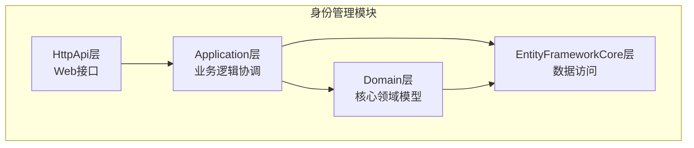
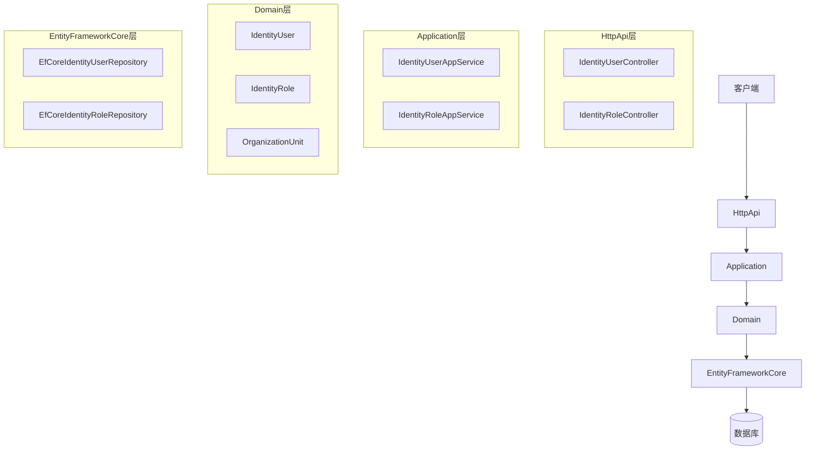
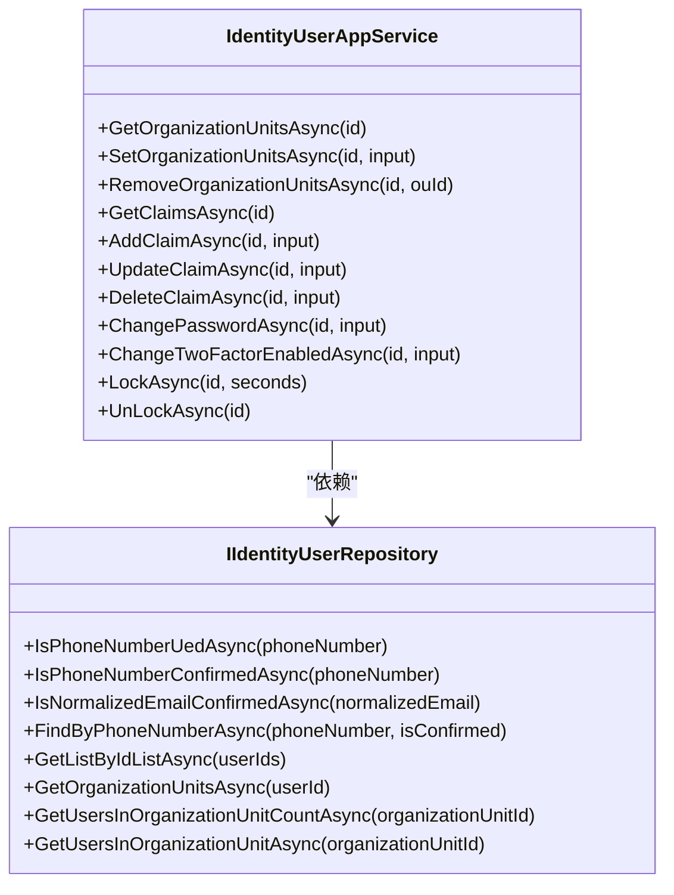
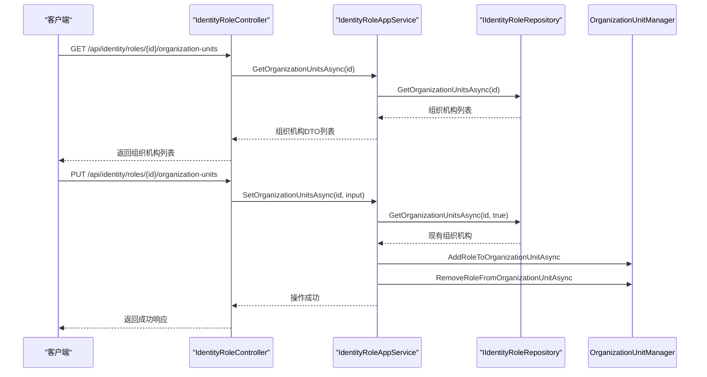
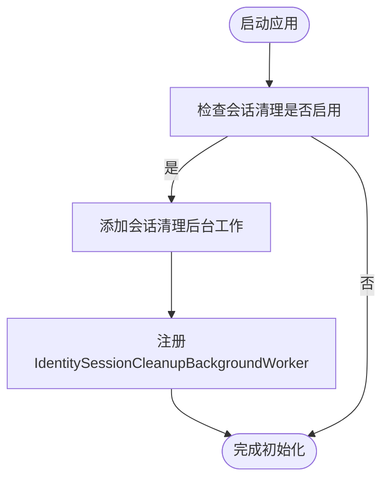
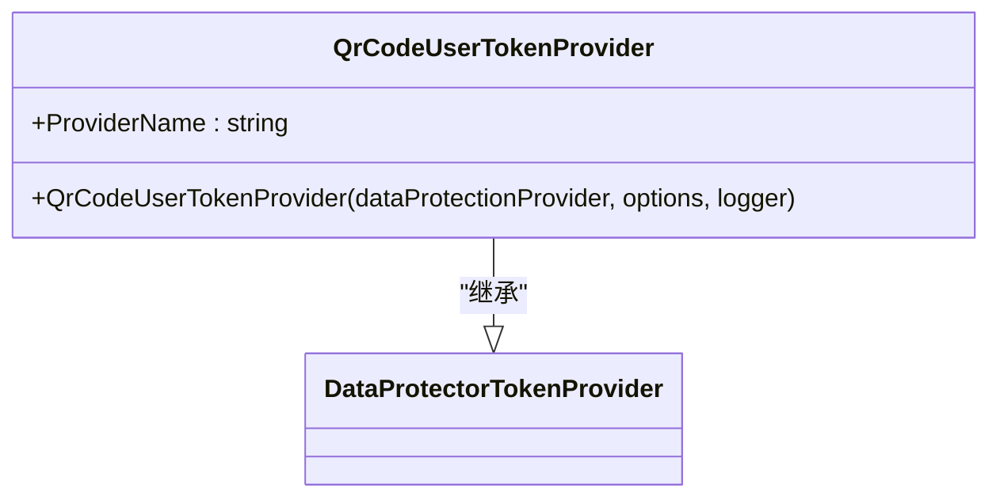
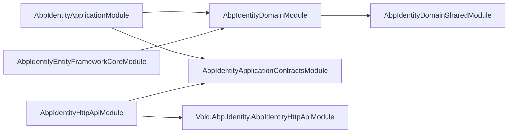

# 身份管理模块

<cite>
**本文档中引用的文件**  
- [AbpIdentityApplicationModule.cs](file://aspnet-core/modules/identity/LINGYUN.Abp.Identity.Application/LINGYUN/Abp/Identity/AbpIdentityApplicationModule.cs)
- [AbpIdentityDomainModule.cs](file://aspnet-core/modules/identity/LINGYUN.Abp.Identity.Domain/LINGYUN/Abp/Identity/AbpIdentityDomainModule.cs)
- [AbpIdentityEntityFrameworkCoreModule.cs](file://aspnet-core/modules/identity/LINGYUN.Abp.Identity.EntityFrameworkCore/LINGYUN/Abp/Identity/EntityFrameworkCore/AbpIdentityEntityFrameworkCoreModule.cs)
- [AbpIdentityHttpApiModule.cs](file://aspnet-core/modules/identity/LINGYUN.Abp.Identity.HttpApi/LINGYUN/Abp/Identity/AbpIdentityHttpApiModule.cs)
- [IdentityUserAppService.cs](file://aspnet-core/modules/identity/LINGYUN.Abp.Identity.Application/LINGYUN/Abp/Identity/IdentityUserAppService.cs)
- [IdentityRoleAppService.cs](file://aspnet-core/modules/identity/LINGYUN.Abp.Identity.Application/LINGYUN/Abp/Identity/IdentityRoleAppService.cs)
- [IIdentityUserRepository.cs](file://aspnet-core/modules/identity/LINGYUN.Abp.Identity.Domain/LINGYUN/Abp/Identity/IIdentityUserRepository.cs)
- [IdentityUserController.cs](file://aspnet-core/modules/identity/LINGYUN.Abp.Identity.HttpApi/LINGYUN/Abp/Identity/IdentityUserController.cs)
- [IdentitySessionEto.cs](file://aspnet-core/modules/identity/LINGYUN.Abp.Identity.Domain.Shared/LINGYUN/Abp/Identity/IdentitySessionEto.cs)
- [QrCodeUserTokenProvider.cs](file://aspnet-core/modules/identity/LINGYUN.Abp.Identity.AspNetCore.QrCode/LINGYUN/Abp/Identity/AspNetCore/QrCode/QrCodeUserTokenProvider.cs)
- [IdentitySettingDefinitionProvider.cs](file://aspnet-core/modules/identity/LINGYUN.Abp.Identity.Domain.Shared/LINGYUN/Abp/Identity/Settings/IdentitySettingDefinitionProvider.cs)
- [IdentitySessionCleanupBackgroundWorker.cs](file://aspnet-core/modules/identity/LINGYUN.Abp.Identity.Session/LINGYUN/Abp/Identity/Session/IdentitySessionCleanupBackgroundWorker.cs)
</cite>

## 目录
1. [简介](#简介)
2. [项目结构](#项目结构)
3. [核心组件](#核心组件)
4. [架构概述](#架构概述)
5. [详细组件分析](#详细组件分析)
6. [依赖分析](#依赖分析)
7. [性能考虑](#性能考虑)
8. [故障排除指南](#故障排除指南)
9. [结论](#结论)

## 简介
身份管理模块是ABP框架中的核心安全组件，负责用户、角色、组织机构的全生命周期管理。该模块采用分层架构设计，包含Application、Domain、EntityFrameworkCore和HttpApi四层，实现了高内聚、低耦合的设计原则。模块提供了完整的用户管理、角色管理、组织机构管理功能，并支持会话管理、二维码登录等高级特性。通过与认证、权限等模块的深度集成，构建了企业级身份认证与访问控制体系。

## 项目结构
身份管理模块遵循ABP模块化设计规范，采用分层架构组织代码结构。各层职责明确，通过依赖注入实现松耦合。

**图示来源**
- [AbpIdentityApplicationModule.cs](file://aspnet-core/modules/identity/LINGYUN.Abp.Identity.Application/LINGYUN/Abp/Identity/AbpIdentityApplicationModule.cs)
- [AbpIdentityDomainModule.cs](file://aspnet-core/modules/identity/LINGYUN.Abp.Identity.Domain/LINGYUN/Abp/Identity/AbpIdentityDomainModule.cs)
- [AbpIdentityEntityFrameworkCoreModule.cs](file://aspnet-core/modules/identity/LINGYUN.Abp.Identity.EntityFrameworkCore/LINGYUN/Abp/Identity/EntityFrameworkCore/AbpIdentityEntityFrameworkCoreModule.cs)
- [AbpIdentityHttpApiModule.cs](file://aspnet-core/modules/identity/LINGYUN.Abp.Identity.HttpApi/LINGYUN/Abp/Identity/AbpIdentityHttpApiModule.cs)

**本节来源**
- [AbpIdentityApplicationModule.cs](file://aspnet-core/modules/identity/LINGYUN.Abp.Identity.Application/LINGYUN/Abp/Identity/AbpIdentityApplicationModule.cs)
- [AbpIdentityDomainModule.cs](file://aspnet-core/modules/identity/LINGYUN.Abp.Identity.Domain/LINGYUN/Abp/Identity/AbpIdentityDomainModule.cs)

## 核心组件
身份管理模块的核心组件包括用户管理、角色管理、组织机构管理和会话管理。Application层通过应用服务协调领域逻辑，Domain层封装核心业务规则，EntityFrameworkCore层实现数据持久化，HttpApi层暴露RESTful接口。

**本节来源**
- [IdentityUserAppService.cs](file://aspnet-core/modules/identity/LINGYUN.Abp.Identity.Application/LINGYUN/Abp/Identity/IdentityUserAppService.cs)
- [IdentityRoleAppService.cs](file://aspnet-core/modules/identity/LINGYUN.Abp.Identity.Application/LINGYUN/Abp/Identity/IdentityRoleAppService.cs)
- [IIdentityUserRepository.cs](file://aspnet-core/modules/identity/LINGYUN.Abp.Identity.Domain/LINGYUN/Abp/Identity/IIdentityUserRepository.cs)

## 架构概述
身份管理模块采用典型的分层架构，各层职责分明：

**图示来源**
- [IdentityUserController.cs](file://aspnet-core/modules/identity/LINGYUN.Abp.Identity.HttpApi/LINGYUN/Abp/Identity/IdentityUserController.cs)
- [IdentityUserAppService.cs](file://aspnet-core/modules/identity/LINGYUN.Abp.Identity.Application/LINGYUN/Abp/Identity/IdentityUserAppService.cs)
- [IIdentityUserRepository.cs](file://aspnet-core/modules/identity/LINGYUN.Abp.Identity.Domain/LINGYUN/Abp/Identity/IIdentityUserRepository.cs)

## 详细组件分析

### 用户管理分析
用户管理组件负责用户账户的全生命周期管理，包括创建、更新、删除、密码重置等操作。

#### 对象导向组件

**图示来源**
- [IdentityUserAppService.cs](file://aspnet-core/modules/identity/LINGYUN.Abp.Identity.Application/LINGYUN/Abp/Identity/IdentityUserAppService.cs)
- [IIdentityUserRepository.cs](file://aspnet-core/modules/identity/LINGYUN.Abp.Identity.Domain/LINGYUN/Abp/Identity/IIdentityUserRepository.cs)

**本节来源**
- [IdentityUserAppService.cs](file://aspnet-core/modules/identity/LINGYUN.Abp.Identity.Application/LINGYUN/Abp/Identity/IdentityUserAppService.cs)
- [IIdentityUserRepository.cs](file://aspnet-core/modules/identity/LINGYUN.Abp.Identity.Domain/LINGYUN/Abp/Identity/IIdentityUserRepository.cs)

### 角色管理分析
角色管理组件负责角色的创建、更新、删除以及角色与组织机构的关联管理。

#### API/服务组件

**图示来源**
- [IdentityRoleAppService.cs](file://aspnet-core/modules/identity/LINGYUN.Abp.Identity.Application/LINGYUN/Abp/Identity/IdentityRoleAppService.cs)
- [IdentityUserController.cs](file://aspnet-core/modules/identity/LINGYUN.Abp.Identity.HttpApi/LINGYUN/Abp/Identity/IdentityUserController.cs)

**本节来源**
- [IdentityRoleAppService.cs](file://aspnet-core/modules/identity/LINGYUN.Abp.Identity.Application/LINGYUN/Abp/Identity/IdentityRoleAppService.cs)

### 会话管理分析
会话管理组件负责用户会话的创建、查询、清理和撤销，支持并发登录策略和跨设备会话管理。

#### 复杂逻辑组件

**图示来源**
- [AbpIdentityDomainModule.cs](file://aspnet-core/modules/identity/LINGYUN.Abp.Identity.Domain/LINGYUN/Abp/Identity/AbpIdentityDomainModule.cs)
- [IdentitySessionCleanupBackgroundWorker.cs](file://aspnet-core/modules/identity/LINGYUN.Abp.Identity.Session/LINGYUN/Abp/Identity/Session/IdentitySessionCleanupBackgroundWorker.cs)

**本节来源**
- [AbpIdentityDomainModule.cs](file://aspnet-core/modules/identity/LINGYUN.Abp.Identity.Domain/LINGYUN/Abp/Identity/AbpIdentityDomainModule.cs)
- [IdentitySessionEto.cs](file://aspnet-core/modules/identity/LINGYUN.Abp.Identity.Domain.Shared/LINGYUN/Abp/Identity/IdentitySessionEto.cs)

### 二维码登录分析
二维码登录组件实现了基于令牌的身份验证机制，支持移动端扫码登录。

#### 对象导向组件

**图示来源**
- [QrCodeUserTokenProvider.cs](file://aspnet-core/modules/identity/LINGYUN.Abp.Identity.AspNetCore.QrCode/LINGYUN/Abp/Identity/AspNetCore/QrCode/QrCodeUserTokenProvider.cs)

**本节来源**
- [QrCodeUserTokenProvider.cs](file://aspnet-core/modules/identity/LINGYUN.Abp.Identity.AspNetCore.QrCode/LINGYUN/Abp/Identity/AspNetCore/QrCode/QrCodeUserTokenProvider.cs)

## 依赖分析
身份管理模块依赖于多个核心框架组件，形成了完整的依赖关系网络。

**图示来源**
- [AbpIdentityApplicationModule.cs](file://aspnet-core/modules/identity/LINGYUN.Abp.Identity.Application/LINGYUN/Abp/Identity/AbpIdentityApplicationModule.cs)
- [AbpIdentityDomainModule.cs](file://aspnet-core/modules/identity/LINGYUN.Abp.Identity.Domain/LINGYUN/Abp/Identity/AbpIdentityDomainModule.cs)
- [AbpIdentityEntityFrameworkCoreModule.cs](file://aspnet-core/modules/identity/LINGYUN.Abp.Identity.EntityFrameworkCore/LINGYUN/Abp/Identity/EntityFrameworkCore/AbpIdentityEntityFrameworkCoreModule.cs)
- [AbpIdentityHttpApiModule.cs](file://aspnet-core/modules/identity/LINGYUN.Abp.Identity.HttpApi/LINGYUN/Abp/Identity/AbpIdentityHttpApiModule.cs)

**本节来源**
- [AbpIdentityApplicationModule.cs](file://aspnet-core/modules/identity/LINGYUN.Abp.Identity.Application/LINGYUN/Abp/Identity/AbpIdentityApplicationModule.cs)
- [AbpIdentityDomainModule.cs](file://aspnet-core/modules/identity/LINGYUN.Abp.Identity.Domain/LINGYUN/Abp/Identity/AbpIdentityDomainModule.cs)

## 性能考虑
身份管理模块在设计时充分考虑了性能优化：
- 通过仓储模式实现数据访问的抽象，支持查询优化
- 使用后台工作器异步处理会话清理等耗时操作
- 提供分页查询接口，避免大数据量加载
- 支持分布式锁，确保并发环境下的数据一致性
- 通过事件总线实现领域事件的异步处理

## 故障排除指南
常见问题及解决方案：
- **会话清理未执行**：检查`IdentitySessionCleanupOptions.IsCleanupEnabled`配置是否启用
- **二维码登录失败**：确认`QrCodeUserTokenProvider`已正确注册
- **组织机构查询性能差**：确保相关数据库字段已建立索引
- **并发登录限制不生效**：检查`ConcurrentLoginStrategy`配置项设置
- **短信验证码重复发送**：验证`SmsRepetInterval`配置的合理性

**本节来源**
- [IdentitySettingDefinitionProvider.cs](file://aspnet-core/modules/identity/LINGYUN.Abp.Identity.Domain.Shared/LINGYUN/Abp/Identity/Settings/IdentitySettingDefinitionProvider.cs)
- [AbpIdentityDomainModule.cs](file://aspnet-core/modules/identity/LINGYUN.Abp.Identity.Domain/LINGYUN/Abp/Identity/AbpIdentityDomainModule.cs)

## 结论
身份管理模块通过清晰的分层架构和模块化设计，提供了企业级身份管理解决方案。模块不仅实现了基本的用户、角色、组织机构管理功能，还扩展了会话管理、二维码登录等高级特性。通过合理的配置选项和扩展点，能够满足不同场景下的身份管理需求。建议在使用时充分理解各层职责，遵循ABP框架的最佳实践，确保系统的安全性和可维护性。