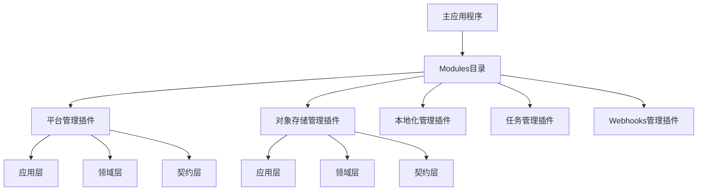
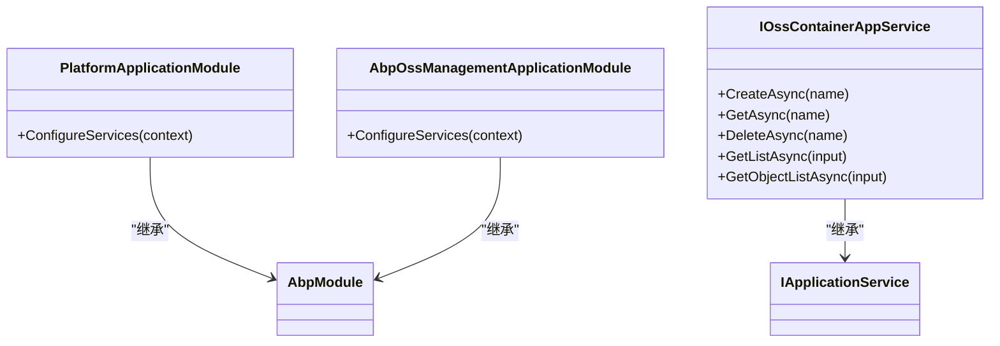
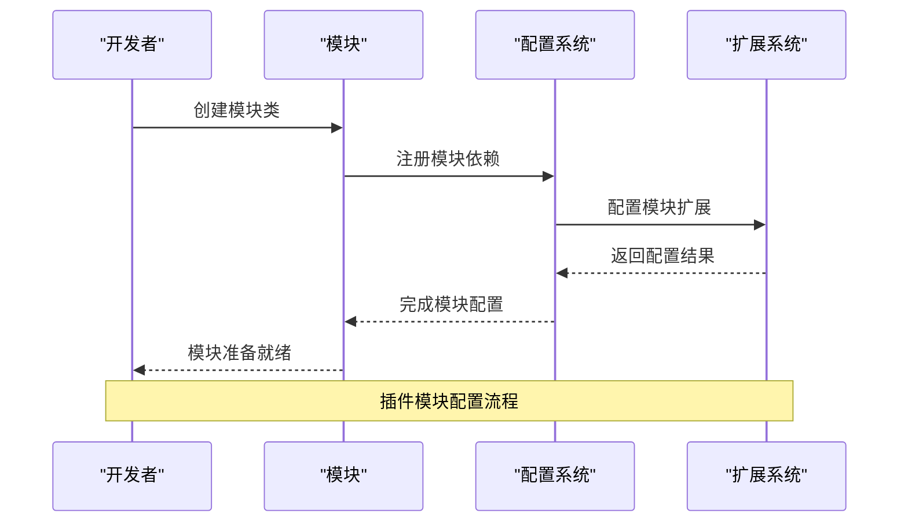
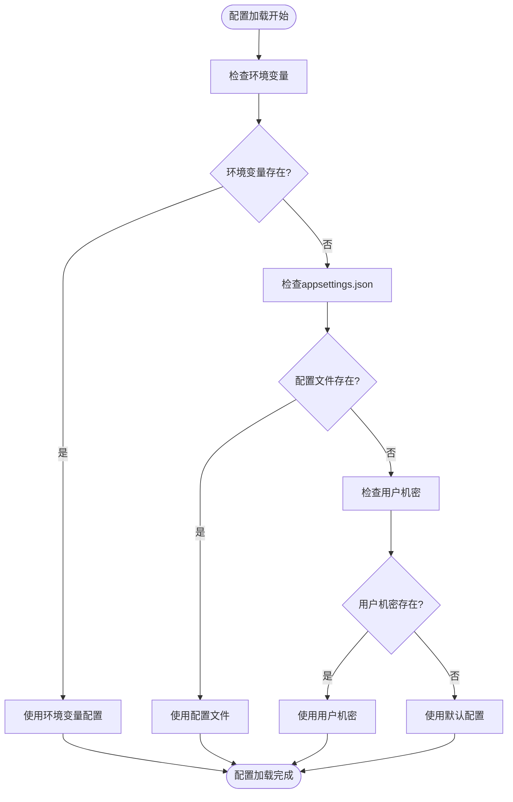

# 插件开发规范

<cite>
**本文档中引用的文件**  
- [Program.cs](file://aspnet-core/templates/micro/content/host/PackageName.CompanyName.ProjectName.HttpApi.Host/Program.cs)
- [Program.cs](file://aspnet-core/services/LY.MicroService.WebhooksManagement.HttpApi.Host/Program.cs)
- [PlatformApplicationModule.cs](file://aspnet-core/modules/platform/LINGYUN.Platform.Application/LINGYUN/Platform/PlatformApplicationModule.cs)
- [AbpOssManagementApplicationModule.cs](file://aspnet-core/modules/oss-management/LINGYUN.Abp.OssManagement.Application/LINGYUN/Abp/OssManagement/AbpOssManagementApplicationModule.cs)
- [IOssContainerAppService.cs](file://aspnet-core/modules/oss-management/LINGYUN.Abp.OssManagement.Application.Contracts/LINGYUN/Abp/OssManagement/IOssContainerAppService.cs)
- [PlatformModuleExtensionConsts.cs](file://aspnet-core/modules/platform/LINGYUN.Platform.Domain.Shared/LINGYUN/Platform/ObjectExtending/PlatformModuleExtensionConsts.cs)
- [PlatformModuleExtensionConfigurationDictionaryExtensions.cs](file://aspnet-core/modules/platform/LINGYUN.Platform.Domain.Shared/LINGYUN/Platform/ObjectExtending/PlatformModuleExtensionConfigurationDictionaryExtensions.cs)
</cite>

## 目录
1. [简介](#简介)
2. [项目结构约定](#项目结构约定)
3. [命名规范](#命名规范)
4. [接口定义标准](#接口定义标准)
5. [版本管理策略](#版本管理策略)
6. [安全性要求](#安全性要求)
7. [性能基准](#性能基准)
8. [测试覆盖标准](#测试覆盖标准)
9. [配置管理实现](#配置管理实现)
10. [数据访问实现](#数据访问实现)
11. [API暴露实现](#api暴露实现)
12. [结论](#结论)

## 简介
本规范文档为ABP Next Admin系统的插件开发提供完整指南。文档详细说明了插件开发的项目结构约定、命名规范、接口定义标准和版本管理策略。同时，文档还涵盖了插件的安全性要求、性能基准和测试覆盖标准，并通过代码示例展示如何实现常见的插件功能，包括配置管理、数据访问和API暴露。

## 项目结构约定
ABP Next Admin系统的插件开发遵循模块化架构设计，所有插件都位于特定的目录结构中。系统通过动态加载机制从指定目录加载插件模块。

**图示来源**
- [Program.cs](file://aspnet-core/templates/micro/content/host/PackageName.CompanyName.ProjectName.HttpApi.Host/Program.cs#L35-L53)
- [Program.cs](file://aspnet-core/services/LY.MicroService.WebhooksManagement.HttpApi.Host/Program.cs#L36-L57)

**本节来源**
- [Program.cs](file://aspnet-core/templates/micro/content/host/PackageName.CompanyName.ProjectName.HttpApi.Host/Program.cs#L35-L53)
- [Program.cs](file://aspnet-core/services/LY.MicroService.WebhooksManagement.HttpApi.Host/Program.cs#L36-L57)

## 命名规范
插件开发遵循统一的命名规范，确保代码的一致性和可读性。命名规范包括项目命名、类命名和接口命名。

### 项目命名规范
插件项目名称采用分层命名方式，格式为：`LINGYUN.Abp.{模块名}.{层名}`。例如：
- `LINGYUN.Abp.Platform.Application` - 平台管理应用层
- `LINGYUN.Abp.OssManagement.Application.Contracts` - 对象存储管理应用契约层

### 类命名规范
模块主类采用`{模块名}ApplicationModule`或`Abp{模块名}ApplicationModule`的命名方式。例如：
- `PlatformApplicationModule` - 平台应用模块
- `AbpOssManagementApplicationModule` - 对象存储管理应用模块

### 接口命名规范
应用服务接口采用`I{功能名}AppService`的命名方式。例如：
- `IOssContainerAppService` - 对象容器应用服务接口

**图示来源**
- [PlatformApplicationModule.cs](file://aspnet-core/modules/platform/LINGYUN.Platform.Application/LINGYUN/Platform/PlatformApplicationModule.cs#L0-L23)
- [AbpOssManagementApplicationModule.cs](file://aspnet-core/modules/oss-management/LINGYUN.Abp.OssManagement.Application/LINGYUN/Abp/OssManagement/AbpOssManagementApplicationModule.cs#L0-L26)
- [IOssContainerAppService.cs](file://aspnet-core/modules/oss-management/LINGYUN.Abp.OssManagement.Application.Contracts/LINGYUN/Abp/OssManagement/IOssContainerAppService.cs#L0-L17)

**本节来源**
- [PlatformApplicationModule.cs](file://aspnet-core/modules/platform/LINGYUN.Platform.Application/LINGYUN/Platform/PlatformApplicationModule.cs#L0-L23)
- [AbpOssManagementApplicationModule.cs](file://aspnet-core/modules/oss-management/LINGYUN.Abp.OssManagement.Application/LINGYUN/Abp/OssManagement/AbpOssManagementApplicationModule.cs#L0-L26)
- [IOssContainerAppService.cs](file://aspnet-core/modules/oss-management/LINGYUN.Abp.OssManagement.Application.Contracts/LINGYUN/Abp/OssManagement/IOssContainerAppService.cs#L0-L17)

## 接口定义标准
插件开发中的接口定义遵循ABP框架的标准，确保服务的一致性和可扩展性。

### 应用服务接口
所有应用服务接口都继承自`IApplicationService`，并遵循CQRS模式。接口方法命名清晰，参数和返回类型明确。

### 模块扩展配置
对于需要扩展其他模块功能的插件，使用模块扩展配置机制。通过`ModuleExtensionConfigurationDictionary`进行配置。

**图示来源**
- [PlatformModuleExtensionConsts.cs](file://aspnet-core/modules/platform/LINGYUN.Platform.Domain.Shared/LINGYUN/Platform/ObjectExtending/PlatformModuleExtensionConsts.cs#L0-L12)
- [PlatformModuleExtensionConfigurationDictionaryExtensions.cs](file://aspnet-core/modules/platform/LINGYUN.Platform.Domain.Shared/LINGYUN/Platform/ObjectExtending/PlatformModuleExtensionConfigurationDictionaryExtensions.cs#L0-L16)

**本节来源**
- [PlatformModuleExtensionConsts.cs](file://aspnet-core/modules/platform/LINGYUN.Platform.Domain.Shared/LINGYUN/Platform/ObjectExtending/PlatformModuleExtensionConsts.cs#L0-L12)
- [PlatformModuleExtensionConfigurationDictionaryExtensions.cs](file://aspnet-core/modules/platform/LINGYUN.Platform.Domain.Shared/LINGYUN/Platform/ObjectExtending/PlatformModuleExtensionConfigurationDictionaryExtensions.cs#L0-L16)

## 版本管理策略
插件开发采用语义化版本管理策略，确保版本的兼容性和可追溯性。

### 版本号格式
版本号采用`主版本号.次版本号.修订号`的格式，例如`1.2.3`。

### 版本兼容性
- 主版本号变更表示不兼容的API变更
- 次版本号变更表示向后兼容的功能新增
- 修订号变更表示向后兼容的问题修正

### 版本发布流程
1. 开发新功能或修复问题
2. 更新版本号
3. 更新变更日志
4. 发布到NuGet包管理器

## 安全性要求
插件开发必须遵循严格的安全性要求，确保系统的整体安全。

### 认证和授权
所有API端点必须实现适当的认证和授权机制。使用ABP框架的权限系统进行细粒度的权限控制。

### 输入验证
所有用户输入必须进行严格的验证，防止注入攻击和其他安全漏洞。

### 数据保护
敏感数据必须进行加密存储，遵循数据保护法规要求。

## 性能基准
插件开发需要满足特定的性能基准，确保系统的高效运行。

### 响应时间
- API请求平均响应时间应小于200ms
- 95%的请求响应时间应小于500ms

### 并发处理
插件应能处理至少1000个并发请求，保持系统稳定。

### 资源使用
- 内存使用应控制在合理范围内
- 数据库查询应优化，避免N+1查询问题

## 测试覆盖标准
插件开发必须达到一定的测试覆盖标准，确保代码质量。

### 单元测试
- 核心业务逻辑的单元测试覆盖率应达到80%以上
- 所有边界条件和异常情况都应有相应的测试

### 集成测试
- 关键业务流程的集成测试覆盖率应达到90%以上
- 数据库交互和外部服务调用应有相应的测试

### 端到端测试
- 主要用户场景的端到端测试覆盖率应达到100%
- UI交互和API调用应有相应的测试

## 配置管理实现
插件开发中的配置管理遵循统一的标准，确保配置的一致性和可管理性。

### 配置文件结构
配置文件采用分层结构，支持不同环境的配置。

### 配置加载机制
使用ABP框架的配置系统，支持从多种来源加载配置，包括：
- appsettings.json文件
- 环境变量
- 用户机密
- 配置中心

**本节来源**
- [Program.cs](file://aspnet-core/services/LY.MicroService.WebhooksManagement.HttpApi.Host/Program.cs#L40-L45)

## 数据访问实现
插件开发中的数据访问实现遵循领域驱动设计原则，确保数据的一致性和完整性。

### 实体框架
使用Entity Framework Core进行数据访问，遵循以下原则：
- 实体类应位于领域层
- 仓储接口应位于领域层
- 仓储实现应位于基础设施层

### 仓储模式
实现仓储模式，封装数据访问逻辑，提供统一的数据访问接口。

### 事务管理
使用ABP框架的事务管理机制，确保数据操作的原子性。

## API暴露实现
插件开发中的API暴露遵循RESTful设计原则，确保API的一致性和易用性。

### 控制器设计
控制器应位于应用层，继承自`AbpController`，并遵循以下原则：
- 每个控制器负责一个资源的管理
- 使用标准的HTTP方法对应CRUD操作
- 返回标准的响应格式

### Swagger集成
所有API都应集成Swagger，提供API文档和测试界面。

### 错误处理
实现统一的错误处理机制，返回标准的错误响应格式。

## 结论
本规范文档为ABP Next Admin系统的插件开发提供了全面的指导。通过遵循这些规范，开发者可以创建高质量、安全、高性能的插件，确保系统的稳定性和可扩展性。建议所有插件开发者在开发过程中严格遵守这些规范，并定期审查和更新插件以符合最新的安全和性能标准。