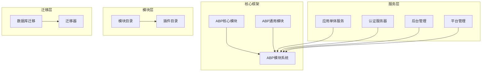
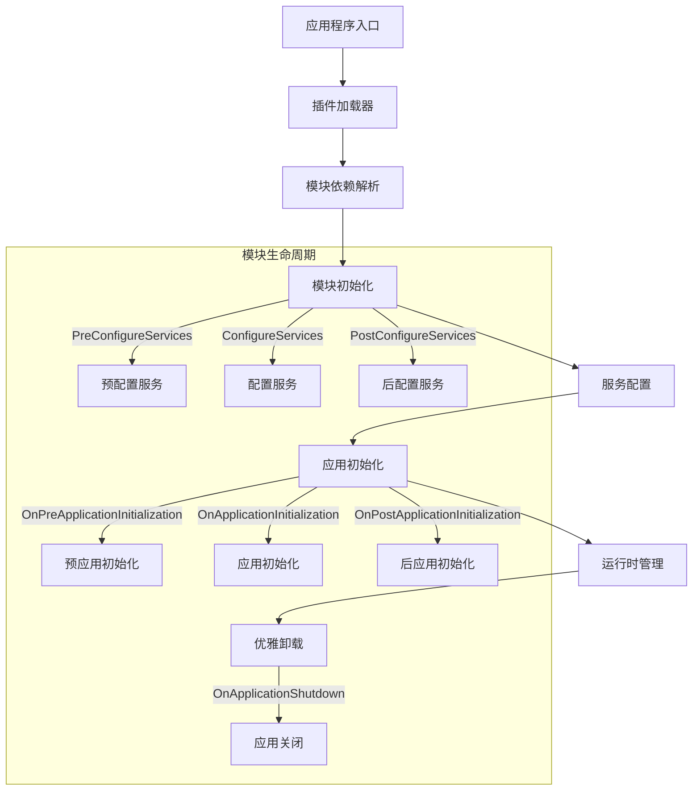
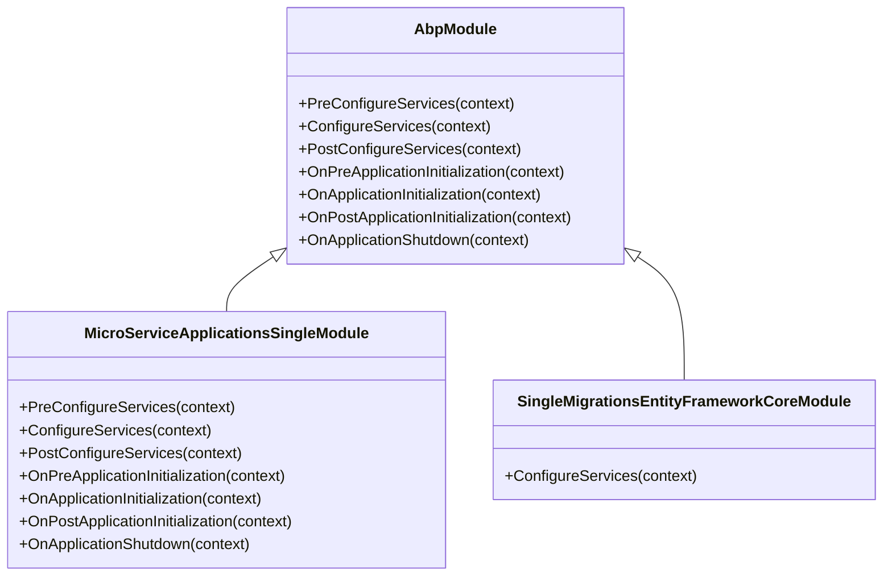
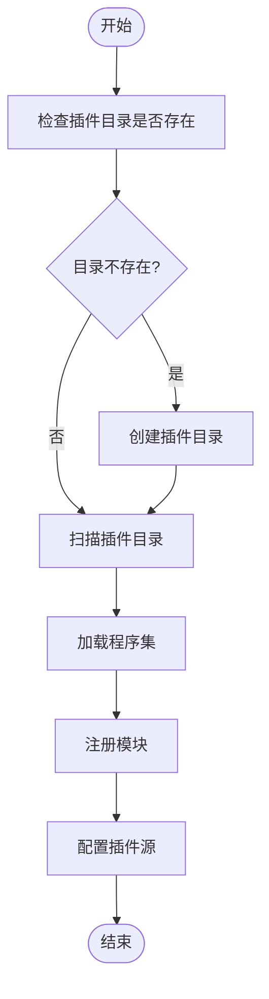
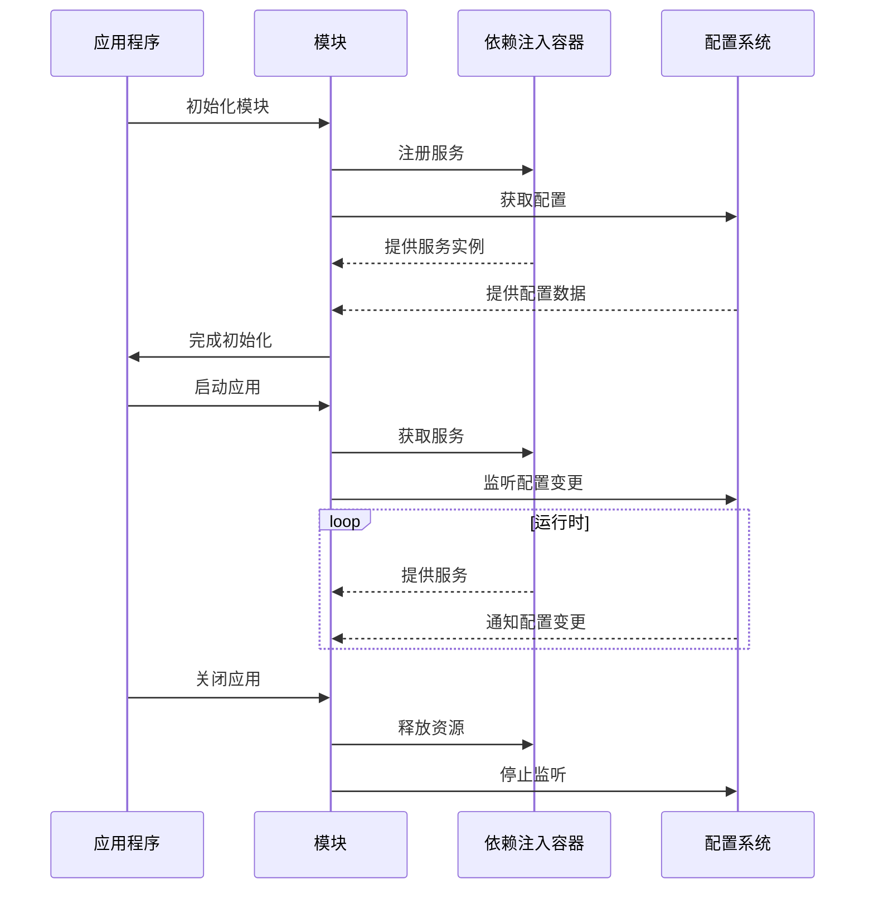
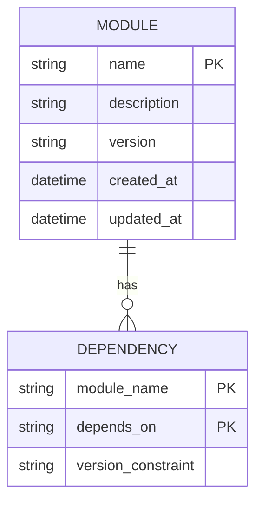

# 插件生命周期管理

<cite>
**本文档引用的文件**   
- [MicroServiceApplicationsSingleModule.cs](file://aspnet-core/services/LY.MicroService.Applications.Single/MicroServiceApplicationsSingleModule.cs)
- [Program.cs](file://aspnet-core/services/LY.MicroService.Applications.Single/Program.cs)
- [AbpCommonModule.cs](file://aspnet-core/framework/common/LINGYUN.Abp.Core/AbpCommonModule.cs)
- [SingleMigrationsEntityFrameworkCoreModule.cs](file://aspnet-core/migrations/LY.MicroService.Applications.Single.EntityFrameworkCore/SingleMigrationsEntityFrameworkCoreModule.cs)
- [ProjectNameDomainModule.cs](file://aspnet-core/templates/aio/content/src/PackageName.CompanyName.ProjectName.Domain/PackageName/CompanyName/ProjectName/ProjectNameDomainModule.cs)
- [WechatManagementHttpApiHostModule.cs](file://aspnet-core/services/LY.MicroService.WechatManagement.HttpApi.Host/WechatManagementHttpApiHostModule.cs)
- [PlatformManagementHttpApiHostModule.cs](file://aspnet-core/services/LY.MicroService.PlatformManagement.HttpApi.Host/PlatformManagementHttpApiHostModule.cs)
</cite>

## 目录
1. [引言](#引言)
2. [项目结构](#项目结构)
3. [核心组件](#核心组件)
4. [架构概述](#架构概述)
5. [详细组件分析](#详细组件分析)
6. [依赖分析](#依赖分析)
7. [性能考虑](#性能考虑)
8. [故障排除指南](#故障排除指南)
9. [结论](#结论)
10. [附录](#附录)（如有必要）

## 引言
本文档详细阐述了ABP Next Admin项目中插件生命周期管理的完整机制。通过分析ABP框架的模块系统，本文档深入探讨了插件从初始化、启动、运行时状态管理到优雅卸载的整个生命周期。文档详细描述了生命周期钩子函数的注册与执行顺序、资源清理机制和状态持久化策略，并为开发者提供了生命周期管理的最佳实践，包括启动顺序依赖处理、健康检查集成和热更新支持。

## 项目结构
ABP Next Admin项目采用模块化架构，通过插件机制实现功能的灵活扩展。项目的核心服务和模块分布在不同的目录中，通过ABP框架的模块系统进行组织和管理。

**Diagram sources**
- [MicroServiceApplicationsSingleModule.cs](file://aspnet-core/services/LY.MicroService.Applications.Single/MicroServiceApplicationsSingleModule.cs)
- [AbpCommonModule.cs](file://aspnet-core/framework/common/LINGYUN.Abp.Core/AbpCommonModule.cs)

**Section sources**
- [MicroServiceApplicationsSingleModule.cs](file://aspnet-core/services/LY.MicroService.Applications.Single/MicroServiceApplicationsSingleModule.cs)
- [AbpCommonModule.cs](file://aspnet-core/framework/common/LINGYUN.Abp.Core/AbpCommonModule.cs)

## 核心组件
本项目的核心组件包括ABP框架的模块系统、插件管理机制、依赖注入容器和生命周期管理器。这些组件协同工作，确保插件能够正确地初始化、启动、运行和卸载。

**Section sources**
- [MicroServiceApplicationsSingleModule.cs](file://aspnet-core/services/LY.MicroService.Applications.Single/MicroServiceApplicationsSingleModule.cs)
- [AbpCommonModule.cs](file://aspnet-core/framework/common/LINGYUN.Abp.Core/AbpCommonModule.cs)

## 架构概述
ABP Next Admin项目的架构基于模块化设计，通过插件机制实现功能的灵活扩展。每个模块都是一个独立的插件，可以独立开发、测试和部署。模块之间通过依赖关系进行连接，确保正确的初始化顺序。

**Diagram sources**
- [MicroServiceApplicationsSingleModule.cs](file://aspnet-core/services/LY.MicroService.Applications.Single/MicroServiceApplicationsSingleModule.cs)
- [Program.cs](file://aspnet-core/services/LY.MicroService.Applications.Single/Program.cs)

## 详细组件分析
### 模块生命周期分析
ABP框架的模块系统提供了完整的生命周期管理机制，包括预配置、配置、后配置、预初始化、初始化、后初始化和关闭等阶段。

#### 模块生命周期钩子

**Diagram sources**
- [MicroServiceApplicationsSingleModule.cs](file://aspnet-core/services/LY.MicroService.Applications.Single/MicroServiceApplicationsSingleModule.cs)
- [AbpCommonModule.cs](file://aspnet-core/framework/common/LINGYUN.Abp.Core/AbpCommonModule.cs)

#### 模块依赖关系

```mermaid
graph TD
A[MicroServiceApplicationsSingleModule] --> B[AbpAuditLoggingModule]
A --> C[AbpBackgroundWorkersHangfireModule]
A --> D[AbpCachingStackExchangeRedisModule]
A --> E[AbpDataProtectionModule]
A --> F[AbpExceptionHandlingModule]
A --> G[AbpFeatureManagementModule]
A --> H[AbpIdentityEntityFrameworkCoreModule]
A --> I[AbpLocalizationModule]
A --> J[AbpMultiTenancyModule]
A --> K[AbpOpenIddictEntityFrameworkCoreModule]
A --> L[AbpPermissionManagementModule]
A --> M[AbpSettingManagementModule]
A --> N[AbpTextTemplatingModule]
A --> O[AbpWebhooksModule]
A --> P[PlatformEntityFrameworkCoreModule]
B --> Q[AbpAuditLoggingEntityFrameworkCoreModule]
C --> R[AbpHangfireModule]
D --> S[AbpCachingModule]
E --> T[AbpDataProtectionEntityFrameworkCoreModule]
F --> U[AbpEmailingExceptionHandlingModule]
G --> V[AbpFeatureManagementWebModule]
H --> W[AbpIdentityDomainModule]
I --> X[AbpLocalizationEntityFrameworkCoreModule]
J --> Y[AbpMultiTenancyEntityFrameworkCoreModule]
K --> Z[AbpOpenIddictDomainModule]
L --> AA[AbpPermissionManagementDomainModule]
M --> AB[AbpSettingManagementEntityFrameworkCoreModule]
N --> AC[AbpTextTemplatingEntityFrameworkCoreModule]
O --> AD[AbpWebhooksEntityFrameworkCoreModule]
P --> AE[PlatformDomainModule]
```

**Diagram sources**
- [MicroServiceApplicationsSingleModule.cs](file://aspnet-core/services/LY.MicroService.Applications.Single/MicroServiceApplicationsSingleModule.cs)
- [SingleMigrationsEntityFrameworkCoreModule.cs](file://aspnet-core/migrations/LY.MicroService.Applications.Single.EntityFrameworkCore/SingleMigrationsEntityFrameworkCoreModule.cs)

### 插件加载机制分析
插件加载机制通过扫描指定目录下的程序集，动态加载和注册模块。

#### 插件加载流程

**Diagram sources**
- [Program.cs](file://aspnet-core/services/LY.MicroService.Applications.Single/Program.cs)
- [MicroServiceApplicationsSingleModule.cs](file://aspnet-core/services/LY.MicroService.Applications.Single/MicroServiceApplicationsSingleModule.cs)

### 运行时状态管理分析
运行时状态管理通过ABP框架的依赖注入容器和配置系统实现，确保模块在运行时能够正确地访问所需的服务和配置。

#### 运行时状态管理流程

**Diagram sources**
- [WechatManagementHttpApiHostModule.cs](file://aspnet-core/services/LY.MicroService.WechatManagement.HttpApi.Host/WechatManagementHttpApiHostModule.cs)
- [PlatformManagementHttpApiHostModule.cs](file://aspnet-core/services/LY.MicroService.PlatformManagement.HttpApi.Host/PlatformManagementHttpApiHostModule.cs)

## 依赖分析
项目中的模块通过依赖关系进行连接，确保正确的初始化顺序。依赖关系通过`[DependsOn]`属性进行声明。

**Diagram sources**
- [MicroServiceApplicationsSingleModule.cs](file://aspnet-core/services/LY.MicroService.Applications.Single/MicroServiceApplicationsSingleModule.cs)
- [ProjectNameDomainModule.cs](file://aspnet-core/templates/aio/content/src/PackageName.CompanyName.ProjectName.Domain/PackageName/CompanyName/ProjectName/ProjectNameDomainModule.cs)

**Section sources**
- [MicroServiceApplicationsSingleModule.cs](file://aspnet-core/services/LY.MicroService.Applications.Single/MicroServiceApplicationsSingleModule.cs)
- [ProjectNameDomainModule.cs](file://aspnet-core/templates/aio/content/src/PackageName.CompanyName.ProjectName.Domain/PackageName/CompanyName/ProjectName/ProjectNameDomainModule.cs)

## 性能考虑
插件生命周期管理对系统性能有重要影响。合理的模块划分和依赖管理可以提高系统启动速度和运行效率。

- **模块粒度**: 模块应该具有适当的粒度，既不过于细碎也不过于庞大
- **依赖管理**: 避免循环依赖，合理组织模块依赖关系
- **延迟加载**: 对于不常用的模块，可以考虑延迟加载
- **缓存机制**: 利用ABP框架的缓存机制，减少重复的初始化操作

## 故障排除指南
### 常见问题
1. **模块未加载**: 检查插件目录路径是否正确，程序集是否包含有效的模块定义
2. **依赖缺失**: 确保所有依赖模块都已正确安装和配置
3. **初始化失败**: 检查模块的生命周期方法是否有异常
4. **配置错误**: 验证模块配置是否正确

### 调试技巧
- 使用日志记录模块的生命周期事件
- 在开发环境中启用详细的错误信息
- 使用调试工具检查依赖注入容器的状态

**Section sources**
- [MicroServiceApplicationsSingleModule.cs](file://aspnet-core/services/LY.MicroService.Applications.Single/MicroServiceApplicationsSingleModule.cs)
- [Program.cs](file://aspnet-core/services/LY.MicroService.Applications.Single/Program.cs)

## 结论
ABP Next Admin项目的插件生命周期管理机制基于ABP框架的模块系统，提供了完整的生命周期管理功能。通过合理的模块划分和依赖管理，开发者可以构建灵活、可扩展的应用程序。本文档详细介绍了插件生命周期的各个阶段，为开发者提供了实用的指导和最佳实践。