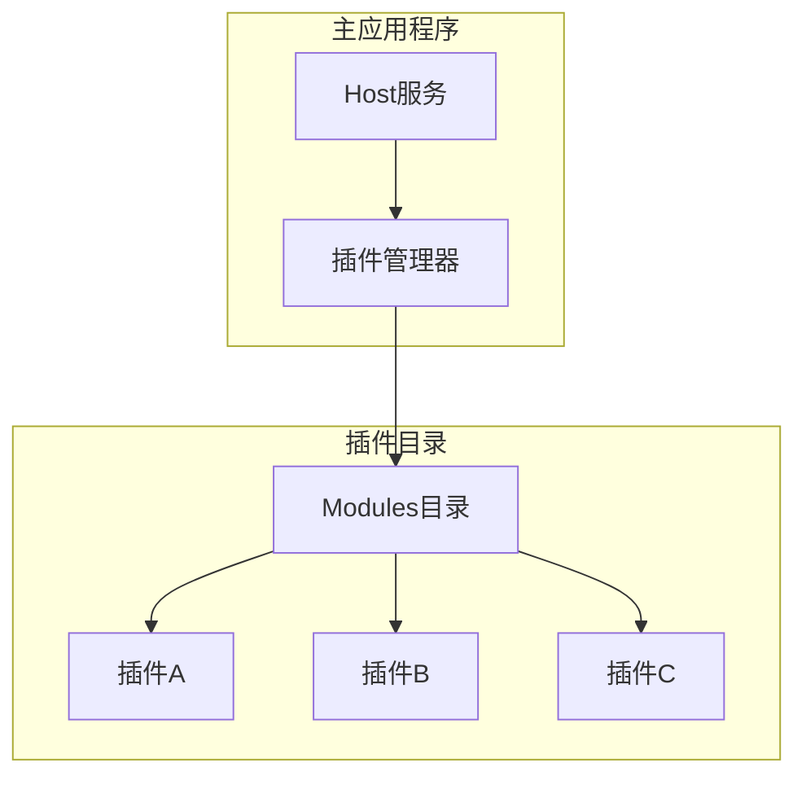
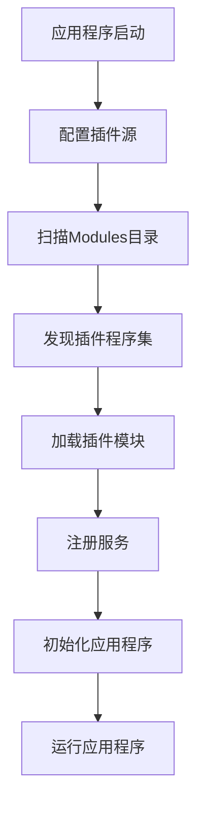
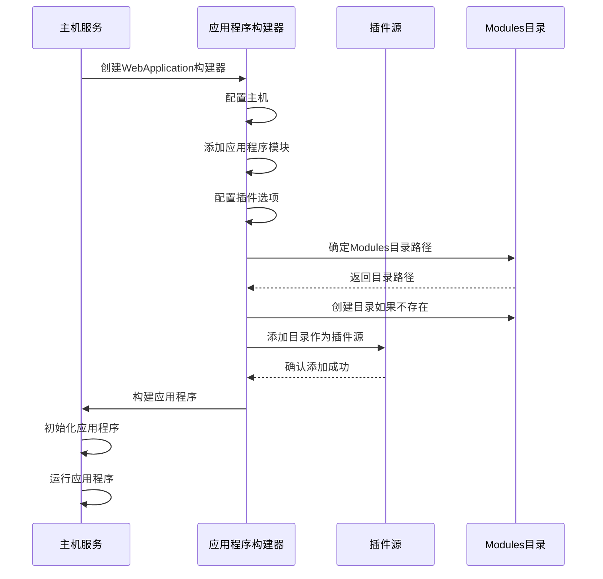
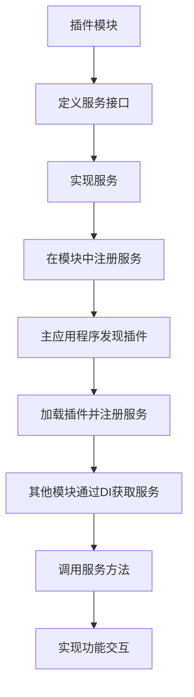
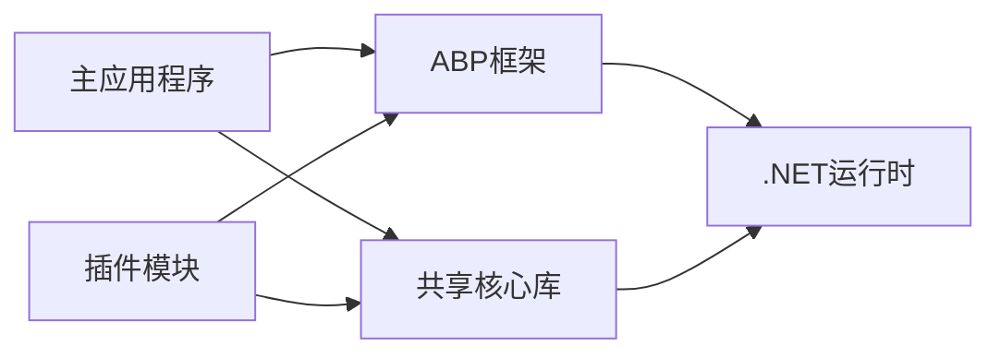

# 插件系统

<cite>
**本文档中引用的文件**
- [Program.cs](file://aspnet-core/services/LY.MicroService.LocalizationManagement.HttpApi.Host/Program.cs)
- [Program.cs](file://aspnet-core/templates/micro/content/host/PackageName.CompanyName.ProjectName.HttpApi.Host/Program.cs)
- [Program.cs](file://aspnet-core/services/LY.MicroService.WorkflowManagement.HttpApi.Host/Program.cs)
- [Program.cs](file://aspnet-core/services/LY.MicroService.IdentityServer/Program.cs)
- [LocalizationResourceExtensions.cs](file://aspnet-core/framework/localization/LINGYUN.Abp.Localization.Xml/LINGYUN/Abp/Localization/Xml/LocalizationResourceExtensions.cs)
- [PlatformRemoteServiceConsts.cs](file://aspnet-core/modules/platform/LINGYUN.Platform.Application.Contracts/LINGYUN/Platform/PlatformRemoteServiceConsts.cs)
</cite>

## 目录
1. [简介](#简介)
2. [项目结构](#项目结构)
3. [核心组件](#核心组件)
4. [架构概述](#架构概述)
5. [详细组件分析](#详细组件分析)
6. [依赖分析](#依赖分析)
7. [性能考虑](#性能考虑)
8. [故障排除指南](#故障排除指南)
9. [结论](#结论)
10. [附录](#附录)（如有必要）

## 简介
本项目采用基于ABP框架的模块化插件系统，通过动态加载机制实现功能扩展。插件系统允许将不同的业务功能模块化，通过插件形式动态加载到主应用程序中，从而实现系统的灵活扩展和维护。系统通过在启动时扫描指定目录下的程序集来发现和加载插件，实现了模块间的松耦合。

## 项目结构
该项目采用微服务架构，插件系统主要通过在各个服务的启动程序中配置插件源来实现。主应用程序在启动时会扫描"Modules"目录下的所有程序集作为插件，并将其动态加载到应用程序域中。

**图示来源**
- [Program.cs](file://aspnet-core/services/LY.MicroService.LocalizationManagement.HttpApi.Host/Program.cs#L52-L72)
- [Program.cs](file://aspnet-core/templates/micro/content/host/PackageName.CompanyName.ProjectName.HttpApi.Host/Program.cs#L35-L53)

**本节来源**
- [Program.cs](file://aspnet-core/services/LY.MicroService.LocalizationManagement.HttpApi.Host/Program.cs#L52-L72)
- [Program.cs](file://aspnet-core/templates/micro/content/host/PackageName.CompanyName.ProjectName.HttpApi.Host/Program.cs#L35-L53)

## 核心组件
插件系统的核心组件包括插件发现、加载、注册和生命周期管理。系统通过ABP框架提供的插件管理机制，在应用程序启动时自动发现和加载位于指定目录下的插件模块。每个插件都是一个独立的.NET程序集，包含特定业务功能的实现。

**本节来源**
- [Program.cs](file://aspnet-core/services/LY.MicroService.LocalizationManagement.HttpApi.Host/Program.cs#L52-L72)
- [Program.cs](file://aspnet-core/services/LY.MicroService.WorkflowManagement.HttpApi.Host/Program.cs#L36-L57)

## 架构概述
插件系统的架构基于ABP框架的模块化设计，通过在应用程序启动配置中添加插件源来实现插件的动态加载。主应用程序与插件之间通过定义良好的接口进行通信，确保了系统的松耦合和高内聚。

**图示来源**
- [Program.cs](file://aspnet-core/services/LY.MicroService.WorkflowManagement.HttpApi.Host/Program.cs#L36-L57)
- [Program.cs](file://aspnet-core/services/LY.MicroService.IdentityServer/Program.cs#L36-L60)

## 详细组件分析
### 插件发现与加载分析
插件系统的发现与加载机制通过在应用程序启动时配置插件源来实现。系统会创建"Modules"目录（如果不存在），然后将该目录添加到插件源中，允许递归搜索所有子目录中的插件。

#### 插件加载流程

**图示来源**
- [Program.cs](file://aspnet-core/templates/micro/content/host/PackageName.CompanyName.ProjectName.HttpApi.Host/Program.cs#L35-L53)
- [Program.cs](file://aspnet-core/services/LY.MicroService.WorkflowManagement.HttpApi.Host/Program.cs#L36-L57)

**本节来源**
- [Program.cs](file://aspnet-core/templates/micro/content/host/PackageName.CompanyName.ProjectName.HttpApi.Host/Program.cs#L35-L53)
- [Program.cs](file://aspnet-core/services/LY.MicroService.WorkflowManagement.HttpApi.Host/Program.cs#L36-L57)

### 插件通信机制分析
插件与主程序之间的通信主要通过依赖注入和服务注册机制实现。每个插件模块都可以定义自己的服务，并将其注册到依赖注入容器中，供其他模块使用。

#### 服务通信流程

**图示来源**
- [PlatformRemoteServiceConsts.cs](file://aspnet-core/modules/platform/LINGYUN.Platform.Application.Contracts/LINGYUN/Platform/PlatformRemoteServiceConsts.cs#L0-L6)
- [LocalizationResourceExtensions.cs](file://aspnet-core/framework/localization/LINGYUN.Abp.Localization.Xml/LINGYUN/Abp/Localization/Xml/LocalizationResourceExtensions.cs#L0-L45)

**本节来源**
- [PlatformRemoteServiceConsts.cs](file://aspnet-core/modules/platform/LINGYUN.Platform.Application.Contracts/LINGYUN/Platform/PlatformRemoteServiceConsts.cs#L0-L6)
- [LocalizationResourceExtensions.cs](file://aspnet-core/framework/localization/LINGYUN.Abp.Localization.Xml/LINGYUN/Abp/Localization/Xml/LocalizationResourceExtensions.cs#L0-L45)

## 依赖分析
插件系统依赖于ABP框架的核心功能，特别是模块化和依赖注入系统。主应用程序与插件之间通过NuGet包引用共享的核心库，确保API的一致性。

**图示来源**
- [Program.cs](file://aspnet-core/services/LY.MicroService.LocalizationManagement.HttpApi.Host/Program.cs#L52-L72)
- [Program.cs](file://aspnet-core/services/LY.MicroService.IdentityServer/Program.cs#L36-L60)

**本节来源**
- [Program.cs](file://aspnet-core/services/LY.MicroService.LocalizationManagement.HttpApi.Host/Program.cs#L52-L72)
- [Program.cs](file://aspnet-core/services/LY.MicroService.IdentityServer/Program.cs#L36-L60)

## 性能考虑
插件系统的性能主要受插件加载时间和内存占用的影响。由于插件是在应用程序启动时一次性加载的，因此会影响启动时间。建议将不常用的功能作为插件，以减少主应用程序的启动开销。

## 故障排除指南
当插件无法正常加载时，应检查以下方面：
1. 确认"Modules"目录存在且可访问
2. 检查插件程序集是否符合.NET标准版本要求
3. 验证插件模块类是否正确继承了ABP模块基类
4. 确认插件程序集的依赖项是否完整

**本节来源**
- [Program.cs](file://aspnet-core/services/LY.MicroService.LocalizationManagement.HttpApi.Host/Program.cs#L52-L72)
- [Program.cs](file://aspnet-core/services/LY.MicroService.WorkflowManagement.HttpApi.Host/Program.cs#L36-L57)

## 结论
本项目的插件系统基于ABP框架实现，通过简单的配置即可实现模块的动态加载。系统设计合理，具有良好的扩展性和维护性。开发者可以遵循相同的模式创建新的插件模块，实现功能的灵活扩展。

## 附录
插件开发最佳实践：
1. 每个插件应专注于单一业务功能
2. 插件之间应尽量减少直接依赖
3. 共享的数据模型应放在独立的共享库中
4. 插件的版本管理应与主应用程序协调一致
5. 插件的安全性应通过权限控制机制来保障