# 插件通信方式

<cite>
**本文档中引用的文件**
- [CAPDistributedEventBus.cs](file://aspnet-core/framework/common/LINGYUN.Abp.EventBus.CAP/LINGYUN/Abp/EventBus/CAP/CAPDistributedEventBus.cs)
- [AbpCAPConsumerServiceSelector.cs](file://aspnet-core/framework/common/LINGYUN.Abp.EventBus.CAP/LINGYUN/Abp/EventBus/CAP/AbpCAPConsumerServiceSelector.cs)
- [ServiceCollectionDaprClientProxyExtensions.cs](file://aspnet-core/framework/dapr/LINGYUN.Abp.Dapr.Client/Microsoft/Extensions/DependencyInjection/ServiceCollectionDaprClientProxyExtensions.cs)
- [PlatformDomainModule.cs](file://aspnet-core/modules/platform/LINGYUN.Platform.Domain/LINGYUN/Platform/PlatformDomainModule.cs)
- [MessageSender.cs](file://aspnet-core/modules/realtime-message/LINGYUN.Abp.IM/LINGYUN/Abp/IM/Messages/MessageSender.cs)
- [ObjectMethodExecutor.cs](file://aspnet-core/framework/common/LINGYUN.Abp.EventBus.CAP/LINGYUN/Abp/EventBus/CAP/Internal/ObjectMethodExecutor.cs)
- [Program.cs](file://aspnet-core/services/LY.MicroService.IdentityServer/Program.cs)
</cite>

## 目录
1. [简介](#简介)
2. [项目架构概览](#项目架构概览)
3. [事件总线模式](#事件总线模式)
4. [服务定位器模式](#服务定位器模式)
5. [依赖注入集成](#依赖注入集成)
6. [跨插件调用安全性](#跨插件调用安全性)
7. [数据序列化格式](#数据序列化格式)
8. [版本兼容性处理](#版本兼容性处理)
9. [异步通信模式](#异步通信模式)
10. [消息队列集成](#消息队列集成)
11. [性能优化技巧](#性能优化技巧)
12. [最佳实践指南](#最佳实践指南)
13. [故障排除指南](#故障排除指南)
14. [总结](#总结)

## 简介

ABP Next Admin是一个基于ABP框架构建的企业级微服务应用平台，采用模块化架构设计，支持插件化开发。本文档深入解析该系统中插件与主程序以及其他插件之间的通信机制，包括事件总线模式、服务定位器模式和依赖注入集成等核心技术。

该系统通过CAP（Cloud Events Application Protocol）分布式事件总线实现插件间的异步通信，结合Dapr客户端代理实现跨服务调用，同时提供了完善的安全性和性能优化机制。

## 项目架构概览

ABP Next Admin采用微服务架构，每个服务都是独立的插件模块，通过统一的通信机制实现协作。

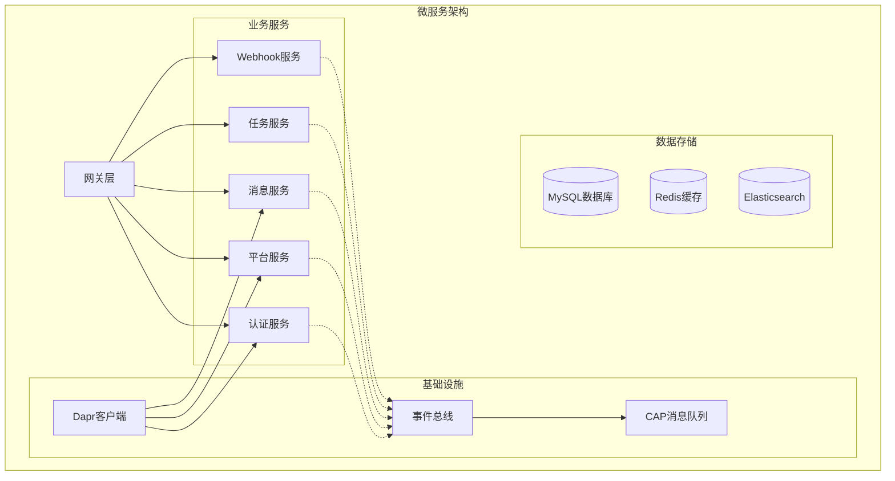

**图表来源**
- [Program.cs](file://aspnet-core/services/LY.MicroService.IdentityServer/Program.cs#L36-L60)
- [PlatformDomainModule.cs](file://aspnet-core/modules/platform/LINGYUN.Platform.Domain/LINGYUN/Platform/PlatformDomainModule.cs#L18-L30)

## 事件总线模式

### CAP分布式事件总线

系统采用CAP（Cloud Events Application Protocol）作为分布式事件总线的核心组件，实现了插件间的异步通信。

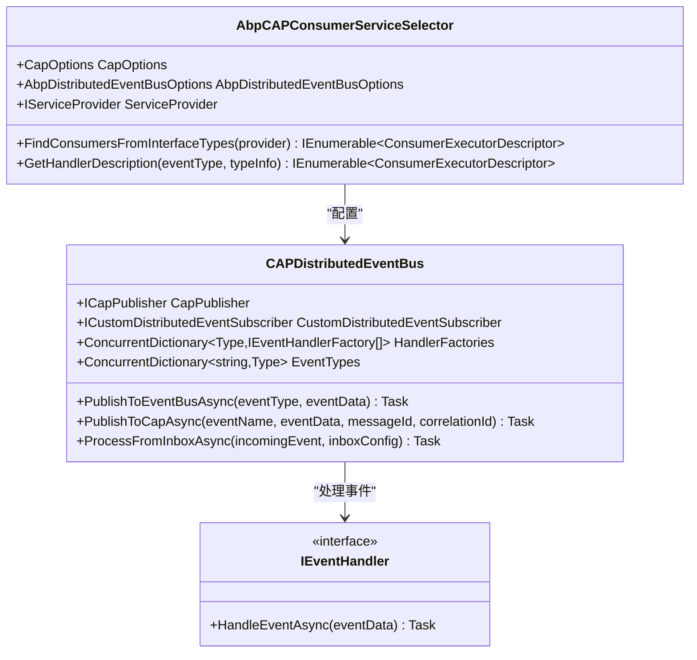

**图表来源**
- [CAPDistributedEventBus.cs](file://aspnet-core/framework/common/LINGYUN.Abp.EventBus.CAP/LINGYUN/Abp/EventBus/CAP/CAPDistributedEventBus.cs#L25-L78)
- [AbpCAPConsumerServiceSelector.cs](file://aspnet-core/framework/common/LINGYUN.Abp.EventBus.CAP/LINGYUN/Abp/EventBus/CAP/AbpCAPConsumerServiceSelector.cs#L17-L41)

### 事件发布流程

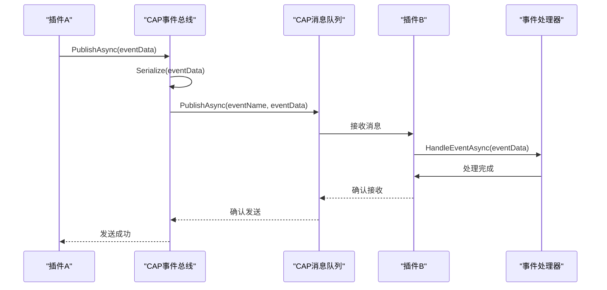

**图表来源**
- [CAPDistributedEventBus.cs](file://aspnet-core/framework/common/LINGYUN.Abp.EventBus.CAP/LINGYUN/Abp/EventBus/CAP/CAPDistributedEventBus.cs#L130-L150)

**章节来源**
- [CAPDistributedEventBus.cs](file://aspnet-core/framework/common/LINGYUN.Abp.EventBus.CAP/LINGYUN/Abp/EventBus/CAP/CAPDistributedEventBus.cs#L1-L297)

## 服务定位器模式

### Dapr客户端代理

系统通过Dapr客户端代理实现服务定位器模式，支持动态服务发现和调用。

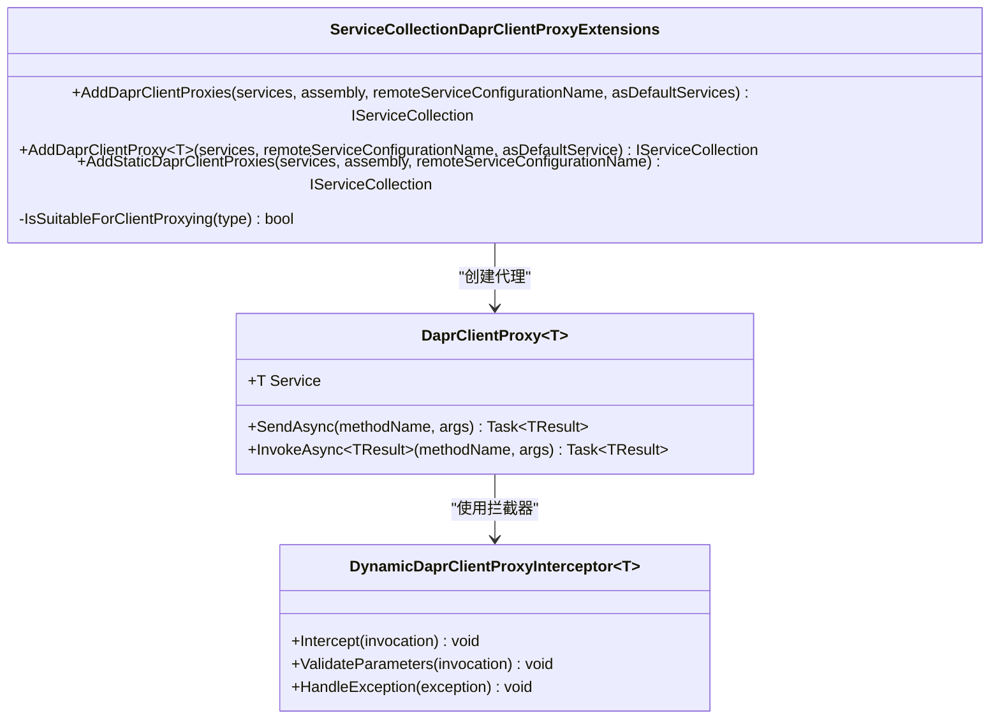

**图表来源**
- [ServiceCollectionDaprClientProxyExtensions.cs](file://aspnet-core/framework/dapr/LINGYUN.Abp.Dapr.Client/Microsoft/Extensions/DependencyInjection/ServiceCollectionDaprClientProxyExtensions.cs#L15-L50)

### 服务发现机制

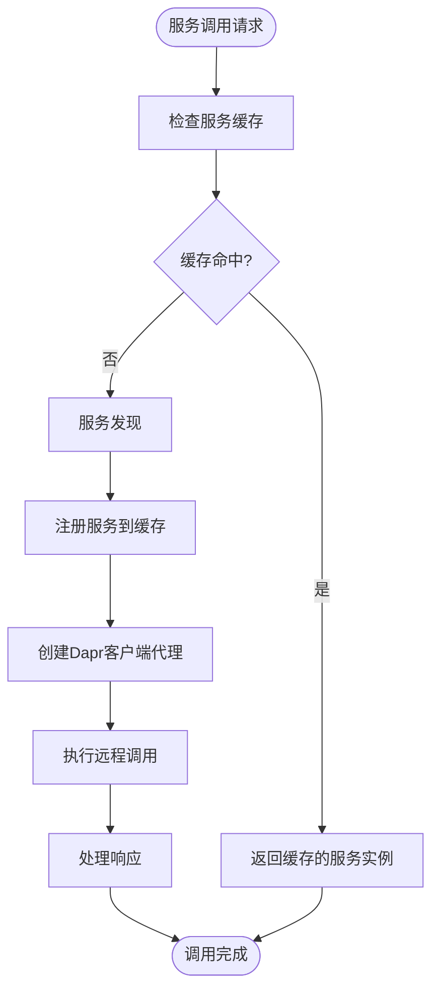

**图表来源**
- [ServiceCollectionDaprClientProxyExtensions.cs](file://aspnet-core/framework/dapr/LINGYUN.Abp.Dapr.Client/Microsoft/Extensions/DependencyInjection/ServiceCollectionDaprClientProxyExtensions.cs#L50-L100)

**章节来源**
- [ServiceCollectionDaprClientProxyExtensions.cs](file://aspnet-core/framework/dapr/LINGYUN.Abp.Dapr.Client/Microsoft/Extensions/DependencyInjection/ServiceCollectionDaprClientProxyExtensions.cs#L1-L195)

## 依赖注入集成

### 模块注册机制

系统采用模块化架构，通过依赖注入实现插件的自动加载和注册。

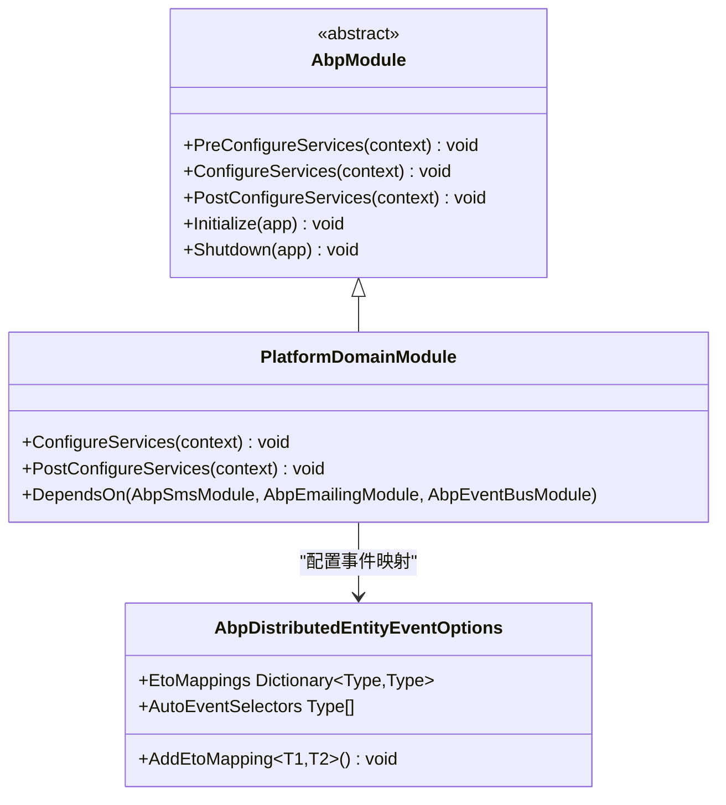

**图表来源**
- [PlatformDomainModule.cs](file://aspnet-core/modules/platform/LINGYUN.Platform.Domain/LINGYUN/Platform/PlatformDomainModule.cs#L18-L30)

### 插件加载流程

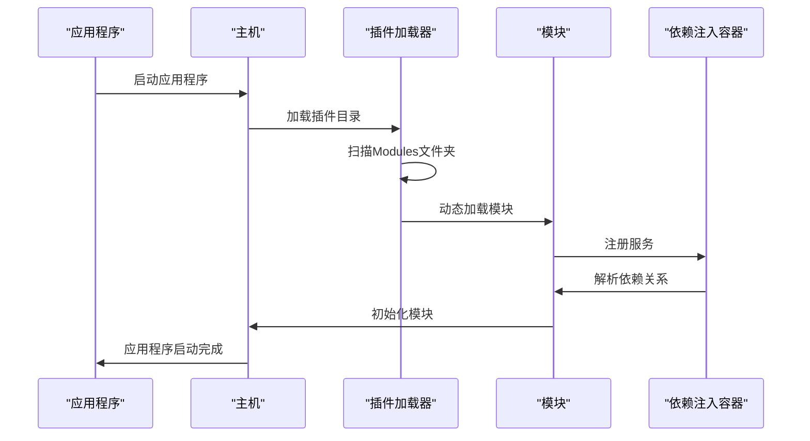

**图表来源**
- [Program.cs](file://aspnet-core/services/LY.MicroService.IdentityServer/Program.cs#L45-L55)

**章节来源**
- [PlatformDomainModule.cs](file://aspnet-core/modules/platform/LINGYUN.Platform.Domain/LINGYUN/Platform/PlatformDomainModule.cs#L1-L82)
- [Program.cs](file://aspnet-core/services/LY.MicroService.IdentityServer/Program.cs#L36-L60)

## 跨插件调用安全性

### 安全头信息传递

系统在跨插件调用时会自动传递安全相关的头信息，确保调用的安全性。

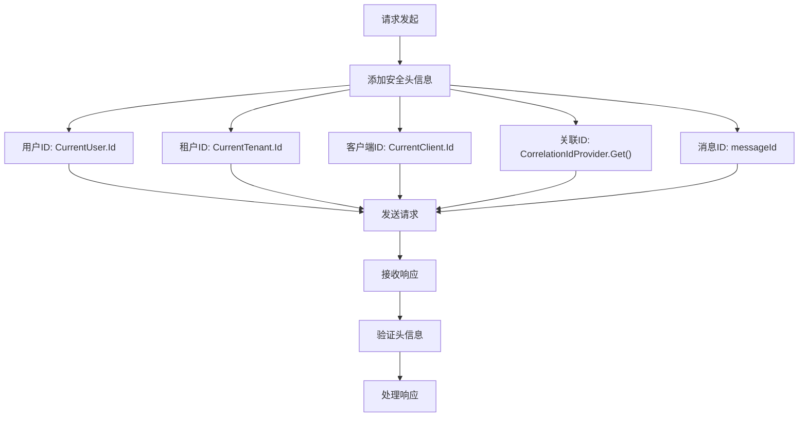

**图表来源**
- [CAPDistributedEventBus.cs](file://aspnet-core/framework/common/LINGYUN.Abp.EventBus.CAP/LINGYUN/Abp/EventBus/CAP/CAPDistributedEventBus.cs#L220-L240)

### 数据加密和验证

系统支持多种加密算法和数据验证机制，确保插件间传输的数据安全。

**章节来源**
- [CAPDistributedEventBus.cs](file://aspnet-core/framework/common/LINGYUN.Abp.EventBus.CAP/LINGYUN/Abp/EventBus/CAP/CAPDistributedEventBus.cs#L220-L240)

## 数据序列化格式

### JSON序列化

系统默认使用JSON格式进行数据序列化，支持自定义序列化器。

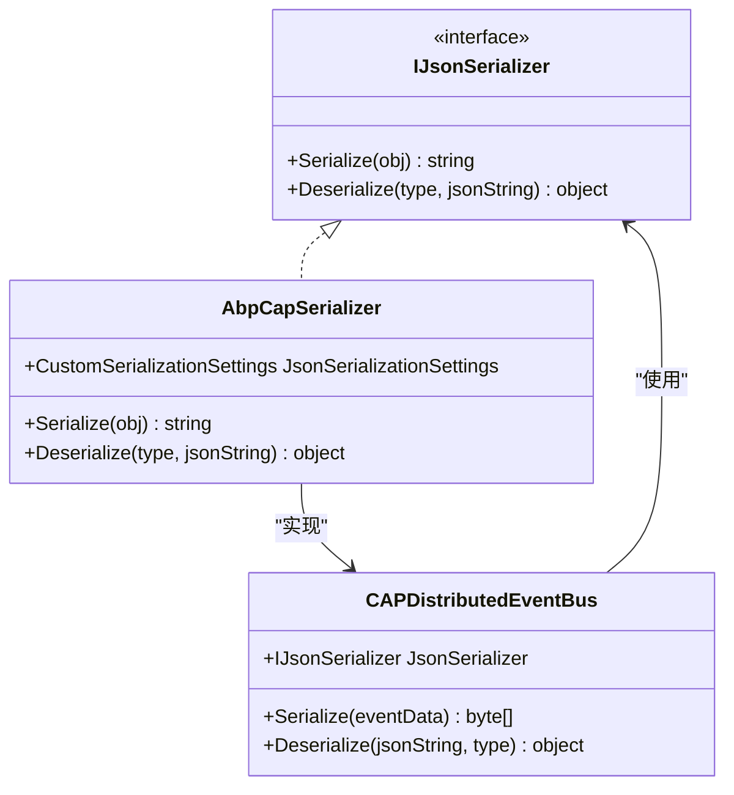

**图表来源**
- [CAPDistributedEventBus.cs](file://aspnet-core/framework/common/LINGYUN.Abp.EventBus.CAP/LINGYUN/Abp/EventBus/CAP/CAPDistributedEventBus.cs#L50-L60)

### 序列化优化

系统通过以下方式优化序列化性能：

1. **对象池技术**：重用序列化对象，减少GC压力
2. **压缩算法**：对大数据进行压缩传输
3. **缓存机制**：缓存常用类型的序列化结果

**章节来源**
- [CAPDistributedEventBus.cs](file://aspnet-core/framework/common/LINGYUN.Abp.EventBus.CAP/LINGYUN/Abp/EventBus/CAP/CAPDistributedEventBus.cs#L150-L170)

## 版本兼容性处理

### 向后兼容策略

系统采用多种策略确保不同版本插件间的兼容性：

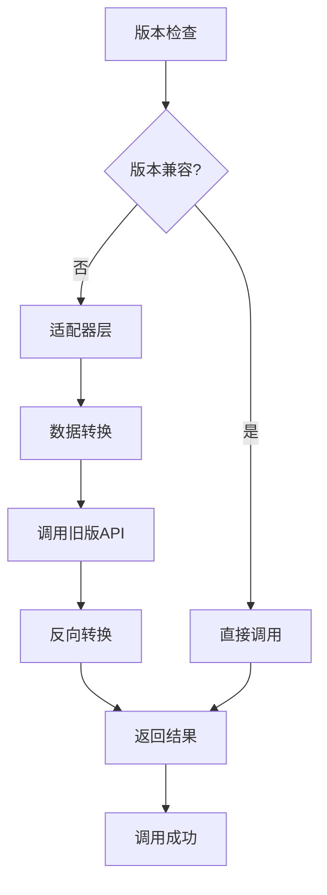

### 版本迁移机制

系统提供自动化的版本迁移工具，支持插件的平滑升级。

**章节来源**
- [ObjectMethodExecutor.cs](file://aspnet-core/framework/common/LINGYUN.Abp.EventBus.CAP/LINGYUN/Abp/EventBus/CAP/Internal/ObjectMethodExecutor.cs#L88-L110)

## 异步通信模式

### 异步事件处理

系统支持多种异步通信模式，包括事件驱动和消息驱动。

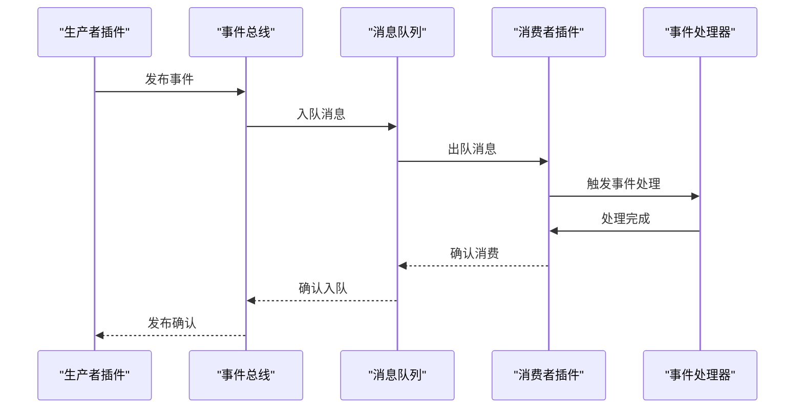

**图表来源**
- [MessageSender.cs](file://aspnet-core/modules/realtime-message/LINGYUN.Abp.IM/LINGYUN/Abp/IM/Messages/MessageSender.cs#L20-L33)

### 并发控制机制

系统通过以下机制控制并发访问：

1. **信号量限制**：控制同时处理的请求数量
2. **限流算法**：防止系统过载
3. **熔断机制**：在异常情况下保护系统

**章节来源**
- [MessageSender.cs](file://aspnet-core/modules/realtime-message/LINGYUN.Abp.IM/LINGYUN/Abp/IM/Messages/MessageSender.cs#L1-L33)

## 消息队列集成

### CAP消息队列

系统集成了CAP消息队列，支持多种消息中间件。

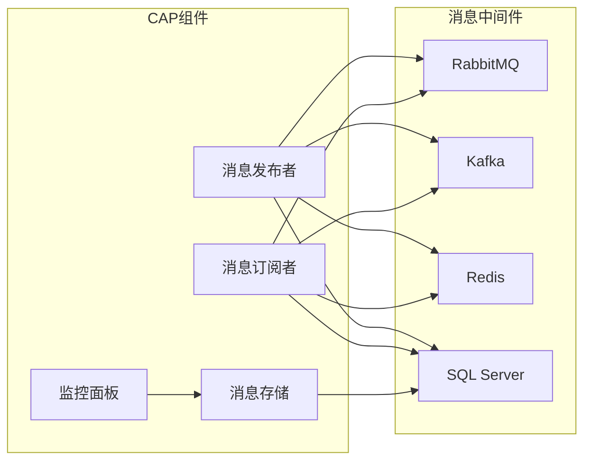

### 消息持久化

系统提供可靠的消息持久化机制：

1. **事务性消息**：确保消息的原子性
2. **重试机制**：失败消息自动重试
3. **死信队列**：处理无法投递的消息

**章节来源**
- [CAPDistributedEventBus.cs](file://aspnet-core/framework/common/LINGYUN.Abp.EventBus.CAP/LINGYUN/Abp/EventBus/CAP/CAPDistributedEventBus.cs#L170-L200)

## 性能优化技巧

### 异步编程优化

系统采用多种异步编程优化技巧：

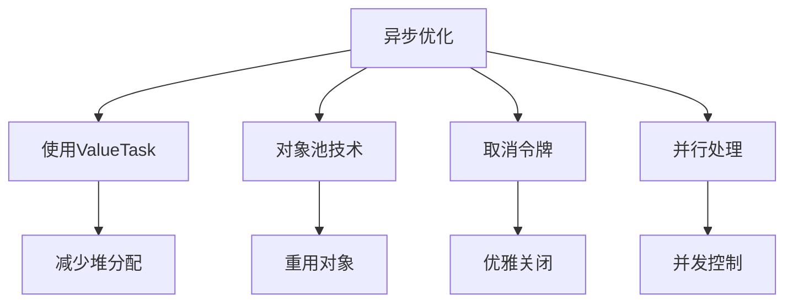

**图表来源**
- [ObjectMethodExecutor.cs](file://aspnet-core/framework/common/LINGYUN.Abp.EventBus.CAP/LINGYUN/Abp/EventBus/CAP/Internal/ObjectMethodExecutor.cs#L237-L265)

### 内存管理优化

系统通过以下方式优化内存使用：

1. **对象池**：重用频繁创建的对象
2. **弱引用**：避免内存泄漏
3. **及时释放**：主动释放不需要的资源

### 网络优化

系统在网络层面进行了多项优化：

1. **连接池**：复用网络连接
2. **压缩传输**：减少网络带宽占用
3. **批量处理**：合并小请求

**章节来源**
- [ObjectMethodExecutor.cs](file://aspnet-core/framework/common/LINGYUN.Abp.EventBus.CAP/LINGYUN/Abp/EventBus/CAP/Internal/ObjectMethodExecutor.cs#L263-L288)

## 最佳实践指南

### 插件设计原则

1. **单一职责**：每个插件只负责一个功能领域
2. **松耦合**：通过事件总线进行通信，减少直接依赖
3. **高内聚**：相关功能集中在一个模块中
4. **可扩展**：支持通过配置或继承进行扩展

### 通信最佳实践

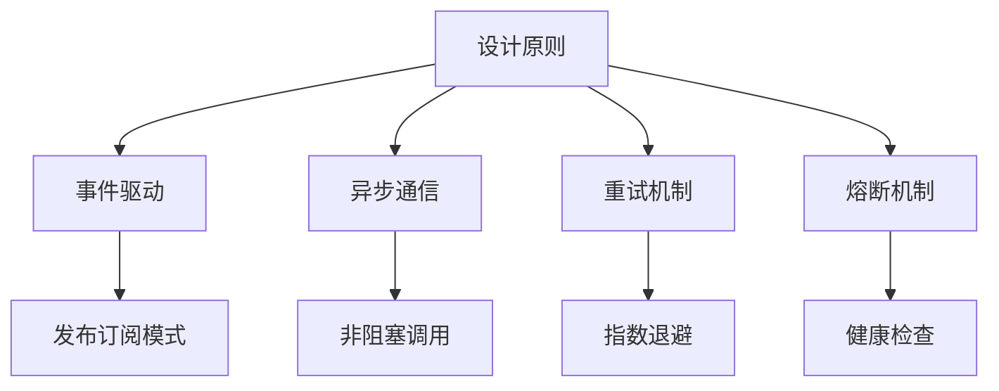

### 错误处理策略

系统采用多层次的错误处理策略：

1. **本地错误处理**：在插件内部处理可预见的错误
2. **全局错误处理**：通过异常过滤器处理未捕获的异常
3. **降级策略**：在服务不可用时提供备用方案
4. **监控告警**：实时监控系统状态并及时告警

## 故障排除指南

### 常见问题诊断

1. **事件丢失**：检查消息队列配置和网络连接
2. **性能瓶颈**：分析异步调用链和资源使用情况
3. **内存泄漏**：检查对象生命周期和资源释放
4. **并发问题**：分析锁竞争和线程安全

### 调试工具和技术

系统提供了丰富的调试工具：

1. **日志分析**：结构化日志记录和分析
2. **性能监控**：实时性能指标监控
3. **分布式追踪**：端到端请求追踪
4. **可视化界面**：直观的系统状态展示

### 监控和告警

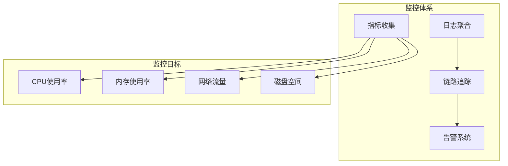

## 总结

ABP Next Admin通过精心设计的插件通信机制，实现了高度模块化和可扩展的企业级应用架构。主要特点包括：

1. **事件驱动架构**：通过CAP事件总线实现松耦合的插件通信
2. **服务定位器模式**：利用Dapr客户端代理实现动态服务发现
3. **依赖注入集成**：通过模块化设计实现插件的自动加载和注册
4. **安全性保障**：完整的安全头信息传递和数据加密机制
5. **性能优化**：多层次的异步编程和内存管理优化
6. **容错能力**：完善的重试机制和熔断保护

这套通信机制不仅保证了系统的稳定性和可靠性，还为未来的功能扩展和性能优化奠定了坚实的基础。开发者可以基于这些机制快速构建新的插件，实现业务需求的快速迭代和部署。