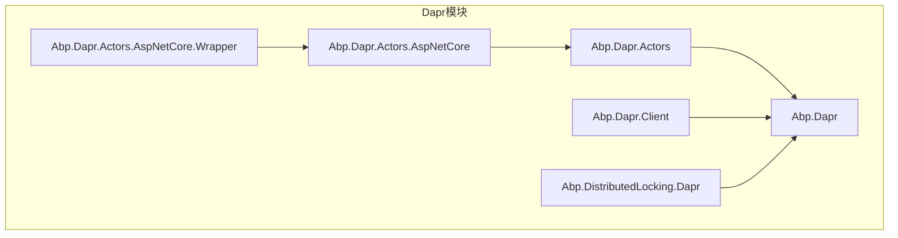
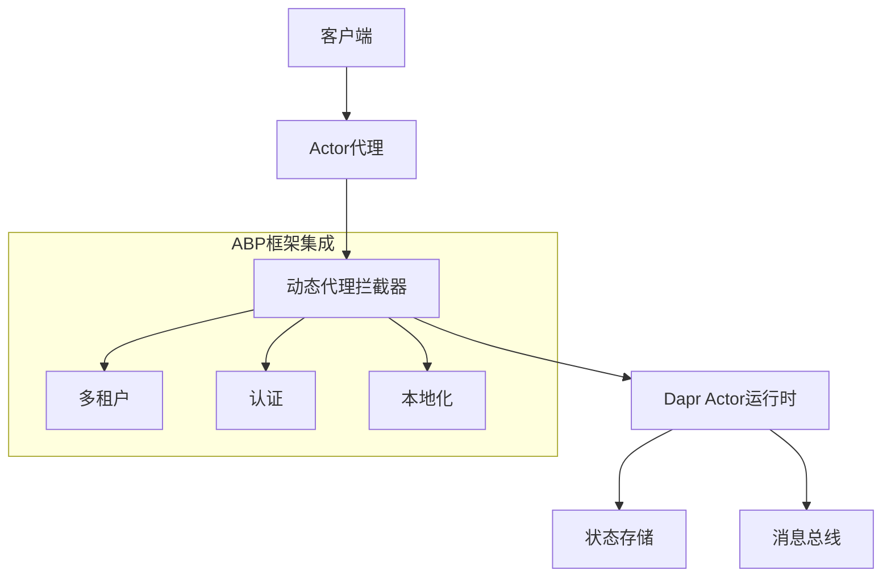
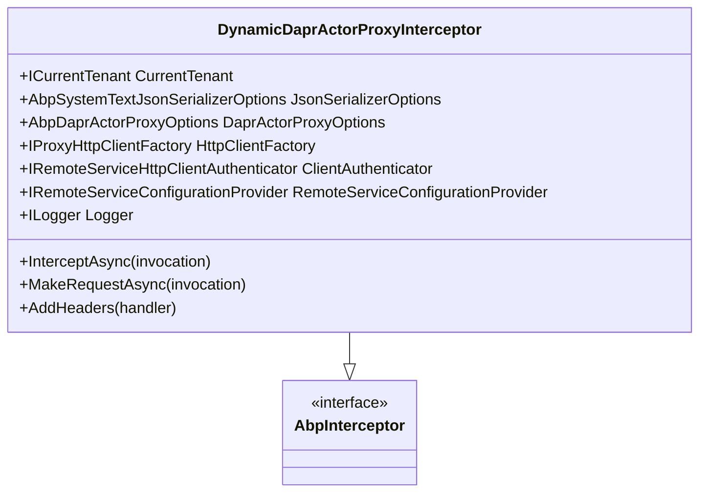
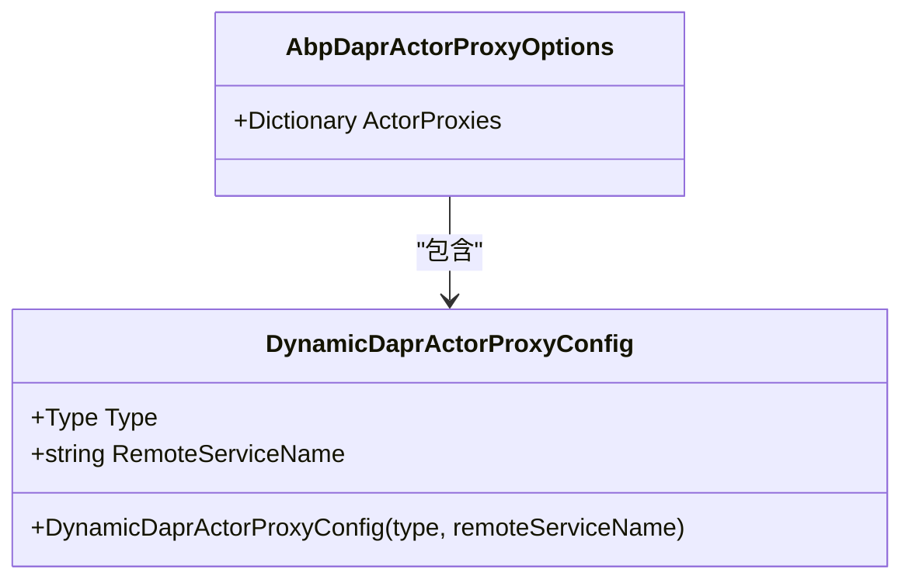
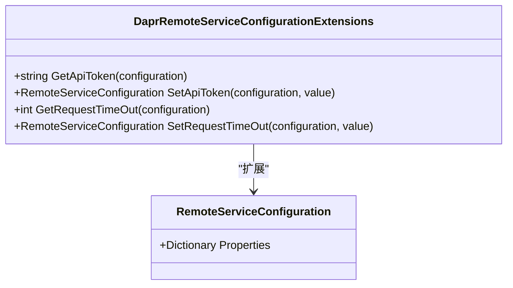
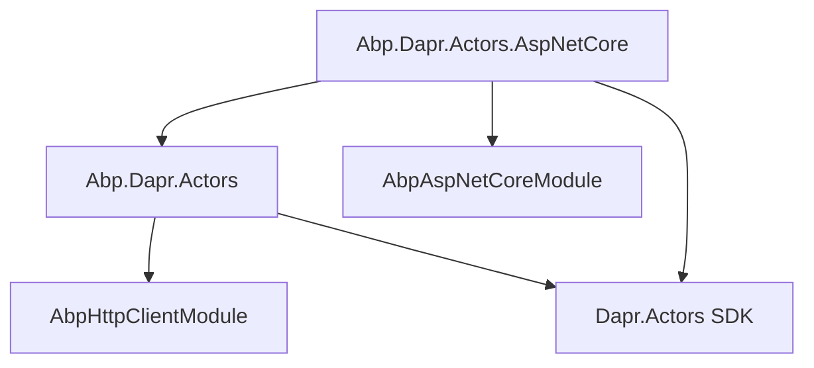

# Dapr Actor模型

<cite>
**本文档引用的文件**
- [AbpDaprActorsModule.cs](file://aspnet-core/framework/dapr/LINGYUN.Abp.Dapr.Actors/LINGYUN/Abp/Dapr/Actors/AbpDaprActorsModule.cs)
- [AbpDaprActorsAspNetCoreModule.cs](file://aspnet-core/framework/dapr/LINGYUN.Abp.Dapr.Actors.AspNetCore/LINGYUN/Abp/Dapr/Actors/AspNetCore/AbpDaprActorsAspNetCoreModule.cs)
- [DynamicDaprActorProxyInterceptor.cs](file://aspnet-core/framework/dapr/LINGYUN.Abp.Dapr.Actors/LINGYUN/Abp/Dapr/Actors/DynamicProxying/DynamicDaprActorProxyInterceptor.cs)
- [AbpDaprActorProxyOptions.cs](file://aspnet-core/framework/dapr/LINGYUN.Abp.Dapr.Actors/LINGYUN/Abp/Dapr/Actors/AbpDaprActorProxyOptions.cs)
- [DynamicDaprActorProxyConfig.cs](file://aspnet-core/framework/dapr/LINGYUN.Abp.Dapr.Actors/LINGYUN/Abp/Dapr/Actors/DynamicProxying/DynamicDaprActorProxyConfig.cs)
- [DaprRemoteServiceConfigurationExtensions.cs](file://aspnet-core/framework/dapr/LINGYUN.Abp.Dapr.Actors/LINGYUN/Abp/Dapr/Actors/DaprRemoteServiceConfigurationExtensions.cs)
- [TestActor.cs](file://aspnet-core/tests/LINGYUN.Abp.Dapr.AspNetCore.TestHost/LINGYUN/Abp/Dapr/Actors/TestActor.cs)
- [ITestActor.cs](file://aspnet-core/tests/LINGYUN.Abp.Dapr.Tests/LINGYUN/Abp/Dapr/Actors/ITestActor.cs)
- [README.md](file://aspnet-core/framework/dapr/LINGYUN.Abp.Dapr.Actors/README.md)
- [README.EN.md](file://aspnet-core/framework/dapr/LINGYUN.Abp.Dapr.Actors/README.EN.md)
</cite>

## 目录
1. [简介](#简介)
2. [项目结构](#项目结构)
3. [核心组件](#核心组件)
4. [架构概述](#架构概述)
5. [详细组件分析](#详细组件分析)
6. [依赖分析](#依赖分析)
7. [性能考虑](#性能考虑)
8. [故障排除指南](#故障排除指南)
9. [结论](#结论)

## 简介
Dapr Actor模型是LINGYUN.Abp.Dapr.Actors模块的核心功能，它为ABP框架提供了分布式Actor模型的实现。该模块基于Dapr的Actor运行时，实现了Actor的生命周期管理、状态持久化和方法调用等核心概念。通过集成ABP框架的依赖注入、多租户和认证授权等特性，该模块为开发者提供了在微服务架构中使用Dapr Actor模型构建分布式应用的完整解决方案。

## 项目结构
LINGYUN.Abp.Dapr.Actors模块是ABP框架中Dapr集成的一部分，位于aspnet-core/framework/dapr目录下。该模块与其他Dapr相关模块协同工作，提供了完整的Dapr集成能力。

**Diagram sources**
- [AbpDaprActorsModule.cs](file://aspnet-core/framework/dapr/LINGYUN.Abp.Dapr.Actors/LINGYUN/Abp/Dapr/Actors/AbpDaprActorsModule.cs)
- [AbpDaprActorsAspNetCoreModule.cs](file://aspnet-core/framework/dapr/LINGYUN.Abp.Dapr.Actors.AspNetCore/LINGYUN/Abp/Dapr/Actors/AspNetCore/AbpDaprActorsAspNetCoreModule.cs)

**Section sources**
- [AbpDaprActorsModule.cs](file://aspnet-core/framework/dapr/LINGYUN.Abp.Dapr.Actors/LINGYUN/Abp/Dapr/Actors/AbpDaprActorsModule.cs)
- [AbpDaprActorsAspNetCoreModule.cs](file://aspnet-core/framework/dapr/LINGYUN.Abp.Dapr.Actors.AspNetCore/LINGYUN/Abp/Dapr/Actors/AspNetCore/AbpDaprActorsAspNetCoreModule.cs)

## 核心组件
LINGYUN.Abp.Dapr.Actors模块的核心组件包括Actor代理拦截器、Actor代理选项和远程服务配置扩展。这些组件共同实现了Dapr Actor模型在ABP框架中的集成。

**Section sources**
- [DynamicDaprActorProxyInterceptor.cs](file://aspnet-core/framework/dapr/LINGYUN.Abp.Dapr.Actors/LINGYUN/Abp/Dapr/Actors/DynamicProxying/DynamicDaprActorProxyInterceptor.cs)
- [AbpDaprActorProxyOptions.cs](file://aspnet-core/framework/dapr/LINGYUN.Abp.Dapr.Actors/LINGYUN/Abp/Dapr/Actors/AbpDaprActorProxyOptions.cs)
- [DaprRemoteServiceConfigurationExtensions.cs](file://aspnet-core/framework/dapr/LINGYUN.Abp.Dapr.Actors/LINGYUN/Abp/Dapr/Actors/DaprRemoteServiceConfigurationExtensions.cs)

## 架构概述
LINGYUN.Abp.Dapr.Actors模块的架构基于Dapr的Actor运行时，通过动态代理和拦截器机制实现了Actor模型在ABP框架中的集成。该模块处理了Actor的生命周期管理、状态持久化和方法调用等核心功能。

**Diagram sources**
- [DynamicDaprActorProxyInterceptor.cs](file://aspnet-core/framework/dapr/LINGYUN.Abp.Dapr.Actors/LINGYUN/Abp/Dapr/Actors/DynamicProxying/DynamicDaprActorProxyInterceptor.cs)
- [AbpDaprActorsModule.cs](file://aspnet-core/framework/dapr/LINGYUN.Abp.Dapr.Actors/LINGYUN/Abp/Dapr/Actors/AbpDaprActorsModule.cs)

## 详细组件分析

### Actor代理拦截器分析
Actor代理拦截器是LINGYUN.Abp.Dapr.Actors模块的核心组件，负责处理Actor方法的调用。它通过动态代理机制拦截Actor方法的调用，并将其转发到Dapr Actor运行时。

**Diagram sources**
- [DynamicDaprActorProxyInterceptor.cs](file://aspnet-core/framework/dapr/LINGYUN.Abp.Dapr.Actors/LINGYUN/Abp/Dapr/Actors/DynamicProxying/DynamicDaprActorProxyInterceptor.cs)

**Section sources**
- [DynamicDaprActorProxyInterceptor.cs](file://aspnet-core/framework/dapr/LINGYUN.Abp.Dapr.Actors/LINGYUN/Abp/Dapr/Actors/DynamicProxying/DynamicDaprActorProxyInterceptor.cs)

### Actor代理选项分析
Actor代理选项类定义了Actor代理的配置，包括Actor代理的远程服务名称和类型信息。

**Diagram sources**
- [AbpDaprActorProxyOptions.cs](file://aspnet-core/framework/dapr/LINGYUN.Abp.Dapr.Actors/LINGYUN/Abp/Dapr/Actors/AbpDaprActorProxyOptions.cs)
- [DynamicDaprActorProxyConfig.cs](file://aspnet-core/framework/dapr/LINGYUN.Abp.Dapr.Actors/LINGYUN/Abp/Dapr/Actors/DynamicProxying/DynamicDaprActorProxyConfig.cs)

**Section sources**
- [AbpDaprActorProxyOptions.cs](file://aspnet-core/framework/dapr/LINGYUN.Abp.Dapr.Actors/LINGYUN/Abp/Dapr/Actors/AbpDaprActorProxyOptions.cs)
- [DynamicDaprActorProxyConfig.cs](file://aspnet-core/framework/dapr/LINGYUN.Abp.Dapr.Actors/LINGYUN/Abp/Dapr/Actors/DynamicProxying/DynamicDaprActorProxyConfig.cs)

### 远程服务配置扩展分析
远程服务配置扩展提供了Dapr特定的配置选项，如请求超时和API令牌。

**Diagram sources**
- [DaprRemoteServiceConfigurationExtensions.cs](file://aspnet-core/framework/dapr/LINGYUN.Abp.Dapr.Actors/LINGYUN/Abp/Dapr/Actors/DaprRemoteServiceConfigurationExtensions.cs)
- [RemoteServiceConfiguration](file://aspnet-core/framework/dapr/LINGYUN.Abp.Dapr.Actors/LINGYUN/Abp/Dapr/Actors/DaprRemoteServiceConfigurationExtensions.cs)

**Section sources**
- [DaprRemoteServiceConfigurationExtensions.cs](file://aspnet-core/framework/dapr/LINGYUN.Abp.Dapr.Actors/LINGYUN/Abp/Dapr/Actors/DaprRemoteServiceConfigurationExtensions.cs)

## 依赖分析
LINGYUN.Abp.Dapr.Actors模块依赖于多个ABP框架的核心模块和Dapr SDK。

**Diagram sources**
- [AbpDaprActorsModule.cs](file://aspnet-core/framework/dapr/LINGYUN.Abp.Dapr.Actors/LINGYUN/Abp/Dapr/Actors/AbpDaprActorsModule.cs)
- [AbpDaprActorsAspNetCoreModule.cs](file://aspnet-core/framework/dapr/LINGYUN.Abp.Dapr.Actors.AspNetCore/LINGYUN/Abp/Dapr/Actors/AspNetCore/AbpDaprActorsAspNetCoreModule.cs)

**Section sources**
- [AbpDaprActorsModule.cs](file://aspnet-core/framework/dapr/LINGYUN.Abp.Dapr.Actors/LINGYUN/Abp/Dapr/Actors/AbpDaprActorsModule.cs)
- [AbpDaprActorsAspNetCoreModule.cs](file://aspnet-core/framework/dapr/LINGYUN.Abp.Dapr.Actors.AspNetCore/LINGYUN/Abp/Dapr/Actors/AspNetCore/AbpDaprActorsAspNetCoreModule.cs)

## 性能考虑
在使用LINGYUN.Abp.Dapr.Actors模块时，需要注意以下性能考虑：

1. Actor实例是单线程的，一次只能处理一个请求，因此需要避免长时间运行的操作。
2. 状态管理操作（如GetStateAsync和SetStateAsync）涉及网络调用，应尽量减少不必要的状态读写。
3. 配置适当的Actor空闲超时和扫描间隔，以平衡资源利用率和响应速度。
4. 使用批量状态操作（如AddOrUpdateStateAsync）来减少网络往返次数。

## 故障排除指南
在使用LINGYUN.Abp.Dapr.Actors模块时，可能会遇到以下常见问题：

**Section sources**
- [DynamicDaprActorProxyInterceptor.cs](file://aspnet-core/framework/dapr/LINGYUN.Abp.Dapr.Actors/LINGYUN/Abp/Dapr/Actors/DynamicProxying/DynamicDaprActorProxyInterceptor.cs)
- [TestActor.cs](file://aspnet-core/tests/LINGYUN.Abp.Dapr.AspNetCore.TestHost/LINGYUN/Abp/Dapr/Actors/TestActor.cs)

### Actor方法调用失败
如果Actor方法调用失败，检查以下几点：
- 确保Actor方法返回Task或Task<T>
- 确保Actor方法最多只有一个参数
- 检查远程服务配置中的BaseUrl是否正确
- 检查Dapr运行时是否正常运行

### 状态持久化问题
如果遇到状态持久化问题，检查以下几点：
- 确保状态存储组件已正确配置
- 检查状态键名是否唯一且正确
- 确认状态序列化/反序列化配置是否正确

### 多租户上下文丢失
如果多租户上下文在Actor调用中丢失，检查以下几点：
- 确保在Actor代理拦截器中正确传递了租户ID
- 检查租户解析器配置是否正确

## 结论
LINGYUN.Abp.Dapr.Actors模块为ABP框架提供了完整的Dapr Actor模型集成。通过动态代理和拦截器机制，该模块实现了Actor的生命周期管理、状态持久化和方法调用等核心功能。该模块还集成了ABP框架的多租户、认证授权和本地化等特性，为开发者提供了在微服务架构中使用Dapr Actor模型构建分布式应用的完整解决方案。通过遵循最佳实践和注意性能考虑，开发者可以充分利用该模块构建高效、可靠的分布式应用。