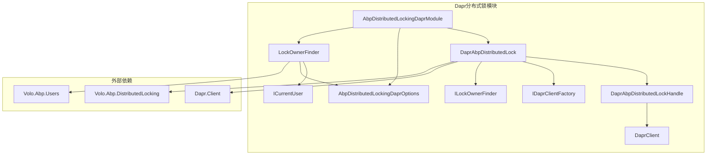
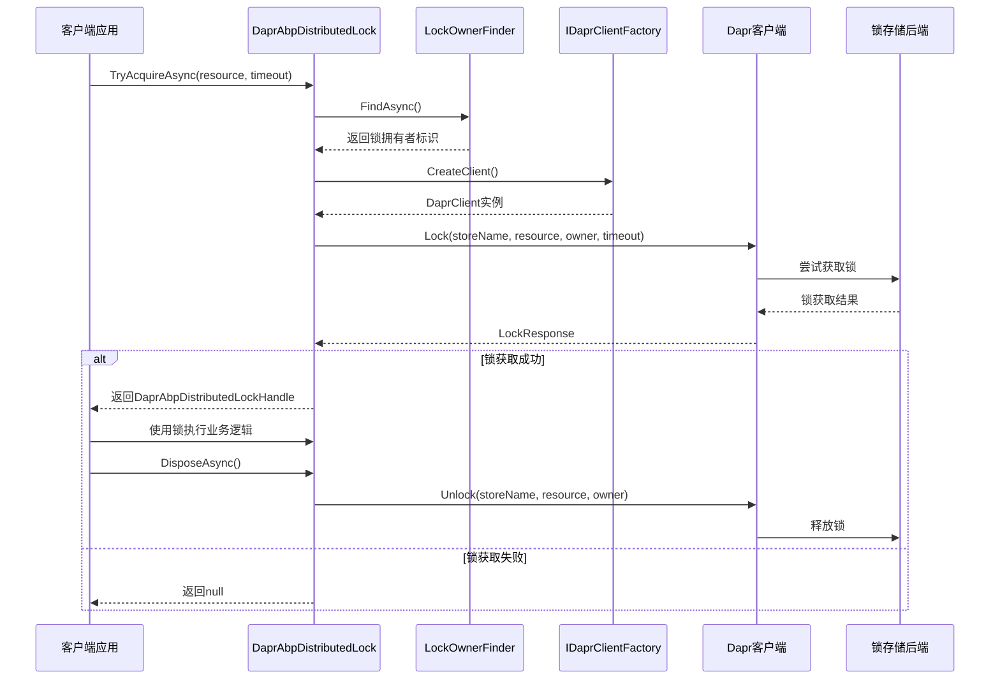
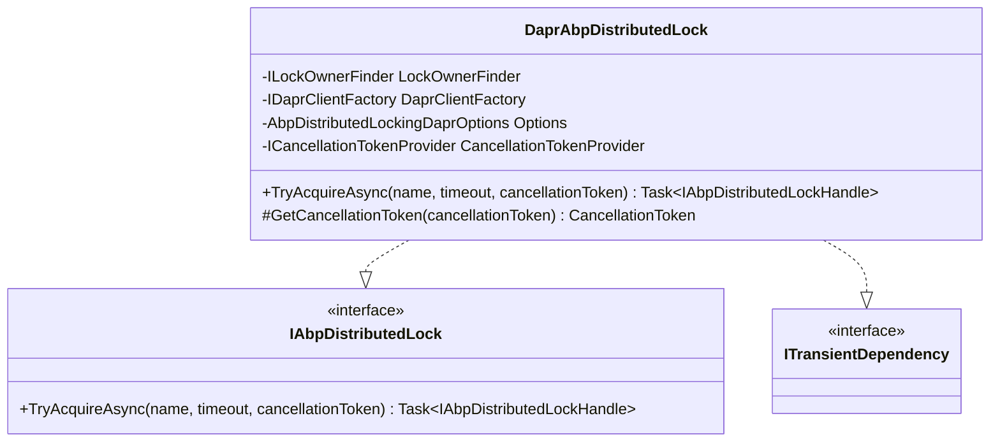
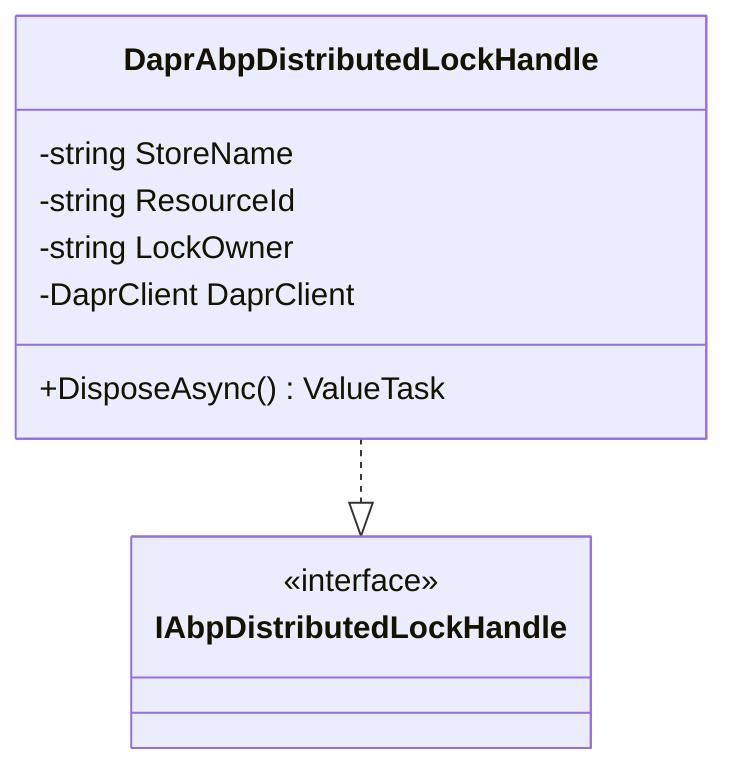
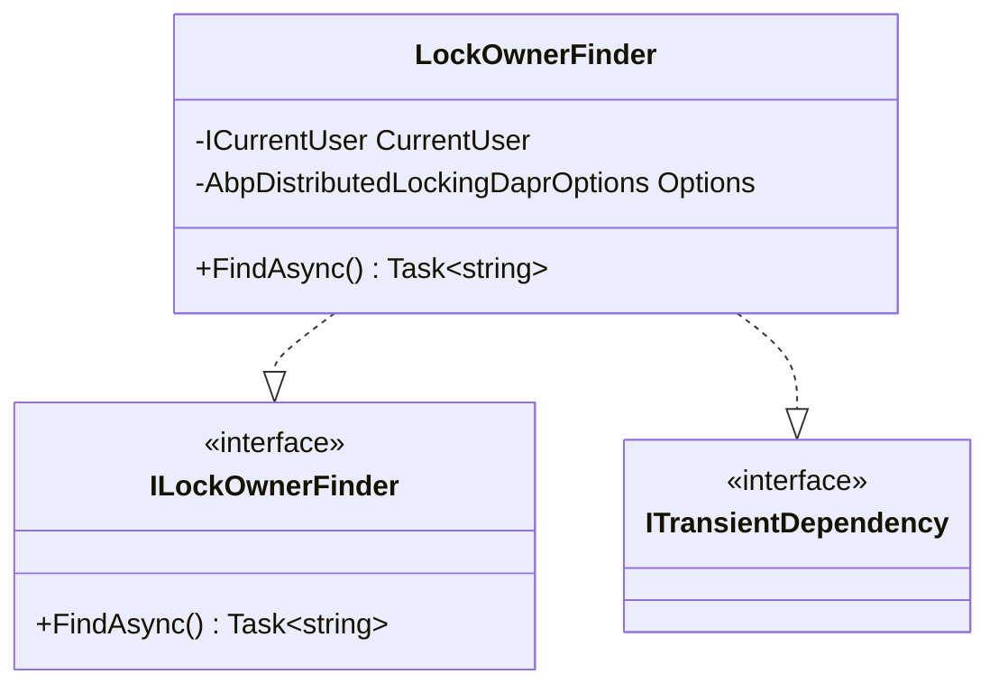

# Dapr分布式锁

<cite>
**本文档中引用的文件**
- [AbpDistributedLockingDaprModule.cs](file://aspnet-core/framework/dapr/LINGYUN.Abp.DistributedLocking.Dapr/LINGYUN/Abp/DistributedLocking/Dapr/AbpDistributedLockingDaprModule.cs)
- [DaprAbpDistributedLock.cs](file://aspnet-core/framework/dapr/LINGYUN.Abp.DistributedLocking.Dapr/LINGYUN/Abp/DistributedLocking/Dapr/DaprAbpDistributedLock.cs)
- [DaprAbpDistributedLockHandle.cs](file://aspnet-core/framework/dapr/LINGYUN.Abp.DistributedLocking.Dapr/LINGYUN/Abp/DistributedLocking/Dapr/DaprAbpDistributedLockHandle.cs)
- [AbpDistributedLockingDaprOptions.cs](file://aspnet-core/framework/dapr/LINGYUN.Abp.DistributedLocking.Dapr/LINGYUN/Abp/DistributedLocking/Dapr/AbpDistributedLockingDaprOptions.cs)
- [ILockOwnerFinder.cs](file://aspnet-core/framework/dapr/LINGYUN.Abp.DistributedLocking.Dapr/LINGYUN/Abp/DistributedLocking/Dapr/ILockOwnerFinder.cs)
- [LockOwnerFinder.cs](file://aspnet-core/framework/dapr/LINGYUN.Abp.DistributedLocking.Dapr/LINGYUN/Abp/DistributedLocking/Dapr/LockOwnerFinder.cs)
- [README.md](file://aspnet-core/framework/dapr/LINGYUN.Abp.DistributedLocking.Dapr/README.md)
- [README.EN.md](file://aspnet-core/framework/dapr/LINGYUN.Abp.DistributedLocking.Dapr/README.EN.md)
</cite>

## 目录
1. [简介](#简介)
2. [项目结构](#项目结构)
3. [核心组件](#核心组件)
4. [架构概览](#架构概览)
5. [详细组件分析](#详细组件分析)
6. [配置与使用](#配置与使用)
7. [最佳实践](#最佳实践)
8. [故障排除](#故障排除)
9. [总结](#总结)

## 简介

Dapr分布式锁是基于Dapr分布式锁API的ABP框架分布式锁实现。该模块提供了与Dapr分布式锁服务的无缝集成，支持跨服务、跨实例的分布式锁定功能。通过Dapr的抽象层，开发者可以轻松地在微服务架构中实现分布式锁，确保数据一致性和并发控制。

Dapr分布式锁模块的核心优势包括：
- **跨服务锁定**：支持不同服务实例之间的锁协调
- **多存储后端**：支持Redis、Consul等多种锁存储组件
- **自动释放**：支持锁超时自动释放机制
- **灵活配置**：提供丰富的配置选项和自定义能力
- **ABP集成**：与ABP框架的分布式锁系统深度集成

## 项目结构

Dapr分布式锁模块采用清晰的分层架构设计，主要包含以下核心文件：



**图表来源**
- [AbpDistributedLockingDaprModule.cs](file://aspnet-core/framework/dapr/LINGYUN.Abp.DistributedLocking.Dapr/LINGYUN/Abp/DistributedLocking/Dapr/AbpDistributedLockingDaprModule.cs#L1-L16)
- [DaprAbpDistributedLock.cs](file://aspnet-core/framework/dapr/LINGYUN.Abp.DistributedLocking.Dapr/LINGYUN/Abp/DistributedLocking/Dapr/DaprAbpDistributedLock.cs#L1-L61)

**章节来源**
- [AbpDistributedLockingDaprModule.cs](file://aspnet-core/framework/dapr/LINGYUN.Abp.DistributedLocking.Dapr/LINGYUN/Abp/DistributedLocking/Dapr/AbpDistributedLockingDaprModule.cs#L1-L16)
- [README.md](file://aspnet-core/framework/dapr/LINGYUN.Abp.DistributedLocking.Dapr/README.md#L1-L50)

## 核心组件

Dapr分布式锁模块由以下核心组件构成：

### 1. 主模块类
`AbpDistributedLockingDaprModule` 是整个模块的入口点，负责依赖注入和服务注册。

### 2. 分布式锁实现
`DaprAbpDistributedLock` 类实现了 `IAbpDistributedLock` 接口，提供分布式锁的核心功能。

### 3. 锁句柄管理
`DaprAbpDistributedLockHandle` 类负责管理锁的生命周期，在释放时自动调用Dapr的解锁API。

### 4. 锁拥有者查找器
`ILockOwnerFinder` 和 `LockOwnerFinder` 提供锁拥有者的标识机制，支持用户身份和自定义标识。

**章节来源**
- [DaprAbpDistributedLock.cs](file://aspnet-core/framework/dapr/LINGYUN.Abp.DistributedLocking.Dapr/LINGYUN/Abp/DistributedLocking/Dapr/DaprAbpDistributedLock.cs#L1-L61)
- [DaprAbpDistributedLockHandle.cs](file://aspnet-core/framework/dapr/LINGYUN.Abp.DistributedLocking.Dapr/LINGYUN/Abp/DistributedLocking/Dapr/DaprAbpDistributedLockHandle.cs#L1-L29)
- [LockOwnerFinder.cs](file://aspnet-core/framework/dapr/LINGYUN.Abp.DistributedLocking.Dapr/LINGYUN/Abp/DistributedLocking/Dapr/LockOwnerFinder.cs#L1-L31)

## 架构概览

Dapr分布式锁的整体架构遵循分层设计原则，通过Dapr的抽象层实现与底层存储的解耦：



**图表来源**
- [DaprAbpDistributedLock.cs](file://aspnet-core/framework/dapr/LINGYUN.Abp.DistributedLocking.Dapr/LINGYUN/Abp/DistributedLocking/Dapr/DaprAbpDistributedLock.cs#L32-L59)
- [DaprAbpDistributedLockHandle.cs](file://aspnet-core/framework/dapr/LINGYUN.Abp.DistributedLocking.Dapr/LINGYUN/Abp/DistributedLocking/Dapr/DaprAbpDistributedLockHandle.cs#L20-L28)

## 详细组件分析

### DaprAbpDistributedLock 分析

`DaprAbpDistributedLock` 是分布式锁的核心实现类，负责协调整个锁获取过程：



**图表来源**
- [DaprAbpDistributedLock.cs](file://aspnet-core/framework/dapr/LINGYUN.Abp.DistributedLocking.Dapr/LINGYUN/Abp/DistributedLocking/Dapr/DaprAbpDistributedLock.cs#L11-L25)

#### 核心方法实现

`TryAcquireAsync` 方法是分布式锁的核心实现，其工作流程如下：

1. **参数处理**：如果未指定超时时间，则使用默认配置
2. **客户端创建**：通过工厂模式创建Dapr客户端实例
3. **拥有者标识**：调用 `LockOwnerFinder` 获取锁拥有者标识
4. **锁获取**：调用Dapr客户端的 `Lock` 方法尝试获取锁
5. **结果处理**：根据返回结果决定是否创建锁句柄

**章节来源**
- [DaprAbpDistributedLock.cs](file://aspnet-core/framework/dapr/LINGYUN.Abp.DistributedLocking.Dapr/LINGYUN/Abp/DistributedLocking/Dapr/DaprAbpDistributedLock.cs#L26-L59)

### DaprAbpDistributedLockHandle 分析

`DaprAbpDistributedLockHandle` 负责管理锁的生命周期，确保在使用完毕后正确释放锁：



**图表来源**
- [DaprAbpDistributedLockHandle.cs](file://aspnet-core/framework/dapr/LINGYUN.Abp.DistributedLocking.Dapr/LINGYUN/Abp/DistributedLocking/Dapr/DaprAbpDistributedLockHandle.cs#L6-L28)

#### 自动释放机制

`DisposeAsync` 方法在锁句柄被释放时自动调用Dapr的 `Unlock` API，确保即使发生异常也能正确释放锁：

```csharp
public async ValueTask DisposeAsync()
{
    await DaprClient.Unlock(StoreName, ResourceId, LockOwner);
}
```

**章节来源**
- [DaprAbpDistributedLockHandle.cs](file://aspnet-core/framework/dapr/LINGYUN.Abp.DistributedLocking.Dapr/LINGYUN/Abp/DistributedLocking/Dapr/DaprAbpDistributedLockHandle.cs#L20-L28)

### LockOwnerFinder 分析

`LockOwnerFinder` 实现了 `ILockOwnerFinder` 接口，负责提供锁的拥有者标识：



**图表来源**
- [LockOwnerFinder.cs](file://aspnet-core/framework/dapr/LINGYUN.Abp.DistributedLocking.Dapr/LINGYUN/Abp/DistributedLocking/Dapr/LockOwnerFinder.cs#L8-L22)

#### 拥有者标识策略

`LockOwnerFinder` 采用智能策略确定锁拥有者标识：
1. **优先使用用户ID**：如果当前用户已认证，使用用户的唯一标识
2. **回退到默认标识**：如果用户未认证，使用配置的默认标识符

```csharp
public Task<string> FindAsync()
{
    if (CurrentUser.IsAuthenticated)
    {
        return Task.FromResult(CurrentUser.GetId().ToString("N"));
    }
    
    return Task.FromResult(Options.DefaultIdentifier);
}
```

**章节来源**
- [LockOwnerFinder.cs](file://aspnet-core/framework/dapr/LINGYUN.Abp.DistributedLocking.Dapr/LINGYUN/Abp/DistributedLocking/Dapr/LockOwnerFinder.cs#L20-L29)

## 配置与使用

### 基本配置

Dapr分布式锁模块支持丰富的配置选项，可以通过 `appsettings.json` 文件进行配置：

```json
{
    "DistributedLocking": {
        "Dapr": {
            "StoreName": "lockstore",
            "DefaultIdentifier": "dapr-lock-owner",
            "DefaultTimeout": "00:00:30"
        }
    }
}
```

### 配置选项说明

| 配置项 | 类型 | 默认值 | 说明 |
|--------|------|--------|------|
| StoreName | string | "lockstore" | 锁存储组件的名称，对应Dapr组件配置 |
| DefaultIdentifier | string | "dapr-lock-owner" | 默认的锁拥有者标识符 |
| DefaultTimeout | TimeSpan | 30秒 | 默认的锁超时时间 |

**章节来源**
- [AbpDistributedLockingDaprOptions.cs](file://aspnet-core/framework/dapr/LINGYUN.Abp.DistributedLocking.Dapr/LINGYUN/Abp/DistributedLocking/Dapr/AbpDistributedLockingDaprOptions.cs#L1-L36)

### 模块注册

在ABP模块中注册Dapr分布式锁模块：

```csharp
[DependsOn(typeof(AbpDistributedLockingDaprModule))]
public class YourProjectModule : AbpModule
{
    public override void ConfigureServices(ServiceConfigurationContext context)
    {
        Configure<AbpDistributedLockingDaprOptions>(options =>
        {
            options.StoreName = "redis-lock";
            options.DefaultIdentifier = "my-service";
            options.DefaultTimeout = TimeSpan.FromMinutes(1);
        });
    }
}
```

### 基本使用示例

#### 简单锁获取

```csharp
public class OrderService
{
    private readonly IDistributedLockProvider _lockProvider;

    public OrderService(IDistributedLockProvider lockProvider)
    {
        _lockProvider = lockProvider;
    }

    public async Task ProcessOrderAsync(string orderId)
    {
        using (var handle = await _lockProvider.TryAcquireAsync($"order:{orderId}"))
        {
            if (handle != null)
            {
                try
                {
                    await ProcessOrderInternalAsync(orderId);
                }
                catch (Exception ex)
                {
                    // 处理异常
                    throw;
                }
            }
            else
            {
                throw new ConcurrencyException("订单正在被其他进程处理");
            }
        }
    }
}
```

#### 高级配置使用

```csharp
public class InventoryService
{
    private readonly IDistributedLockProvider _lockProvider;
    private readonly ILogger<InventoryService> _logger;

    public InventoryService(
        IDistributedLockProvider lockProvider,
        ILogger<InventoryService> logger)
    {
        _lockProvider = lockProvider;
        _logger = logger;
    }

    public async Task UpdateInventoryAsync(string productId, int quantity)
    {
        var lockOptions = new DistributedLockOptions
        {
            Timeout = TimeSpan.FromSeconds(10),
            RetryDelay = TimeSpan.FromMilliseconds(100)
        };

        try
        {
            using (var handle = await _lockProvider.TryAcquireAsync(
                $"inventory:{productId}",
                lockOptions))
            {
                if (handle == null)
                {
                    _logger.LogWarning("无法获取库存锁，产品ID: {ProductId}", productId);
                    throw new ConcurrencyException("无法获取库存锁");
                }

                await UpdateInventoryInternalAsync(productId, quantity);
            }
        }
        catch (Exception ex) when (ex is not ConcurrencyException)
        {
            _logger.LogError(ex, "更新库存时发生错误");
            throw;
        }
    }
}
```

**章节来源**
- [README.md](file://aspnet-core/framework/dapr/LINGYUN.Abp.DistributedLocking.Dapr/README.md#L51-L140)

### 自定义锁拥有者标识

如果需要更复杂的锁拥有者标识策略，可以实现自定义的 `ILockOwnerFinder`：

```csharp
public class CustomLockOwnerFinder : ILockOwnerFinder
{
    private readonly ICurrentTenant _currentTenant;

    public CustomLockOwnerFinder(ICurrentTenant currentTenant)
    {
        _currentTenant = currentTenant;
    }

    public string GetOwner()
    {
        return $"{_currentTenant.Id ?? "host"}-{Environment.MachineName}";
    }
}

// 注册自定义实现
context.Services.AddTransient<ILockOwnerFinder, CustomLockOwnerFinder>();
```

## 最佳实践

### 1. 锁资源命名策略

合理设计锁资源名称，避免命名冲突和死锁：

```csharp
// 推荐：使用有意义的命名空间和唯一标识
var lockKey = $"inventory:product:{productId}:update";

// 避免：过于简单的命名
var lockKey = "update";
```

### 2. 超时时间设置

根据业务特点合理设置锁超时时间：

```csharp
// 短时间操作：10秒
options.DefaultTimeout = TimeSpan.FromSeconds(10);

// 中等时间操作：30秒
options.DefaultTimeout = TimeSpan.FromSeconds(30);

// 长时间操作：2分钟
options.DefaultTimeout = TimeSpan.FromMinutes(2);
```

### 3. 异常处理

确保在异常情况下正确释放锁：

```csharp
try
{
    using (var handle = await _lockProvider.TryAcquireAsync(lockKey))
    {
        if (handle == null)
        {
            throw new ConcurrencyException("无法获取锁");
        }
        
        // 执行业务逻辑
        await BusinessLogicAsync();
    }
}
catch (ConcurrencyException)
{
    // 记录日志并重新抛出
    _logger.LogWarning("并发冲突，无法获取锁");
    throw;
}
catch (Exception ex)
{
    // 记录异常但不重新抛出
    _logger.LogError(ex, "业务逻辑执行失败");
    // 不重新抛出，避免影响其他业务
}
```

### 4. 性能优化

- **最小化锁持有时间**：尽快释放锁
- **批量操作**：合并多个操作减少锁竞争
- **异步处理**：使用异步API避免阻塞

### 5. 监控和调试

```csharp
public class MonitoredDistributedLock : IDistributedLockProvider
{
    private readonly IDistributedLockProvider _inner;
    private readonly ILogger<MonitoredDistributedLock> _logger;

    public MonitoredDistributedLock(
        IDistributedLockProvider inner,
        ILogger<MonitoredDistributedLock> logger)
    {
        _inner = inner;
        _logger = logger;
    }

    public async Task<IAbpDistributedLockHandle?> TryAcquireAsync(
        string name, 
        DistributedLockOptions? options = null)
    {
        var stopwatch = Stopwatch.StartNew();
        var result = await _inner.TryAcquireAsync(name, options);
        stopwatch.Stop();
        
        _logger.LogInformation(
            "锁获取完成: 资源={Resource}, 成功={Success}, 耗时={ElapsedMs}ms",
            name, 
            result != null, 
            stopwatch.ElapsedMilliseconds);
            
        return result;
    }
}
```

## 故障排除

### 常见问题及解决方案

#### 1. 锁获取失败

**症状**：频繁出现 `ConcurrencyException` 或锁获取返回 null

**可能原因**：
- 锁存储组件不可用
- 锁超时时间过短
- 锁资源名称冲突

**解决方案**：
```csharp
// 增加重试机制
public async Task<bool> TryWithRetryAsync(string lockKey, Func<Task> action)
{
    var retryCount = 3;
    var delay = TimeSpan.FromMilliseconds(100);
    
    for (int i = 0; i < retryCount; i++)
    {
        using (var handle = await _lockProvider.TryAcquireAsync(lockKey))
        {
            if (handle != null)
            {
                await action();
                return true;
            }
        }
        
        if (i < retryCount - 1)
        {
            await Task.Delay(delay * (i + 1));
        }
    }
    
    return false;
}
```

#### 2. 死锁问题

**症状**：应用程序长时间无响应

**预防措施**：
- 设置合理的锁超时时间
- 使用超时参数而非默认值
- 避免嵌套锁获取

```csharp
// 避免嵌套锁
public async Task ProcessNestedAsync(string orderId)
{
    // 第一层锁
    using (var handle1 = await _lockProvider.TryAcquireAsync($"order:{orderId}"))
    {
        if (handle1 == null) return;
        
        // 处理订单
        
        // 避免在此处获取第二层锁
        // 使用其他方式处理关联数据
    }
}
```

#### 3. 性能问题

**症状**：锁获取耗时过长

**诊断步骤**：
1. 启用Dapr客户端日志
2. 监控锁存储组件性能
3. 分析锁竞争热点

**优化建议**：
```csharp
// 使用更细粒度的锁
var fineGrainedLock = $"inventory:product:{productId}:sku:{sku}";

// 或者使用读写锁模式
public class OptimizedInventoryService
{
    private readonly IDistributedLockProvider _lockProvider;
    
    public async Task UpdateStockAsync(string productId, int delta)
    {
        // 只有写操作需要锁
        using (var handle = await _lockProvider.TryAcquireAsync($"inventory:{productId}:write"))
        {
            if (handle != null)
            {
                await UpdateStockInternalAsync(productId, delta);
            }
        }
    }
    
    public async Task<int> GetStockAsync(string productId)
    {
        // 读操作不需要锁
        return await GetStockInternalAsync(productId);
    }
}
```

**章节来源**
- [README.md](file://aspnet-core/framework/dapr/LINGYUN.Abp.DistributedLocking.Dapr/README.md#L141-L224)

## 总结

Dapr分布式锁模块为ABP框架提供了强大而灵活的分布式锁解决方案。通过与Dapr的深度集成，它不仅简化了分布式锁的使用，还提供了丰富的配置选项和扩展能力。

### 主要优势

1. **易于使用**：与ABP框架无缝集成，开箱即用
2. **灵活配置**：支持多种锁存储后端和丰富的配置选项
3. **自动管理**：自动处理锁的获取和释放
4. **安全可靠**：内置超时机制和异常处理
5. **高性能**：基于Dapr的高效实现

### 适用场景

- **订单处理**：防止重复下单和库存超卖
- **支付系统**：确保支付状态的一致性
- **定时任务**：防止同一任务同时运行多个实例
- **数据同步**：确保数据变更的原子性
- **缓存更新**：避免缓存击穿和缓存雪崩

### 发展方向

随着微服务架构的普及，Dapr分布式锁将在以下方面继续发展：
- 更多存储后端支持
- 更精细的性能调优
- 更完善的监控和告警
- 更智能的死锁检测和预防

通过合理使用Dapr分布式锁，开发者可以构建更加健壮和可靠的分布式系统，有效应对并发控制的各种挑战。