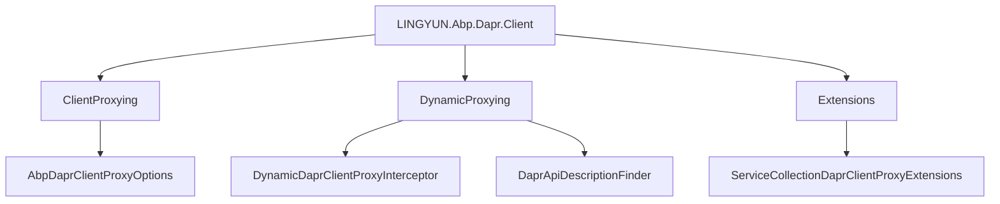
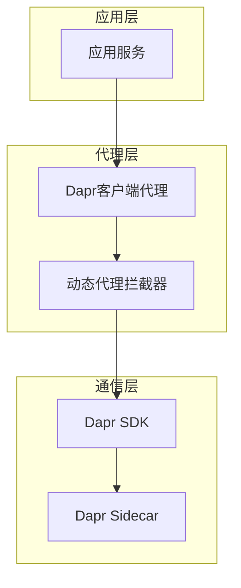

# Dapr客户端集成

<cite>
**本文档引用的文件**  
- [AbpDaprClientModule.cs](file://aspnet-core/framework/dapr/LINGYUN.Abp.Dapr.Client/LINGYUN/Abp/Dapr/Client/AbpDaprClientModule.cs)
- [DaprRemoteServiceConfigurationExtensions.cs](file://aspnet-core/framework/dapr/LINGYUN.Abp.Dapr.Client/LINGYUN/Abp/Dapr/Client/DaprRemoteServiceConfigurationExtensions.cs)
- [AbpDaprClientProxyOptions.cs](file://aspnet-core/framework/dapr/LINGYUN.Abp.Dapr.Client/LINGYUN/Abp/Dapr/Client/ClientProxying/AbpDaprClientProxyOptions.cs)
- [DynamicDaprClientProxyInterceptor.cs](file://aspnet-core/framework/dapr/LINGYUN.Abp.Dapr.Client/LINGYUN/Abp/Dapr/Client/DynamicProxying/DynamicDaprClientProxyInterceptor.cs)
- [DaprApiDescriptionFinder.cs](file://aspnet-core/framework/dapr/LINGYUN.Abp.Dapr.Client/LINGYUN/Abp/Dapr/Client/DynamicProxying/DaprApiDescriptionFinder.cs)
- [ServiceCollectionDaprClientProxyExtensions.cs](file://aspnet-core/framework/dapr/LINGYUN.Abp.Dapr.Client/Microsoft/Extensions/DependencyInjection/ServiceCollectionDaprClientProxyExtensions.cs)
- [ITestAppService.cs](file://aspnet-core/tests/LINGYUN.Abp.Dapr.Tests/LINGYUN/Abp/Dapr/ServiceInvocation/ITestAppService.cs)
- [TestAppServiceTests.cs](file://aspnet-core/tests/LINGYUN.Abp.Dapr.Client.Tests/LINGYUN/Abp/Dapr/Client/Tests/TestAppServiceTests.cs)
- [TestClientProxy.Generated.cs](file://aspnet-core/tests/LINGYUN.Abp.Dapr.Client.Tests/ClientProxies/TestClientProxy.Generated.cs)
</cite>

## 目录
1. [简介](#简介)
2. [项目结构](#项目结构)
3. [核心组件](#核心组件)
4. [架构概述](#架构概述)
5. [详细组件分析](#详细组件分析)
6. [依赖分析](#依赖分析)
7. [性能考虑](#性能考虑)
8. [故障排除指南](#故障排除指南)
9. [结论](#结论)

## 简介
LINGYUN.Abp.Dapr.Client模块为ABP框架提供了Dapr客户端集成能力，实现了服务调用、状态管理、发布订阅等核心功能。该模块通过动态代理技术简化了Dapr服务间的通信，提供了配置化的方式集成Dapr客户端，支持服务发现、请求拦截、响应处理和错误处理等高级功能。

## 项目结构
LINGYUN.Abp.Dapr.Client模块位于`aspnet-core/framework/dapr/`目录下，主要包含客户端代理、动态代理、配置扩展等核心组件。模块通过依赖注入集成，提供了丰富的扩展点和配置选项。



**图示来源**
- [AbpDaprClientModule.cs](file://aspnet-core/framework/dapr/LINGYUN.Abp.Dapr.Client/LINGYUN/Abp/Dapr/Client/AbpDaprClientModule.cs)
- [AbpDaprClientProxyOptions.cs](file://aspnet-core/framework/dapr/LINGYUN.Abp.Dapr.Client/LINGYUN/Abp/Dapr/Client/ClientProxying/AbpDaprClientProxyOptions.cs)
- [DynamicDaprClientProxyInterceptor.cs](file://aspnet-core/framework/dapr/LINGYUN.Abp.Dapr.Client/LINGYUN/Abp/Dapr/Client/DynamicProxying/DynamicDaprClientProxyInterceptor.cs)

**本节来源**
- [AbpDaprClientModule.cs](file://aspnet-core/framework/dapr/LINGYUN.Abp.Dapr.Client/LINGYUN/Abp/Dapr/Client/AbpDaprClientModule.cs)
- [README.md](file://aspnet-core/framework/dapr/LINGYUN.Abp.Dapr.Client/README.md)

## 核心组件
LINGYUN.Abp.Dapr.Client模块的核心组件包括Dapr客户端代理、动态代理拦截器、API描述查找器和依赖注入扩展。这些组件共同实现了Dapr服务间的透明调用和管理。

**本节来源**
- [AbpDaprClientProxyOptions.cs](file://aspnet-core/framework/dapr/LINGYUN.Abp.Dapr.Client/LINGYUN/Abp/Dapr/Client/ClientProxying/AbpDaprClientProxyOptions.cs)
- [DynamicDaprClientProxyInterceptor.cs](file://aspnet-core/framework/dapr/LINGYUN.Abp.Dapr.Client/LINGYUN/Abp/Dapr/Client/DynamicProxying/DynamicDaprClientProxyInterceptor.cs)
- [DaprApiDescriptionFinder.cs](file://aspnet-core/framework/dapr/LINGYUN.Abp.Dapr.Client/LINGYUN/Abp/Dapr/Client/DynamicProxying/DaprApiDescriptionFinder.cs)

## 架构概述
LINGYUN.Abp.Dapr.Client模块采用分层架构，上层为应用服务提供透明的Dapr客户端调用，中层通过动态代理实现服务间通信，底层集成Dapr SDK处理具体的网络通信。



**图示来源**
- [DynamicDaprClientProxyInterceptor.cs](file://aspnet-core/framework/dapr/LINGYUN.Abp.Dapr.Client/LINGYUN/Abp/Dapr/Client/DynamicDaprClientProxyInterceptor.cs)
- [DaprApiDescriptionFinder.cs](file://aspnet-core/framework/dapr/LINGYUN.Abp.Dapr.Client/LINGYUN/Abp/Dapr/Client/DynamicProxying/DaprApiDescriptionFinder.cs)

## 详细组件分析

### Dapr客户端代理分析
Dapr客户端代理组件负责创建和管理Dapr客户端实例，提供配置化的代理创建方式。

#### 类图
```mermaid
classDiagram
    class DaprClientProxy~TRemoteService~ {
        +TRemoteService Service
        +DaprClientProxy(TRemoteService service)
    }
    
    class DynamicDaprProxyInterceptorClientProxy~TService~ {
        +CallRequestAsync~T~(ClientProxyRequestContext requestContext) Task~T~
        +CallRequestAsync(ClientProxyRequestContext requestContext) Task~HttpContent~
    }
    
    class DaprClientProxyBase~TService~ {
        +RequestAsync~T~(ClientProxyRequestContext requestContext) Task~T~
        +RequestAsync(ClientProxyRequestContext requestContext) Task~HttpContent~
    }
    
    DaprClientProxyBase~TService~ <|-- DynamicDaprProxyInterceptorClientProxy~TService~
    DaprClientProxy~TRemoteService~