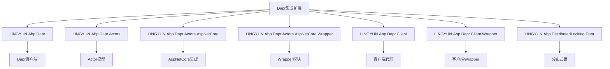
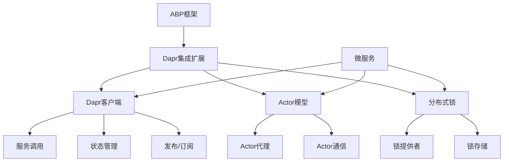
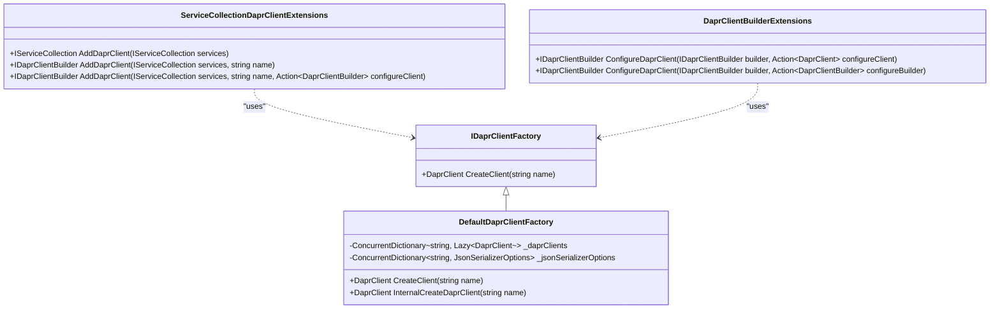
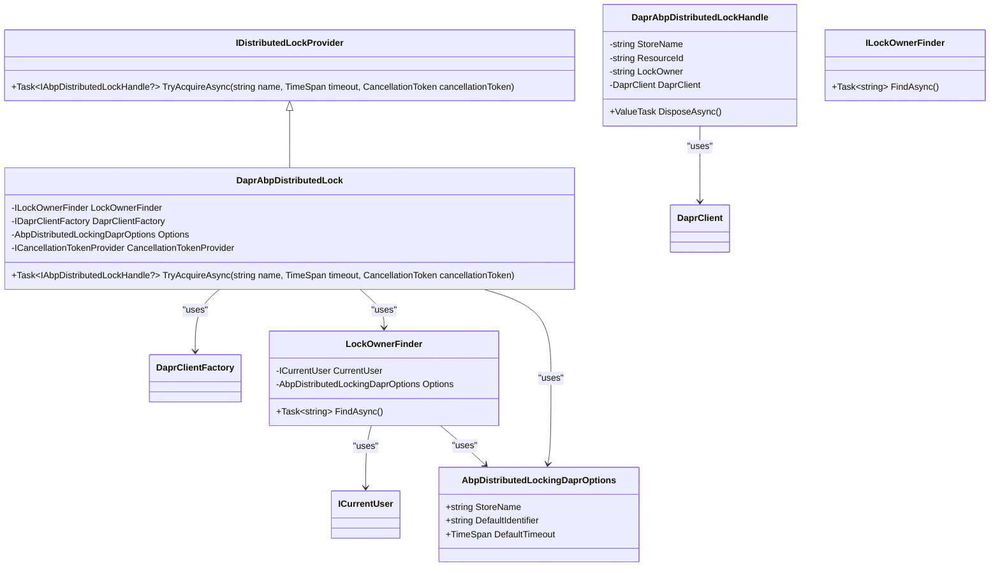
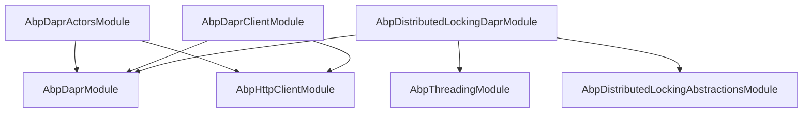

# Dapr集成扩展

<cite>
**本文档中引用的文件**
- [AbpDaprModule.cs](file://aspnet-core/framework/dapr/LINGYUN.Abp.Dapr/LINGYUN/Abp/Dapr/AbpDaprModule.cs)
- [AbpDaprActorsModule.cs](file://aspnet-core/framework/dapr/LINGYUN.Abp.Dapr.Actors/LINGYUN/Abp/Dapr/Actors/AbpDaprActorsModule.cs)
- [AbpDaprClientModule.cs](file://aspnet-core/framework/dapr/LINGYUN.Abp.Dapr.Client/LINGYUN/Abp/Dapr/Client/AbpDaprClientModule.cs)
- [DefaultDaprClientFactory.cs](file://aspnet-core/framework/dapr/LINGYUN.Abp.Dapr/Dapr/Client/DefaultDaprClientFactory.cs)
- [DaprClientProxy.cs](file://aspnet-core/framework/dapr/LINGYUN.Abp.Dapr.Client/LINGYUN/Abp/Dapr/Client/DynamicProxying/DaprClientProxy.cs)
- [DaprAbpDistributedLock.cs](file://aspnet-core/framework/dapr/LINGYUN.Abp.DistributedLocking.Dapr/LINGYUN/Abp/DistributedLocking/Dapr/DaprAbpDistributedLock.cs)
- [DaprAbpDistributedLockHandle.cs](file://aspnet-core/framework/dapr/LINGYUN.Abp.DistributedLocking.Dapr/LINGYUN/Abp/DistributedLocking/Dapr/DaprAbpDistributedLockHandle.cs)
- [AbpDistributedLockingDaprOptions.cs](file://aspnet-core/framework/dapr/LINGYUN.Abp.DistributedLocking.Dapr/LINGYUN/Abp/DistributedLocking/Dapr/AbpDistributedLockingDaprOptions.cs)
- [LockOwnerFinder.cs](file://aspnet-core/framework/dapr/LINGYUN.Abp.DistributedLocking.Dapr/LINGYUN/Abp/DistributedLocking/Dapr/LockOwnerFinder.cs)
- [AbpDaprActorProxyOptions.cs](file://aspnet-core/framework/dapr/LINGYUN.Abp.Dapr.Actors/LINGYUN/Abp/Dapr/Actors/AbpDaprActorProxyOptions.cs)
- [DynamicDaprActorProxyConfig.cs](file://aspnet-core/framework/dapr/LINGYUN.Abp.Dapr.Actors/LINGYUN/Abp/Dapr/Actors/DynamicProxying/DynamicDaprActorProxyConfig.cs)
- [README.md](file://aspnet-core/framework/dapr/LINGYUN.Abp.Dapr/README.md)
- [README.md](file://aspnet-core/framework/dapr/LINGYUN.Abp.Dapr.Actors/README.md)
- [README.md](file://aspnet-core/framework/dapr/LINGYUN.Abp.Dapr.Client/README.md)
- [README.md](file://aspnet-core/framework/dapr/LINGYUN.Abp.DistributedLocking.Dapr/README.md)
</cite>

## 目录
1. [简介](#简介)
2. [项目结构](#项目结构)
3. [核心组件](#核心组件)
4. [架构概述](#架构概述)
5. [详细组件分析](#详细组件分析)
6. [依赖分析](#依赖分析)
7. [性能考虑](#性能考虑)
8. [故障排除指南](#故障排除指南)
9. [结论](#结论)

## 简介
Dapr集成扩展为ABP框架提供了与Dapr（Distributed Application Runtime）的无缝集成。该扩展包含多个模块，实现了Dapr的核心功能，包括Dapr客户端、Actor模型、分布式锁等。通过这些模块，开发者可以轻松地在ABP应用程序中使用Dapr提供的分布式应用运行时能力，如服务调用、状态管理、发布/订阅、分布式锁等。

## 项目结构
Dapr集成扩展位于`aspnet-core/framework/dapr`目录下，包含多个子模块，每个子模块负责不同的功能：



**图源**
- [README.md](file://aspnet-core/framework/dapr/LINGYUN.Abp.Dapr/README.md)
- [README.md](file://aspnet-core/framework/dapr/LINGYUN.Abp.Dapr.Actors/README.md)
- [README.md](file://aspnet-core/framework/dapr/LINGYUN.Abp.DistributedLocking.Dapr/README.md)

**节源**
- [README.md](file://aspnet-core/framework/dapr/LINGYUN.Abp.Dapr/README.md)
- [README.md](file://aspnet-core/framework/dapr/LINGYUN.Abp.Dapr.Actors/README.md)
- [README.md](file://aspnet-core/framework/dapr/LINGYUN.Abp.DistributedLocking.Dapr/README.md)

## 核心组件
Dapr集成扩展的核心组件包括Dapr客户端、Actor模型和分布式锁。这些组件通过模块化设计，可以独立使用或组合使用，为ABP应用程序提供强大的分布式能力。

**节源**
- [AbpDaprModule.cs](file://aspnet-core/framework/dapr/LINGYUN.Abp.Dapr/LINGYUN/Abp/Dapr/AbpDaprModule.cs)
- [AbpDaprActorsModule.cs](file://aspnet-core/framework/dapr/LINGYUN.Abp.Dapr.Actors/LINGYUN/Abp/Dapr/Actors/AbpDaprActorsModule.cs)
- [AbpDaprClientModule.cs](file://aspnet-core/framework/dapr/LINGYUN.Abp.Dapr.Client/LINGYUN/Abp/Dapr/Client/AbpDaprClientModule.cs)

## 架构概述
Dapr集成扩展的架构基于ABP框架的模块化设计，每个功能模块都是一个独立的ABP模块，通过依赖关系进行集成。核心架构包括：



**图源**
- [AbpDaprModule.cs](file://aspnet-core/framework/dapr/LINGYUN.Abp.Dapr/LINGYUN/Abp/Dapr/AbpDaprModule.cs)
- [AbpDaprActorsModule.cs](file://aspnet-core/framework/dapr/LINGYUN.Abp.Dapr.Actors/LINGYUN/Abp/Dapr/Actors/AbpDaprActorsModule.cs)
- [AbpDaprClientModule.cs](file://aspnet-core/framework/dapr/LINGYUN.Abp.Dapr.Client/LINGYUN/Abp/Dapr/Client/AbpDaprClientModule.cs)

## 详细组件分析
### Dapr客户端分析
Dapr客户端模块提供了与Dapr运行时的集成，允许应用程序通过Dapr进行服务调用、状态管理和发布/订阅操作。

#### 类图


**图源**
- [DefaultDaprClientFactory.cs](file://aspnet-core/framework/dapr/LINGYUN.Abp.Dapr/Dapr/Client/DefaultDaprClientFactory.cs)
- [ServiceCollectionDaprClientExtensions.cs](file://aspnet-core/framework/dapr/LINGYUN.Abp.Dapr/Microsoft/Extensions/DependencyInjection/ServiceCollectionDaprClientExtensions.cs)
- [DaprClientBuilderExtensions.cs](file://aspnet-core/framework/dapr/LINGYUN.Abp.Dapr/Dapr/Client/DaprClientBuilderExtensions.cs)

**节源**
- [DefaultDaprClientFactory.cs](file://aspnet-core/framework/dapr/LINGYUN.Abp.Dapr/Dapr/Client/DefaultDaprClientFactory.cs)

### Dapr Actor模型分析
Dapr Actor模型模块提供了Actor模式的实现，允许开发者创建和管理Actor实例，实现分布式状态管理和通信。

#### 序列图
```mermaid
sequenceDiagram
participant Client as "客户端"
participant Proxy as "代理"
participant Actor as "Actor"
participant Dapr as "Dapr运行时"
Client->>Proxy : 调用Actor方法
Proxy->>Dapr : 发送HTTP请求
Dapr->>Actor : 激活Actor实例
Actor->>Actor : 执行业务逻辑
Actor->>Dapr : 返回结果
Dapr->>Proxy : 返回响应
Proxy->>Client : 返回结果
```

**图源**
- [AbpDaprActorsModule.cs](file://aspnet-core/framework/dapr/LINGYUN.Abp.Dapr.Actors/LINGYUN/Abp/Dapr/Actors/AbpDaprActorsModule.cs)
- [README.md](file://aspnet-core/framework/dapr/LINGYUN.Abp.Dapr.Actors/README.md)

**节源**
- [AbpDaprActorsModule.cs](file://aspnet-core/framework/dapr/LINGYUN.Abp.Dapr.Actors/LINGYUN/Abp/Dapr/Actors/AbpDaprActorsModule.cs)

### 分布式锁分析
分布式锁模块基于Dapr的分布式锁API，提供了跨服务、跨实例的分布式锁定功能。

#### 类图


**图源**
- [DaprAbpDistributedLock.cs](file://aspnet-core/framework/dapr/LINGYUN.Abp.DistributedLocking.Dapr/LINGYUN/Abp/DistributedLocking/Dapr/DaprAbpDistributedLock.cs)
- [DaprAbpDistributedLockHandle.cs](file://aspnet-core/framework/dapr/LINGYUN.Abp.DistributedLocking.Dapr/LINGYUN/Abp/DistributedLocking/Dapr/DaprAbpDistributedLockHandle.cs)
- [LockOwnerFinder.cs](file://aspnet-core/framework/dapr/LINGYUN.Abp.DistributedLocking.Dapr/LINGYUN/Abp/DistributedLocking/Dapr/LockOwnerFinder.cs)
- [AbpDistributedLockingDaprOptions.cs](file://aspnet-core/framework/dapr/LINGYUN.Abp.DistributedLocking.Dapr/LINGYUN/Abp/DistributedLocking/Dapr/AbpDistributedLockingDaprOptions.cs)

**节源**
- [DaprAbpDistributedLock.cs](file://aspnet-core/framework/dapr/LINGYUN.Abp.DistributedLocking.Dapr/LINGYUN/Abp/DistributedLocking/Dapr/DaprAbpDistributedLock.cs)

## 依赖分析
Dapr集成扩展的模块之间存在明确的依赖关系，这些关系通过ABP模块的依赖系统进行管理。



**图源**
- [AbpDaprModule.cs](file://aspnet-core/framework/dapr/LINGYUN.Abp.Dapr/LINGYUN/Abp/Dapr/AbpDaprModule.cs)
- [AbpDaprActorsModule.cs](file://aspnet-core/framework/dapr/LINGYUN.Abp.Dapr.Actors/LINGYUN/Abp/Dapr/Actors/AbpDaprActorsModule.cs)
- [AbpDaprClientModule.cs](file://aspnet-core/framework/dapr/LINGYUN.Abp.Dapr.Client/LINGYUN/Abp/Dapr/Client/AbpDaprClientModule.cs)
- [AbpDistributedLockingDaprModule.cs](file://aspnet-core/framework/dapr/LINGYUN.Abp.DistributedLocking.Dapr/LINGYUN/Abp/DistributedLocking/Dapr/AbpDistributedLockingDaprModule.cs)

**节源**
- [AbpDaprModule.cs](file://aspnet-core/framework/dapr/LINGYUN.Abp.Dapr/LINGYUN/Abp/Dapr/AbpDaprModule.cs)
- [AbpDaprActorsModule.cs](file://aspnet-core/framework/dapr/LINGYUN.Abp.Dapr.Actors/LINGYUN/Abp/Dapr/Actors/AbpDaprActorsModule.cs)
- [AbpDaprClientModule.cs](file://aspnet-core/framework/dapr/LINGYUN.Abp.Dapr.Client/LINGYUN/Abp/Dapr/Client/AbpDaprClientModule.cs)
- [AbpDistributedLockingDaprModule.cs](file://aspnet-core/framework/dapr/LINGYUN.Abp.DistributedLocking.Dapr/LINGYUN/Abp/DistributedLocking/Dapr/AbpDistributedLockingDaprModule.cs)

## 性能考虑
在使用Dapr集成扩展时，需要考虑以下性能因素：

1. **Dapr客户端实例**：DaprClient实例是线程安全的，建议使用单例模式，避免频繁创建和销毁。
2. **具名DaprClient**：为不同的微服务使用不同的具名DaprClient，可以避免配置冲突和性能瓶颈。
3. **超时和重试策略**：在生产环境中应该适当配置超时和重试策略，以应对网络波动和临时故障。
4. **gRPC通道配置**：gRPC通道配置需要注意性能和资源消耗，避免过度配置导致资源浪费。
5. **JSON序列化选项**：JSON序列化选项会影响所有使用该DaprClient的请求，应该根据实际需求进行优化。
6. **分布式锁超时时间**：合理设置分布式锁的超时时间，避免死锁和资源浪费。

## 故障排除指南
在使用Dapr集成扩展时，可能会遇到以下常见问题：

1. **Dapr Sidecar未正确配置**：确保Dapr Sidecar已正确配置并运行。
2. **分布式锁组件未正确定义**：确保分布式锁组件在Dapr配置中正确定义。
3. **锁获取失败**：正确处理锁获取失败的情况，避免业务逻辑中断。
4. **高并发性能影响**：在高并发场景下注意性能影响，合理配置锁的粒度和超时时间。
5. **配置更改未生效**：配置更改后需要重新创建DaprClient实例才能生效。

**节源**
- [README.md](file://aspnet-core/framework/dapr/LINGYUN.Abp.Dapr/README.md)
- [README.md](file://aspnet-core/framework/dapr/LINGYUN.Abp.Dapr.Actors/README.md)
- [README.md](file://aspnet-core/framework/dapr/LINGYUN.Abp.DistributedLocking.Dapr/README.md)

## 结论
Dapr集成扩展为ABP框架提供了强大的分布式应用运行时能力。通过模块化设计，开发者可以轻松地在ABP应用程序中使用Dapr的核心功能，如服务调用、状态管理、发布/订阅和分布式锁。这些功能使得构建可扩展、高可用的分布式应用程序变得更加简单和可靠。