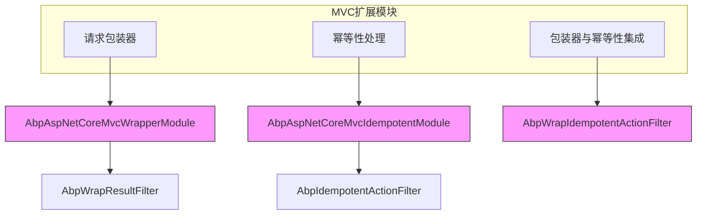
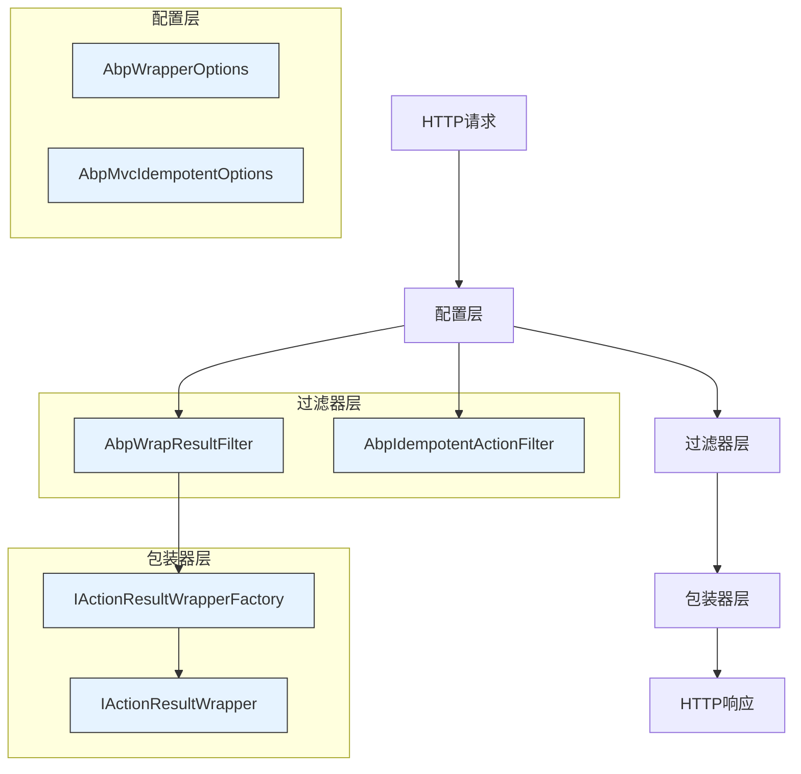
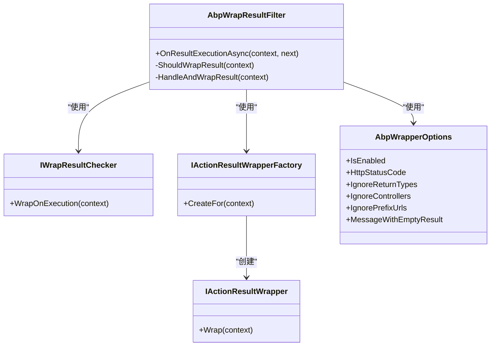

# MVC扩展

<cite>
**本文档中引用的文件**   
- [AbpAspNetCoreMvcWrapperModule.cs](file://aspnet-core/framework/mvc/LINGYUN.Abp.AspNetCore.Mvc.Wrapper/LINGYUN/Abp/AspNetCore/Mvc/Wrapper/AbpAspNetCoreMvcWrapperModule.cs)
- [AbpWrapResultFilter.cs](file://aspnet-core/framework/mvc/LINGYUN.Abp.AspNetCore.Mvc.Wrapper/LINGYUN/Abp/AspNetCore/Mvc/Wrapper/Filters/AbpWrapResultFilter.cs)
- [AbpWrapperOptions.cs](file://aspnet-core/framework/common/LINGYUN.Abp.Wrapper/LINGYUN/Abp/Wrapper/AbpWrapperOptions.cs)
- [IWrapResultChecker.cs](file://aspnet-core/framework/mvc/LINGYUN.Abp.AspNetCore.Mvc.Wrapper/LINGYUN/Abp/AspNetCore/Mvc/Wrapper/IWrapResultChecker.cs)
- [IActionResultWrapper.cs](file://aspnet-core/framework/mvc/LINGYUN.Abp.AspNetCore.Mvc.Wrapper/LINGYUN/Abp/AspNetCore/Mvc/Wrapper/Wraping/IActionResultWrapper.cs)
- [IActionResultWrapperFactory.cs](file://aspnet-core/framework/mvc/LINGYUN.Abp.AspNetCore.Mvc.Wrapper/LINGYUN/Abp/AspNetCore/Mvc/Wrapper/Wraping/IActionResultWrapperFactory.cs)
- [AbpIdempotentActionFilter.cs](file://aspnet-core/framework/mvc/LINGYUN.Abp.AspNetCore.Mvc.Idempotent/LINGYUN/Abp/AspNetCore/Mvc/Idempotent/AbpIdempotentActionFilter.cs)
- [AbpAspNetCoreMvcIdempotentModule.cs](file://aspnet-core/framework/mvc/LINGYUN.Abp.AspNetCore.Mvc.Idempotent/LINGYUN/Abp/AspNetCore/Mvc/Idempotent/AbpAspNetCoreMvcIdempotentModule.cs)
- [AbpWrapIdempotentActionFilter.cs](file://aspnet-core/framework/mvc/LINGYUN.Abp.AspNetCore.Mvc.Idempotent.Wrapper/LINGYUN/Abp/AspNetCore/Mvc/Idempotent/Wrapper/AbpWrapIdempotentActionFilter.cs)
- [README.md](file://aspnet-core/framework/mvc/LINGYUN.Abp.AspNetCore.Mvc.Wrapper/README.md)
- [README.md](file://aspnet-core/framework/mvc/LINGYUN.Abp.AspNetCore.Mvc.Idempotent/README.md)
</cite>

## 目录
1. [简介](#简介)
2. [项目结构](#项目结构)
3. [核心组件](#核心组件)
4. [架构概述](#架构概述)
5. [详细组件分析](#详细组件分析)
6. [依赖分析](#依赖分析)
7. [性能考虑](#性能考虑)
8. [故障排除指南](#故障排除指南)
9. [结论](#结论)

## 简介
本文档详细介绍了ABP框架中MVC扩展的功能，重点阐述了幂等性处理、请求包装和客户端集成等核心机制。文档深入解析了MVC扩展的技术架构、配置方式和使用场景，为开发者提供了完整的最佳实践指南。通过本文档，开发者将学习如何配置MVC扩展、处理幂等性请求以及优化MVC性能，并通过实际代码示例了解如何在应用中使用这些MVC扩展功能。

## 项目结构
ABP框架的MVC扩展模块主要包含三个核心组件：请求包装器、幂等性处理和包装器与幂等性的集成。这些组件位于`aspnet-core/framework/mvc`目录下，形成了一个完整的MVC功能扩展体系。

**图示来源**
- [AbpAspNetCoreMvcWrapperModule.cs](file://aspnet-core/framework/mvc/LINGYUN.Abp.AspNetCore.Mvc.Wrapper/LINGYUN/Abp/AspNetCore/Mvc/Wrapper/AbpAspNetCoreMvcWrapperModule.cs)
- [AbpAspNetCoreMvcIdempotentModule.cs](file://aspnet-core/framework/mvc/LINGYUN.Abp.AspNetCore.Mvc.Idempotent/LINGYUN/Abp/AspNetCore/Mvc/Idempotent/AbpAspNetCoreMvcIdempotentModule.cs)
- [AbpWrapIdempotentActionFilter.cs](file://aspnet-core/framework/mvc/LINGYUN.Abp.AspNetCore.Mvc.Idempotent.Wrapper/LINGYUN/Abp/AspNetCore/Mvc/Idempotent/Wrapper/AbpWrapIdempotentActionFilter.cs)

**本节来源**
- [README.md](file://aspnet-core/framework/mvc/LINGYUN.Abp.AspNetCore.Mvc.Wrapper/README.md)
- [README.md](file://aspnet-core/framework/mvc/LINGYUN.Abp.AspNetCore.Mvc.Idempotent/README.md)

## 核心组件
MVC扩展的核心组件包括请求包装器、幂等性处理和它们的集成实现。请求包装器负责统一包装ASP.NET Core MVC的响应结果，支持自定义包装规则、异常结果包装和本地化错误消息。幂等性处理模块确保API接口的幂等性，防止重复请求造成数据不一致。这两个功能通过专门的过滤器实现，可以在Action执行前后进行拦截和处理。

**本节来源**
- [AbpWrapResultFilter.cs](file://aspnet-core/framework/mvc/LINGYUN.Abp.AspNetCore.Mvc.Wrapper/LINGYUN/Abp/AspNetCore/Mvc/Wrapper/Filters/AbpWrapResultFilter.cs)
- [AbpIdempotentActionFilter.cs](file://aspnet-core/framework/mvc/LINGYUN.Abp.AspNetCore.Mvc.Idempotent/LINGYUN/Abp/AspNetCore/Mvc/Idempotent/AbpIdempotentActionFilter.cs)

## 架构概述
MVC扩展的架构基于ASP.NET Core的过滤器机制，通过在MVC管道中注入自定义过滤器来实现功能扩展。整体架构分为三层：配置层、过滤器层和包装器层。配置层提供灵活的选项配置，过滤器层负责拦截请求和响应，包装器层则实现具体的包装逻辑。

**图示来源**
- [AbpWrapperOptions.cs](file://aspnet-core/framework/common/LINGYUN.Abp.Wrapper/LINGYUN/Abp/Wrapper/AbpWrapperOptions.cs)
- [AbpWrapResultFilter.cs](file://aspnet-core/framework/mvc/LINGYUN.Abp.AspNetCore.Mvc.Wrapper/LINGYUN/Abp/AspNetCore/Mvc/Wrapper/Filters/AbpWrapResultFilter.cs)
- [AbpIdempotentActionFilter.cs](file://aspnet-core/framework/mvc/LINGYUN.Abp.AspNetCore.Mvc.Idempotent/LINGYUN/Abp/AspNetCore/Mvc/Idempotent/AbpIdempotentActionFilter.cs)
- [IActionResultWrapperFactory.cs](file://aspnet-core/framework/mvc/LINGYUN.Abp.AspNetCore.Mvc.Wrapper/LINGYUN/Abp/AspNetCore/Mvc/Wrapper/Wraping/IActionResultWrapperFactory.cs)
- [IActionResultWrapper.cs](file://aspnet-core/framework/mvc/LINGYUN.Abp.AspNetCore.Mvc.Wrapper/LINGYUN/Abp/AspNetCore/Mvc/Wrapper/Wraping/IActionResultWrapper.cs)

## 详细组件分析

### 请求包装器分析
请求包装器组件通过`AbpWrapResultFilter`实现，该过滤器在MVC结果执行时进行拦截，根据配置决定是否对结果进行包装。包装器支持多种配置选项，包括启用/禁用包装、忽略特定控制器和返回类型、自定义空结果消息等。

#### 类图

**图示来源**
- [AbpWrapResultFilter.cs](file://aspnet-core/framework/mvc/LINGYUN.Abp.AspNetCore.Mvc.Wrapper/LINGYUN/Abp/AspNetCore/Mvc/Wrapper/Filters/AbpWrapResultFilter.cs)
- [IWrapResultChecker.cs](file://aspnet-core/framework/mvc/LINGYUN.Abp.AspNetCore.Mvc.Wrapper/LINGYUN/Abp/AspNetCore/Mvc/Wrapper/IWrapResultChecker.cs)
- [IActionResultWrapperFactory.cs](file://aspnet-core/framework/mvc/LINGYUN.Abp.AspNetCore.Mvc.Wrapper/LINGYUN/Abp/AspNetCore/Mvc/Wrapper/Wraping/IActionResultWrapperFactory.cs)
- [IActionResultWrapper.cs](file://aspnet-core/framework/mvc/LINGYUN.Abp.AspNetCore.Mvc.Wrapper/LINGYUN/Abp/AspNetCore/Mvc/Wrapper/Wraping/IActionResultWrapper.cs)
- [AbpWrapperOptions.cs](file://aspnet-core/framework/common/LINGYUN.Abp.Wrapper/LINGYUN/Abp/Wrapper/AbpWrapperOptions.cs)

**本节来源**
- [AbpWrapResultFilter.cs](file://aspnet-core/framework/mvc/LINGYUN.Abp.AspNetCore.Mvc.Wrapper/LINGYUN/Abp/AspNetCore/Mvc/Wrapper/Filters/AbpWrap